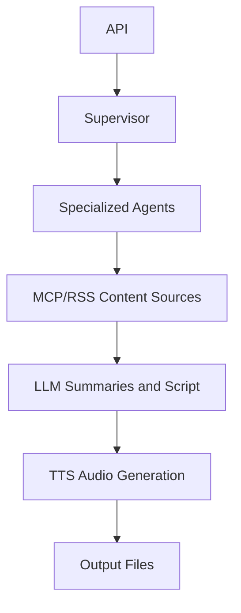

<p align="center">
  
</p>

# 🎓 AI Agent Patterns Educational Guide

## 📚 **Learning Path: From Beginner to Expert**

This guide provides a structured learning path through the AI Agent Patterns implemented in the AI-Parrot project. Each section builds upon previous concepts, making it perfect for educational purposes.

AI-Parrot is an educational system with production-inspired patterns. Treat the code as a working map of agent concepts, not as a finished production platform. The best way to learn from it is to run one podcast generation, inspect the logs, then read the code path that produced each step.

### **How to Study This Project**

1. **Start with the workflow**: `SYSTEM_OVERVIEW.md` shows API → supervisor → agents → MCP/RSS → LLM → TTS → output.
2. **Study the API contract**: `API_DOCUMENTATION.md` explains queued generation and task polling.
3. **Follow the supervisor**: `src/podcast_generator/agent_supervisor.py` shows how work is split across agents.
4. **Follow content sourcing**: `src/podcast_generator/article_fetcher.py` and `src/podcast_generator/mcp_client.py` show MCP-first fetching with RSS fallback.
5. **Follow collaboration**: `src/podcast_generator/a2a_protocol.py` demonstrates peer-style quality assessment.
6. **Follow generation**: `src/podcast_generator/ai_processor.py` and `src/podcast_generator/file_utils.py` turn articles into script and audio.
7. **Follow resilience**: `src/podcast_generator/circuit_breaker.py` demonstrates failure boundaries and fallback thinking.
8. **Finish with tests**: `tests/` gives safe examples learners can change before touching paid APIs.

### **Pattern-to-Test Map**

| Pattern | Code to Read | Test to Run |
|---|---|---|
| Supervisor orchestration | `src/podcast_generator/agent_supervisor.py` | `tests/test_agent_supervisor.py` |
| A2A consensus | `src/podcast_generator/a2a_protocol.py` | `tests/test_a2a_protocol.py` |
| MCP/RSS sourcing | `src/podcast_generator/article_fetcher.py`, `src/podcast_generator/mcp_client.py` | `tests/test_mcp_rss_fetching.py` |
| Circuit breaker resilience | `src/podcast_generator/circuit_breaker.py` | `tests/test_circuit_breaker.py` |

### **Production Gaps to Notice**

These gaps are part of the lesson. In production, task state should move from memory to Redis or a database, authentication and authorization should be hardened, workers should run outside the web process, queues should absorb long-running jobs, retries and dead-letter handling should be explicit, rate limiting should protect paid API calls, logs and metrics should be centralized, and deployment should include secrets management, scaling, backups, and alerting.

---

## 🌟 **Level 1: Foundational Concepts**

### **🤖 What are AI Agent Patterns?**

AI Agent Patterns are reusable solutions to common problems in multi-agent systems. Just like design patterns in software engineering, they provide proven approaches to:

- **Coordination**: How agents work together
- **Communication**: How agents exchange information  
- **Specialization**: How agents divide responsibilities
- **Resilience**: How systems handle failures
- **Monitoring**: How to observe system behavior

### **🎯 Why Use Agent Patterns?**

1. **Scalability**: Systems can grow by adding more agents
2. **Reliability**: Failures in one agent don't crash the system
3. **Maintainability**: Each agent has clear responsibilities
4. **Flexibility**: Easy to modify or replace individual components
5. **Observability**: Clear visibility into system behavior

---

## 🏗️ **Level 2: Architecture Understanding**

### **📊 System Overview**

```
🎙️ AI-Parrot Podcast Generator
├── 🏛️ Supervisor Agent (Coordinator)
├── 📰 Content Fetcher Agent (Data Collection)
├── 🎯 Quality Assessor Agent (A2A Collaboration)  
├── 🤖 Content Processor Agent (AI Processing)
└── 🎵 Audio Generator Agent (Media Production)
```

### **🔄 Data Flow**



---

## 🎭 **Level 3: Pattern Deep Dive**

### **Pattern 1: 🏛️ Hierarchical Coordination (Supervisor)**

**📖 Concept**: A supervisor agent coordinates multiple worker agents, similar to a project manager directing a team.

**🔍 Implementation Location**: `src/podcast_generator/agent_supervisor.py`

**🎯 Key Learning Points**:
```python
class AgentSupervisor:
    """
    🎓 EDUCATIONAL FOCUS:
    - Task queue management
    - Agent lifecycle coordination  
    - Load balancing across agents
    - System health monitoring
    """
```

**💡 Real-world Applications**:
- Microservices orchestration
- Workflow management systems
- Distributed computing clusters
- DevOps pipeline coordination

**🧪 Exercise**: Add an observer that records elapsed task time, then extend `tests/test_agent_supervisor.py`.

### **Pattern 2: 🤝 Agent-to-Agent Communication**

**📖 Concept**: Agents communicate directly with peers to collaborate on tasks, like experts consulting each other.

**🔍 Implementation Location**: `src/podcast_generator/a2a_protocol.py`

**🎯 Key Learning Points**:
```python
class A2AQualityAgent:
    """
    🎓 EDUCATIONAL FOCUS:
    - Peer discovery mechanisms
    - Consensus building algorithms
    - Network resilience patterns
    - Collaborative decision making
    """
```

**💡 Real-world Applications**:
- Blockchain consensus mechanisms
- Distributed databases
- Peer-to-peer networks
- Collaborative filtering systems

**🧪 Exercise**: Change the confidence weighting formula, then update `tests/test_a2a_protocol.py`.

### **Pattern 3: 🎭 Specialized Agent Pattern**

**📖 Concept**: Each agent has a specific domain expertise, like specialists in a medical team.

**🔍 Implementation Examples**:
```python
class ContentFetcherAgent(SpecializedAgent):
    """🎓 Specializes in: Article retrieval and processing"""
    
class QualityAssessorAgent(SpecializedAgent):
    """🎓 Specializes in: A2A collaborative assessment"""
    
class ContentProcessorAgent(SpecializedAgent):
    """🎓 Specializes in: AI summarization and script generation"""
```

**💡 Real-world Applications**:
- Expert systems
- Recommendation engines
- Automated trading systems
- Content moderation platforms

**🧪 Exercise**: Add a new specialized agent with one task contract, then extend `tests/test_agent_supervisor.py`.

### **Pattern 4: 👁️ Observer Pattern**

**📖 Concept**: Components can subscribe to events and get notified when things happen, like a news subscription service.

**🔍 Implementation Location**: `src/podcast_generator/agent_supervisor.py`

**🎯 Key Learning Points**:
```python
def task_monitor_observer(event_type: str, data: Dict[str, Any]):
    """
    🎓 EDUCATIONAL FOCUS:
    - Event-driven architecture
    - Loose coupling between components
    - Real-time monitoring capabilities
    - Debugging and observability
    """
```

**💡 Real-world Applications**:
- Event streaming platforms (Kafka)
- Real-time analytics
- Monitoring and alerting systems
- User interface updates

**🧪 Exercise**: Add a second observer that stores events in memory, then assert the event order in `tests/test_agent_supervisor.py`.

### **Pattern 5: 🔄 Circuit Breaker Resilience**

**📖 Concept**: Prevent cascade failures by "breaking the circuit" when services are unhealthy, like electrical circuit breakers.

**🔍 Implementation Location**: `src/podcast_generator/circuit_breaker.py`

**🎯 Key Learning Points**:
```python
class CircuitBreaker:
    """
    🎓 EDUCATIONAL FOCUS:
    - Failure detection mechanisms
    - Graceful degradation strategies
    - Automatic recovery procedures
    - System stability patterns
    """
```

**💡 Real-world Applications**:
- Netflix's Hystrix library
- AWS service mesh patterns
- Database connection pooling
- API rate limiting

**🧪 Exercise**: Add a half-open recovery test, then extend `tests/test_circuit_breaker.py`.

---

## 🧪 **Level 4: Hands-on Learning**

### **🔬 Experiment 1: Basic Podcast Generation**

**Objective**: Understand the traditional workflow

```bash
# Run the default podcast workflow
python -m podcast_generator.main --language en --voice "Aria"
```

**🎯 Learning Goals**:
- Observe the end-to-end workflow
- Identify where content fetching, LLM processing, and audio generation happen
- Note which steps require external API keys

### **🔬 Experiment 2: A2A Collaboration**

**Objective**: See agents collaborating on quality assessment

```bash
python -m pytest tests/test_a2a_protocol.py -q
```

**🎯 Learning Goals**:
- Inspect local quality scoring
- Observe confidence-weighted consensus
- Change one score and predict the resulting consensus

### **🔬 Experiment 3: Full Agent Coordination**

**Objective**: Experience complete multi-agent system

```bash
python -m pytest tests/test_agent_supervisor.py -q
```

**🎯 Learning Goals**:
- See task submission and execution
- Monitor observer event order
- Understand how a supervisor delegates work without calling paid APIs

### **🔬 Experiment 4: Visual Learning**

**Objective**: Use the Streamlit UI for visual understanding

```bash
# Launch the educational interface
./run_ui.sh
```

**🎯 Learning Goals**:
- Visualize agent network topology
- Monitor real-time system metrics
- Understand pattern interactions

---

## 📊 **Level 5: Performance Analysis**

### **📈 Metrics to Monitor**

1. **Task Execution Time**: How long each agent takes
2. **System Throughput**: Total podcasts per hour
3. **A2A Consensus Quality**: Agreement between agents
4. **Resource Utilization**: CPU and memory usage
5. **Error Rates**: Failure frequency by component

### **🔍 Analysis Questions**

1. **Scalability**: How does performance change with more agents?
2. **Reliability**: What happens when agents fail?
3. **Quality**: Does A2A collaboration improve output?
4. **Efficiency**: What's the overhead of coordination?
5. **Maintainability**: How easy is it to modify agents?

---

## 🎯 **Level 6: Advanced Concepts**

### **🚀 Extension Ideas**

1. **Load Balancing**: Implement agent pool management
2. **Caching**: Add result caching between agents
3. **Scheduling**: Time-based podcast generation
4. **Analytics**: Detailed performance metrics
5. **Security**: Agent authentication and authorization

### **🔮 Research Directions**

1. **Machine Learning**: Agents that learn from experience
2. **Blockchain**: Decentralized agent coordination
3. **Edge Computing**: Distributed agent deployment
4. **Quantum Computing**: Quantum-enhanced agent communication
5. **Swarm Intelligence**: Emergent behavior from simple agents

---

## 📚 **Learning Resources**

### **📖 Books**
- "Multiagent Systems" by Gerhard Weiss
- "An Introduction to MultiAgent Systems" by Michael Wooldridge
- "Distributed Systems" by Maarten van Steen

### **🎓 Online Courses**
- MIT 6.034 Artificial Intelligence
- Stanford CS221 Artificial Intelligence
- Coursera Multi-Agent Systems

### **🔬 Research Papers**
- "The Contract Net Protocol" (Smith, 1980)
- "Consensus in the Presence of Partial Synchrony" (Dwork et al., 1988)
- "MapReduce: Simplified Data Processing" (Dean & Ghemawat, 2004)

### **🛠️ Tools and Frameworks**
- JADE (Java Agent Development Framework)
- SPADE (Smart Python Agent Development Environment)
- Mesa (Agent-based modeling in Python)
- Ray (Distributed computing framework)

---

## 🎉 **Assessment and Next Steps**

### **✅ Self-Assessment Checklist**

- [ ] I understand what AI Agent Patterns are and why they're useful
- [ ] I can identify the 5 patterns implemented in AI-Parrot
- [ ] I can run all experimental configurations
- [ ] I can interpret the monitoring dashboard
- [ ] I can explain the trade-offs between patterns
- [ ] I can propose extensions to the system
- [ ] I understand real-world applications of these patterns

### **🚀 Next Learning Steps**

1. **Implement a New Agent**: Add a translation agent
2. **Modify Coordination**: Try different task scheduling algorithms
3. **Add Monitoring**: Implement custom metrics collection
4. **Scale the System**: Deploy agents across multiple machines
5. **Research Applications**: Study how companies use these patterns

### **🤝 Community Engagement**

- Join AI/ML communities and discuss agent patterns
- Contribute to open-source multi-agent projects
- Attend conferences on distributed systems
- Share your learning journey and experiments
- Mentor others learning about AI agent systems

---

## 🎯 **Conclusion**

The AI-Parrot project serves as a comprehensive educational platform for learning AI Agent Patterns. By working through this guide, you've gained:

- **Theoretical Understanding**: Core concepts and principles
- **Practical Experience**: Hands-on implementation details
- **System Thinking**: How patterns work together
- **Performance Awareness**: Trade-offs and optimization
- **Future Vision**: Advanced concepts and research directions

**Remember**: The best way to learn is by doing. Experiment, break things, fix them, and most importantly, have fun exploring the fascinating world of AI Agent Patterns! 🚀

---

*This educational guide is designed to grow with your learning journey. As you gain expertise, revisit sections to discover deeper insights and connections.*
