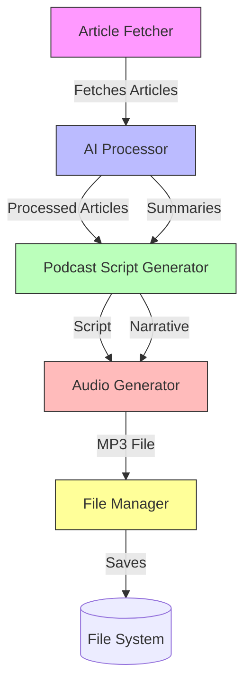
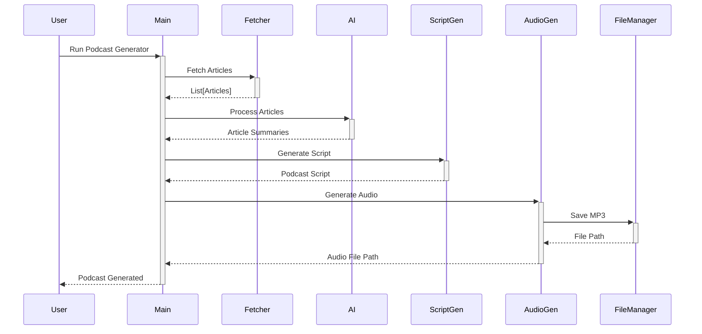
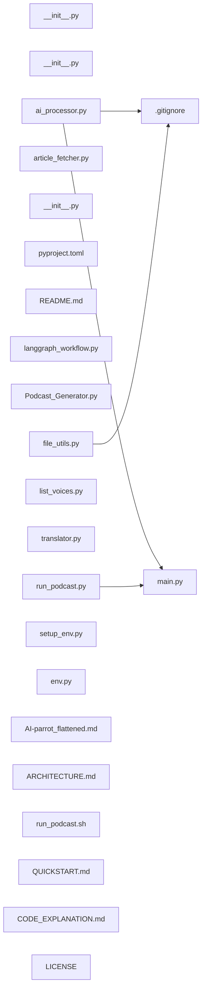

Repository Summary:
Files analyzed: 23
Directories scanned: 25
Total size: 120.10 KB (122987 bytes)
Estimated tokens: 30746
Processing time: 0.04 seconds


## Table of Contents

- [Project Summary](#project-summary)
- [Directory Structure](#directory-structure)
- [Files Content](#files-content)
  - Files By Category:
    - Configuration (2 files):
      - [.gitignore](#_gitignore) - 576 bytes
      - [pyproject.toml](#pyproject_toml) - 1.1 KB
    - Documentation (5 files):
      - [AI-parrot_flattened.md](#AI-parrot_flattened_md) - 31.2 KB
      - [ARCHITECTURE.md](#ARCHITECTURE_md) - 4.2 KB
      - [CODE_EXPLANATION.md](#CODE_EXPLANATION_md) - 3.6 KB
      - [QUICKSTART.md](#QUICKSTART_md) - 3.4 KB
      - [README.md](#README_md) - 6.9 KB
    - Other (1 files):
      - [LICENSE](#LICENSE) - 1.0 KB
    - Other (sh) (1 files):
      - [run_podcast.sh](#run_podcast_sh) - 4.0 KB
    - Python (14 files):
      - [__init__.py](#__init___py) - 43 bytes
      - [__init__.py](#__init___py) - 46 bytes
      - [__init__.py](#__init___py) - 22 bytes
      - [ai_processor.py](#ai_processor_py) - 12.5 KB
      - [article_fetcher.py](#article_fetcher_py) - 4.7 KB
      - [env.py](#env_py) - 2.8 KB
      - [file_utils.py](#file_utils_py) - 14.9 KB
      - [langgraph_workflow.py](#langgraph_workflow_py) - 7.2 KB
      - [list_voices.py](#list_voices_py) - 656 bytes
      - [main.py](#main_py) - 3.7 KB
      - [and 4 more Python files...]
- [Architecture and Relationships](#architecture-and-relationships)
  - [File Dependencies](#file-dependencies)
  - [Class Relationships](#class-relationships)
  - [Component Interactions](#component-interactions)

## Project Summary <a id="project-summary"></a>

# Project Digest: AI-parrot
Generated on: Thu Sep 18 2025 15:10:50 GMT+0200 (Central European Summer Time)
Source: /Users/giuseppe/Documents/Coding/AI-parrot
Project Directory: /Users/giuseppe/Documents/Coding/AI-parrot

# Directory Structure
[DIR] .
  [DIR] .git
  [DIR] .github
    [DIR] instructions
  [FILE] .gitignore
  [DIR] .vscode
  [DIR] FlattenSourceCode_Output
  [FILE] LICENSE
  [FILE] Podcast_Generator.py
  [FILE] README.md
  [DIR] docs
    [FILE] ARCHITECTURE.md
    [FILE] CODE_EXPLANATION.md
    [FILE] QUICKSTART.md
  [FILE] list_voices.py
  [FILE] pyproject.toml
  [FILE] run_podcast.py
  [FILE] run_podcast.sh
  [FILE] setup_env.py
  [DIR] src
    [FILE] __init__.py
    [DIR] podcast_generator
      [FILE] __init__.py
      [FILE] ai_processor.py
      [FILE] article_fetcher.py
      [FILE] file_utils.py
      [FILE] langgraph_workflow.py
      [FILE] main.py
      [FILE] translator.py
    [DIR] utils
      [FILE] __init__.py
      [FILE] env.py

# Files Content

## .gitignore <a id="gitignore"></a> **RECENTLY MODIFIED**

# Python virtual environment
.venv/
venv/
ENV/

# Environment variables
.env

# Compiled Python files
__pycache__/
*.py[cod]
*$py.class
*.so
.Python

# Distribution / packaging
dist/
build/
*.egg-info/
*.egg

# Unit test / coverage reports
htmlcov/
.tox/
.coverage
.coverage.*
.cache
nosetests.xml
coverage.xml
*.cover

# Type checking
.mypy_cache/
.dmypy.json
dmypy.json

# IDE specific files
.idea/
.vscode/
*.swp
*.swo

# OS specific files
.DS_Store
Thumbs.db

# Podcast output directory
PodcastOutput/

#Ignore vscode AI rules
.github/instructions/codacy.instructions.md

## src/podcast_generator/main.py <a id="main_py"></a>

### Dependencies

- `asyncio`
- `os`
- `sys`
- `argparse`
- `Path`
- `run_podcast_workflow`
- `validate_api_keys`
- `pathlib`
- `podcast_generator.langgraph_workflow`
- `utils.env`

"""Main script to run the podcast generator workflow."""
import asyncio
import os
import sys
import argparse
from pathlib import Path

# Add the project root to the Python path to enable imports
project_root = Path(__file__).parent.parent.parent
sys.path.insert(0, str(project_root))

from podcast_generator.langgraph_workflow import run_podcast_workflow
from utils.env import validate_api_keys, load_env_vars

async def main(language: str = 'en', voice: str = 'Aria'):
    """Run the podcast generator workflow.

    Args:
        language: Language code ('en' for English, 'es' for Spanish).
        voice: Voice to use for the podcast.
    """
    print("AI Podcast Generator")
    print("-------------------")
    print(f"Language: {'Spanish' if language == 'es' else 'English'}")
    print(f"Voice: {voice}")
    print("-------------------")

    # Load environment variables
    env_loaded = load_env_vars()
    if not env_loaded:
        print("Error: Could not load .env file. Please make sure it exists in the project root.")
        return

    # Print current working directory and .env path for debugging
    print(f"Current working directory: {os.getcwd()}")
    print(f"Loading .env from: {os.path.abspath('.env')}")

    # Validate API keys
    api_key_status = validate_api_keys()

    # Check for required API keys
    required_keys = ["ANTHROPIC_API_KEY"]
    missing_keys = [key for key in required_keys if not os.getenv(key)]

    if missing_keys:
        print("\nError: The following required API keys are missing from your .env file:")
        for key in missing_keys:
            print(f"- {key}")
        print("\nPlease add the missing API keys and try again.")
        return

    # Check for optional API keys
    optional_keys = {
        "OPENAI_API_KEY": "GPT-4 will be used for script refinement if available, otherwise Claude Sonnet will be used",
        "NEWS_API_KEY": "Using RSS feeds only (no News API functionality)"
    }

    print("\nAPI Key Status:")
    print(f"- Anthropic API: {'✅ Available' if os.getenv('ANTHROPIC_API_KEY') else '❌ Missing (Required)'}")
    print(f"- OpenAI API: {'✅ Available' if os.getenv('OPENAI_API_KEY') else '⚠️  Missing (Optional)'}")
    print(f"- News API: {'✅ Available' if os.getenv('NEWS_API_KEY') else '⚠️  Missing (Optional, using RSS feeds only)'}")

    # News API is optional since we're using RSS feeds
    if not api_key_status.get("news_api", False):
        print("\nInfo: NEWS_API_KEY not found. Using RSS feeds only.")

    print("Starting podcast generation workflow...")
    try:
        # Run the podcast workflow
        await run_podcast_workflow(language=language, voice_name=voice)
        print("\n✓ Podcast generation completed successfully!")
    except Exception as e:
        print(f"\n✗ An error occurred during podcast generation: {e}")
        if "ELEVEN_API_KEY" in str(e):
            print("Please make sure you have set the ELEVEN_API_KEY environment variable.")
        if "voice" in str(e).lower():
            print("Please check that the specified voice is available in your ElevenLabs account.")
        raise

if __name__ == "__main__":
    # Set up argument parser
    parser = argparse.ArgumentParser(description='Generate an AI podcast.')
    parser.add_argument('-l', '--language', type=str, default='en',
                      choices=['en', 'es'],
                      help='Language for the podcast (en/es)')
    parser.add_argument('-v', '--voice', type=str, default='Aria',
                      help='Voice to use for the podcast')

    # Parse command line arguments
    args = parser.parse_args()

    # Run the main function with the parsed arguments
    asyncio.run(main(language=args.language, voice=args.voice))

## src/podcast_generator/ai_processor.py <a id="ai_processor_py"></a>

### Dependencies

- `Dict`
- `ChatAnthropic`
- `ChatOpenAI`
- `HumanMessage`
- `BaseChatModel`
- `APIKeys`
- `re`
- `at`
- `datetime`
- `typing`
- `langchain_anthropic`
- `langchain_openai`
- `langchain.schema.messages`
- `langchain_core.language_models.chat_models`
- `utils.env`

"""AI processing module for podcast generation."""
from typing import Dict, List, Any, Optional, Tuple, Literal

from langchain_anthropic import ChatAnthropic
from langchain_openai import ChatOpenAI
from langchain.schema.messages import HumanMessage, SystemMessage
from langchain_core.language_models.chat_models import BaseChatModel

from utils.env import APIKeys

# Define model types for type hints
ModelType = Literal["claude-haiku", "claude-sonnet", "claude-opus", "gpt-4"]

class AIProcessor:
    """Class for AI-powered article processing using Claude AI."""

    def __init__(self):
        """Initialize the AIProcessor with different LLMs for different tasks."""
        self.api_keys = APIKeys()

        # Initialize Claude models
        if not self.api_keys.anthropic:
            raise ValueError("ANTHROPIC_API_KEY not found in environment variables")

        # Initialize OpenAI model if available (for script refinement)
        self.openai_available = bool(self.api_keys.openai)

    def _get_llm(self, model_type: ModelType) -> BaseChatModel:
        """Get the appropriate LLM for the specified task.

        Args:
            model_type: Type of model to get (haiku, sonnet, opus, gpt-4)

        Returns:
            Configured language model
        """
        common_params = {
            "temperature": 0.7,
            "max_tokens": 4000
        }

        if model_type == "claude-haiku":
            return ChatAnthropic(
                api_key=self.api_keys.anthropic,
                model_name="claude-3-haiku-20240307",
                **common_params
            )
        elif model_type == "claude-sonnet":
            return ChatAnthropic(
                api_key=self.api_keys.anthropic,
                model_name="claude-3-sonnet-20240229",
                **common_params
            )
        elif model_type == "claude-opus":
            return ChatAnthropic(
                api_key=self.api_keys.anthropic,
                model_name="claude-3-opus-20240229",
                **common_params
            )
        elif model_type == "gpt-4" and self.openai_available:
            return ChatOpenAI(
                api_key=self.api_keys.openai,
                model_name="gpt-4-turbo-preview",
                **common_params
            )
        else:
            # Fallback to Claude Sonnet if GPT-4 is not available
            return ChatAnthropic(
                api_key=self.api_keys.anthropic,
                model_name="claude-3-sonnet-20240229",
                **common_params
            )

    def rank_articles_by_relevance(
        self, articles: List[Dict[str, Any]], keywords: List[str]
    ) -> List[Dict[str, Any]]:
        """Rank articles by relevance to keywords.

        Args:
            articles: List of article dictionaries.
            keywords: List of keywords to rank articles by.

        Returns:
            Ranked list of articles with relevance scores.
        """
        if not articles:
            return []

        content = "\n\n".join([
            f"Article:\n{article['title']}: {article.get('description', '')}\n"
            for article in articles
        ])
        keywords_str = ", ".join(keywords)

        prompt = (
            f"Rate the relevance of the following articles based on these keywords: {keywords_str}. "
            f"For each article, provide a score between 1 and 10.\n\n{content}"
        )

        try:
            # Get relevance scores from Claude Haiku (fast and cost-effective)
            llm = self._get_llm("claude-haiku")
            messages = [
                SystemMessage(content="You are an AI assistant that rates article relevance. Respond with only the scores, one per line."),
                HumanMessage(content=prompt)
            ]
            response = llm.invoke(messages)
            relevance_scores = [
                int(score.strip())
                for score in response.content.splitlines()
                if score.strip().isdigit()
            ]

            # Calculate final scores
            ranked_articles = self._calculate_final_scores(articles, relevance_scores)
            return ranked_articles

        except Exception as e:
            print(f"Error during ranking: {e}")
            # Return original articles if ranking fails
            return articles

    def _calculate_final_scores(
        self, articles: List[Dict[str, Any]], relevance_scores: List[int]
    ) -> List[Dict[str, Any]]:
        """Calculate final scores for articles based on recency and relevance.

        Args:
            articles: List of article dictionaries.
            relevance_scores: List of relevance scores from AI.

        Returns:
            List of articles with final scores.
        """
        # Define the weights for recency and relevance
        recency_weight = 0.5
        relevance_weight = 0.5
        max_days_old = 14  # Two-week range

        current_time = datetime.now()

        result = []
        for i, article in enumerate(articles):
            article_copy = article.copy()  # Create a copy to avoid modifying the original

            published = article_copy['published']
            days_old = (current_time - published).days
            recency_score = max(0, 1 - days_old / max_days_old)

            # Get relevance score, or 0 if no score was assigned
            relevance_score = relevance_scores[i] if i < len(relevance_scores) else 0

            # Calculate final score
            final_score = (recency_weight * recency_score) + (relevance_weight * (relevance_score / 10)) + 0.05

            # Store the final score in the article dictionary
            article_copy['final_score'] = final_score
            result.append(article_copy)

        # Sort articles by final score in descending order (highest score first)
        return sorted(result, key=lambda x: x['final_score'], reverse=True)

    def summarize_article(self, article: Dict[str, Any], max_retries: int = 3) -> str:
        """Summarize an article using Claude AI.

        Args:
            article: Article dictionary to summarize.
            max_retries: Maximum number of retries if summarization fails.

        Returns:
            Summarized article text.
        """
        content = f"{article['title']}: {article.get('description', '')}"
        system_prompt = """You are a helpful AI assistant that summarizes articles about artificial intelligence.
        Focus on the key points and main ideas, keeping the summary concise and informative."""

        for retry in range(max_retries):
            try:
                # Use Claude Sonnet for summarization (good balance of speed and quality)
                llm = self._get_llm("claude-sonnet")
                messages = [
                    SystemMessage(content=system_prompt),
                    HumanMessage(content=f"Summarize this article about AI:\n\n{content}")
                ]
                response = llm.invoke(messages)
                return response.content
            except Exception as e:
                print(f"Error summarizing article: {e}. Retry {retry+1}/{max_retries}")
                if retry == max_retries - 1:
                    print(f"Failed to summarize article after {max_retries} attempts")
                    return content  # Return original content if summarization fails
                continue

    def generate_podcast_script(self, summaries: List[Dict[str, Any]]) -> str:
        """Generate a podcast script from article summaries.

        Args:
            summaries: List of article dictionaries with summaries.

        Returns:
            Generated podcast script optimized for TTS.
        """
        if not summaries:
            return "Welcome to Artificial Intelligence Today. No AI news updates are available right now. Check back soon for more updates."

        # Format the articles for the prompt
        articles_text = ""
        for i, article in enumerate(summaries, 1):
            articles_text += f"\n\nArticle {i}: {article['title']}\n{article.get('summary', 'No summary available.')}"

        system_prompt = """You are a professional radio host creating a clean, engaging podcast script about the latest AI news.
The script will be read by a text-to-speech system, so please follow these guidelines carefully:

- Write in a natural, conversational tone
- Keep sentences short and clear (max 15-20 words)
- Avoid complex sentence structures
- Use simple, direct language
- Skip any meta-commentary about the script format
- Don't mention being a host or use phrases like "in this episode"
- Avoid quotation marks and special formatting
- Use em dashes for pauses — like this
- Keep numbers simple (e.g., "thirteen point three million" instead of "13.3 million")
- Start with the content immediately - no intros or titles
- Create a seamless narrative that flows naturally from one story to the next"""

        try:
            # Use Claude Opus for script generation (highest quality for creative content)
            llm = self._get_llm("claude-opus")
            messages = [
                SystemMessage(content=system_prompt),
                HumanMessage(content=f"Create a podcast script based on these articles:\n\n{articles_text}")
            ]
            response = llm.invoke(messages)
            return response.content
        except Exception as e:
            print(f"Error generating podcast script: {e}")
            # Fallback to simple formatting if AI generation fails
            script = "Welcome to Artificial Intelligence Today. "
            for article in summaries:
                script += f"{article['title']}. {article.get('summary', 'No summary available.')} "
            script += "That's all for today's AI update."
            return script

    def revise_podcast_script(self, script: str) -> str:
        """Refine the podcast script for optimal TTS performance.

        Args:
            script: The original podcast script.

        Returns:
            Script optimized for natural-sounding TTS output.
        """
        system_prompt = """You are a professional audio editor preparing a script for text-to-speech synthesis.
Please optimize the podcast script for the best possible TTS output following these rules:

1. Start with the content immediately - NO introductory phrases
2. Remove any script-like elements (e.g., "Host:", "Narrator:", "[sound effect]")
3. Convert numbers to words (e.g., "13.3 million" → "thirteen point three million")
4. Replace abbreviations with full words (e.g., "AI" → "artificial intelligence" on first mention)
5. Break long sentences into shorter ones (max 15-20 words)
6. Remove or rephrase complex technical terms for clarity
7. Add em dashes — for natural pauses
8. Remove any meta-commentary about the script format
9. Ensure smooth transitions between ideas
10. Remove any self-referential phrases (e.g., "in this episode")
11. Make sure the script sounds natural when spoken aloud

Return ONLY the revised script with NO additional commentary or explanations."""

        try:
            # Use GPT-4 for script refinement (excellent at following detailed instructions)
            # Fall back to Claude Sonnet if GPT-4 is not available
            llm = self._get_llm("gpt-4")
            messages = [
                SystemMessage(content=system_prompt),
                HumanMessage(content=f"Please optimize this podcast script for TTS:\n\n{script}")
            ]
            response = llm.invoke(messages)
            # Additional cleaning to ensure no artifacts remain
            cleaned = response.content.strip()
            # Remove any remaining timestamps or special markers
            import re
            cleaned = re.sub(r'\[.*?\]|\(.*?\)|\*.*?\*', '', cleaned)
            # Remove any remaining introductory phrases
            cleaned = re.sub(r'^(Here\'s the (?:revised )?script:?[\s—:]*|Script:?[\s—:]*|Podcast Script:?[\s—:]*)', '', cleaned, flags=re.IGNORECASE)
            # Normalize whitespace
            cleaned = ' '.join(cleaned.split())
            # Clean up any remaining leading/trailing dashes or colons
            cleaned = re.sub(r'^[\s—:]+', '', cleaned)
            return cleaned
        except Exception as e:
            print(f"Error revising podcast script: {e}")
            return script  # Return the original script if revision fails

# Add this import at the top of the file
from datetime import datetime

## src/podcast_generator/__init__.py <a id="init___py"></a>

"""Podcast generator module for Mujica."""

## src/utils/__init__.py <a id="init___py"></a>

"""Utility modules for the Mujica package."""

## pyproject.toml <a id="pyproject_toml"></a>

[build-system]
requires = ["hatchling"]
build-backend = "hatchling.build"

[project]
name = "mujica"
version = "0.1.0"
description = "AI Podcast Generator"
readme = "README.md"
requires-python = ">=3.8"
license = {text = "MIT"}
authors = [
    {name = "Your Name", email = "your.email@example.com"}
]
dependencies = [
    "python-dotenv>=1.0.0",
    "openai>=1.0.0",
    "anthropic>=0.21.0",
    "langgraph>=0.0.20",
    "langchain>=0.1.0",
    "langchain-anthropic>=0.1.0",
    "langchain-openai>=0.0.2",
    "aiofiles>=23.2.1",
    "feedparser>=6.0.10",
    "beautifulsoup4>=4.12.2",
    "requests>=2.31.0",
    "elevenlabs>=0.2.28"
]

[tool.hatch.build.targets.wheel]
packages = ["podcast_generator", "utils"]

[project.optional-dependencies]
dev = [
    "pytest>=7.0.0",
    "pytest-asyncio>=0.23.0",
    "black>=23.0.0",
    "isort>=5.0.0",
    "mypy>=1.0.0",
    "types-requests>=2.31.0",
    "types-beautifulsoup4>=4.12.0"
]

[tool.black]
line-length = 88

[tool.isort]
profile = "black"

[tool.mypy]
python_version = "3.8"
warn_return_any = true
warn_unused_configs = true
disallow_untyped_defs = true
disallow_incomplete_defs = true

## src/__init__.py <a id="init___py"></a>

"""Mujica package."""

## README.md <a id="README_md"></a>

# AI Podcast Generator

An AI-powered system that automatically generates podcast episodes from recent news articles using multiple LLMs for different tasks and ElevenLabs for text-to-speech conversion.

## 🎯 Multi-LLM Architecture

The system intelligently uses different LLMs for different tasks to optimize for both quality and cost:

| Task | Model | Purpose |
|------|-------|---------|
| Article Ranking | Claude Haiku | Fast and cost-effective relevance scoring |
| Article Summarization | Claude Sonnet | Balanced speed and quality |
| Script Generation | Claude Opus | High-quality creative content |
| Script Refinement | GPT-4 (or Claude Sonnet) | Precise TTS optimization |

## 🌟 Features

- **Automated Article Fetching**: Fetches the latest articles from RSS feeds
- **AI-Powered Summarization**: Uses Claude AI to process and summarize content
- **Natural-Sounding Narration**: Converts text to speech using ElevenLabs' high-quality voices
- **Multi-language Support**: Generate podcasts in English or Spanish
- **Customizable Voices**: Choose from multiple high-quality voices
- **Customizable Output**: Control voice, number of articles, and output format
- **LangGraph Workflow**: Robust pipeline for podcast generation

## 🚀 Quick Start

### Prerequisites

- Python 3.8+
- [UV](https://github.com/astral-sh/uv) for virtual environment and dependency management
- API keys for required services (see below)
- (Optional) `ffmpeg` for audio processing (installed by default on most systems)

### Required API Keys

#### 🔑 Required
- `ANTHROPIC_API_KEY` - For Claude AI models (Sonnet, Haiku, Opus)

#### 📝 Optional but Recommended
- `OPENAI_API_KEY` - For GPT-4 script refinement (falls back to Claude Sonnet if not available)
- `ELEVENLABS_API_KEY` - For high-quality text-to-speech (required for audio output)
- `NEWS_API_KEY` - For News API integration (falls back to RSS feeds if not available)

Add these to your `.env` file in the project root.

### Installation

1. Clone the repository:
   ```bash
   git clone <repository-url>
   cd AI-parrot
   ```

2. Set up the environment (automatic with the script):
   ```bash
   # Make the script executable
   chmod +x run_podcast.sh

   # Run the script (it will set up the environment if needed)
   ./run_podcast.sh --help
   ```

### Using the Script (Recommended)

```bash
# Make the script executable (only needed once)
chmod +x run_podcast.sh

# Run with default settings
./run_podcast.sh

# Show help
./run_podcast.sh --help
```

### Manual Execution

If you prefer to run it manually:

```bash
# Activate the virtual environment
source .venv/bin/activate  # On Windows: .venv\Scripts\activate

# Run the podcast generator
python -m podcast_generator.main
```

## 📚 Documentation

For detailed documentation, please refer to the following files in the `docs/` directory:

- [ARCHITECTURE.md](docs/ARCHITECTURE.md): System architecture and design
- [CODE_EXPLANATION.md](docs/CODE_EXPLANATION.md): In-depth code documentation
- [QUICKSTART.md](docs/QUICKSTART.md): Getting started guide

## 🔧 Configuration

### Environment Variables

Create a `.env` file with the following variables:

```env
# Required
ANTHROPIC_API_KEY=your_anthropic_key_here

# Optional but recommended
OPENAI_API_KEY=your_openai_key_here  # Required for Spanish translation
ELEVENLABS_API_KEY=your_elevenlabs_key_here  # Required for audio generation
NEWS_API_KEY=your_newsapi_key_here  # Falls back to RSS feeds if not available
```

### Language and Voice Options

The podcast generator supports multiple languages and voices:

#### Languages
- `en` - English (default)
- `es` - Spanish

#### Recommended Voices
- **English**: Aria (default), Sarah, Lily
- **Spanish**: Aria, Sarah, Lily (optimized for Spanish)

To specify a language and voice when running the script:

```bash
# English with default voice (Aria)
./run_podcast.sh

# Spanish with default voice
./run_podcast.sh --language es

# Specify a different voice
./run_podcast.sh --language es --voice "Sarah"
```

### Script Usage

```bash
# Show help
./run_podcast.sh --help

# Generate podcast with custom options
./run_podcast.sh --language es --voice "Lily"
NEWS_API_KEY=your_news_api_key
OUTPUT_DIR=./PodcastOutput
```

## 🎙️ Usage

### Basic Usage

```bash
poetry run python run_podcast.py
```

### Advanced Options

```bash
poetry run python run_podcast.py \
    --num-articles 5 \
    --output-dir ./my_podcasts \
    --voice "Aria" \
    --topic "AI and Technology"
```

## 📂 Output Files

The application generates the following files in the `PodcastOutput` directory:

- `AIpodcast_YYYYMMDD_narrative.txt`: The generated podcast script
- `AIpodcast_YYYYMMDD.mp3`: The audio file of the podcast (if ElevenLabs API key is provided)
- `podcast_articles_YYYYMMDD.csv`: CSV file containing the processed articles

## 🔍 Troubleshooting

### Common Issues

1. **Permission Denied** when running the script:
   ```bash
   chmod +x run_podcast.sh
   ```

2. **Missing Dependencies**:
   The script will automatically install required dependencies.

3. **API Key Errors**:
   Make sure your API keys are correctly set in the `.env` file or environment variables.

4. **Audio Generation Fails**:
   - Check your ElevenLabs API key
   - Ensure you have enough credits in your ElevenLabs account
   - Verify your internet connection

## 🤝 Contributing

We welcome contributions! Please read our [Contributing Guidelines](CONTRIBUTING.md) before submitting pull requests.

## 📄 License

This project is licensed under the [MIT License](LICENSE).

## Project Structure

```text
AI-parrot/
├── .venv/                      # Virtual environment
├── pyproject.toml              # Project configuration
├── README.md                   # This file
├── .env                        # Environment variables (API keys)
└── src/                        # Source code
    ├── __init__.py             # Package initialization
    ├── utils/                  # Utility modules
    │   ├── __init__.py         # Package initialization
    │   └── env.py              # Environment utilities
    └── podcast_generator/      # Podcast generator system
        ├── __init__.py         # Package initialization
        ├── article_fetcher.py  # Article fetching utilities
        ├── ai_processor.py     # AI processing modules
        ├── file_utils.py       # File handling utilities
        ├── langgraph_workflow.py # LangGraph workflow
        └── main.py             # Main script
```

## Podcast Generator System

The podcast generator system uses LangGraph to orchestrate a workflow that:

1. Fetches recent AI-related articles from various sources
2. Ranks articles by relevance to AI topics
3. Summarizes the most relevant articles using Mistral AI
4. Generates a podcast script with natural transitions between stories
5. Converts the script to an audio file using text-to-speech
6. Saves all outputs (text, audio, and article data)

The system is built with extensibility in mind, making it easy to add new article sources or customize the generation process.

## src/podcast_generator/article_fetcher.py <a id="article_fetcher_py"></a>

### Dependencies

- `asyncio`
- `datetime`
- `Dict`
- `feedparser`
- `BeautifulSoup`
- `requests`
- `typing`
- `bs4`

"""Article fetching and processing module for podcast generation."""
import asyncio
from datetime import datetime, timedelta
from typing import Dict, List, Any

import feedparser
from bs4 import BeautifulSoup
import requests

# Define keywords for interesting articles
INTERESTING_KEYWORDS = [
    "AI", "Artificial Intelligence", "Machine Learning", "Deep Learning",
    "LLM", "GPT", "Large Language Model", "ChatGPT", "ChatGPT-4",
    "Mistral", "MistralAI", "Llama", "Ollama", "OpenAI", "Anthropic",
    "Claude", "AI Ethics", "AI Policy", "AI Regulation", "AI Governance"
]

def is_within_last_two_weeks(published_date: datetime) -> bool:
    """Check if a date is within the last two weeks.

    Args:
        published_date: The date to check.

    Returns:
        True if the date is within the last two weeks, False otherwise.
    """
    two_weeks_ago = datetime.now() - timedelta(days=14)
    return published_date >= two_weeks_ago

async def fetch_techcrunch_articles() -> List[Dict[str, Any]]:
    """Fetch AI articles from TechCrunch.

    Returns:
        List of article dictionaries with title, link, description, and published date.
    """
    techcrunch_url = "https://techcrunch.com/tag/artificial-intelligence/feed/"
    feed = feedparser.parse(techcrunch_url)
    articles = []

    for entry in feed.entries[:50]:  # Increased from 30 to 50 to get more articles
        try:
            published = datetime(*entry.published_parsed[:6])
            if is_within_last_two_weeks(published):
                articles.append({
                    'title': entry.title,
                    'link': entry.link,
                    'description': entry.summary,
                    'published': published,
                    'source': 'TechCrunch'
                })
        except Exception as e:
            print(f"Error processing TechCrunch article: {e}")

    return articles

async def fetch_mit_tech_review_ai() -> List[Dict[str, Any]]:
    """Fetch AI articles from MIT Technology Review's AI section.

    Returns:
        List of article dictionaries with title, link, description, and published date.
    """
    url = "https://www.technologyreview.com/topic/artificial-intelligence/feed/"
    feed = feedparser.parse(url)
    articles = []

    for entry in feed.entries[:40]:
        try:
            published = datetime(*entry.published_parsed[:6])
            if is_within_last_two_weeks(published):
                articles.append({
                    'title': entry.title,
                    'link': entry.link,
                    'description': entry.summary,
                    'published': published,
                    'source': 'MIT Tech Review'
                })
        except Exception as e:
            print(f"Error processing MIT Tech Review article: {e}")

    return articles

async def fetch_venturebeat_ai() -> List[Dict[str, Any]]:
    """Fetch AI articles from VentureBeat's AI section.

    Returns:
        List of article dictionaries with title, link, description, and published date.
    """
    url = "https://venturebeat.com/category/ai/feed/"
    feed = feedparser.parse(url)
    articles = []

    for entry in feed.entries[:40]:
        try:
            published = datetime(*entry.published_parsed[:6])
            if is_within_last_two_weeks(published):
                articles.append({
                    'title': entry.title,
                    'link': entry.link,
                    'description': entry.summary,
                    'published': published,
                    'source': 'VentureBeat'
                })
        except Exception as e:
            print(f"Error processing VentureBeat article: {e}")

    return articles

async def fetch_multiple_sources() -> List[Dict[str, Any]]:
    """Fetch articles from multiple sources.

    Fetches from multiple AI news sources and combines the results.

    Returns:
        Combined list of articles from all sources.
    """
    # Fetch from multiple sources concurrently
    tasks = [
        fetch_techcrunch_articles(),
        fetch_mit_tech_review_ai(),
        fetch_venturebeat_ai()
    ]

    # Wait for all fetches to complete
    results = await asyncio.gather(*tasks, return_exceptions=True)

    # Combine results from all sources
    all_articles = []
    for result in results:
        if isinstance(result, list):
            all_articles.extend(result)

    # Remove duplicates based on article title
    seen_titles = set()
    unique_articles = []
    for article in all_articles:
        title = article['title'].lower().strip()
        if title not in seen_titles:
            seen_titles.add(title)
            unique_articles.append(article)

    return unique_articles

## src/podcast_generator/langgraph_workflow.py <a id="langgraph_workflow_py"></a>

### Dependencies

- `asyncio`
- `TypedDict`
- `StateGraph`
- `fetch_multiple_sources`
- `AIProcessor`
- `FileManager`
- `typing`
- `langgraph.graph`
- `podcast_generator.article_fetcher`
- `podcast_generator.ai_processor`
- `podcast_generator.file_utils`

"""LangGraph workflow for podcast generation."""
import asyncio
from typing import TypedDict, List, Dict, Any, Tuple

from langgraph.graph import StateGraph, END

from podcast_generator.article_fetcher import fetch_multiple_sources, INTERESTING_KEYWORDS
from podcast_generator.ai_processor import AIProcessor
from podcast_generator.file_utils import FileManager

# Define state for LangGraph
class PodcastState(TypedDict):
    """State type for the podcast generation workflow."""

    articles: List[Dict[str, Any]]
    summaries: List[Dict[str, Any]]
    ranked_articles: List[Dict[str, Any]]
    revised_script: str
    language: str
    voice_name: str

# Number of articles to include in the final podcast (10-12 articles)
NUM_ARTICLES = 12

# Define node functions for the LangGraph workflow
async def fetch_articles_function(state: PodcastState) -> PodcastState:
    """Fetch articles from multiple sources.

    Args:
        state: Current workflow state.

    Returns:
        Updated state with fetched articles.
    """
    print("Fetching articles...")
    articles = await fetch_multiple_sources()
    print(f"Fetched {len(articles)} articles")
    state['articles'] = articles
    return state

async def sort_articles_by_date(state: PodcastState) -> PodcastState:
    """Sort articles by publication date (newest first).

    Args:
        state: Current workflow state.

    Returns:
        Updated state with sorted articles.
    """
    print("Sorting articles by date...")
    # Sort articles by published date (newest first)
    sorted_articles = sorted(
        state['articles'],
        key=lambda x: x['published'],
        reverse=True
    )
    state['ranked_articles'] = sorted_articles[:NUM_ARTICLES]  # Take most recent N articles
    print(f"Selected {len(state['ranked_articles'])} most recent articles")
    return state

async def summarize_articles_function(state: PodcastState) -> PodcastState:
    """Summarize articles using AI.

    Args:
        state: Current workflow state.

    Returns:
        Updated state with summarized articles.
    """
    print("Summarizing articles...")
    processor = AIProcessor()
    summarized_articles = []

    for article in state['ranked_articles']:
        article_copy = article.copy()
        summary = processor.summarize_article(article_copy)
        article_copy['summary'] = summary
        summarized_articles.append(article_copy)

    state['summaries'] = summarized_articles
    print(f"Summarized {len(summarized_articles)} articles")
    return state

def should_retry_summarization(state: PodcastState) -> str:
    """Decide whether to retry summarization or proceed.

    Args:
        state: Current workflow state.

    Returns:
        Next node name.
    """
    if len(state.get('summaries', [])) > 0:
        return "save_csv"
    return "summarize_articles"

def generate_podcast_script(state: PodcastState) -> PodcastState:
    """Generate a podcast script from article summaries.

    Args:
        state: Current workflow state.

    Returns:
        Updated state with generated podcast script.
    """
    print("Generating podcast script...")
    processor = AIProcessor()
    script = processor.generate_podcast_script(state['summaries'])
    revised_script = processor.revise_podcast_script(script)
    state['revised_script'] = revised_script
    print("Podcast script generated and revised")
    return state

async def save_podcast_files(state: PodcastState) -> PodcastState:
    """Save podcast files (narrative version and MP3).

    Args:
        state: Current workflow state.

    Returns:
        Updated state after saving files.
    """
    print("Saving podcast files...")
    file_manager = FileManager()

    # Get language and voice from state (default to English and Aria if not set)
    language = state.get('language', 'en')
    voice_name = state.get('voice_name', 'Aria')

    # Save clean narrative version (using the revised script as source)
    narrative_path = await file_manager.save_narrative_file(
        content=state['revised_script'],
        language=language
    )
    print(f"Saved {language.upper()} narrative script to: {narrative_path}")

    # Save MP3 using the narrative version
    with open(narrative_path, 'r', encoding='utf-8') as f:
        narrative_content = f.read()

    print(f"Generating audio with voice: {voice_name}")

    try:
        # Save MP3 with translation if needed
        mp3_path = await file_manager.save_mp3_file(
            text_content=narrative_content,
            voice_name=voice_name,
            language=language,
            save_translation=True  # Save the translated text for reference
        )
        print(f"✓ Successfully generated podcast MP3: {mp3_path}")

    except Exception as e:
        print(f"Error generating podcast audio: {str(e)}")
        # Fall back to English if Spanish fails
        if language == 'es':
            print("Falling back to English...")
            mp3_path = await file_manager.save_mp3_file(
                text_content=state['revised_script'],  # Use original English text
                voice_name=voice_name,
                language='en',
                save_translation=False
            )
            print(f"✓ Successfully generated English podcast MP3: {mp3_path}")

    return state

def create_podcast_workflow() -> StateGraph:
    """Create the podcast generation workflow graph.

    Returns:
        Compiled LangGraph workflow.
    """
    # Create the graph
    graph = StateGraph(PodcastState)

    # Add nodes to the graph
    graph.add_node("fetch_articles", fetch_articles_function)
    graph.add_node("sort_articles", sort_articles_by_date)
    graph.add_node("summarize_articles", summarize_articles_function)
    graph.add_node("generate_script", generate_podcast_script)
    graph.add_node("save_files", save_podcast_files)

    # Define edges for the workflow
    graph.add_edge("fetch_articles", "sort_articles")
    graph.add_edge("sort_articles", "summarize_articles")
    graph.add_conditional_edges(
        "summarize_articles",
        should_retry_summarization,
        {
            "save_csv": "generate_script",
            "summarize_articles": "summarize_articles"
        }
    )
    graph.add_edge("generate_script", "save_files")
    graph.add_edge("save_files", END)

    # Set the entry point
    graph.set_entry_point("fetch_articles")

    # Compile the graph
    return graph.compile()

async def run_podcast_workflow(language: str = 'en', voice_name: str = 'Aria') -> PodcastState:
    """Run the podcast generation workflow.

    Args:
        language: Language code ('en' for English, 'es' for Spanish).
        voice_name: Name of the voice to use for the podcast.

    Returns:
        Final state of the workflow.
    """
    workflow = create_podcast_workflow()

    # Initialize the state with language and voice settings
    initial_state: PodcastState = {
        'articles': [],
        'summaries': [],
        'ranked_articles': [],
        'revised_script': '',
        'language': language,
        'voice_name': voice_name
    }

    # Run the workflow
    final_state = await workflow.ainvoke(initial_state)
    return final_state

## Podcast_Generator.py <a id="Podcast_Generator_py"></a>

### Dependencies

- `os`
- `asyncio`
- `requests`
- `feedparser`
- `BeautifulSoup`
- `datetime`
- `load_dotenv`
- `ChatMistralAI`
- `aiofiles`
- `csv`
- `math`
- `random`
- `gTTS`
- `TypedDict`
- `StateGraph`
- `bs4`
- `dotenv`
- `langchain_mistralai`
- `gtts`
- `typing`
- `langgraph.graph`

import os
import asyncio
import requests
import feedparser
from bs4 import BeautifulSoup
from datetime import datetime, timedelta
from dotenv import load_dotenv
from langchain_mistralai import ChatMistralAI
import aiofiles
import csv
import math
import random
from gtts import gTTS
from typing import TypedDict, List
from langgraph.graph import StateGraph, END

# Load environment variables
load_dotenv()
news_api_key = os.getenv("NEWS_API_KEY")
tavily_api_key = os.getenv("TAVILY_API_KEY")
mistral_api_key = os.getenv("MISTRAL_API_KEY")
mistral_model = os.getenv("Mistral_Model_ID")

# Initialize Mistral for summarization and ranking
mistral_agent = ChatMistralAI(api_key=mistral_api_key, model=mistral_model)

# Number of news articles to fetch, summarize, and generate in the podcast
NUM_ARTICLES = 20  # Increased this to fetch more articles initially

# Define the date range (1 week old)
def is_within_last_two_weeks(published_date):
    two_weeks_ago = datetime.now() - timedelta(days=14)  # Expand to last 14 days
    return published_date >= two_weeks_ago

# Define keywords for interesting articles
interesting_keywords = ["AI", "Artificial Intelligence", "Machine Learning", "Deep Learning", "LLM", "GPT", "Large Language Model", "ChatGPT", "ChatGPT-4", "Mistral", "MistralAI", "Llama", "Ollama", "OpenAI", "Anthropic", "Claude", "AI Ethics", "AI Policy", "AI Regulation", "AI Governance"]

# Define state for LangGraph
class AgentState(TypedDict):
    articles: List[dict]
    summaries: List[dict]
    ranked_articles: List[dict]

# Function to fetch articles
async def fetch_articles_function(state):
    techcrunch_url = "https://techcrunch.com/tag/artificial-intelligence/feed/"
    feed = feedparser.parse(techcrunch_url)
    articles = []

    for entry in feed.entries[:30]:  # Fetch more articles to ensure we get enough interesting ones
        published = datetime(*entry.published_parsed[:6])
        if is_within_last_two_weeks(published):  # Use expanded two-week window
            articles.append({
                'title': entry.title,
                'link': entry.link,
                'description': entry.summary,
                'published': published
            })
    state['articles'] = articles
    return state

# Function to rank articles using both recency and relevance
async def rank_articles_function(state):
    content = "\n\n".join([f"Article:\n{article['title']}: {article['description']}\n" for article in state['articles']])
    keywords = ", ".join(interesting_keywords)

    # Mistral prompt for relevance scoring
    prompt = f"Rate the relevance of the following articles based on these keywords: {keywords}. For each article, provide a score between 1 and 10.\n\n{content}"

    try:
        # Get relevance scores from Mistral
        response = mistral_agent.invoke([{"role": "user", "content": prompt}])
        relevance_scores = [int(score.strip()) for score in response.content.splitlines() if score.strip().isdigit()]

        # Define the weights for recency and relevance
        recency_weight = 0.5  # Reduced weight for recency to prioritize relevance more
        relevance_weight = 0.5
        max_days_old = 14  # Two-week range

        current_time = datetime.now()

        for i, article in enumerate(state['articles']):
            published = article['published']
            days_old = (current_time - published).days
            recency_score = max(0, 1 - days_old / max_days_old)  # Closer to 0 as the article gets older

            # Get relevance score, or 0 if no score was assigned
            relevance_score = relevance_scores[i] if i < len(relevance_scores) else 0

            # Adjust the final score calculation to give a small boost to all articles
            final_score = (recency_weight * recency_score) + (relevance_weight * (relevance_score / 10)) + 0.05  # Reducing strict filtering

            # Store the final score in the article dictionary
            article['final_score'] = final_score

        # Sort articles by final score in descending order (highest score first)
        state['ranked_articles'] = sorted(state['articles'], key=lambda x: x['final_score'], reverse=True)[:NUM_ARTICLES]

    except Exception as e:
        print(f"Error during ranking: {e}")

    return state

# Function to summarize articles using Mistral with retries
async def summarize_articles_function(state, max_retries=3):
    summarized_articles = []

    # Limit the number of articles to summarize (or summarize all)
    for article in state['ranked_articles'][:NUM_ARTICLES]:  # Ensures NUM_ARTICLES are summarized
        content = f"{article['title']}: {article['description']}"
        prompt = f"Summarize the following article, focusing on key points about artificial intelligence and its applications:\n\n{content}"
        retries = 0

        while retries < max_retries:
            try:
                response = mistral_agent.invoke([{"role": "user", "content": prompt}])
                article['summary'] = response.content
                summarized_articles.append(article)
                break
            except Exception as e:
                retries += 1
                print(f"Error summarizing article: {e}. Retry {retries}/{max_retries}")

        if retries == max_retries:
            article['summary'] = "Summary could not be generated."
            summarized_articles.append(article)

    state['summaries'] = summarized_articles
    return state

# Define conditional function to decide retry logic
def should_retry_summarization(state):
    if len(state['summaries']) > 0:
        return "save_csv"
    return "summarize_articles"

# Function to generate and revise the podcast script using AI in one step
def generate_and_revise_podcast_script(state):
    intro_variations = [
        "In other news,", "Next up,", "Moving on to the next story,", "Here’s another update,",
        "Another interesting development,", "Meanwhile,", "Shifting gears to our next story,",
        "Let’s turn to the next topic,"
    ]
    commentary_variations = [
        "It's fascinating to see how this story is evolving and shaping the AI landscape. Let’s keep an eye on this as more developments unfold.",
        "This is a key development in the AI field, and it's sure to have a big impact moving forward.",
        "It’s amazing to witness how quickly things are changing with AI. We’ll be sure to follow this story as it develops.",
        "What a significant update! AI continues to drive innovations, and this is something to watch closely.",
        "The AI landscape is being transformed with stories like this, and it’s certainly exciting to see where it’s heading."
    ]

    # Generate the initial script
    script = "Welcome to the latest episode of 'Artificial Intelligence Today', where we bring you the top stories and trends in artificial intelligence. Let's dive right into the headlines that are shaping the future of technology.\n\n"

    first_article = state['summaries'][0]
    script += f"{first_article['title']}\n{first_article['summary']}\n{random.choice(commentary_variations)}\n\n"

    # Use NUM_ARTICLES to control how many articles are included in the script
    for article in state['summaries'][1:NUM_ARTICLES]:
        script += f"{random.choice(intro_variations)}\n{article['title']}\n{article['summary']}\n{random.choice(commentary_variations)}\n\n"

    script += "And that’s a wrap for this AI news highlights. Stay tuned for more updates and stories that are defining the future of artificial intelligence. Thanks for listening, and until next time, stay curious and stay informed!"

    # Revise the script using AI for better flow and style
    prompt = f"""
    You are a professional radio host. Revise the following podcast script to make it sound more engaging, friendly, and professional for a radio show audience. Keep the tone conversational but polished.

    Here's the script:

    {script}

    Revise the script to make it sound more engaging, friendly, and professional for the podcast audience, but keep the tone conversational and polished.
    """

    try:
        # Send the script to Mistral AI for revision
        response = mistral_agent.invoke([{"role": "user", "content": prompt}])
        revised_script = response.content
        state['revised_script'] = revised_script  # Store the revised script in state
    except Exception as e:
        print(f"Error revising podcast script: {e}")
        state['revised_script'] = script  # Use the original script if revision fails

    return state  # Return the updated state instead of the script

# Function to save the revised podcast script
async def save_podcast_script_function(state):
    script_directory = "PodcastScript"
    os.makedirs(script_directory, exist_ok=True)  # Ensure the directory exists
    current_date = datetime.now().strftime("%Y%m%d")

    # Ensure the script is generated and revised only once
    if 'revised_script' not in state:  # Check if revised script exists
        state = generate_and_revise_podcast_script(state)  # Generate if not present

    # Save the revised script to a file
    script_filepath = os.path.join(script_directory, f"AIpodcast_{current_date}.txt")
    async with aiofiles.open(script_filepath, "w") as file:
        await file.write(state['revised_script'])  # Write the revised script to file
    print(f"Revised podcast script saved to: {script_filepath}")

    return state

# Function to convert the revised script to MP3
def convert_script_to_mp3(state):
    script_directory = "PodcastScript"
    os.makedirs(script_directory, exist_ok=True)  # Ensure the directory exists
    current_date = datetime.now().strftime("%Y%m%d")

    # Ensure the script is generated and revised only once
    if 'revised_script' not in state:  # Check if revised script exists
        state = generate_and_revise_podcast_script(state)  # Generate if not present

    # Convert the revised script to an MP3 file
    mp3_filepath = os.path.join(script_directory, f"AIpodcast_{current_date}.mp3")
    tts = gTTS(state['revised_script'], lang='en')  # Generate the MP3 from the revised script
    tts.save(mp3_filepath)
    print(f"Revised podcast script converted to MP3 and saved to: {mp3_filepath}")

    return state

# Function to save articles to CSV
def save_articles_to_csv_function(state):
    script_directory = "PodcastScript"
    os.makedirs(script_directory, exist_ok=True)
    current_date = datetime.now().strftime("%Y%m%d")
    filename = f"AIpodcast_{current_date}.csv"
    filepath = os.path.join(script_directory, filename)

    headers = ["Title", "Summary", "Link"]

    with open(filepath, mode="w", newline="", encoding="utf-8") as csvfile:
        writer = csv.DictWriter(csvfile, fieldnames=headers)
        writer.writeheader()

        for article in state['summaries']:
            writer.writerow({
                "Title": article["title"],
                "Summary": article.get("summary", "Summary not available"),
                "Link": article["link"]
            })

    print(f"Articles list saved to: {filepath}")
    return state

# Define the graph
graph = StateGraph(AgentState)

# Add nodes to the graph
graph.add_node("fetch_articles", fetch_articles_function)
graph.add_node("rank_articles", rank_articles_function)
graph.add_node("summarize_articles", summarize_articles_function)
graph.add_node("save_csv", save_articles_to_csv_function)
graph.add_node("generate_and_revise_podcast_script", generate_and_revise_podcast_script)
graph.add_node("save_podcast_script", save_podcast_script_function)
graph.add_node("convert_to_mp3", convert_script_to_mp3)

# Define edges for the workflow
graph.add_edge("fetch_articles", "rank_articles")
graph.add_edge("rank_articles", "summarize_articles")
graph.add_conditional_edges("summarize_articles", should_retry_summarization, {"save_csv": "save_csv", "retry": "summarize_articles"})
graph.add_edge("save_csv", "generate_and_revise_podcast_script")  # Ensure state is passed here
graph.add_edge("generate_and_revise_podcast_script", "save_podcast_script")  # Revised script is in the state
graph.add_edge("save_podcast_script", "convert_to_mp3")  # Use the same state for MP3 conversion

# Set the entry point
graph.set_entry_point("fetch_articles")

# Compile the graph
app = graph.compile()

# Invoke the workflow using async method (ainvoke)
async def run_workflow():
    await app.ainvoke({"articles": [], "summaries": [], "ranked_articles": []})

# Main event loop
asyncio.run(run_workflow())

## run_podcast.py <a id="run_podcast_py"></a>

### Dependencies

- `sys`
- `argparse`
- `asyncio`
- `Path`
- `main`
- `pathlib`
- `podcast_generator.main`

#!/usr/bin/env python3
"""Runner script for the podcast generator."""
import sys
import argparse
import asyncio
from pathlib import Path

# Add the src directory to the Python path
project_root = Path(__file__).parent
src_dir = project_root / "src"
if str(src_dir) not in sys.path:
    sys.path.insert(0, str(src_dir))

# Import the main function
from podcast_generator.main import main

def parse_args():
    """Parse command line arguments."""
    parser = argparse.ArgumentParser(
        description='Generate an AI podcast from recent articles.',
        formatter_class=argparse.ArgumentDefaultsHelpFormatter
    )

    parser.add_argument(
        '--language',
        '-l',
        type=str,
        choices=['en', 'es'],
        default='en',
        help='Language for the podcast (en=English, es=Spanish)'
    )

    parser.add_argument(
        '--voice',
        '-v',
        type=str,
        default='Aria',
        help='Voice to use for the podcast. For Spanish, recommended: Aria, Sarah, or Lily.'
    )

    return parser.parse_args()

if __name__ == "__main__":
    args = parse_args()
    asyncio.run(main(language=args.language, voice=args.voice))

## src/podcast_generator/translator.py <a id="translator_py"></a>

### Dependencies

- `Optional`
- `os`
- `HumanMessage`
- `ChatOpenAI`
- `typing`
- `langchain_core.messages`
- `langchain_openai`

"""Module for handling text translation."""
from typing import Optional
import os
from langchain_core.messages import HumanMessage, SystemMessage
from langchain_openai import ChatOpenAI

class Translator:
    """Handles translation of text between languages."""

    def __init__(self, model_name: str = "gpt-4"):
        """Initialize the translator with a specific model.

        Args:
            model_name: Name of the OpenAI model to use for translation.
        """
        self.model = ChatOpenAI(
            model=model_name,
            temperature=0.3,
            api_key=os.getenv("OPENAI_API_KEY")
        )

    async def translate_to_spanish(self, text: str) -> str:
        """Translate text to Spanish.

        Args:
            text: The text to translate.

        Returns:
            The translated text in Spanish.
        """
        system_prompt = (
            "You are a professional translator. Translate the following text to Spanish. "
            "Maintain the original tone, style, and meaning. Keep proper nouns, names, "
            "and technical terms in their original form if no common Spanish equivalent exists. "
            "Ensure the translation sounds natural and fluent in Spanish."
        )

        messages = [
            SystemMessage(content=system_prompt),
            HumanMessage(content=text)
        ]

        response = await self.model.ainvoke(messages)
        return response.content

    def batch_translate(self, texts: list[str]) -> list[str]:
        """Translate a list of texts to Spanish.

        Args:
            texts: List of texts to translate.

        Returns:
            List of translated texts.
        """
        return [self.translate_to_spanish(text) for text in texts]

## setup_env.py <a id="setup_env_py"></a>

### Dependencies

- `os`
- `Path`
- `pathlib`

#!/usr/bin/env python3
"""Helper script to create .env file with required API keys."""
import os
from pathlib import Path

def main():
    env_path = Path(".env")

    if env_path.exists():
        print(".env file already exists. Please edit it manually if needed.")
        return

    print("Setting up .env file for Mujica Podcast Generator")
    print("-" * 50)

    # Get required API keys from user
    mistral_key = input("Enter your Mistral API key (required): ").strip()

    # Ask for optional keys
    openai_key = input("Enter your OpenAI API key (optional, press Enter to skip): ").strip()
    anthropic_key = input("Enter your Anthropic API key (optional, press Enter to skip): ").strip()
    news_api_key = input("Enter your News API key (optional, press Enter to skip): ").strip()

    # Create .env content
    env_content = [
        "# Required API Keys for the Podcast Generator",
        f"MISTRAL_API_KEY={mistral_key}",
        "",
        "# Optional API Keys (uncomment if you want to use these services)",
    ]

    if openai_key:
        env_content.append(f"OPENAI_API_KEY={openai_key}")
    else:
        env_content.append("# OPENAI_API_KEY=your_openai_api_key_here")

    if anthropic_key:
        env_content.append(f"ANTHROPIC_API_KEY={anthropic_key}")
    else:
        env_content.append("# ANTHROPIC_API_KEY=your_anthropic_api_key_here")

    if news_api_key:
        env_content.append(f"NEWS_API_KEY={news_api_key}")
    else:
        env_content.append("# NEWS_API_KEY=your_news_api_key_here")

    # Write to .env file
    with open(env_path, 'w') as f:
        f.write("\n".join(env_content) + "\n")

    print("\n.env file has been created successfully!")
    print("You can now run the podcast generator with: python -m podcast_generator.main")

if __name__ == "__main__":
    main()

## src/utils/env.py <a id="env_py"></a>

### Dependencies

- `os`
- `Path`
- `Optional`
- `load_dotenv`
- `pathlib`
- `typing`
- `dotenv`

"""Environment variable utilities for Mujica."""
import os
from pathlib import Path
from typing import Optional

from dotenv import load_dotenv

# Load environment variables from .env file
def load_env_vars(env_file: Optional[str] = None) -> bool:
    """Load environment variables from .env file.

    Args:
        env_file: Path to .env file. If None, will look for .env in project root.

    Returns:
        bool: True if .env file was found and loaded, False otherwise
    """
    if env_file is None:
        # Look for .env in the current working directory
        project_root = Path.cwd()
        env_file = project_root / ".env"
    else:
        env_file = Path(env_file)

    if not env_file.exists():
        print(f"Warning: .env file not found at {env_file}")
        return False

    load_dotenv(env_file, override=True)
    return True

class APIKey: "[REDACTED]""Class to access API keys from environment variables."""

    @property
    def openai(self) -> str:
        """Get OpenAI API key."""
        return os.getenv("OPENAI_API_KEY", "")

    @property
    def anthropic(self) -> str:
        """Get Anthropic API key."""
        return os.getenv("ANTHROPIC_API_KEY", "")

    @property
    def google(self) -> str:
        """Get Google API key."""
        return os.getenv("GOOGLE_API_KEY", "")

    @property
    def elevenlabs(self) -> str:
        """Get ElevenLabs API key."""
        return os.getenv("ELEVENLABS_API_KEY", "")

    @property
    def mistral(self) -> str:
        """Get Mistral API key."""
        return os.getenv("MISTRAL_API_KEY", "")

    @property
    def openrouter(self) -> str:
        """Get OpenRouter API key."""
        return os.getenv("OPENROUTER_API_KEY", "")

    @property
    def elevenlabs(self) -> str:
        """Get ElevenLabs API key."""
        return os.getenv("ELEVENLABS_API_KEY", "")

    @property
    def tavily(self) -> str:
        """Get Tavily API key."""
        return os.getenv("TAVILY_API_KEY", "")

    @property
    def news_api(self) -> str:
        """Get News API key."""
        return os.getenv("NEWS_API_KEY", "")

def validate_api_keys() -> dict:
    """Validate that required API keys are set.

    Returns:
        Dictionary with API key name as key and boolean indicating if it's set as value.
    """
    api_keys = APIKeys()
    return {
        "openai": bool(api_keys.openai),
        "anthropic": bool(api_keys.anthropic),
        "google": bool(api_keys.google),
        "mistral": bool(api_keys.mistral),
        "openrouter": bool(api_keys.openrouter),
        "elevenlabs": bool(api_keys.elevenlabs),
        "tavily": bool(api_keys.tavily),
        "news_api": bool(api_keys.news_api),
    }

# Load environment variables when this module is imported
load_env_vars()

## src/podcast_generator/file_utils.py <a id="file_utils_py"></a>

### Dependencies

- `os`
- `json`
- `csv`
- `asyncio`
- `random`
- `datetime`
- `Path`
- `List`
- `ElevenLabs`
- `Translator`
- `re`
- `pathlib`
- `typing`
- `elevenlabs.client`
- `.translator`

"""File operations for the AI Podcast Generator.

This module provides the FileManager class which handles all file-related operations
for the podcast generator, including saving articles, generating audio files, and
managing the output directory structure.

Key Features:
- Save article data to CSV files
- Generate and save podcast narratives
- Convert text to speech using ElevenLabs API
- Handle translations between English and Spanish
- Manage output directory structure

Example:
    >>> file_manager = FileManager(output_dir="MyPodcasts")
    >>> await file_manager.save_mp3_file("Hello, world!", voice_name="Sarah")
"""
import os
import json
import csv
import asyncio
import random
from datetime import datetime
from pathlib import Path
from typing import List, Dict, Any, Optional, Union, Literal
import asyncio
from elevenlabs.client import ElevenLabs
from .translator import Translator

class FileManager:
    """Manages all file operations for the podcast generator.

    This class handles the creation, management, and organization of all files
    generated during the podcast creation process, including text content,
    audio files, and metadata.

    Attributes:
        output_dir (str): Directory where all output files will be saved.
        voice_client (ElevenLabs): Client for the ElevenLabs text-to-speech API.
        translator (Translator): Handles translation between English and Spanish.
    """

    def __init__(self, output_dir: str = "PodcastOutput"):
        """Initialize the file manager with the output directory.

        Creates the output directory if it doesn't exist and initializes
        the ElevenLabs client and Translator.

        Args:
            output_dir: Directory where output files will be saved. Defaults to "PodcastOutput".
        """
        self.output_dir = output_dir
        self.voice_client = ElevenLabs()
        self.translator = Translator()
        os.makedirs(output_dir, exist_ok=True)

    def get_output_path(self, filename: str) -> str:
        """Get the full path for an output file.

        Args:
            filename: Name of the file.

        Returns:
            Full path to the output file.
        """
        return os.path.join(self.output_dir, filename)

    async def save_article_data(self, articles: List[Dict[str, Any]]) -> str:
        """Save article data to a CSV file.

        Args:
            articles: List of article dictionaries.

        Returns:
            Path to the saved CSV file.
        """
        if not articles:
            return ""

        # Generate filename with current date
        date_str = datetime.now().strftime("%Y%m%d")
        filename = f"podcast_articles_{date_str}.csv"
        filepath = self.get_output_path(filename)

        # Extract field names from the first article
        fieldnames = list(articles[0].keys())

        # Write to CSV
        with open(filepath, 'w', newline='', encoding='utf-8') as csvfile:
            writer = csv.DictWriter(csvfile, fieldnames=fieldnames)
            writer.writeheader()
            for article in articles:
                writer.writerow(article)

        return filepath

    async def save_narrative_file(
        self,
        content: str,
        prefix: str = "AIpodcast",
        language: Literal['en', 'es'] = 'en'
    ) -> str:
        """Save the narrative script to a text file.

        Args:
            content: The narrative content to save.
            prefix: Prefix for the filename.
            language: Language code ('en' for English, 'es' for Spanish).

        Returns:
            Path to the saved file.
        """
        date_str = datetime.now().strftime("%Y%m%d")
        lang_suffix = '_es' if language == 'es' else ''
        filename = f"{prefix}_{date_str}_narrative{lang_suffix}.txt"
        filepath = self.get_output_path(filename)

        with open(filepath, 'w', encoding='utf-8') as f:
            f.write(content)

        return filepath

    async def save_to_file(self, content: str, filename: str) -> str:
        """Save content to a file.

        Args:
            content: Content to save.
            filename: Name of the file.

        Returns:
            Path to the saved file.
        """
        filepath = self.get_output_path(filename)
        with open(filepath, 'w', encoding='utf-8') as f:
            f.write(content)
        return filepath

    def _get_voice_id(self, voice_name: str) -> str:
        """Get the voice ID for a given voice name.

        Args:
            voice_name: Name of the voice to look up.

        Returns:
            Voice ID string.
        """
        try:
            # Get all available voices
            response = self.voice_client.voices.get_all()

            # Find the voice by name (case-insensitive)
            voice = next((v for v in response.voices if voice_name.lower() in v.name.lower()), None)

            if not voice:
                print(f"Voice '{voice_name}' not found. Using the first available voice.")
                return response.voices[0].voice_id

            return voice.voice_id

        except Exception as e:
            print(f"Error getting voice ID: {e}")
            # Return a default voice ID if there's an error
            return "21m00Tcm4TlvDq8ikWAM"  # Default voice ID (Rachel)

    async def save_mp3_file(
        self,
        text_content: str,
        voice_name: str = "Sarah",
        language: Literal['en', 'es'] = 'es',
        save_translation: bool = True,
        max_retries: int = 3,
        chunk_size: int = 2048
    ) -> str:
        """Convert text to speech using ElevenLabs and save as MP3.

        This method handles the entire process of text-to-speech conversion,
        including optional translation to Spanish and saving the resulting
        audio file. It includes retry logic for handling API rate limits
        and network issues.

        Args:
            text_content: The text content to convert to speech.
            voice_name: The voice name to use for speech synthesis.
                     Recommended voices:
                     - English: 'Aria', 'Domi', 'Rachel'
                     - Spanish: 'Sarah', 'Lily', 'Elin'
                     Defaults to 'Sarah' which works well for Spanish.
            language: Language code ('en' for English, 'es' for Spanish).
                     Defaults to 'es' (Spanish).
            save_translation: Whether to save the translated text to a file.
                           Useful for debugging and review.
            max_retries: Maximum number of retry attempts for API calls.
                       Defaults to 3.
            chunk_size: Size of text chunks to process at once.
                      Helps with handling large texts and avoiding timeouts.
                      Defaults to 2048 characters.

        Returns:
            str: Path to the saved MP3 file.

        Raises:
            Exception: If there's an error generating or saving the MP3 after
                     all retry attempts.

        Example:
            >>> file_manager = FileManager()
            >>> mp3_path = await file_manager.save_mp3_file(
            ...     "Hello, world!",
            ...     voice_name="Sarah",
            ...     language="es"
            ... )
            >>> print(f"Audio saved to: {mp3_path}")
        """
        original_text = text_content
        date_str = datetime.now().strftime("%Y%m%d_%H%M%S")

        # Translate to Spanish if needed
        if language == 'es':
            print("Translating content to Spanish...")
            try:
                # Make sure to await the async translation
                text_content = await self.translator.translate_to_spanish(text_content)
                print("Translation complete.")

                # Save the translated text for reference if requested
                if save_translation:
                    trans_file = os.path.join(
                        self.output_dir,
                        f"translated_script_{date_str}.txt"
                    )
                    with open(trans_file, 'w', encoding='utf-8') as f:
                        f.write(text_content)
                    print(f"Saved translated script to: {trans_file}")

                    # Also save the original for comparison
                    orig_file = os.path.join(
                        self.output_dir,
                        f"original_script_{date_str}.txt"
                    )
                    with open(orig_file, 'w', encoding='utf-8') as f:
                        f.write(original_text)
            except Exception as e:
                print(f"Warning: Translation failed: {str(e)}")
                print("Falling back to original text.")
                text_content = original_text

        # Generate output filename with language and voice
        output_filename = f"podcast_{date_str}_{voice_name}_{language}.mp3"
        output_path = os.path.join(self.output_dir, output_filename)

        retry_count = 0

        while retry_count < max_retries:
            try:
                print(f"Generating speech with voice: {voice_name} (Attempt {retry_count + 1}/{max_retries})...")

                # Get the voice ID
                voice_id = self._get_voice_id(voice_name)

                # Generate the audio using the client
                audio = self.voice_client.text_to_speech.convert(
                    text=text_content,
                    voice_id=voice_id,
                    model_id="eleven_multilingual_v2" if language == 'es' else "eleven_monolingual_v1"
                )

                # Save the audio file
                with open(output_path, 'wb') as f:
                    for chunk in audio:
                        if chunk:
                            f.write(chunk)

                print(f"Successfully saved podcast to: {output_path}")
                return output_path

            except Exception as e:
                retry_count += 1
                if retry_count >= max_retries:
                    error_msg = f"Error generating or saving MP3 after {max_retries} attempts: {str(e)}"
                    print(error_msg)
                    raise Exception(error_msg) from e

                # Exponential backoff with jitter
                wait_time = min(2 ** retry_count + random.uniform(0, 1), 30)  # Cap at 30 seconds
                print(f"Attempt {retry_count} failed: {str(e)}. Retrying in {wait_time:.1f} seconds...")
                await asyncio.sleep(wait_time)

        # If we get here, all retries have failed
        error_msg = f"Failed to generate audio after {max_retries} attempts"
        print(error_msg)
        raise Exception(error_msg)

    def save_articles_to_csv(self, articles: List[Dict[str, Any]]) -> str:
        """Save articles to a CSV file.

        Args:
            articles: List of article dictionaries.

        Returns:
            Path to the saved CSV file.
        """
        file_path = self.get_file_path("csv")

        headers = ["Title", "Summary", "Link"]

        with open(file_path, mode="w", newline="", encoding="utf-8") as csvfile:
            writer = csv.DictWriter(csvfile, fieldnames=headers)
            writer.writeheader()

            for article in articles:
                writer.writerow({
                    "Title": article["title"],
                    "Summary": article.get("summary", "Summary not available"),
                    "Link": article["link"]
                })

        return file_path

    def _clean_podcast_script(self, script: str) -> str:
        """Clean and format the podcast script for natural reading.

        Args:
            script: The original podcast script.

        Returns:
            Cleaned narrative text ready for TTS.
        """
        import re

        # Remove any introductory phrases that might have been added by the AI
        script = re.sub(
            r'^(Here(?:''s| is) the (?:revised )?(?:podcast )?script:?|'
            r'Let me (?:create|write) (?:a|the) (?:podcast )?script (?:for you|now):?|'
            r'\*\*[^*]+\*\:?\s*|'
            r'^---\s*)',
            '',
            script,
            flags=re.IGNORECASE | re.MULTILINE
        )

        # Remove any remaining timestamps, section markers, or special formatting
        script = re.sub(r'\b(?:\d{1,2}:\d{2}(?::\d{2})?|\[.*?\]|\*\*[^*]+\*\*|##+\s*|\*\s*|_|~~|`)\s*', ' ', script)

        # Normalize all whitespace and handle em dashes
        script = ' '.join(script.split())
        script = re.sub(r'--+', '—', script)  # Convert multiple dashes to em dash

        # Split into sentences and clean each one
        sentences = []
        for sentence in re.split(r'([.!?]\s*)', script):
            sentence = sentence.strip()
            if not sentence:
                continue

            # Capitalize the first letter of each sentence
            if sentence and sentence[0].isalpha() and sentence[0].islower():
                sentence = sentence[0].upper() + sentence[1:]

            sentences.append(sentence)

        # Join sentences back together
        cleaned_text = ''.join(sentences)

        # Add paragraph breaks after sentences that end a complete thought
        cleaned_text = re.sub(r'([.!?])(\s+[A-Z])', '\1\n\n\2', cleaned_text)

        # Clean up any remaining artifacts
        cleaned_text = re.sub(r'\s+', ' ', cleaned_text)  # Normalize spaces
        cleaned_text = re.sub(r'\n\s*\n', '\n\n', cleaned_text)  # Normalize newlines
        cleaned_text = re.sub(r'\s+([.,!?])', '\1', cleaned_text)  # Remove spaces before punctuation
        cleaned_text = re.sub(r'([.!?])\s+', '\1 ', cleaned_text)  # Single space after sentence endings
        cleaned_text = re.sub(r'\s*—\s*', ' — ', cleaned_text)  # Add spaces around em dashes

        # Ensure proper capitalization at the start of paragraphs
        paragraphs = []
        for para in cleaned_text.split('\n\n'):
            para = para.strip()
            if not para:
                continue

            # Capitalize first letter of each paragraph
            if para and para[0].isalpha() and para[0].islower():
                para = para[0].upper() + para[1:]

            # Ensure the paragraph ends with punctuation
            if para and para[-1] not in '.!?':
                para += '.'

            paragraphs.append(para)

        # Join with double newlines between paragraphs
        return '\n\n'.join(paragraphs)

## list_voices.py <a id="list_voices_py"></a>

### Dependencies

- `ElevenLabs`
- `elevenlabs.client`

#!/usr/bin/env python3
"""Utility script to list available ElevenLabs voices."""
from elevenlabs.client import ElevenLabs

def list_voices():
    """List all available voices with their details."""
    client = ElevenLabs()
    voices = client.voices.get_all()

    print("\nAvailable Voices:")
    print("-" * 80)

    for i, voice in enumerate(voices.voices, 1):
        print(f"{i}. {voice.name}")
        print(f"   ID: {voice.voice_id}")
        print(f"   Labels: {voice.labels}")
        print(f"   Preview: https://api.elevenlabs.io/v1/voices/{voice.voice_id}/preview")
        print("-" * 80)

if __name__ == "__main__":
    list_voices()

## FlattenSourceCode_Output/AI-parrot_flattened.md <a id="AI-parrot_flattened_md"></a>

# Project Digest: AI-parrot
Generated on: Thu Sep 18 2025 15:10:50 GMT+0200 (Central European Summer Time)
Source: /Users/giuseppe/Documents/Coding/AI-parrot
Project Directory: /Users/giuseppe/Documents/Coding/AI-parrot

# Directory Structure
[DIR] .
  [DIR] .git
  [DIR] .github
    [DIR] instructions
  [FILE] .gitignore
  [DIR] .vscode
  [DIR] FlattenSourceCode_Output
  [FILE] LICENSE
  [FILE] Podcast_Generator.py
  [FILE] README.md
  [DIR] docs
    [FILE] ARCHITECTURE.md
    [FILE] CODE_EXPLANATION.md
    [FILE] QUICKSTART.md
  [FILE] list_voices.py
  [FILE] pyproject.toml
  [FILE] run_podcast.py
  [FILE] run_podcast.sh
  [FILE] setup_env.py
  [DIR] src
    [FILE] __init__.py
    [DIR] podcast_generator
      [FILE] __init__.py
      [FILE] ai_processor.py
      [FILE] article_fetcher.py
      [FILE] file_utils.py
      [FILE] langgraph_workflow.py
      [FILE] main.py
      [FILE] translator.py
    [DIR] utils
      [FILE] __init__.py
      [FILE] env.py

# Files Content

## .gitignore <a id="gitignore"></a> **RECENTLY MODIFIED**

# Python virtual environment
.venv/
venv/
ENV/

# Environment variables
.env

# Compiled Python files
__pycache__/
*.py[cod]
*$py.class
*.so
.Python

# Distribution / packaging
dist/
build/
*.egg-info/
*.egg

# Unit test / coverage reports
htmlcov/
.tox/
.coverage
.coverage.*
.cache
nosetests.xml
coverage.xml
*.cover

# Type checking
.mypy_cache/
.dmypy.json
dmypy.json

# IDE specific files
.idea/
.vscode/
*.swp
*.swo

# OS specific files
.DS_Store
Thumbs.db

# Podcast output directory
PodcastOutput/

#Ignore vscode AI rules
.github/instructions/codacy.instructions.md

## src/podcast_generator/main.py <a id="main_py"></a>

### Dependencies

- `asyncio`
- `os`
- `sys`
- `argparse`
- `Path`
- `run_podcast_workflow`
- `validate_api_keys`
- `pathlib`
- `podcast_generator.langgraph_workflow`
- `utils.env`

"""Main script to run the podcast generator workflow."""
import asyncio
import os
import sys
import argparse
from pathlib import Path

# Add the project root to the Python path to enable imports
project_root = Path(__file__).parent.parent.parent
sys.path.insert(0, str(project_root))

from podcast_generator.langgraph_workflow import run_podcast_workflow
from utils.env import validate_api_keys, load_env_vars

async def main(language: str = 'en', voice: str = 'Aria'):
    """Run the podcast generator workflow.

    Args:
        language: Language code ('en' for English, 'es' for Spanish).
        voice: Voice to use for the podcast.
    """
    print("AI Podcast Generator")
    print("-------------------")
    print(f"Language: {'Spanish' if language == 'es' else 'English'}")
    print(f"Voice: {voice}")
    print("-------------------")

    # Load environment variables
    env_loaded = load_env_vars()
    if not env_loaded:
        print("Error: Could not load .env file. Please make sure it exists in the project root.")
        return

    # Print current working directory and .env path for debugging
    print(f"Current working directory: {os.getcwd()}")
    print(f"Loading .env from: {os.path.abspath('.env')}")

    # Validate API keys
    api_key_status = validate_api_keys()

    # Check for required API keys
    required_keys = ["ANTHROPIC_API_KEY"]
    missing_keys = [key for key in required_keys if not os.getenv(key)]

    if missing_keys:
        print("\nError: The following required API keys are missing from your .env file:")
        for key in missing_keys:
            print(f"- {key}")
        print("\nPlease add the missing API keys and try again.")
        return

    # Check for optional API keys
    optional_keys = {
        "OPENAI_API_KEY": "GPT-4 will be used for script refinement if available, otherwise Claude Sonnet will be used",
        "NEWS_API_KEY": "Using RSS feeds only (no News API functionality)"
    }

    print("\nAPI Key Status:")
    print(f"- Anthropic API: {'✅ Available' if os.getenv('ANTHROPIC_API_KEY') else '❌ Missing (Required)'}")
    print(f"- OpenAI API: {'✅ Available' if os.getenv('OPENAI_API_KEY') else '⚠️  Missing (Optional)'}")
    print(f"- News API: {'✅ Available' if os.getenv('NEWS_API_KEY') else '⚠️  Missing (Optional, using RSS feeds only)'}")

    # News API is optional since we're using RSS feeds
    if not api_key_status.get("news_api", False):
        print("\nInfo: NEWS_API_KEY not found. Using RSS feeds only.")

    print("Starting podcast generation workflow...")
    try:
        # Run the podcast workflow
        await run_podcast_workflow(language=language, voice_name=voice)
        print("\n✓ Podcast generation completed successfully!")
    except Exception as e:
        print(f"\n✗ An error occurred during podcast generation: {e}")
        if "ELEVEN_API_KEY" in str(e):
            print("Please make sure you have set the ELEVEN_API_KEY environment variable.")
        if "voice" in str(e).lower():
            print("Please check that the specified voice is available in your ElevenLabs account.")
        raise

if __name__ == "__main__":
    # Set up argument parser
    parser = argparse.ArgumentParser(description='Generate an AI podcast.')
    parser.add_argument('-l', '--language', type=str, default='en',
                      choices=['en', 'es'],
                      help='Language for the podcast (en/es)')
    parser.add_argument('-v', '--voice', type=str, default='Aria',
                      help='Voice to use for the podcast')

    # Parse command line arguments
    args = parser.parse_args()

    # Run the main function with the parsed arguments
    asyncio.run(main(language=args.language, voice=args.voice))

## src/podcast_generator/ai_processor.py <a id="ai_processor_py"></a>

### Dependencies

- `Dict`
- `ChatAnthropic`
- `ChatOpenAI`
- `HumanMessage`
- `BaseChatModel`
- `APIKeys`
- `re`
- `at`
- `datetime`
- `typing`
- `langchain_anthropic`
- `langchain_openai`
- `langchain.schema.messages`
- `langchain_core.language_models.chat_models`
- `utils.env`

"""AI processing module for podcast generation."""
from typing import Dict, List, Any, Optional, Tuple, Literal

from langchain_anthropic import ChatAnthropic
from langchain_openai import ChatOpenAI
from langchain.schema.messages import HumanMessage, SystemMessage
from langchain_core.language_models.chat_models import BaseChatModel

from utils.env import APIKeys

# Define model types for type hints
ModelType = Literal["claude-haiku", "claude-sonnet", "claude-opus", "gpt-4"]

class AIProcessor:
    """Class for AI-powered article processing using Claude AI."""

    def __init__(self):
        """Initialize the AIProcessor with different LLMs for different tasks."""
        self.api_keys = APIKeys()

        # Initialize Claude models
        if not self.api_keys.anthropic:
            raise ValueError("ANTHROPIC_API_KEY not found in environment variables")

        # Initialize OpenAI model if available (for script refinement)
        self.openai_available = bool(self.api_keys.openai)

    def _get_llm(self, model_type: ModelType) -> BaseChatModel:
        """Get the appropriate LLM for the specified task.

        Args:
            model_type: Type of model to get (haiku, sonnet, opus, gpt-4)

        Returns:
            Configured language model
        """
        common_params = {
            "temperature": 0.7,
            "max_tokens": 4000
        }

        if model_type == "claude-haiku":
            return ChatAnthropic(
                api_key=self.api_keys.anthropic,
                model_name="claude-3-haiku-20240307",
                **common_params
            )
        elif model_type == "claude-sonnet":
            return ChatAnthropic(
                api_key=self.api_keys.anthropic,
                model_name="claude-3-sonnet-20240229",
                **common_params
            )
        elif model_type == "claude-opus":
            return ChatAnthropic(
                api_key=self.api_keys.anthropic,
                model_name="claude-3-opus-20240229",
                **common_params
            )
        elif model_type == "gpt-4" and self.openai_available:
            return ChatOpenAI(
                api_key=self.api_keys.openai,
                model_name="gpt-4-turbo-preview",
                **common_params
            )
        else:
            # Fallback to Claude Sonnet if GPT-4 is not available
            return ChatAnthropic(
                api_key=self.api_keys.anthropic,
                model_name="claude-3-sonnet-20240229",
                **common_params
            )

    def rank_articles_by_relevance(
        self, articles: List[Dict[str, Any]], keywords: List[str]
    ) -> List[Dict[str, Any]]:
        """Rank articles by relevance to keywords.

        Args:
            articles: List of article dictionaries.
            keywords: List of keywords to rank articles by.

        Returns:
            Ranked list of articles with relevance scores.
        """
        if not articles:
            return []

        content = "\n\n".join([
            f"Article:\n{article['title']}: {article.get('description', '')}\n"
            for article in articles
        ])
        keywords_str = ", ".join(keywords)

        prompt = (
            f"Rate the relevance of the following articles based on these keywords: {keywords_str}. "
            f"For each article, provide a score between 1 and 10.\n\n{content}"
        )

        try:
            # Get relevance scores from Claude Haiku (fast and cost-effective)
            llm = self._get_llm("claude-haiku")
            messages = [
                SystemMessage(content="You are an AI assistant that rates article relevance. Respond with only the scores, one per line."),
                HumanMessage(content=prompt)
            ]
            response = llm.invoke(messages)
            relevance_scores = [
                int(score.strip())
                for score in response.content.splitlines()
                if score.strip().isdigit()
            ]

            # Calculate final scores
            ranked_articles = self._calculate_final_scores(articles, relevance_scores)
            return ranked_articles

        except Exception as e:
            print(f"Error during ranking: {e}")
            # Return original articles if ranking fails
            return articles

    def _calculate_final_scores(
        self, articles: List[Dict[str, Any]], relevance_scores: List[int]
    ) -> List[Dict[str, Any]]:
        """Calculate final scores for articles based on recency and relevance.

        Args:
            articles: List of article dictionaries.
            relevance_scores: List of relevance scores from AI.

        Returns:
            List of articles with final scores.
        """
        # Define the weights for recency and relevance
        recency_weight = 0.5
        relevance_weight = 0.5
        max_days_old = 14  # Two-week range

        current_time = datetime.now()

        result = []
        for i, article in enumerate(articles):
            article_copy = article.copy()  # Create a copy to avoid modifying the original

            published = article_copy['published']
            days_old = (current_time - published).days
            recency_score = max(0, 1 - days_old / max_days_old)

            # Get relevance score, or 0 if no score was assigned
            relevance_score = relevance_scores[i] if i < len(relevance_scores) else 0

            # Calculate final score
            final_score = (recency_weight * recency_score) + (relevance_weight * (relevance_score / 10)) + 0.05

            # Store the final score in the article dictionary
            article_copy['final_score'] = final_score
            result.append(article_copy)

        # Sort articles by final score in descending order (highest score first)
        return sorted(result, key=lambda x: x['final_score'], reverse=True)

    def summarize_article(self, article: Dict[str, Any], max_retries: int = 3) -> str:
        """Summarize an article using Claude AI.

        Args:
            article: Article dictionary to summarize.
            max_retries: Maximum number of retries if summarization fails.

        Returns:
            Summarized article text.
        """
        content = f"{article['title']}: {article.get('description', '')}"
        system_prompt = """You are a helpful AI assistant that summarizes articles about artificial intelligence.
        Focus on the key points and main ideas, keeping the summary concise and informative."""

        for retry in range(max_retries):
            try:
                # Use Claude Sonnet for summarization (good balance of speed and quality)
                llm = self._get_llm("claude-sonnet")
                messages = [
                    SystemMessage(content=system_prompt),
                    HumanMessage(content=f"Summarize this article about AI:\n\n{content}")
                ]
                response = llm.invoke(messages)
                return response.content
            except Exception as e:
                print(f"Error summarizing article: {e}. Retry {retry+1}/{max_retries}")
                if retry == max_retries - 1:
                    print(f"Failed to summarize article after {max_retries} attempts")
                    return content  # Return original content if summarization fails
                continue

    def generate_podcast_script(self, summaries: List[Dict[str, Any]]) -> str:
        """Generate a podcast script from article summaries.

        Args:
            summaries: List of article dictionaries with summaries.

        Returns:
            Generated podcast script optimized for TTS.
        """
        if not summaries:
            return "Welcome to Artificial Intelligence Today. No AI news updates are available right now. Check back soon for more updates."

        # Format the articles for the prompt
        articles_text = ""
        for i, article in enumerate(summaries, 1):
            articles_text += f"\n\nArticle {i}: {article['title']}\n{article.get('summary', 'No summary available.')}"

        system_prompt = """You are a professional radio host creating a clean, engaging podcast script about the latest AI news.
The script will be read by a text-to-speech system, so please follow these guidelines carefully:

- Write in a natural, conversational tone
- Keep sentences short and clear (max 15-20 words)
- Avoid complex sentence structures
- Use simple, direct language
- Skip any meta-commentary about the script format
- Don't mention being a host or use phrases like "in this episode"
- Avoid quotation marks and special formatting
- Use em dashes for pauses — like this
- Keep numbers simple (e.g., "thirteen point three million" instead of "13.3 million")
- Start with the content immediately - no intros or titles
- Create a seamless narrative that flows naturally from one story to the next"""

        try:
            # Use Claude Opus for script generation (highest quality for creative content)
            llm = self._get_llm("claude-opus")
            messages = [
                SystemMessage(content=system_prompt),
                HumanMessage(content=f"Create a podcast script based on these articles:\n\n{articles_text}")
            ]
            response = llm.invoke(messages)
            return response.content
        except Exception as e:
            print(f"Error generating podcast script: {e}")
            # Fallback to simple formatting if AI generation fails
            script = "Welcome to Artificial Intelligence Today. "
            for article in summaries:
                script += f"{article['title']}. {article.get('summary', 'No summary available.')} "
            script += "That's all for today's AI update."
            return script

    def revise_podcast_script(self, script: str) -> str:
        """Refine the podcast script for optimal TTS performance.

        Args:
            script: The original podcast script.

        Returns:
            Script optimized for natural-sounding TTS output.
        """
        system_prompt = """You are a professional audio editor preparing a script for text-to-speech synthesis.
Please optimize the podcast script for the best possible TTS output following these rules:

1. Start with the content immediately - NO introductory phrases
2. Remove any script-like elements (e.g., "Host:", "Narrator:", "[sound effect]")
3. Convert numbers to words (e.g., "13.3 million" → "thirteen point three million")
4. Replace abbreviations with full words (e.g., "AI" → "artificial intelligence" on first mention)
5. Break long sentences into shorter ones (max 15-20 words)
6. Remove or rephrase complex technical terms for clarity
7. Add em dashes — for natural pauses
8. Remove any meta-commentary about the script format
9. Ensure smooth transitions between ideas
10. Remove any self-referential phrases (e.g., "in this episode")
11. Make sure the script sounds natural when spoken aloud

Return ONLY the revised script with NO additional commentary or explanations."""

        try:
            # Use GPT-4 for script refinement (excellent at following detailed instructions)
            # Fall back to Claude Sonnet if GPT-4 is not available
            llm = self._get_llm("gpt-4")
            messages = [
                SystemMessage(content=system_prompt),
                HumanMessage(content=f"Please optimize this podcast script for TTS:\n\n{script}")
            ]
            response = llm.invoke(messages)
            # Additional cleaning to ensure no artifacts remain
            cleaned = response.content.strip()
            # Remove any remaining timestamps or special markers
            import re
            cleaned = re.sub(r'\[.*?\]|\(.*?\)|\*.*?\*', '', cleaned)
            # Remove any remaining introductory phrases
            cleaned = re.sub(r'^(Here\'s the (?:revised )?script:?[\s—:]*|Script:?[\s—:]*|Podcast Script:?[\s—:]*)', '', cleaned, flags=re.IGNORECASE)
            # Normalize whitespace
            cleaned = ' '.join(cleaned.split())
            # Clean up any remaining leading/trailing dashes or colons
            cleaned = re.sub(r'^[\s—:]+', '', cleaned)
            return cleaned
        except Exception as e:
            print(f"Error revising podcast script: {e}")
            return script  # Return the original script if revision fails

# Add this import at the top of the file
from datetime import datetime

## src/podcast_generator/__init__.py <a id="init___py"></a>

"""Podcast generator module for Mujica."""

## src/utils/__init__.py <a id="init___py"></a>

"""Utility modules for the Mujica package."""

## pyproject.toml <a id="pyproject_toml"></a>

[build-system]
requires = ["hatchling"]
build-backend = "hatchling.build"

[project]
name = "mujica"
version = "0.1.0"
description = "AI Podcast Generator"
readme = "README.md"
requires-python = ">=3.8"
license = {text = "MIT"}
authors = [
    {name = "Your Name", email = "your.email@example.com"}
]
dependencies = [
    "python-dotenv>=1.0.0",
    "openai>=1.0.0",
    "anthropic>=0.21.0",
    "langgraph>=0.0.20",
    "langchain>=0.1.0",
    "langchain-anthropic>=0.1.0",
    "langchain-openai>=0.0.2",
    "aiofiles>=23.2.1",
    "feedparser>=6.0.10",
    "beautifulsoup4>=4.12.2",
    "requests>=2.31.0",
    "elevenlabs>=0.2.28"
]

[tool.hatch.build.targets.wheel]
packages = ["podcast_generator", "utils"]

[project.optional-dependencies]
dev = [
    "pytest>=7.0.0",
    "pytest-asyncio>=0.23.0",
    "black>=23.0.0",
    "isort>=5.0.0",
    "mypy>=1.0.0",
    "types-requests>=2.31.0",
    "types-beautifulsoup4>=4.12.0"
]

[tool.black]
line-length = 88

[tool.isort]
profile = "black"

[tool.mypy]
python_version = "3.8"
warn_return_any = true
warn_unused_configs = true
disallow_untyped_defs = true
disallow_incomplete_defs = true

## src/__init__.py <a id="init___py"></a>

"""Mujica package."""

## README.md <a id="README_md"></a>

# AI Podcast Generator

An AI-powered system that automatically generates podcast episodes from recent news articles using multiple LLMs for different tasks and ElevenLabs for text-to-speech conversion.

## 🎯 Multi-LLM Architecture

The system intelligently uses different LLMs for different tasks to optimize for both quality and cost:

| Task | Model | Purpose |
|------|-------|---------|
| Article Ranking | Claude Haiku | Fast and cost-effective relevance scoring |
| Article Summarization | Claude Sonnet | Balanced speed and quality |
| Script Generation | Claude Opus | High-quality creative content |
| Script Refinement | GPT-4 (or Claude Sonnet) | Precise TTS optimization |

## 🌟 Features

- **Automated Article Fetching**: Fetches the latest articles from RSS feeds
- **AI-Powered Summarization**: Uses Claude AI to process and summarize content
- **Natural-Sounding Narration**: Converts text to speech using ElevenLabs' high-quality voices
- **Multi-language Support**: Generate podcasts in English or Spanish
- **Customizable Voices**: Choose from multiple high-quality voices
- **Customizable Output**: Control voice, number of articles, and output format
- **LangGraph Workflow**: Robust pipeline for podcast generation

## 🚀 Quick Start

### Prerequisites

- Python 3.8+
- [UV](https://github.com/astral-sh/uv) for virtual environment and dependency management
- API keys for required services (see below)
- (Optional) `ffmpeg` for audio processing (installed by default on most systems)

### Required API Keys

#### 🔑 Required
- `ANTHROPIC_API_KEY` - For Claude AI models (Sonnet, Haiku, Opus)

#### 📝 Optional but Recommended
- `OPENAI_API_KEY` - For GPT-4 script refinement (falls back to Claude Sonnet if not available)
- `ELEVENLABS_API_KEY` - For high-quality text-to-speech (required for audio output)
- `NEWS_API_KEY` - For News API integration (falls back to RSS feeds if not available)

Add these to your `.env` file in the project root.

### Installation

1. Clone the repository:
   ```bash
   git clone <repository-url>
   cd AI-parrot
   ```

2. Set up the environment (automatic with the script):
   ```bash
   # Make the script executable
   chmod +x run_podcast.sh

   # Run the script (it will set up the environment if needed)
   ./run_podcast.sh --help
   ```

### Using the Script (Recommended)

```bash
# Make the script executable (only needed once)
chmod +x run_podcast.sh

# Run with default settings
./run_podcast.sh

# Show help
./run_podcast.sh --help
```

### Manual Execution

If you prefer to run it manually:

```bash
# Activate the virtual environment
source .venv/bin/activate  # On Windows: .venv\Scripts\activate

# Run the podcast generator
python -m podcast_generator.main
```

## 📚 Documentation

For detailed documentation, please refer to the following files in the `docs/` directory:

- [ARCHITECTURE.md](docs/ARCHITECTURE.md): System architecture and design
- [CODE_EXPLANATION.md](docs/CODE_EXPLANATION.md): In-depth code documentation
- [QUICKSTART.md](docs/QUICKSTART.md): Getting started guide

## 🔧 Configuration

### Environment Variables

Create a `.env` file with the following variables:

```env
# Required
ANTHROPIC_API_KEY=your_anthropic_key_here

# Optional but recommended
OPENAI_API_KEY=your_openai_key_here  # Required for Spanish translation
ELEVENLABS_API_KEY=your_elevenlabs_key_here  # Required for audio generation
NEWS_API_KEY=your_newsapi_key_here  # Falls back to RSS feeds if not available
```

### Language and Voice Options

The podcast generator supports multiple languages and voices:

#### Languages
- `en` - English (default)
- `es` - Spanish

#### Recommended Voices
- **English**: Aria (default), Sarah, Lily
- **Spanish**: Aria, Sarah, Lily (optimized for Spanish)

To specify a language and voice when running the script:

```bash
# English with default voice (Aria)
./run_podcast.sh

# Spanish with default voice
./run_podcast.sh --language es

# Specify a different voice
./run_podcast.sh --language es --voice "Sarah"
```

### Script Usage

```bash
# Show help
./run_podcast.sh --help

# Generate podcast with custom options
./run_podcast.sh --language es --voice "Lily"
NEWS_API_KEY=your_news_api_key
OUTPUT_DIR=./PodcastOutput
```

## 🎙️ Usage

### Basic Usage

```bash
poetry run python run_podcast.py
```

### Advanced Options

```bash
poetry run python run_podcast.py \
    --num-articles 5 \
    --output-dir ./my_podcasts \
    --voice "Aria" \
    --topic "AI and Technology"
```

## 📂 Output Files

The application generates the following files in the `PodcastOutput` directory:

- `AIpodcast_YYYYMMDD_narrative.txt`: The generated podcast script
- `AIpodcast_YYYYMMDD.mp3`: The audio file of the podcast (if ElevenLabs API key is provided)
- `podcast_articles_YYYYMMDD.csv`: CSV file containing the processed articles

## 🔍 Troubleshooting

### Common Issues

1. **Permission Denied** when running the script:
   ```bash
   chmod +x run_podcast.sh
   ```

2. **Missing Dependencies**:
   The script will automatically install required dependencies.

3. **API Key Errors**:
   Make sure your API keys are correctly set in the `.env` file or environment variables.

4. **Audio Generation Fails**:
   - Check your ElevenLabs API key
   - Ensure you have enough credits in your ElevenLabs account
   - Verify your internet connection

## 🤝 Contributing

We welcome contributions! Please read our [Contributing Guidelines](CONTRIBUTING.md) before submitting pull requests.

## 📄 License

This project is licensed under the [MIT License](LICENSE).

## Project Structure

```text
AI-parrot/
├── .venv/                      # Virtual environment
├── pyproject.toml              # Project configuration
├── README.md                   # This file
├── .env                        # Environment variables (API keys)
└── src/                        # Source code
    ├── __init__.py             # Package initialization
    ├── utils/                  # Utility modules
    │   ├── __init__.py         # Package initialization
    │   └── env.py              # Environment utilities
    └── podcast_generator/      # Podcast generator system
        ├── __init__.py         # Package initialization
        ├── article_fetcher.py  # Article fetching utilities
        ├── ai_processor.py     # AI processing modules
        ├── file_utils.py       # File handling utilities
        ├── langgraph_workflow.py # LangGraph workflow
        └── main.py             # Main script
```

## Podcast Generator System

The podcast generator system uses LangGraph to orchestrate a workflow that:

1. Fetches recent AI-related articles from various sources
2. Ranks articles by relevance to AI topics
3. Summarizes the most relevant articles using Mistral AI
4. Generates a podcast script with natural transitions between stories
5. Converts the script to an audio file using text-to-speech
6. Saves all outputs (text, audio, and article data)

The system is built with extensibility in mind, making it easy to add new article sources or customize the generation process.

## src/podcast_generator/article_fetcher.py <a id="article_fetcher_py"></a>

### Dependencies

- `asyncio`
- `datetime`
- `Dict`
- `feedparser`
- `BeautifulSoup`
- `requests`
- `typing`
- `bs4`

"""Article fetching and processing module for podcast generation."""
import asyncio
from datetime import datetime, timedelta
from typing import Dict, List, Any

import feedparser
from bs4 import BeautifulSoup
import requests

# Define keywords for interesting articles
INTERESTING_KEYWORDS = [
    "AI", "Artificial Intelligence", "Machine Learning", "Deep Learning",
    "LLM", "GPT", "Large Language Model", "ChatGPT", "ChatGPT-4",
    "Mistral", "MistralAI", "Llama", "Ollama", "OpenAI", "Anthropic",
    "Claude", "AI Ethics", "AI Policy", "AI Regulation", "AI Governance"
]

def is_within_last_two_weeks(published_date: datetime) -> bool:
    """Check if a date is within the last two weeks.

    Args:
        published_date: The date to check.

    Returns:
        True if the date is within the last two weeks, False otherwise.
    """
    two_weeks_ago = datetime.now() - timedelta(days=14)
    return published_date >= two_weeks_ago

async def fetch_techcrunch_articles() -> List[Dict[str, Any]]:
    """Fetch AI articles from TechCrunch.

    Returns:
        List of article dictionaries with title, link, description, and published date.
    """
    techcrunch_url = "https://techcrunch.com/tag/artificial-intelligence/feed/"
    feed = feedparser.parse(techcrunch_url)
    articles = []

    for entry in feed.entries[:50]:  # Increased from 30 to 50 to get more articles
        try:
            published = datetime(*entry.published_parsed[:6])
            if is_within_last_two_weeks(published):
                articles.append({
                    'title': entry.title,
                    'link': entry.link,
                    'description': entry.summary,
                    'published': published,
                    'source': 'TechCrunch'
                })
        except Exception as e:
            print(f"Error processing TechCrunch article: {e}")

    return articles

async def fetch_mit_tech_review_ai() -> List[Dict[str, Any]]:
    """Fetch AI articles from MIT Technology Review's AI section.

    Returns:
        List of article dictionaries with title, link, description, and published date.
    """
    url = "https://www.technologyreview.com/topic/artificial-intelligence/feed/"
    feed = feedparser.parse(url)
    articles = []

    for entry in feed.entries[:40]:
        try:
            published = datetime(*entry.published_parsed[:6])
            if is_within_last_two_weeks(published):
                articles.append({
                    'title': entry.title,
                    'link': entry.link,
                    'description': entry.summary,
                    'published': published,
                    'source': 'MIT Tech Review'
                })
        except Exception as e:
            print(f"Error processing MIT Tech Review article: {e}")

    return articles

async def fetch_venturebeat_ai() -> List[Dict[str, Any]]:
    """Fetch AI articles from VentureBeat's AI section.

    Returns:
        List of article dictionaries with title, link, description, and published date.
    """
    url = "https://venturebeat.com/category/ai/feed/"
    feed = feedparser.parse(url)
    articles = []

    for entry in feed.entries[:40]:
        try:
            published = datetime(*entry.published_parsed[:6])
            if is_within_last_two_weeks(published):
                articles.append({
                    'title': entry.title,
                    'link': entry.link,
                    'description': entry.summary,
                    'published': published,
                    'source': 'VentureBeat'
                })
        except Exception as e:
            print(f"Error processing VentureBeat article: {e}")

    return articles

async def fetch_multiple_sources() -> List[Dict[str, Any]]:
    """Fetch articles from multiple sources.

    Fetches from multiple AI news sources and combines the results.

    Returns:
        Combined list of articles from all sources.
    """
    # Fetch from multiple sources concurrently
    tasks = [
        fetch_techcrunch_articles(),
        fetch_mit_tech_review_ai(),
        fetch_venturebeat_ai()
    ]

    # Wait for all fetches to complete
    results = await asyncio.gather(*tasks, return_exceptions=True)

    # Combine results from all sources
    all_articles = []
    for result in results:
        if isinstance(result, list):
            all_articles.extend(result)

    # Remove duplicates based on article title
    seen_titles = set()
    unique_articles = []
    for article in all_articles:
        title = article['title'].lower().strip()
        if title not in seen_titles:
            seen_titles.add(title)
            unique_articles.append(article)

    return unique_articles

## docs/ARCHITECTURE.md <a id="ARCHITECTURE_md"></a>

# Podcast Generator - System Architecture

## Overview

The Podcast Generator is an AI-powered system that automatically generates podcast episodes based on recent news articles. It fetches articles, processes them using AI, generates a podcast script, and converts it to speech using ElevenLabs TTS.

## System Diagram



## Component Overview

### 1. Article Fetcher
- Fetches recent articles from RSS feeds
- Filters and processes article data
- Outputs structured article data

### 2. AI Processing

The AI processing is handled by the `AIProcessor` class, which uses different LLM models optimized for specific tasks:

| Task | Model | Reason |
|------|-------|--------|
| **Article Ranking** | Claude Haiku | Fast and cost-effective for relevance scoring |
| **Article Summarization** | Claude Sonnet | Good balance of speed and quality for summarization |
| **Script Generation** | Claude Opus | Highest quality for creative content generation |
| **Script Refinement** | GPT-4 (fallback to Claude Sonnet) | Excellent at following detailed instructions for TTS optimization |

The system will automatically fall back to Claude Sonnet if GPT-4 is not available.

### 3. Podcast Script Generator
- Creates a natural-sounding podcast script
- Structures the content with proper transitions
- Ensures cohesive narrative flow

### 4. Audio Generator
- Converts text to speech using ElevenLabs
- Handles voice selection and audio generation
- Manages audio quality settings

### 5. File Manager
- Handles file operations
- Manages storage of generated content
- Organizes output files

## Data Flow



## Prompts

### Article Summarization Prompt
```
Summarize the following article in a clear and concise manner, focusing on the key points that would be interesting for a podcast audience.
Include the main topic, key findings or events, and any important context.

Article Title: {article_title}
Article Content: {article_content}

Summary:
```

### Podcast Script Generation Prompt
```
Create a podcast script based on the following article summaries.
The script should have a natural flow, with smooth transitions between articles.
Include an introduction, main content with 3-5 key points, and a conclusion.

Article Summaries:
{article_summaries}

Podcast Script:
```

## Error Handling

The system includes comprehensive error handling for:
- API failures (ElevenLabs, Claude AI)
- Network connectivity issues
- File system operations
- Invalid or missing configuration

## Security Considerations

- API keys are loaded from environment variables
- Sensitive files are excluded via .gitignore
- Input validation is performed on all external data

## Performance Considerations

- Asynchronous operations for I/O bound tasks
- Caching of API responses where appropriate
- Efficient file handling for large audio files

## Dependencies

- Python 3.8+
- ElevenLabs Python SDK
- LangChain
- Claude AI
- aiofiles
- python-dotenv

## Configuration

Configuration is managed through environment variables. See `.env.example` for required variables.

## Logging

Comprehensive logging is implemented throughout the application to aid in debugging and monitoring.

## docs/QUICKSTART.md <a id="QUICKSTART_md"></a>

# Podcast Generator - Quick Start Guide

## Prerequisites

- Python 3.8 or higher
- [UV](https://github.com/astral-sh/uv) for virtual environment and dependency management
- API keys for required services (see Configuration)

## Installation

1. Clone the repository:
   ```bash
   git clone <repository-url>
   cd Mujica
   ```

2. Set up the environment:
   ```bash
   # Create and activate virtual environment
   uv venv
   source .venv/bin/activate  # On Windows: .venv\Scripts\activate

   # Install dependencies
   uv pip install -e .

   # Copy and configure environment variables
   cp .env.example .env
   # Edit .env with your API keys
   ```

## Configuration

### API Keys

Create a `.env` file in the project root with the following variables:

```bash
# Required API Keys
ELEVENLABS_API_KEY=your_elevenlabs_api_key
ANTHROPIC_API_KEY=your_anthropic_api_key

# Optional: News API key if using RSS feed fallback
NEWS_API_KEY=your_news_api_key
```

### Environment Variables

The script will automatically load variables from the `.env` file. You can also set them in your environment:

```bash
export ANTHROPIC_API_KEY= "[REDACTED]"
export ELEVENLABS_API_KEY= "[REDACTED]"
```

## Troubleshooting

### Common Issues

1. **Permission Denied** when running the script:
   ```bash
   chmod +x run_podcast.sh
   ```

2. **Virtual Environment Not Found**:
   The script will automatically create one if it doesn't exist.

3. **Missing Dependencies**:
   The script will automatically install required dependencies.
```

## Usage

### Basic Usage (Recommended)

Run the podcast generator using the provided script:

```bash
# Make the script executable (only needed once)
chmod +x run_podcast.sh

# Run the podcast generator
./run_podcast.sh
```

### Manual Execution

If you prefer to run it manually:

```bash
# Activate the virtual environment
source .venv/bin/activate  # On Windows: .venv\Scripts\activate

# Run the podcast generator
python -m podcast_generator.main
```

### Advanced Options

```bash
# Generate a podcast with custom settings
poetry run python run_podcast.py \
    --num-articles 5 \
    --output-dir ./my_podcasts \
    --voice "Aria" \
    --topic "AI and Technology"
```

### Available Arguments

- `--num-articles`: Number of articles to include (default: 5)
- `--output-dir`: Directory to save generated files (default: ./PodcastOutput)
- `--voice`: Voice to use for TTS (default: "Aria")
- `--topic`: Topic for the podcast (default: "AI and Technology")

## Output Files

The generator creates the following files in the output directory:

- `AIpodcast_<DATE>_narrative.txt`: The generated podcast script
- `AIpodcast_<DATE>.mp3`: The generated audio file

## Available Voices

To list all available voices:

```bash
poetry run python -c "from elevenlabs import voices; print([v.name for v in voices()])"
```

## Troubleshooting

### Common Issues

1. **API Key Errors**
   - Ensure all required API keys are set in the `.env` file
   - Verify the keys have the correct permissions

2. **Audio Generation Fails**
   - Check your ElevenLabs API key and quota
   - Ensure you have a stable internet connection

3. **Article Fetching Issues**
   - Check if the RSS feed URLs are accessible
   - Verify your network connection

## Updating

To update to the latest version:

```bash
git pull origin main
poetry install
```

## Support

For issues and feature requests, please use the [issue tracker](<repository-url>/issues).

## License

[Specify your license here]

## run_podcast.sh <a id="run_podcast_sh"></a>

#!/bin/bash

# Colors for output
GREEN='\033[0;32m'
YELLOW='\033[1;33m'
RED='\033[0;31m'
NC='\033[0m' # No Color

# Get the directory where the script is located
SCRIPT_DIR="$( cd "$( dirname "${BASH_SOURCE[0]}" )" &> /dev/null && pwd )"
cd "$SCRIPT_DIR" || exit 1

echo -e "${GREEN}=== AI Podcast Generator ===${NC}"

# Check if virtual environment exists
if [ ! -d ".venv" ]; then
    echo -e "${YELLOW}Virtual environment not found. Creating one...${NC}"
    uv venv || { echo -e "${RED}Failed to create virtual environment${NC}"; exit 1; }

    echo -e "${GREEN}Installing dependencies...${NC}"
    source .venv/bin/activate
    uv pip install -e . || { echo -e "${RED}Failed to install dependencies${NC}"; exit 1; }
else
    # Activate the virtual environment
    source .venv/bin/activate || { echo -e "${RED}Failed to activate virtual environment${NC}"; exit 1; }
fi

# Add the src directory to the Python path
export PYTHONPATH="${PWD}/src:${PYTHONPATH}"

# Check for required API keys
if [ -z "$ANTHROPIC_API_KEY" ] && [ -f ".env" ]; then
    # Try to load from .env file if not set
    export $(grep -v '^#' .env | xargs)
fi

if [ -z "$ANTHROPIC_API_KEY" ]; then
    echo -e "${YELLOW}Warning: ANTHROPIC_API_KEY not found. Some features may not work.${NC}"
fi

# Parse command line arguments
LANGUAGE="es"  # Default to Spanish
VOICE="Sarah"   # Default voice (optimized for Spanish)

# Parse command line arguments
while [[ $# -gt 0 ]]; do
    case $1 in
        -l|--language)
            LANGUAGE="$2"
            shift # past argument
            shift # past value
            ;;
        -v|--voice)
            VOICE="$2"
            shift # past argument
            shift # past value
            ;;
        -h|--help)
            echo "Usage: $0 [OPTIONS]"
            echo "Options:"
            echo "  -l, --language LANGUAGE  Set the podcast language (en/es). Default: en"
            echo "  -v, --voice VOICE       Set the voice for the podcast. Default: Aria"
            echo "  -h, --help             Show this help message"
            exit 0
            ;;
        *)
            echo "Unknown parameter: $1"
            echo "Use -h or --help for usage information"
            exit 1
            ;;
    esac
done

# Validate language
if [[ "$LANGUAGE" != "en" && "$LANGUAGE" != "es" ]]; then
    echo -e "${RED}Error: Invalid language. Use 'en' for English or 'es' for Spanish.${NC}"
    exit 1
fi

# Show configuration
echo -e "\n${GREEN}=== Configuration ===${NC}"
echo -e "Language: ${YELLOW}${LANGUAGE}${NC}"
echo -e "Voice:    ${YELLOW}${VOICE}${NC}"

# Run the podcast generator with the specified language and voice
echo -e "\n${GREEN}Starting podcast generation...${NC}"
echo -e "Language: ${YELLOW}${LANGUAGE}${NC}"
echo -e "Voice:    ${YELLOW}${VOICE}${NC}"

# Run the podcast generator with the specified parameters
python -m podcast_generator.main --language "$LANGUAGE" --voice "$VOICE"
EXIT_CODE=$?

# Check the exit status and display appropriate message
if [ $EXIT_CODE -eq 0 ]; then
    echo -e "\n${GREEN}✓ Podcast generated successfully!${NC}"
    echo -e "Check the 'PodcastOutput' directory for the generated files."

    # List the generated files
    if [ -d "PodcastOutput" ]; then
        echo -e "\n${GREEN}Generated files:${NC}"
        ls -l PodcastOutput/*
    fi
else
    echo -e "\n${RED}✗ Podcast generation failed with exit code $EXIT_CODE${NC}"

    # Provide troubleshooting tips for common issues
    if [ $EXIT_CODE -eq 1 ]; then
        echo -e "\n${YELLOW}Possible issues:${NC}"

        if [ -z "$ANTHROPIC_API_KEY" ]; then
            echo "- Missing ANTHROPIC_API_KEY in environment variables"
        fi

        if [ "$LANGUAGE" = "es" ] && [ -z "$OPENAI_API_KEY" ]; then
            echo "- Spanish translation requires OPENAI_API_KEY to be set"
        fi

        if [ -z "$ELEVENLABS_API_KEY" ]; then
            echo "- Audio generation requires ELEVENLABS_API_KEY to be set"
        fi

        echo -e "\nCheck the error message above for more details."
    fi

    exit $EXIT_CODE
fi

## docs/CODE_EXPLANATION.md <a id="CODE_EXPLANATION_md"></a>

# Podcast Generator - Code Explanation

## Table of Contents
1. [Core Components](#core-components)
2. [Workflow](#workflow)
3. [Key Classes](#key-classes)
4. [Important Methods](#important-methods)
5. [Configuration](#configuration)
6. [Extending the System](#extending-the-system)

## Core Components

### 1. Article Fetcher (`article_fetcher.py`)
Responsible for fetching articles from RSS feeds and formatting them for processing.

### 2. AI Processor (`ai_processor.py`)
Handles all AI-related operations including article summarization and content generation.

### 3. File Utils (`file_utils.py`)
Manages file operations including saving text and audio files.

### 4. LangGraph Workflow (`langgraph_workflow.py`)
Orchestrates the podcast generation process using a state machine pattern.

### 5. Main Entry Point (`main.py`)
Provides the command-line interface for the application.

## Workflow


## Key Classes

### 1. `AIProcessor`
Handles all AI-related operations using Claude AI.

**Key Methods:**
- `summarize_article`: Summarizes a single article
- `generate_podcast_script`: Creates a podcast script from article summaries

### 2. `FileManager`
Manages all file operations.

**Key Methods:**
- `save_text_file`: Saves text content to a file
- `save_mp3_file`: Converts text to speech and saves as MP3
- `save_articles_to_csv`: Saves article data to a CSV file

### 3. `ArticleFetcher`
Fetches and processes articles from RSS feeds.

**Key Methods:**
- `fetch_articles`: Fetches articles from configured sources
- `process_article`: Processes raw article data into a structured format

## Important Methods

### Article Processing
```python
def summarize_article(self, article: Dict[str, Any]) -> str:
    """Summarize an article using Claude AI."""
    # Implementation details...
```

### Script Generation
```python
async def generate_podcast_script(articles: List[Dict[str, Any]]) -> str:
    """Generate a podcast script from article summaries."""
    # Implementation details...
```

### Audio Generation
```python
def save_mp3_file(self, text_content: str, voice_name: str = "Aria") -> str:
    """Convert text to speech and save as MP3."""
    # Implementation details...
```

## Configuration

The system is configured using environment variables loaded from a `.env` file:

```ini
# Required
ELEVENLABS_API_KEY=your_api_key
ANTHROPIC_API_KEY=your_api_key

# Optional
NEWS_API_KEY=your_news_api_key
OUTPUT_DIR=./output
```

## Extending the System

### Adding New Article Sources
1. Create a new method in `ArticleFetcher`
2. Update the `fetch_articles` method to include the new source

### Adding New AI Models
1. Create a new processor class
2. Implement the required interface
3. Update the factory method in `AIProcessor`

### Customizing Voice Output
Modify the `save_mp3_file` method in `FileManager` to support additional voice parameters.

## Error Handling

The system includes comprehensive error handling for:
- API failures
- Network issues
- File system errors
- Invalid input data

## Testing

Run the test suite with:

```bash
pytest tests/
```

## Performance Considerations

- Uses asynchronous I/O for network operations
- Implements caching where appropriate
- Handles large files efficiently

## Security Considerations

- API keys are never hardcoded
- Input validation is performed on all external data
- Sensitive files are excluded from version control

## LICENSE <a id="LICENSE"></a>

MIT License

Copyright (c) 2025 [Your Name]

Permission is hereby granted, free of charge, to any person obtaining a copy
of this software and associated documentation files (the "Software"), to deal
in the Software without restriction, including without limitation the rights
to use, copy, modify, merge, publish, distribute, sublicense, and/or sell
copies of the Software, and to permit persons to whom the Software is
furnished to do so, subject to the following conditions:

The above copyright notice and this permission notice shall be included in all
copies or substantial portions of the Software.

THE SOFTWARE IS PROVIDED "AS IS", WITHOUT WARRANTY OF ANY KIND, EXPRESS OR
IMPLIED, INCLUDING BUT NOT LIMITED TO THE WARRANTIES OF MERCHANTABILITY,
FITNESS FOR A PARTICULAR PURPOSE AND NONINFRINGEMENT. IN NO EVENT SHALL THE
AUTHORS OR COPYRIGHT HOLDERS BE LIABLE FOR ANY CLAIM, DAMAGES OR OTHER
LIABILITY, WHETHER IN AN ACTION OF CONTRACT, TORT OR OTHERWISE, ARISING FROM,
OUT OF OR IN CONNECTION WITH THE SOFTWARE OR THE USE OR OTHER DEALINGS IN THE
SOFTWARE.
## Code Visualization


### Architecture and Relationships

These diagrams visualize code relationships at different levels of abstraction.

### File Dependencies

This diagram shows dependencies between individual source files.

#

Below is a visualization of file dependencies in the codebase:



### Class Relationships

This diagram shows inheritance and associations between classes.


<!-- TEST VISUALIZATION MARKER -->


