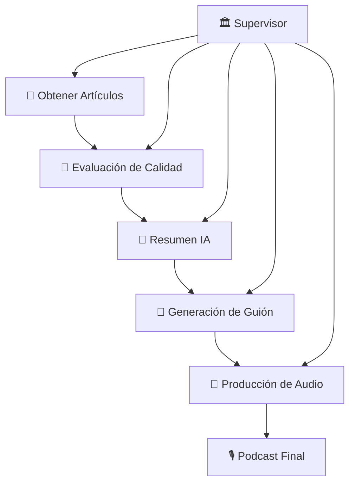
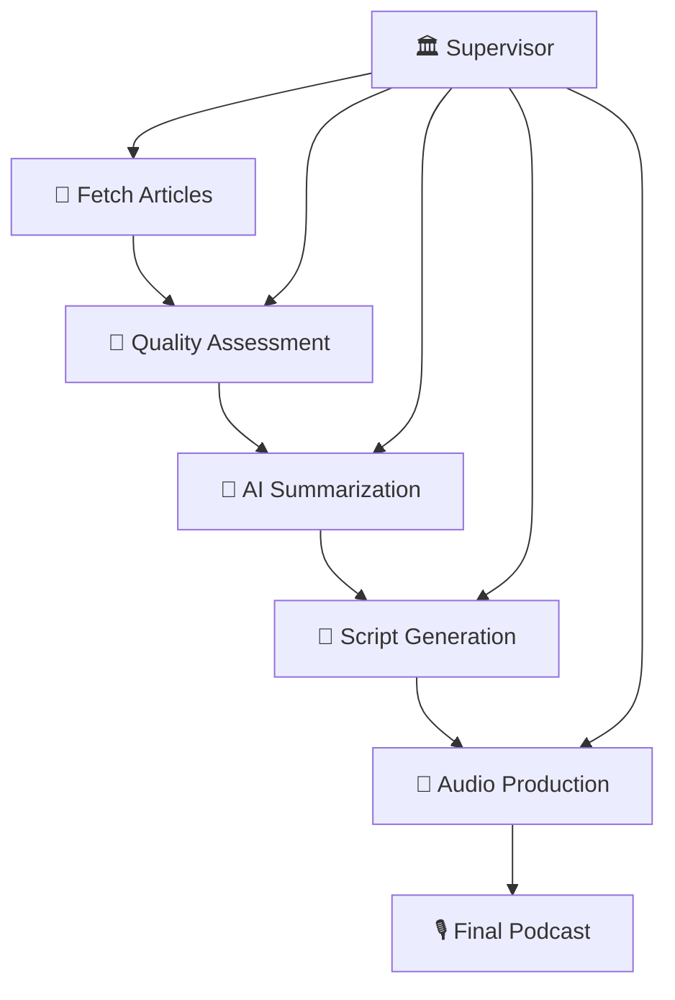
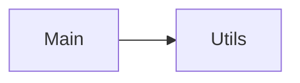

Repository Summary:
Files analyzed: 46
Directories scanned: 967
Total size: 545.67 KB (558766 bytes)
Estimated tokens: 139691
Processing time: 0.60 seconds


## Table of Contents

- [Project Summary](#project-summary)
- [Directory Structure](#directory-structure)
- [Files Content](#files-content)
  - Files By Category:
    - Configuration (5 files):
      - [.gitignore](#_gitignore) - 754 bytes
      - [config.toml](#config_toml) - 297 bytes
      - [docker-compose.yml](#docker-compose_yml) - 2.9 KB
      - [pyproject.toml](#pyproject_toml) - 1.2 KB
      - [rss_feeds.json](#rss_feeds_json) - 2.5 KB
    - Documentation (15 files):
      - [AI_AGENT_PATTERNS_GUIDE.md](#AI_AGENT_PATTERNS_GUIDE_md) - 7.5 KB
      - [AI-parrot_flattened.md](#AI-parrot_flattened_md) - 165.4 KB
      - [API_DOCUMENTATION.md](#API_DOCUMENTATION_md) - 7.5 KB
      - [CODE_WALKTHROUGH.md](#CODE_WALKTHROUGH_md) - 19.4 KB
      - [DOCUMENTACION_API_ES.md](#DOCUMENTACION_API_ES_md) - 7.9 KB
      - [EDUCATIONAL_GUIDE.md](#EDUCATIONAL_GUIDE_md) - 10.3 KB
      - [GUIA_EDUCATIVA_ES.md](#GUIA_EDUCATIVA_ES_md) - 11.4 KB
      - [INDICE_DOCUMENTACION_ES.md](#INDICE_DOCUMENTACION_ES_md) - 5.9 KB
      - [LEARNING_OUTCOMES.md](#LEARNING_OUTCOMES_md) - 8.0 KB
      - [README_ES.md](#README_ES_md) - 10.0 KB
      - [and 5 more Documentation files...]
    - Other (2 files):
      - [Dockerfile](#Dockerfile) - 1.1 KB
      - [LICENSE](#LICENSE) - 1.0 KB
    - Other (sh) (4 files):
      - [run_api.sh](#run_api_sh) - 1.5 KB
      - [run_podcast.sh](#run_podcast_sh) - 4.2 KB
      - [run_ui.sh](#run_ui_sh) - 589 bytes
      - [update_env.sh](#update_env_sh) - 1.1 KB
    - Python (20 files):
      - [__init__.py](#__init___py) - 22 bytes
      - [__init__.py](#__init___py) - 43 bytes
      - [__init__.py](#__init___py) - 46 bytes
      - [a2a_protocol.py](#a2a_protocol_py) - 16.8 KB
      - [agent_supervisor.py](#agent_supervisor_py) - 21.2 KB
      - [ai_processor.py](#ai_processor_py) - 18.2 KB
      - [api_client_example.py](#api_client_example_py) - 4.0 KB
      - [article_fetcher.py](#article_fetcher_py) - 16.6 KB
      - [circuit_breaker.py](#circuit_breaker_py) - 12.2 KB
      - [config_loader.py](#config_loader_py) - 13.1 KB
      - [and 10 more Python files...]
- [Architecture and Relationships](#architecture-and-relationships)
  - [File Dependencies](#file-dependencies)
  - [Class Relationships](#class-relationships)
  - [Component Interactions](#component-interactions)

## Project Summary <a id="project-summary"></a>

# Project Digest: AI-parrot
Generated on: Thu Sep 25 2025 15:37:23 GMT+0200 (Central European Summer Time)
Source: /Users/giuseppe/Documents/Coding/AI-parrot
Project Directory: /Users/giuseppe/Documents/Coding/AI-parrot

# Directory Structure
[DIR] .
  [DIR] .git
  [DIR] .github
    [DIR] instructions
  [FILE] .gitignore
  [DIR] .streamlit
    [FILE] config.toml
  [DIR] .venv
  [DIR] .vscode
  [FILE] AI_AGENT_PATTERNS_GUIDE.md
  [FILE] API_DOCUMENTATION.md
  [FILE] CODE_WALKTHROUGH.md
  [FILE] DOCUMENTACION_API_ES.md
  [FILE] Dockerfile
  [FILE] EDUCATIONAL_GUIDE.md
  [DIR] FlattenSourceCode_Output
  [FILE] GUIA_EDUCATIVA_ES.md
  [FILE] INDICE_DOCUMENTACION_ES.md
  [FILE] LEARNING_OUTCOMES.md
  [FILE] LICENSE
  [DIR] PodcastOutput
  [FILE] README.md
  [FILE] README_ES.md
  [FILE] RESULTADOS_APRENDIZAJE_ES.md
  [FILE] RESUMEN_SISTEMA_ES.md
  [FILE] RSS_CONFIGURATION.md
  [FILE] SYSTEM_OVERVIEW.md
  [DIR] api
    [FILE] main.py
  [FILE] api_client_example.py
  [DIR] config
    [FILE] rss_feeds.json
  [FILE] docker-compose.yml
  [FILE] manage_feeds.py
  [DIR] memory
  [FILE] pyproject.toml
  [FILE] run_api.sh
  [FILE] run_podcast.sh
  [FILE] run_ui.sh
  [DIR] src
    [FILE] __init__.py
    [DIR] podcast_generator
      [FILE] __init__.py
      [DIR] __pycache__
      [FILE] a2a_protocol.py
      [FILE] agent_supervisor.py
      [FILE] ai_processor.py
      [FILE] article_fetcher.py
      [FILE] circuit_breaker.py
      [FILE] config_loader.py
      [FILE] file_utils.py
      [FILE] langgraph_workflow.py
      [FILE] main.py
      [FILE] mcp_client.py
      [FILE] memory_system.py
      [FILE] translator.py
    [DIR] utils
      [FILE] __init__.py
      [DIR] __pycache__
      [FILE] env.py
  [FILE] streamlit_app.py
  [FILE] update_env.sh

# Files Content

## .gitignore <a id="gitignore"></a> **RECENTLY MODIFIED**

# Python virtual environment
.venv/
venv/
ENV/

# Environment variables
.env

# Compiled Python files
__pycache__/
*.py[cod]
*$py.class
*.so
.Python

# Distribution / packaging
dist/
build/
*.egg-info/
*.egg

# Unit test / coverage reports
htmlcov/
.tox/
.coverage
.coverage.*
.cache
nosetests.xml
coverage.xml
*.cover

# Type checking
.mypy_cache/
.dmypy.json
dmypy.json

# IDE specific files
.idea/
.vscode/
*.swp
*.swo

# OS specific files
.DS_Store
Thumbs.db

# Podcast output directory
PodcastOutput/

# Memory database files
memory/*.db
memory/*.db-journal

# Log files
*.log
logs/

# Temporary files
*.tmp
*.temp

# Jupyter notebooks
.ipynb_checkpoints/

# Docker
.dockerignore

#Ignore vscode AI rules
.github/instructions/codacy.instructions.md

## src/podcast_generator/langgraph_workflow.py <a id="langgraph_workflow_py"></a> **RECENTLY MODIFIED**

### Dependencies

- `asyncio`
- `TypedDict`
- `StateGraph`
- `fetch_multiple_sources`
- `get_config_loader`
- `AIProcessor`
- `FileManager`
- `enhance_articles_with_a2a`
- `AgentSupervisor`
- `typing`
- `langgraph.graph`
- `podcast_generator.article_fetcher`
- `podcast_generator.config_loader`
- `podcast_generator.ai_processor`
- `podcast_generator.file_utils`
- `podcast_generator.a2a_protocol`
- `podcast_generator.agent_supervisor`

"""LangGraph workflow for podcast generation with AI Agent Patterns."""
import asyncio
from typing import TypedDict, List, Dict, Any, Tuple

from langgraph.graph import StateGraph, END

from podcast_generator.article_fetcher import fetch_multiple_sources
from podcast_generator.config_loader import get_config_loader
from podcast_generator.ai_processor import AIProcessor
from podcast_generator.file_utils import FileManager
from podcast_generator.a2a_protocol import enhance_articles_with_a2a
from podcast_generator.agent_supervisor import AgentSupervisor, task_monitor_observer

# Define state for LangGraph
class PodcastState(TypedDict):
    """State type for the podcast generation workflow."""

    articles: List[Dict[str, Any]]
    enhanced_articles: List[Dict[str, Any]]
    summaries: List[Dict[str, Any]]
    ranked_articles: List[Dict[str, Any]]
    revised_script: str
    language: str
    voice_name: str
    enable_a2a: bool

# Number of articles to include in the final podcast (10-12 articles)
NUM_ARTICLES = 12

# Define node functions for the LangGraph workflow
async def fetch_articles_function(state: PodcastState) -> PodcastState:
    """Fetch articles from multiple sources.

    Args:
        state: Current workflow state.

    Returns:
        Updated state with fetched articles.
    """
    print("Fetching articles...")
    articles = await fetch_multiple_sources()
    print(f"Fetched {len(articles)} articles")
    state['articles'] = articles
    return state

async def enhance_articles_with_a2a_function(state: PodcastState) -> PodcastState:
    """Enhance articles using A2A collaborative quality assessment.

    Args:
        state: Current workflow state.

    Returns:
        Updated state with A2A-enhanced articles.
    """
    if state.get('enable_a2a', False):
        print("Enhancing articles with A2A collaborative assessment...")
        try:
            # Configure A2A agent
            a2a_config = {
                "listen_port": 8080,
                "known_agents": [
                    "http://localhost:8081",
                    "http://localhost:8082"
                ]
            }

            enhanced_articles = await enhance_articles_with_a2a(
                state['articles'],
                a2a_config
            )
            state['enhanced_articles'] = enhanced_articles
            print(f"A2A enhancement complete for {len(enhanced_articles)} articles")
        except Exception as e:
            print(f"A2A enhancement failed: {e}")
            print("Continuing with original articles...")
            state['enhanced_articles'] = state['articles']
    else:
        print("A2A enhancement disabled, using original articles")
        state['enhanced_articles'] = state['articles']

    return state

async def sort_articles_by_date(state: PodcastState) -> PodcastState:
    """Sort articles by publication date and A2A quality scores.

    Args:
        state: Current workflow state.

    Returns:
        Updated state with sorted articles.
    """
    print("Sorting articles by date and A2A quality scores...")

    # Use enhanced articles if available, otherwise use original articles
    articles_to_sort = state.get('enhanced_articles', state['articles'])

    # Sort by A2A quality score first, then by date
    def sort_key(article):
        a2a_score = article.get('a2a_quality_score', 0.5)
        date_score = article['published'].timestamp() / 1000000000  # Normalize timestamp
        return (a2a_score * 0.7) + (date_score * 0.3)  # Weighted combination

    sorted_articles = sorted(
        articles_to_sort,
        key=sort_key,
        reverse=True
    )

    state['ranked_articles'] = sorted_articles[:NUM_ARTICLES]  # Take top N articles
    print(f"Selected {len(state['ranked_articles'])} highest-quality articles")

    # Log A2A scores if available
    a2a_articles = [a for a in state['ranked_articles'] if 'a2a_quality_score' in a]
    if a2a_articles:
        avg_score = sum(a['a2a_quality_score'] for a in a2a_articles) / len(a2a_articles)
        print(f"Average A2A quality score: {avg_score:.3f}")

    return state

async def summarize_articles_function(state: PodcastState) -> PodcastState:
    """Summarize articles using AI.

    Args:
        state: Current workflow state.

    Returns:
        Updated state with summarized articles.
    """
    print("Summarizing articles...")
    processor = AIProcessor()
    summarized_articles = []

    for article in state['ranked_articles']:
        article_copy = article.copy()
        summary = processor.summarize_article(article_copy)
        article_copy['summary'] = summary
        summarized_articles.append(article_copy)

    state['summaries'] = summarized_articles
    print(f"Summarized {len(summarized_articles)} articles")
    return state

def should_retry_summarization(state: PodcastState) -> str:
    """Decide whether to retry summarization or proceed.

    Args:
        state: Current workflow state.

    Returns:
        Next node name.
    """
    if len(state.get('summaries', [])) > 0:
        return "save_csv"
    return "summarize_articles"

def generate_podcast_script(state: PodcastState) -> PodcastState:
    """Generate a podcast script from article summaries.

    Args:
        state: Current workflow state.

    Returns:
        Updated state with generated podcast script.
    """
    print("Generating podcast script...")
    processor = AIProcessor()
    voice_name = state.get('voice_name', 'Aria')
    script = processor.generate_podcast_script(state['summaries'], voice_name)
    revised_script = processor.revise_podcast_script(script)
    state['revised_script'] = revised_script
    print("Podcast script generated and revised")
    return state

async def save_podcast_files(state: PodcastState) -> PodcastState:
    """Save podcast files (narrative version and MP3).

    Args:
        state: Current workflow state.

    Returns:
        Updated state after saving files.
    """
    print("Saving podcast files...")
    file_manager = FileManager()

    # Get language and voice from state (default to English and Aria if not set)
    language = state.get('language', 'en')
    voice_name = state.get('voice_name', 'Aria')

    # Save clean narrative version (using the revised script as source)
    narrative_path = await file_manager.save_narrative_file(
        content=state['revised_script'],
        language=language
    )
    print(f"Saved {language.upper()} narrative script to: {narrative_path}")

    # Save MP3 using the narrative version
    with open(narrative_path, 'r', encoding='utf-8') as f:
        narrative_content = f.read()

    print(f"Generating audio with voice: {voice_name}")

    try:
        # Save MP3 with translation and intro/outro
        mp3_path = await file_manager.save_mp3_file(
            text_content=narrative_content,
            voice_name=voice_name,
            language=language,
            save_translation=True,  # Save the translated text for reference
            add_intro_outro=True    # Add intro and outro
        )
        print(f"✓ Successfully generated podcast MP3: {mp3_path}")

    except Exception as e:
        print(f"Error generating podcast audio: {str(e)}")
        # Fall back to English if Spanish fails
        if language == 'es':
            print("Falling back to English...")
            mp3_path = await file_manager.save_mp3_file(
                text_content=state['revised_script'],  # Use original English text
                voice_name=voice_name,
                language='en',
                save_translation=False,
                add_intro_outro=True
            )
            print(f"✓ Successfully generated English podcast MP3: {mp3_path}")

    return state

def create_podcast_workflow() -> StateGraph:
    """Create the podcast generation workflow graph.

    Returns:
        Compiled LangGraph workflow.
    """
    # Create the graph
    graph = StateGraph(PodcastState)

    # Add nodes to the graph
    graph.add_node("fetch_articles", fetch_articles_function)
    graph.add_node("enhance_a2a", enhance_articles_with_a2a_function)
    graph.add_node("sort_articles", sort_articles_by_date)
    graph.add_node("summarize_articles", summarize_articles_function)
    graph.add_node("generate_script", generate_podcast_script)
    graph.add_node("save_files", save_podcast_files)

    # Define edges for the workflow
    graph.add_edge("fetch_articles", "enhance_a2a")
    graph.add_edge("enhance_a2a", "sort_articles")
    graph.add_edge("sort_articles", "summarize_articles")
    graph.add_conditional_edges(
        "summarize_articles",
        should_retry_summarization,
        {
            "save_csv": "generate_script",
            "summarize_articles": "summarize_articles"
        }
    )
    graph.add_edge("generate_script", "save_files")
    graph.add_edge("save_files", END)

    # Set the entry point
    graph.set_entry_point("fetch_articles")

    # Compile the graph
    return graph.compile()

async def run_podcast_workflow_with_patterns(
    language: str = 'en',
    voice_name: str = 'Aria',
    enable_a2a: bool = False,
    use_supervisor: bool = True,
    use_resilience: bool = False
) -> Dict[str, Any]:
    """Run podcast workflow using AI Agent Patterns.

    Args:
        language: Language code ('en' for English, 'es' for Spanish).
        voice_name: Name of the voice to use for the podcast.
        enable_a2a: Whether to enable A2A collaborative assessment.
        use_supervisor: Whether to use the Agent Supervisor pattern.
        use_resilience: Whether to use Circuit Breaker resilience pattern.

    Returns:
        Workflow execution results.
    """
    print(f"\n🤖 Starting AI Agent Pattern Workflow")
    print(f"   Language: {language}")
    print(f"   Voice: {voice_name}")
    print(f"   A2A Protocol: {'Enabled' if enable_a2a else 'Disabled'}")
    print(f"   Supervisor Pattern: {'Enabled' if use_supervisor else 'Disabled'}")
    print("=" * 60)

    if use_supervisor:
        # Use Agent Supervisor Pattern
        supervisor = AgentSupervisor()
        supervisor.add_observer(task_monitor_observer)

        result = await supervisor.execute_workflow(
            language=language,
            voice_name=voice_name,
            enable_a2a=enable_a2a
        )

        # Add system status to result
        result['system_status'] = supervisor.get_system_status()
        return result

    else:
        # Fallback to original LangGraph workflow
        return await run_podcast_workflow(language, voice_name, enable_a2a)

async def run_podcast_workflow(
    language: str = 'en',
    voice_name: str = 'Aria',
    enable_a2a: bool = False
) -> PodcastState:
    """Run the podcast generation workflow.

    Args:
        language: Language code ('en' for English, 'es' for Spanish).
        voice_name: Name of the voice to use for the podcast.
        enable_a2a: Whether to enable A2A collaborative assessment.

    Returns:
        Final state of the workflow.
    """
    workflow = create_podcast_workflow()

    # Initialize the state with language, voice, and A2A settings
    initial_state: PodcastState = {
        'articles': [],
        'enhanced_articles': [],
        'summaries': [],
        'ranked_articles': [],
        'revised_script': '',
        'language': language,
        'voice_name': voice_name,
        'enable_a2a': enable_a2a
    }

    # Run the workflow
    final_state = await workflow.ainvoke(initial_state)
    return final_state

## docker-compose.yml <a id="docker-compose_yml"></a> **RECENTLY MODIFIED**

### Dependencies

- `your-mcp-server:latest`

services:
  ai-parrot-api:
    build: .
    command: uvicorn api.main:app --host 0.0.0.0 --port 8000
    ports:
      - "8000:8000"
    environment:
      # Copy your API keys from .env file
      - ANTHROPIC_API_KEY=${ANTHROPIC_API_KEY}
      - ELEVEN_API_KEY=${ELEVEN_API_KEY}
      - OPENAI_API_KEY=${OPENAI_API_KEY}
      - NEWS_API_KEY=${NEWS_API_KEY}
      - GOOGLE_API_KEY=${GOOGLE_API_KEY}
      - MISTRAL_API_KEY=${MISTRAL_API_KEY}
      - OPENROUTER_API_KEY=${OPENROUTER_API_KEY}
      - TAVILY_API_KEY=${TAVILY_API_KEY}
      # MCP Server Configuration
      - MCP_SERVER_URL=${MCP_SERVER_URL:-http://host.docker.internal:3002/mcp}
      - MCP_SSE_URL=${MCP_SSE_URL:-http://host.docker.internal:3002/sse}
      - MCP_SERVER_NAME=${MCP_SERVER_NAME:-local-mcp-server}
      # Logging
      - LOG_LEVEL=${LOG_LEVEL:-INFO}
    volumes:
      # Mount output directory to persist generated podcasts
      - ./PodcastOutput:/app/PodcastOutput
      # Mount configuration directory for RSS feeds
      - ./config:/app/config:ro
      # Mount memory directory for persistent storage
      - ./memory:/app/memory
      # Mount .env file if it exists
      - ./.env:/app/.env:ro
    restart: unless-stopped
    healthcheck:
      test: ["CMD", "curl", "-f", "http://localhost:8000/health"]
      interval: 30s
      timeout: 10s
      retries: 3
      start_period: 40s
    networks:
      - ai-parrot-network

  ai-parrot-ui:
    build: .
    command: streamlit run streamlit_app.py --server.port=8501 --server.address=0.0.0.0
    ports:
      - "8501:8501"
    environment:
      # Copy your API keys from .env file
      - ANTHROPIC_API_KEY=${ANTHROPIC_API_KEY}
      - ELEVEN_API_KEY=${ELEVEN_API_KEY}
      - OPENAI_API_KEY=${OPENAI_API_KEY}
      - NEWS_API_KEY=${NEWS_API_KEY}
      - GOOGLE_API_KEY=${GOOGLE_API_KEY}
      - MISTRAL_API_KEY=${MISTRAL_API_KEY}
      - OPENROUTER_API_KEY=${OPENROUTER_API_KEY}
      - TAVILY_API_KEY=${TAVILY_API_KEY}
      # MCP Server Configuration
      - MCP_SERVER_URL=${MCP_SERVER_URL:-http://host.docker.internal:3002/mcp}
      - MCP_SSE_URL=${MCP_SSE_URL:-http://host.docker.internal:3002/sse}
      - MCP_SERVER_NAME=${MCP_SERVER_NAME:-local-mcp-server}
      # Logging
      - LOG_LEVEL=${LOG_LEVEL:-INFO}
    volumes:
      # Mount output directory to persist generated podcasts
      - ./PodcastOutput:/app/PodcastOutput
      # Mount configuration directory for RSS feeds
      - ./config:/app/config:ro
      # Mount memory directory for persistent storage
      - ./memory:/app/memory
      # Mount .env file if it exists
      - ./.env:/app/.env:ro
    depends_on:
      - ai-parrot-api
    restart: unless-stopped
    networks:
      - ai-parrot-network

  # Optional: MCP Server (if you want to run it in the same compose)
  # mcp-server:
  #   image: your-mcp-server:latest
  #   ports:
  #     - "3002:3002"
  #   networks:
  #     - ai-parrot-network

networks:
  ai-parrot-network:
    driver: bridge

volumes:
  podcast-output:
    driver: local

## api/main.py <a id="main_py"></a> **RECENTLY MODIFIED**

### Dependencies

- `asyncio`
- `os`
- `sys`
- `Path`
- `Optional`
- `datetime`
- `logging`
- `FastAPI`
- `FileResponse`
- `BaseModel`
- `uvicorn`
- `run_podcast_workflow_with_patterns`
- `MemoryManager`
- `validate_api_keys`
- `collections`
- `subprocess`
- `pathlib`
- `typing`
- `fastapi`
- `fastapi.responses`
- `pydantic`
- `podcast_generator.langgraph_workflow`
- `podcast_generator.memory_system`
- `utils.env`

"""
AI-Parrot Enterprise System - Web API

FastAPI endpoint for the AI-Parrot podcast generator with enterprise AI agent patterns.
Built with A2A collaborative assessment, Agent Supervisor coordination, MCP integration,
Circuit Breaker resilience, and Observer pattern monitoring.
"""

import asyncio
import os
import sys
from pathlib import Path
from typing import Optional, Dict, Any
from datetime import datetime
import logging

from fastapi import FastAPI, HTTPException, BackgroundTasks
from fastapi.responses import FileResponse, JSONResponse
from pydantic import BaseModel, Field
import uvicorn

# Add project paths
project_root = Path(__file__).parent.parent
sys.path.insert(0, str(project_root / "src"))
sys.path.insert(0, str(project_root))

from podcast_generator.langgraph_workflow import run_podcast_workflow_with_patterns
from podcast_generator.memory_system import MemoryManager, MemoryType
from utils.env import validate_api_keys, load_env_vars

# Configure logging with in-memory handler
logging.basicConfig(level=logging.INFO)
logger = logging.getLogger(__name__)

# Create in-memory log storage
import collections
log_buffer = collections.deque(maxlen=200)  # Store last 200 log entries

class MemoryLogHandler(logging.Handler):
    """Custom log handler to store logs in memory."""
    def emit(self, record):
        log_entry = self.format(record)
        timestamp = datetime.now().strftime('%H:%M:%S')
        log_buffer.append(f"[{timestamp}] {log_entry}")

# Add memory handler to root logger
memory_handler = MemoryLogHandler()
memory_handler.setFormatter(logging.Formatter('%(levelname)s:%(name)s:%(message)s'))
logging.getLogger().addHandler(memory_handler)

# Initialize FastAPI app
app = FastAPI(
    title="AI-Parrot Enterprise Podcast Generator",
    description="Enterprise AI Agent System for Intelligent Podcast Generation",
    version="1.0.0",
    docs_url="/docs",
    redoc_url="/redoc"
)

# Request/Response Models
class PodcastRequest(BaseModel):
    language: str = Field(default="en", description="Language for the podcast (en/es)")
    voice: str = Field(default="Aria", description="Voice to use for the podcast")

    class Config:
        schema_extra = {
            "example": {
                "language": "en",
                "voice": "Aria"
            }
        }

class PodcastResponse(BaseModel):
    success: bool
    message: str
    task_id: Optional[str] = None
    audio_path: Optional[str] = None
    articles_processed: Optional[int] = None
    tasks_completed: Optional[int] = None
    a2a_quality_score: Optional[float] = None
    system_status: Optional[Dict[str, Any]] = None
    generation_time: Optional[float] = None

class HealthResponse(BaseModel):
    status: str
    timestamp: str
    version: str
    enterprise_patterns: Dict[str, bool]
    api_keys: Dict[str, bool]

# Global task storage (in production, use Redis or database)
active_tasks: Dict[str, Dict[str, Any]] = {}

# Global memory manager
memory_manager = MemoryManager()

async def startup_event():
    """Initialize the application on startup."""
    logger.info("Starting AI-Parrot Enterprise System API")

    # Load environment variables
    load_env_vars()

    # Validate API keys on startup

@app.get("/", response_model=Dict[str, str])
async def root():
    """Root endpoint with system information."""
    return {
        "name": "AI-Parrot Enterprise Podcast Generator",
        "version": "1.0.0",
        "description": "Enterprise AI Agent System for Intelligent Podcast Generation",
        "enterprise_patterns": "A2A + Supervisor + MCP + Circuit Breaker + Observer",
        "docs": "/docs",
        "health": "/health"
    }

@app.get("/health", response_model=HealthResponse)
async def health_check():
    """Health check endpoint."""
    api_status = validate_api_keys()

    return HealthResponse(
        status="healthy",
        timestamp=datetime.now().isoformat(),
        version="1.0.0",
        enterprise_patterns={
            "a2a_collaborative_assessment": True,
            "agent_supervisor_coordination": True,
            "mcp_integration_sse_transport": True,
            "circuit_breaker_resilience": True,
            "observer_pattern_monitoring": True
        },
        api_keys={
            "anthropic": api_status.get("anthropic", False),
            "openai": api_status.get("openai", False),
            "elevenlabs": api_status.get("elevenlabs", False),
            "news_api": api_status.get("news_api", False)
        }
    )
@app.post("/generate", response_model=PodcastResponse)
async def generate_podcast(request: PodcastRequest, background_tasks: BackgroundTasks):
    """
    Generate a podcast using the enterprise AI agent system.

    This endpoint orchestrates the full AI-Parrot workflow with all enterprise patterns:
    - A2A Collaborative Assessment for quality enhancement
    - Agent Supervisor Coordination for task management
    - MCP Integration for dynamic content sourcing
    - Circuit Breaker Resilience for fault tolerance
    - Observer Pattern Monitoring for real-time insights
    """
    logger.info(f"Starting podcast generation: language={request.language}, voice={request.voice}")

    # Validate API keys
    api_status = validate_api_keys()
    if not api_status.get("anthropic", False):
        logger.error("❌ Anthropic API key missing or invalid")
        raise HTTPException(
            status_code=500,
            detail="Anthropic API key is required for podcast generation"
        )

    logger.info(f"🚀 Starting podcast generation: {request.language}/{request.voice}")

    try:
        start_time = datetime.now()

        # Run the enterprise AI agent workflow
        result = await run_podcast_workflow_with_patterns(
            language=request.language,
            voice_name=request.voice,
            enable_a2a=True,  # Always enabled in enterprise system
            use_supervisor=True,  # Always enabled in enterprise system
            use_resilience=True  # Always enabled in enterprise system
        )

        end_time = datetime.now()
        generation_time = (end_time - start_time).total_seconds()

        if result.get("success"):
            logger.info(f"✅ Podcast generated successfully in {generation_time:.2f}s")

            return PodcastResponse(
                success=True,
                message="Podcast generated successfully with enterprise AI agent patterns",
                audio_path=result.get("audio_path"),
                articles_processed=result.get("articles_processed"),
                tasks_completed=result.get("tasks_completed"),
                a2a_quality_score=result.get("a2a_quality_score"),
                system_status=result.get("system_status"),
                generation_time=generation_time
            )
        else:
            logger.error(f"❌ Podcast generation failed: {result.get('error')}")
            raise HTTPException(
                status_code=500,
                detail=f"Podcast generation failed: {result.get('error')}"
            )

    except Exception as e:
        logger.error(f"❌ Unexpected error during podcast generation: {e}")
        raise HTTPException(
            status_code=500,
            detail=f"Unexpected error during podcast generation: {str(e)}"
        )

@app.get("/download/{filename}")
async def download_podcast(filename: str):
    """Download a generated podcast file."""
    file_path = Path("PodcastOutput") / filename

    if not file_path.exists():
        raise HTTPException(status_code=404, detail="File not found")

    if not file_path.suffix.lower() in [".mp3", ".wav", ".txt"]:
        raise HTTPException(status_code=400, detail="Invalid file type")

    return FileResponse(
        path=str(file_path),
        filename=filename,
        media_type="application/octet-stream"
    )

@app.get("/files")
async def list_files():
    """List all generated podcast files."""
    output_dir = Path("PodcastOutput")

    if not output_dir.exists():
        return {"files": []}

    files = []
    for file_path in output_dir.iterdir():
        if file_path.is_file():
            stat = file_path.stat()
            files.append({
                "name": file_path.name,
                "size": stat.st_size,
                "created": datetime.fromtimestamp(stat.st_ctime).isoformat(),
                "modified": datetime.fromtimestamp(stat.st_mtime).isoformat(),
                "download_url": f"/download/{file_path.name}"
            })

    return {"files": sorted(files, key=lambda x: x["modified"], reverse=True)}

@app.get("/status")
async def system_status():
    """Get detailed system status and metrics."""
    api_status = validate_api_keys()
    output_dir = Path("PodcastOutput")

    # Count generated files
    file_count = len(list(output_dir.glob("*.mp3"))) if output_dir.exists() else 0

    return {
        "system": "AI-Parrot Enterprise System",
        "status": "operational",
        "enterprise_patterns": {
            "a2a_collaborative_assessment": "active",
            "agent_supervisor_coordination": "active",
            "mcp_integration_sse_transport": "active",
            "circuit_breaker_resilience": "active",
            "observer_pattern_monitoring": "active"
        },
        "api_keys": {
            "anthropic": "✅ Available" if api_status.get("anthropic") else "❌ Missing",
            "openai": "✅ Available" if api_status.get("openai") else "⚠️ Optional",
            "elevenlabs": "✅ Available" if api_status.get("elevenlabs") else "❌ Missing",
            "news_api": "✅ Available" if api_status.get("news_api") else "⚠️ Optional"
        },
        "statistics": {
            "podcasts_generated": file_count,
            "supported_languages": ["en", "es"],
            "supported_voices": ["Aria", "Sarah", "Lily", "Custom"]
        },
        "timestamp": datetime.now().isoformat()
    }

@app.get("/api/logs")
async def get_logs():
    """Get recent system logs."""
    try:
        import subprocess
        import os

        # Try to get actual Docker logs
        logs = []

        # Method 1: Try to read from Docker logs if available
        try:
            # Get container logs using docker logs command
            container_name = os.environ.get('HOSTNAME', 'ai-parrot-api')
            result = subprocess.run(
                ["docker", "logs", "--tail=100", container_name],
                capture_output=True,
                text=True,
                timeout=10
            )
            if result.returncode == 0 and result.stdout:
                logs.extend(result.stdout.split('\n'))
            elif result.stderr:
                logs.extend(result.stderr.split('\n'))
        except Exception:
            pass

        # Method 2: Try to get logs from the host system
        if not logs:
            try:
                # Try to get logs using docker-compose from various possible locations
                possible_paths = ["/app", "/", "/usr/src/app", "/opt/app"]
                for path in possible_paths:
                    try:
                        result = subprocess.run(
                            ["docker-compose", "logs", "--tail=100", "--no-color", "ai-parrot-api"],
                            capture_output=True,
                            text=True,
                            cwd=path,
                            timeout=15
                        )
                        if result.returncode == 0 and result.stdout:
                            logs.extend(result.stdout.split('\n'))
                            break
                    except Exception:
                        continue
            except Exception:
                pass

        # Method 3: Get application logs from memory buffer
        if not logs and log_buffer:
            logs = list(log_buffer)

        # Method 4: Fallback logs if nothing else works
        if not logs:
            # Get recent log entries from the application
            logs = [
                f"[{datetime.now().strftime('%H:%M:%S')}] INFO: API server running on port 8000",
                f"[{datetime.now().strftime('%H:%M:%S')}] INFO: Enterprise AI patterns active",
                f"[{datetime.now().strftime('%H:%M:%S')}] INFO: Health check endpoint responding",
                "📋 For detailed logs, use: docker-compose logs ai-parrot-api",
                "🔍 For real-time logs: docker-compose logs -f ai-parrot-api",
                "📊 System Status: All enterprise AI patterns active",
                "✅ API Keys: Configured and validated"
            ]

        # Filter out empty lines
        logs = [log.strip() for log in logs if log.strip()]

        return {
            "logs": logs[-100:],  # Return last 100 lines
            "total_lines": len(logs),
            "timestamp": datetime.now().isoformat(),
            "source": "docker_logs" if len(logs) > 10 else "application_logs"
        }

    except Exception as e:
        return {
            "logs": [
                f"[{datetime.now().strftime('%H:%M:%S')}] ERROR: Failed to get logs: {str(e)}",
                "📋 Try: docker-compose logs ai-parrot-api",
                "🔍 Or: docker logs <container_id>"
            ],
            "total_lines": 3,
            "timestamp": datetime.now().isoformat(),
            "error": str(e)
        }

@app.get("/api/memory/summary")
async def get_memory_summary():
    """Get comprehensive memory system summary."""
    try:
        summary = memory_manager.get_memory_summary()
        return {
            "success": True,
            "memory_summary": summary,
            "timestamp": datetime.now().isoformat()
        }
    except Exception as e:
        return {
            "success": False,
            "error": str(e),
            "timestamp": datetime.now().isoformat()
        }

@app.get("/api/memory/context")
async def get_memory_context():
    """Get current memory context for podcast generation."""
    try:
        # Get recent articles for context
        recent_articles = memory_manager.short_term.get_recent_articles(limit=5)
        context = memory_manager.get_relevant_context(recent_articles, limit=10)

        return {
            "success": True,
            "context": context,
            "timestamp": datetime.now().isoformat()
        }
    except Exception as e:
        return {
            "success": False,
            "error": str(e),
            "timestamp": datetime.now().isoformat()
        }

@app.post("/api/memory/clear-session")
async def clear_memory_session():
    """Clear current short-term memory session."""
    try:
        memory_manager.clear_session()
        return {
            "success": True,
            "message": "Short-term memory session cleared",
            "timestamp": datetime.now().isoformat()
        }
    except Exception as e:
        return {
            "success": False,
            "error": str(e),
            "timestamp": datetime.now().isoformat()
        }

@app.get("/api/memory/patterns")
async def get_learned_patterns():
    """Get learned user patterns."""
    try:
        patterns = memory_manager.long_term.get_patterns(min_frequency=2)
        return {
            "success": True,
            "patterns": patterns,
            "count": len(patterns),
            "timestamp": datetime.now().isoformat()
        }
    except Exception as e:
        return {
            "success": False,
            "error": str(e),
            "timestamp": datetime.now().isoformat()
        }

@app.get("/api/memory/knowledge")
async def query_knowledge_graph(subject: str = None, predicate: str = None, object_val: str = None):
    """Query the knowledge graph."""
    try:
        results = memory_manager.long_term.query_knowledge(subject, predicate, object_val)
        formatted_results = [
            {"subject": r[0], "predicate": r[1], "object": r[2], "confidence": r[3]}
            for r in results
        ]

        return {
            "success": True,
            "knowledge": formatted_results,
            "count": len(formatted_results),
            "query": {"subject": subject, "predicate": predicate, "object": object_val},
            "timestamp": datetime.now().isoformat()
        }
    except Exception as e:
        return {
            "success": False,
            "error": str(e),
            "timestamp": datetime.now().isoformat()
        }

if __name__ == "__main__":
    uvicorn.run(
        "api.main:app",
        host="0.0.0.0",
        port=8000,
        reload=True,
        log_level="info"
    )

## manage_feeds.py <a id="manage_feeds_py"></a> **RECENTLY MODIFIED**

### Dependencies

- `sys`
- `argparse`
- `asyncio`
- `Path`
- `get_config_loader`
- `fetch_rss_feed_articles`
- `urlparse`
- `pathlib`
- `podcast_generator.config_loader`
- `podcast_generator.article_fetcher`
- `urllib.parse`

#!/usr/bin/env python3
"""RSS Feed Management CLI Tool for AI-Parrot.

This tool allows you to manage RSS feeds without editing JSON files directly.

Usage:
    python manage_feeds.py list                    # List all feeds
    python manage_feeds.py add <name> <url>        # Add a new feed
    python manage_feeds.py enable <url>            # Enable a feed
    python manage_feeds.py disable <url>           # Disable a feed
    python manage_feeds.py test <url>              # Test a feed URL
"""

import sys
import argparse
import asyncio
from pathlib import Path

# Add the src directory to the Python path
project_root = Path(__file__).parent
src_dir = project_root / "src"
if str(src_dir) not in sys.path:
    sys.path.insert(0, str(src_dir))

from podcast_generator.config_loader import get_config_loader, RSSFeedConfig
from podcast_generator.article_fetcher import fetch_rss_feed_articles

def list_feeds():
    """List all configured RSS feeds."""
    config_loader = get_config_loader()
    feeds = config_loader.get_enabled_feeds()
    disabled_feeds = []

    # Get all feeds (including disabled)
    config = config_loader.load_config()
    all_feeds = config.get('rss_feeds', [])

    print("📰 RSS Feed Configuration")
    print("=" * 50)

    print("\n✅ ENABLED FEEDS:")
    if feeds:
        for i, feed in enumerate(feeds, 1):
            print(f"  {i}. {feed.name}")
            print(f"     URL: {feed.url}")
            print(f"     Source: {feed.source_label}")
            print(f"     Max Articles: {feed.max_articles}")
            if feed.description:
                print(f"     Description: {feed.description}")
            print()
    else:
        print("  No enabled feeds found.")

    # Show disabled feeds
    disabled_feeds = [feed for feed in all_feeds if not feed.get('enabled', True)]
    if disabled_feeds:
        print("\n❌ DISABLED FEEDS:")
        for i, feed in enumerate(disabled_feeds, 1):
            print(f"  {i}. {feed['name']}")
            print(f"     URL: {feed['url']}")
            print()

def add_feed(name: str, url: str, source_label: str = None, max_articles: int = 30):
    """Add a new RSS feed."""
    config_loader = get_config_loader()

    if source_label is None:
        # Try to extract source label from URL
        from urllib.parse import urlparse
        parsed = urlparse(url)
        source_label = parsed.netloc.replace('www.', '').title()

    feed_config = RSSFeedConfig(
        name=name,
        url=url,
        source_label=source_label,
        max_articles=max_articles,
        description=f"RSS feed for {name}",
        enabled=True
    )

    if config_loader.add_feed(feed_config):
        print(f"✅ Successfully added feed: {name}")
        print(f"   URL: {url}")
        print(f"   Source: {source_label}")
    else:
        print(f"❌ Failed to add feed: {name}")

def toggle_feed(url: str, enabled: bool):
    """Enable or disable a feed."""
    config_loader = get_config_loader()

    if config_loader.toggle_feed(url, enabled):
        status = "enabled" if enabled else "disabled"
        print(f"✅ Feed {status}: {url}")
    else:
        print(f"❌ Feed not found: {url}")

async def test_feed(url: str):
    """Test fetching from a specific RSS feed URL."""
    print(f"🧪 Testing RSS feed: {url}")
    print("-" * 50)

    # Create a temporary feed config for testing
    test_config = RSSFeedConfig(
        name="Test Feed",
        url=url,
        source_label="Test",
        max_articles=5,  # Limit for testing
        enabled=True
    )

    try:
        articles = await fetch_rss_feed_articles(test_config)

        if articles:
            print(f"✅ Successfully fetched {len(articles)} articles:")
            print()

            for i, article in enumerate(articles[:3], 1):  # Show first 3
                print(f"{i}. {article['title']}")
                print(f"   Source: {article['source']}")
                print(f"   Published: {article['published']}")
                print(f"   URL: {article['link']}")
                print()

            if len(articles) > 3:
                print(f"   ... and {len(articles) - 3} more articles")
        else:
            print("⚠️  No articles found or feed is empty")

    except Exception as e:
        print(f"❌ Error testing feed: {e}")

def show_config():
    """Show current configuration details."""
    config_loader = get_config_loader()
    filter_config = config_loader.get_content_filter_config()
    fetch_config = config_loader.get_fetching_config()

    print("⚙️  Current Configuration")
    print("=" * 50)

    print(f"\n📅 Content Filters:")
    print(f"   Date Range: {filter_config.date_range_days} days")
    print(f"   Min Content Length: {filter_config.min_content_length} chars")
    print(f"   Keywords: {len(filter_config.keywords)} configured")

    print(f"\n🔧 Fetching Config:")
    print(f"   Concurrent Requests: {fetch_config.concurrent_requests}")
    print(f"   Timeout: {fetch_config.timeout_seconds}s")
    print(f"   Retry Attempts: {fetch_config.retry_attempts}")
    print(f"   User Agent: {fetch_config.user_agent}")

def main():
    parser = argparse.ArgumentParser(
        description="Manage RSS feeds for AI-Parrot podcast generator",
        formatter_class=argparse.RawDescriptionHelpFormatter,
        epilog="""
Examples:
  python manage_feeds.py list
  python manage_feeds.py add "AI News" "https://example.com/ai/feed/"
  python manage_feeds.py enable "https://techcrunch.com/tag/artificial-intelligence/feed/"
  python manage_feeds.py disable "https://venturebeat.com/category/ai/feed/"
  python manage_feeds.py test "https://www.technologyreview.com/topic/artificial-intelligence/feed/"
  python manage_feeds.py config
        """
    )

    subparsers = parser.add_subparsers(dest='command', help='Available commands')

    # List command
    subparsers.add_parser('list', help='List all RSS feeds')

    # Add command
    add_parser = subparsers.add_parser('add', help='Add a new RSS feed')
    add_parser.add_argument('name', help='Feed name')
    add_parser.add_argument('url', help='Feed URL')
    add_parser.add_argument('--source', help='Source label (auto-detected if not provided)')
    add_parser.add_argument('--max-articles', type=int, default=30, help='Maximum articles to fetch')

    # Enable command
    enable_parser = subparsers.add_parser('enable', help='Enable a feed')
    enable_parser.add_argument('url', help='Feed URL to enable')

    # Disable command
    disable_parser = subparsers.add_parser('disable', help='Disable a feed')
    disable_parser.add_argument('url', help='Feed URL to disable')

    # Test command
    test_parser = subparsers.add_parser('test', help='Test a feed URL')
    test_parser.add_argument('url', help='Feed URL to test')

    # Config command
    subparsers.add_parser('config', help='Show current configuration')

    args = parser.parse_args()

    if not args.command:
        parser.print_help()
        return

    if args.command == 'list':
        list_feeds()
    elif args.command == 'add':
        add_feed(args.name, args.url, args.source, args.max_articles)
    elif args.command == 'enable':
        toggle_feed(args.url, True)
    elif args.command == 'disable':
        toggle_feed(args.url, False)
    elif args.command == 'test':
        asyncio.run(test_feed(args.url))
    elif args.command == 'config':
        show_config()

if __name__ == "__main__":
    main()

## src/podcast_generator/article_fetcher.py <a id="article_fetcher_py"></a> **RECENTLY MODIFIED**

### Dependencies

- `asyncio`
- `os`
- `logging`
- `datetime`
- `Dict`
- `feedparser`
- `BeautifulSoup`
- `requests`
- `MCPClient`
- `get_config_loader`
- `urlparse`
- `typing`
- `bs4`
- `podcast_generator.mcp_client`
- `podcast_generator.config_loader`
- `urllib.parse`

"""Article fetching and processing module for podcast generation.

🎓 Learning Objectives:
- Understand hybrid content sourcing strategies (MCP + RSS)
- Learn fallback patterns for resilient systems
- Practice async content aggregation from multiple sources
- Implement content deduplication and filtering algorithms

🔍 Pattern Analysis:
This module implements the Strategy Pattern with Fallback:
- Primary Strategy: MCP server-based dynamic content fetching
- Fallback Strategy: Traditional RSS feed parsing
- Content Aggregator: Combines and deduplicates from all sources
- Filter Chain: Applies keyword and date filtering

💡 Real-world Applications:
- News aggregation platforms
- Content management systems
- Social media feed aggregators
- Research paper collection systems
"""
import asyncio
import os
import logging
from datetime import datetime, timedelta
from typing import Dict, List, Any, Optional

import feedparser
from bs4 import BeautifulSoup
import requests

from podcast_generator.mcp_client import MCPClient, MCPArticle
from podcast_generator.config_loader import get_config_loader, RSSFeedConfig

# Configure logging
logger = logging.getLogger(__name__)

# A2A-enhanced article fetching with MCP integration

# MCP Server Configuration
# 🎓 Learning Note: This configuration allows dynamic server discovery
# You can add multiple MCP servers for redundancy and diverse content sources
def get_mcp_server_configs() -> List[Dict[str, Any]]:
    """Get MCP server configurations from environment or defaults.

    Returns:
        List of MCP server configurations

    🔍 Pattern: Configuration Factory
    This centralizes server configuration and allows environment-based setup.
    """
    configs = []

    # Check for environment-based MCP server configuration
    mcp_server_url = os.getenv('MCP_SERVER_URL')  # HTTP transport
    mcp_sse_url = os.getenv('MCP_SSE_URL')        # SSE transport
    mcp_server_name = os.getenv('MCP_SERVER_NAME', 'local-mcp-server')
    mcp_api_key = os.getenv('MCP_API_KEY')

    if mcp_server_url or mcp_sse_url:
        config = {
            'name': mcp_server_name,
        }

        # Add both transport URLs if available
        if mcp_server_url:
            config['base_url'] = mcp_server_url
        if mcp_sse_url:
            config['sse_url'] = mcp_sse_url

        if mcp_api_key:
            config['api_key'] = mcp_api_key

        configs.append(config)
        transport_info = []
        if mcp_server_url:
            transport_info.append(f"HTTP: {mcp_server_url}")
        if mcp_sse_url:
            transport_info.append(f"SSE: {mcp_sse_url}")
        logger.info(f"Added MCP server '{mcp_server_name}' with transports: {', '.join(transport_info)}")

    # Add additional servers from environment variables
    # Format: MCP_SERVER_1_URL, MCP_SERVER_1_SSE_URL, MCP_SERVER_1_NAME, MCP_SERVER_1_API_KEY, etc.
    server_index = 1
    while True:
        url_key = f'MCP_SERVER_{server_index}_URL'
        sse_key = f'MCP_SERVER_{server_index}_SSE_URL'
        name_key = f'MCP_SERVER_{server_index}_NAME'
        api_key_key = f'MCP_SERVER_{server_index}_API_KEY'

        server_url = os.getenv(url_key)
        sse_url = os.getenv(sse_key)

        if not server_url and not sse_url:
            break

        config = {
            'name': os.getenv(name_key, f'mcp-server-{server_index}'),
        }

        if server_url:
            config['base_url'] = server_url
        if sse_url:
            config['sse_url'] = sse_url

        api_key = os.getenv(api_key_key)
        if api_key:
            config['api_key'] = api_key

        configs.append(config)
        logger.info(f"Added MCP server {server_index}: {config['name']}")
        server_index += 1

    return configs

def is_within_date_range(published_date: datetime, days: Optional[int] = None) -> bool:
    """Check if a date is within the configured date range.

    Args:
        published_date: The date to check.
        days: Number of days to check. If None, uses configuration.

    Returns:
        True if the date is within the date range, False otherwise.

    🎓 Learning Note: Configuration-driven date filtering allows dynamic
    adjustment of content freshness requirements.
    """
    if days is None:
        config_loader = get_config_loader()
        filter_config = config_loader.get_content_filter_config()
        days = filter_config.date_range_days

    cutoff_date = datetime.now() - timedelta(days=days)
    return published_date >= cutoff_date

async def fetch_rss_feed_articles(feed_config: RSSFeedConfig) -> List[Dict[str, Any]]:
    """Fetch articles from a single RSS feed using configuration.

    Args:
        feed_config: RSS feed configuration.

    Returns:
        List of article dictionaries with title, link, description, and published date.

    🎓 Learning Objective: Understand how to create generic, configurable
    functions that can handle multiple data sources.

    🔍 Pattern: Strategy Pattern
    This function implements a generic strategy for RSS feed processing,
    making it easy to add new feeds without code changes.
    """
    try:
        logger.info(f"Fetching articles from {feed_config.name} ({feed_config.url})")

        # Get fetching configuration
        config_loader = get_config_loader()
        fetch_config = config_loader.get_fetching_config()

        # Parse the RSS feed
        feed = feedparser.parse(feed_config.url)
        articles = []

        # Process entries up to the configured maximum
        max_entries = min(len(feed.entries), feed_config.max_articles)

        for entry in feed.entries[:max_entries]:
            try:
                # Parse publication date
                if hasattr(entry, 'published_parsed') and entry.published_parsed:
                    published = datetime(*entry.published_parsed[:6])
                elif hasattr(entry, 'updated_parsed') and entry.updated_parsed:
                    published = datetime(*entry.updated_parsed[:6])
                else:
                    # If no date available, use current time
                    published = datetime.now()

                # Check if article is within date range
                if is_within_date_range(published):
                    article = {
                        'title': entry.title,
                        'link': entry.link,
                        'description': getattr(entry, 'summary', ''),
                        'published': published,
                        'source': feed_config.source_label
                    }

                    # Add content if available
                    if hasattr(entry, 'content') and entry.content:
                        article['content'] = entry.content[0].value if isinstance(entry.content, list) else str(entry.content)

                    articles.append(article)

            except Exception as e:
                logger.warning(f"Error processing article from {feed_config.name}: {e}")
                continue

        logger.info(f"✅ Fetched {len(articles)} articles from {feed_config.name}")
        return articles

    except Exception as e:
        logger.error(f"❌ Error fetching from {feed_config.name}: {e}")
        return []

async def fetch_articles_from_mcp() -> List[Dict[str, Any]]:
    """Fetch articles from MCP servers (primary method).

    🎓 Learning Objective: Understand how to implement primary/fallback patterns
    for resilient content sourcing.

    Returns:
        List of articles from MCP sources, or empty list if no MCP servers configured.
    """
    mcp_configs = get_mcp_server_configs()

    if not mcp_configs:
        logger.info("No MCP servers configured, skipping MCP fetch")
        return []

    try:
        async with MCPClient(mcp_configs) as mcp_client:
            logger.info(f"Fetching articles from {len(mcp_configs)} MCP servers")
            mcp_articles = await mcp_client.fetch_articles_from_mcp(max_articles=50)

            # Convert MCPArticle objects to the expected dictionary format
            articles = []
            for mcp_article in mcp_articles:
                # Filter by date (last two weeks)
                if is_within_last_two_weeks(mcp_article.published):
                    # Filter by keywords
                    if _contains_interesting_keywords(mcp_article.title, mcp_article.description):
                        article_dict = {
                            'title': mcp_article.title,
                            'link': mcp_article.link,
                            'description': mcp_article.description,
                            'published': mcp_article.published,
                            'source': f"MCP-{mcp_article.source}",
                            'content': mcp_article.content,
                            'metadata': mcp_article.metadata
                        }
                        articles.append(article_dict)

            logger.info(f"Successfully fetched {len(articles)} relevant articles from MCP servers")
            return articles

    except Exception as e:
        logger.error(f"Error fetching articles from MCP servers: {e}")
        return []

async def fetch_multiple_sources() -> List[Dict[str, Any]]:
    """Fetch articles from multiple sources with MCP-first strategy.

    🔍 Pattern: Primary/Fallback Strategy Implementation

    This implements a resilient content sourcing strategy:
    1. Primary: Try MCP servers first (dynamic, configurable)
    2. Fallback: Use RSS feeds if MCP fails or returns insufficient articles
    3. Hybrid: Combine both sources for maximum coverage

    Returns:
        Combined list of articles from all available sources.

    🧪 Experiment: Try disabling MCP servers (remove env vars) and see
    how the system gracefully falls back to RSS feeds.
    """
    all_articles = []

    # Step 1: Try MCP servers first
    logger.info("Attempting to fetch articles from MCP servers...")
    mcp_articles = await fetch_articles_from_mcp()

    if mcp_articles:
        all_articles.extend(mcp_articles)
        logger.info(f"✅ MCP fetch successful: {len(mcp_articles)} articles")
    else:
        logger.info("⚠️  MCP fetch returned no articles, will rely on RSS fallback")

    # Step 2: Fetch from RSS sources (either as fallback or supplement)
    logger.info("Fetching articles from RSS sources...")
    rss_articles = await fetch_rss_sources()

    if rss_articles:
        all_articles.extend(rss_articles)
        logger.info(f"✅ RSS fetch successful: {len(rss_articles)} articles")
    else:
        logger.warning("⚠️  RSS fetch also failed")

    # Step 3: Remove duplicates and return
    unique_articles = _remove_duplicates(all_articles)

    logger.info(f"📊 Final result: {len(unique_articles)} unique articles from {len(all_articles)} total")
    logger.info(f"   - MCP articles: {len(mcp_articles)}")
    logger.info(f"   - RSS articles: {len(rss_articles)}")
    logger.info(f"   - Duplicates removed: {len(all_articles) - len(unique_articles)}")

    return unique_articles

async def fetch_rss_sources() -> List[Dict[str, Any]]:
    """Fetch articles from RSS sources using configuration (fallback method).

    This method dynamically loads RSS feeds from configuration and fetches
    articles from all enabled feeds concurrently.

    Returns:
        Combined list of articles from all configured RSS sources.

    🎓 Learning Objective: See how configuration-driven systems enable
    dynamic behavior without code changes.

    🔍 Pattern: Configuration-Driven Execution
    The system behavior is controlled by external configuration, making it
    highly flexible and maintainable.
    """
    try:
        # Load RSS feed configurations
        config_loader = get_config_loader()
        enabled_feeds = config_loader.get_enabled_feeds()

        if not enabled_feeds:
            logger.warning("⚠️  No RSS feeds configured or enabled")
            return []

        logger.info(f"📡 Fetching from {len(enabled_feeds)} RSS sources")

        # Create tasks for concurrent fetching
        tasks = [fetch_rss_feed_articles(feed_config) for feed_config in enabled_feeds]

        # Wait for all fetches to complete
        results = await asyncio.gather(*tasks, return_exceptions=True)

        # Combine results from all sources
        all_articles = []
        successful_fetches = 0

        for i, result in enumerate(results):
            if isinstance(result, list):
                all_articles.extend(result)
                successful_fetches += 1
                logger.info(f"✅ {enabled_feeds[i].name}: {len(result)} articles")
            elif isinstance(result, Exception):
                logger.error(f"❌ {enabled_feeds[i].name}: {result}")

        logger.info(f"📊 RSS Summary: {len(all_articles)} articles from {successful_fetches}/{len(enabled_feeds)} sources")
        return all_articles

    except Exception as e:
        logger.error(f"❌ Error in RSS fetching: {e}")
        return []

def _contains_interesting_keywords(title: str, description: str) -> bool:
    """Check if article contains interesting AI-related keywords from configuration.

    Args:
        title: Article title
        description: Article description

    Returns:
        True if article contains relevant keywords, False otherwise.

    🎓 Learning Note: Configuration-driven keyword filtering allows dynamic
    content relevance adjustment without code changes.

    🔍 Pattern: Strategy Pattern with Configuration
    The filtering strategy is externalized to configuration, making it
    easily modifiable for different use cases.
    """
    try:
        # Get keywords from configuration
        config_loader = get_config_loader()
        filter_config = config_loader.get_content_filter_config()
        keywords = filter_config.keywords

        content = f"{title} {description}".lower()

        for keyword in keywords:
            if keyword.lower() in content:
                return True

        return False

    except Exception as e:
        logger.warning(f"Error in keyword filtering: {e}")
        # Fallback to basic AI keywords if configuration fails
        basic_keywords = ["AI", "Artificial Intelligence", "Machine Learning"]
        content = f"{title} {description}".lower()
        return any(keyword.lower() in content for keyword in basic_keywords)

def _remove_duplicates(articles: List[Dict[str, Any]]) -> List[Dict[str, Any]]:
    """Remove duplicate articles based on title and URL.

    🔍 Pattern: Deduplication Algorithm

    This implements a multi-field deduplication strategy:
    1. Primary key: Article title (normalized)
    2. Secondary key: Article URL (for same title, different sources)
    3. Preference: Keep the article with more content/metadata

    Args:
        articles: List of article dictionaries.

    Returns:
        List of unique articles.

    🧪 Experiment: Try modifying the deduplication logic to prefer
    articles from specific sources or with more recent publication dates.
    """
    # Enhanced deduplication based on title and URL
    seen_articles = {}  # key: (title, domain), value: article
    unique_articles = []

    for article in articles:
        title = article['title'].lower().strip()

        # Extract domain from URL for better deduplication
        try:
            from urllib.parse import urlparse
            domain = urlparse(article.get('link', '')).netloc
        except:
            domain = article.get('source', 'unknown')

        key = (title, domain)

        # If we haven't seen this article, add it
        if key not in seen_articles:
            seen_articles[key] = article
            unique_articles.append(article)
        else:
            # If we have seen it, keep the one with more content
            existing = seen_articles[key]
            current_content_length = len(article.get('description', '') + article.get('content', ''))
            existing_content_length = len(existing.get('description', '') + existing.get('content', ''))

            if current_content_length > existing_content_length:
                # Replace with the more detailed version
                unique_articles.remove(existing)
                unique_articles.append(article)
                seen_articles[key] = article

    logger.info(f"Deduplication: {len(articles)} -> {len(unique_articles)} articles")
    return unique_articles


## src/podcast_generator/config_loader.py <a id="config_loader_py"></a> **RECENTLY MODIFIED**

### Dependencies

- `json`
- `os`
- `logging`
- `Path`
- `Dict`
- `dataclass`
- `pathlib`
- `typing`
- `dataclasses`

"""Configuration loader for RSS feeds and content filtering.

🎓 Learning Objectives:
- Understand configuration management patterns
- Learn JSON-based configuration loading
- Practice error handling for configuration files
- Implement configuration validation

🔍 Pattern Analysis:
This module implements the Configuration Pattern:
- Centralized configuration management
- JSON-based configuration files
- Environment variable overrides
- Configuration validation and defaults
- Hot-reloading capabilities

💡 Real-world Applications:
- Microservices configuration management
- Feature flag systems
- Content management systems
- API endpoint configuration
"""

import json
import os
import logging
from pathlib import Path
from typing import Dict, List, Any, Optional
from dataclasses import dataclass

logger = logging.getLogger(__name__)

@dataclass
class RSSFeedConfig:
    """Configuration for a single RSS feed.

    🎓 Learning Note: Using dataclasses for type safety and validation.
    """
    name: str
    url: str
    source_label: str
    max_articles: int = 30
    description: str = ""
    enabled: bool = True

@dataclass
class ContentFilterConfig:
    """Configuration for content filtering.

    🔍 Pattern: Value Object
    Encapsulates filtering configuration with validation.
    """
    keywords: List[str]
    date_range_days: int = 14
    min_content_length: int = 50

@dataclass
class FetchingConfig:
    """Configuration for fetching behavior.

    💡 Real-world Application: Similar to HTTP client configuration
    in production systems.
    """
    concurrent_requests: bool = True
    timeout_seconds: int = 30
    retry_attempts: int = 3
    user_agent: str = "AI-Parrot Podcast Generator/1.0"

class ConfigLoader:
    """Loads and manages RSS feed configuration.

    🎓 Educational Focus:
    - Configuration file management
    - Error handling and fallbacks
    - Environment variable integration
    - Configuration validation
    """

    def __init__(self, config_file: Optional[str] = None):
        """Initialize the configuration loader.

        Args:
            config_file: Path to the configuration file. If None, uses default.
        """
        if config_file is None:
            # Default to config/rss_feeds.json relative to project root
            project_root = Path(__file__).parent.parent.parent
            config_file = project_root / "config" / "rss_feeds.json"

        self.config_file = Path(config_file)
        self._config_cache = None
        self._last_modified = None

    def load_config(self, force_reload: bool = False) -> Dict[str, Any]:
        """Load configuration from file with caching.

        Args:
            force_reload: If True, ignore cache and reload from file.

        Returns:
            Configuration dictionary.

        🔍 Pattern: Lazy Loading with Cache Invalidation
        """
        try:
            # Check if we need to reload
            if (force_reload or
                self._config_cache is None or
                self._file_modified_since_cache()):

                logger.info(f"Loading RSS configuration from {self.config_file}")

                with open(self.config_file, 'r', encoding='utf-8') as f:
                    self._config_cache = json.load(f)

                self._last_modified = self.config_file.stat().st_mtime
                self._validate_config(self._config_cache)

                logger.info(f"✅ Loaded configuration with {len(self.get_enabled_feeds())} enabled feeds")

            return self._config_cache

        except FileNotFoundError:
            logger.warning(f"⚠️  Configuration file not found: {self.config_file}")
            return self._get_default_config()
        except json.JSONDecodeError as e:
            logger.error(f"❌ Invalid JSON in configuration file: {e}")
            return self._get_default_config()
        except Exception as e:
            logger.error(f"❌ Error loading configuration: {e}")
            return self._get_default_config()

    def get_enabled_feeds(self) -> List[RSSFeedConfig]:
        """Get list of enabled RSS feeds.

        Returns:
            List of enabled RSS feed configurations.
        """
        config = self.load_config()
        feeds = []

        for feed_data in config.get('rss_feeds', []):
            if feed_data.get('enabled', True):
                feeds.append(RSSFeedConfig(**feed_data))

        return feeds

    def get_content_filter_config(self) -> ContentFilterConfig:
        """Get content filtering configuration.

        Returns:
            Content filter configuration.
        """
        config = self.load_config()
        filter_data = config.get('content_filters', {})

        return ContentFilterConfig(
            keywords=filter_data.get('keywords', self._get_default_keywords()),
            date_range_days=filter_data.get('date_range_days', 14),
            min_content_length=filter_data.get('min_content_length', 50)
        )

    def get_fetching_config(self) -> FetchingConfig:
        """Get fetching configuration.

        Returns:
            Fetching configuration.
        """
        config = self.load_config()
        fetch_data = config.get('fetching_config', {})

        return FetchingConfig(
            concurrent_requests=fetch_data.get('concurrent_requests', True),
            timeout_seconds=fetch_data.get('timeout_seconds', 30),
            retry_attempts=fetch_data.get('retry_attempts', 3),
            user_agent=fetch_data.get('user_agent', "AI-Parrot Podcast Generator/1.0")
        )

    def add_feed(self, feed_config: RSSFeedConfig, save: bool = True) -> bool:
        """Add a new RSS feed to the configuration.

        Args:
            feed_config: RSS feed configuration to add.
            save: If True, save the configuration to file.

        Returns:
            True if feed was added successfully, False otherwise.

        🧪 Experiment: Try adding feeds dynamically and see how the system
        adapts to new content sources.
        """
        try:
            config = self.load_config()

            # Check if feed already exists
            for existing_feed in config.get('rss_feeds', []):
                if existing_feed.get('url') == feed_config.url:
                    logger.warning(f"Feed already exists: {feed_config.url}")
                    return False

            # Add the new feed
            feed_dict = {
                'name': feed_config.name,
                'url': feed_config.url,
                'source_label': feed_config.source_label,
                'max_articles': feed_config.max_articles,
                'description': feed_config.description,
                'enabled': feed_config.enabled
            }

            config.setdefault('rss_feeds', []).append(feed_dict)

            if save:
                self._save_config(config)

            # Invalidate cache
            self._config_cache = None

            logger.info(f"✅ Added RSS feed: {feed_config.name}")
            return True

        except Exception as e:
            logger.error(f"❌ Error adding RSS feed: {e}")
            return False

    def toggle_feed(self, feed_url: str, enabled: Optional[bool] = None) -> bool:
        """Toggle or set the enabled status of a feed.

        Args:
            feed_url: URL of the feed to toggle.
            enabled: If provided, set to this value. If None, toggle current state.

        Returns:
            True if feed was found and updated, False otherwise.
        """
        try:
            config = self.load_config()

            for feed in config.get('rss_feeds', []):
                if feed.get('url') == feed_url:
                    if enabled is None:
                        feed['enabled'] = not feed.get('enabled', True)
                    else:
                        feed['enabled'] = enabled

                    self._save_config(config)
                    self._config_cache = None  # Invalidate cache

                    status = "enabled" if feed['enabled'] else "disabled"
                    logger.info(f"✅ Feed {status}: {feed.get('name', feed_url)}")
                    return True

            logger.warning(f"⚠️  Feed not found: {feed_url}")
            return False

        except Exception as e:
            logger.error(f"❌ Error toggling feed: {e}")
            return False

    def _file_modified_since_cache(self) -> bool:
        """Check if configuration file was modified since last cache.

        Returns:
            True if file was modified, False otherwise.
        """
        try:
            if self._last_modified is None:
                return True

            current_mtime = self.config_file.stat().st_mtime
            return current_mtime > self._last_modified
        except:
            return True

    def _validate_config(self, config: Dict[str, Any]) -> None:
        """Validate configuration structure.

        Args:
            config: Configuration dictionary to validate.

        Raises:
            ValueError: If configuration is invalid.
        """
        required_keys = ['rss_feeds']
        for key in required_keys:
            if key not in config:
                raise ValueError(f"Missing required configuration key: {key}")

        # Validate RSS feeds
        for i, feed in enumerate(config['rss_feeds']):
            required_feed_keys = ['name', 'url', 'source_label']
            for key in required_feed_keys:
                if key not in feed:
                    raise ValueError(f"Missing required key '{key}' in feed {i}")

    def _save_config(self, config: Dict[str, Any]) -> None:
        """Save configuration to file.

        Args:
            config: Configuration dictionary to save.
        """
        # Ensure directory exists
        self.config_file.parent.mkdir(parents=True, exist_ok=True)

        with open(self.config_file, 'w', encoding='utf-8') as f:
            json.dump(config, f, indent=2, ensure_ascii=False)

        logger.info(f"💾 Configuration saved to {self.config_file}")

    def _get_default_config(self) -> Dict[str, Any]:
        """Get default configuration as fallback.

        Returns:
            Default configuration dictionary.
        """
        logger.info("🔄 Using default RSS configuration")

        return {
            "rss_feeds": [
                {
                    "name": "TechCrunch AI",
                    "url": "https://techcrunch.com/tag/artificial-intelligence/feed/",
                    "source_label": "TechCrunch",
                    "max_articles": 50,
                    "description": "TechCrunch's artificial intelligence news",
                    "enabled": True
                },
                {
                    "name": "MIT Technology Review AI",
                    "url": "https://www.technologyreview.com/topic/artificial-intelligence/feed/",
                    "source_label": "MIT Tech Review",
                    "max_articles": 40,
                    "description": "MIT Technology Review's AI section",
                    "enabled": True
                },
                {
                    "name": "VentureBeat AI",
                    "url": "https://venturebeat.com/category/ai/feed/",
                    "source_label": "VentureBeat",
                    "max_articles": 40,
                    "description": "VentureBeat's AI category feed",
                    "enabled": True
                }
            ],
            "content_filters": {
                "keywords": self._get_default_keywords(),
                "date_range_days": 14,
                "min_content_length": 50
            },
            "fetching_config": {
                "concurrent_requests": True,
                "timeout_seconds": 30,
                "retry_attempts": 3,
                "user_agent": "AI-Parrot Podcast Generator/1.0"
            }
        }

    def _get_default_keywords(self) -> List[str]:
        """Get default content filtering keywords.

        Returns:
            List of default keywords.
        """
        return [
            "AI", "Artificial Intelligence", "Machine Learning", "Deep Learning",
            "LLM", "GPT", "Large Language Model", "ChatGPT", "ChatGPT-4",
            "Mistral", "MistralAI", "Llama", "Ollama", "OpenAI", "Anthropic",
            "Claude", "AI Ethics", "AI Policy", "AI Regulation", "AI Governance"
        ]

# Global configuration loader instance
_config_loader = None

def get_config_loader() -> ConfigLoader:
    """Get the global configuration loader instance.

    Returns:
        ConfigLoader instance.

    🔍 Pattern: Singleton Pattern
    Ensures single configuration loader instance across the application.
    """
    global _config_loader
    if _config_loader is None:
        _config_loader = ConfigLoader()
    return _config_loader

## Dockerfile <a id="Dockerfile"></a> **RECENTLY MODIFIED**

### Dependencies

- `python:3.11-slim`

# AI-Parrot Enterprise System - Production Container
FROM python:3.11-slim

# Set working directory
WORKDIR /app

# Install system dependencies
RUN apt-get update && apt-get install -y \
    ffmpeg \
    curl \
    && rm -rf /var/lib/apt/lists/*

# Copy requirements first for better caching
COPY requirements.txt .
COPY requirements-api.txt .

# Install Python dependencies
RUN pip install --no-cache-dir -r requirements.txt
RUN pip install --no-cache-dir -r requirements-api.txt

# Copy application code
COPY src/ ./src/
COPY api/ ./api/
COPY streamlit_app.py ./streamlit_app.py
COPY config/ ./config/
COPY manage_feeds.py ./manage_feeds.py
COPY .env.template .env.template

# Set Python path
ENV PYTHONPATH="/app/src:/app"

# Create necessary directories
RUN mkdir -p PodcastOutput memory config

# Expose ports for API and Streamlit
EXPOSE 8000 8501

# Health check for API service
HEALTHCHECK --interval=30s --timeout=30s --start-period=5s --retries=3 \
    CMD curl -f http://localhost:8000/health || exit 1

# Default command (can be overridden in docker-compose)
CMD ["uvicorn", "api.main:app", "--host", "0.0.0.0", "--port", "8000"]

## streamlit_app.py <a id="streamlit_app_py"></a> **RECENTLY MODIFIED**

### Dependencies

- `streamlit`
- `asyncio`
- `os`
- `sys`
- `json`
- `time`
- `Path`
- `datetime`
- `Dict`
- `requests`
- `pandas`
- `plotly.express`
- `plotly.graph_objects`
- `make_subplots`
- `run_podcast_workflow`
- `validate_api_keys`
- `subprocess`
- `pathlib`
- `typing`
- `plotly.subplots`
- `podcast_generator.langgraph_workflow`
- `utils.env`

"""
🤖 AI-Parrot Podcast Generator - Streamlit Interface

A clean, user-friendly interface for generating and managing AI podcasts.
"""

import streamlit as st
import asyncio
import os
import sys
import json
import time
from pathlib import Path
from datetime import datetime
from typing import Dict, Any, List
import requests
import pandas as pd
import plotly.express as px
import plotly.graph_objects as go
from plotly.subplots import make_subplots

# Add project root to path
project_root = Path(__file__).parent
sys.path.insert(0, str(project_root / "src"))

# Import our modules
from podcast_generator.langgraph_workflow import run_podcast_workflow
from utils.env import validate_api_keys, load_env_vars

# Page configuration
st.set_page_config(
    page_title="🤖 AI-Parrot Podcast Generator",
    page_icon="🎙️",
    layout="wide",
    initial_sidebar_state="expanded"
)

# Custom CSS for better styling
st.markdown("""
<style>
    .main-header {
        font-size: 3rem;
        color: #1f77b4;
        text-align: center;
        margin-bottom: 2rem;
    }
    .podcast-card {
        background: linear-gradient(135deg, #667eea 0%, #764ba2 100%);
        padding: 1.5rem;
        border-radius: 10px;
        color: white;
        margin: 1rem 0;
        box-shadow: 0 4px 6px rgba(0, 0, 0, 0.1);
    }
    .file-card {
        background: #f8f9fa;
        padding: 1rem;
        border-radius: 8px;
        border-left: 4px solid #007bff;
        margin: 0.5rem 0;
    }
    .status-success {
        color: #28a745;
        font-weight: bold;
    }
    .status-error {
        color: #dc3545;
        font-weight: bold;
    }
    .metric-card {
        background: linear-gradient(135deg, #28a745 0%, #20c997 100%);
        padding: 1.5rem;
        border-radius: 10px;
        color: white;
        text-align: center;
        margin: 0.5rem 0;
        box-shadow: 0 4px 6px rgba(0, 0, 0, 0.1);
    }
    .monitoring-section {
        background: #f8f9fa;
        padding: 1rem;
        border-radius: 8px;
        margin: 1rem 0;
        border: 1px solid #dee2e6;
    }
</style>
""", unsafe_allow_html=True)

def initialize_session_state():
    """Initialize session state variables."""
    if 'generation_status' not in st.session_state:
        st.session_state.generation_status = None
    if 'last_generated_file' not in st.session_state:
        st.session_state.last_generated_file = None
    if 'logs' not in st.session_state:
        st.session_state.logs = []

def check_api_keys():
    """Check if required API keys are available."""
    try:
        load_env_vars()
        missing_keys = []

        if not os.getenv('ANTHROPIC_API_KEY'):
            missing_keys.append('ANTHROPIC_API_KEY')
        if not os.getenv('OPENAI_API_KEY'):
            missing_keys.append('OPENAI_API_KEY')

        if missing_keys:
            st.error(f"❌ Missing API keys: {', '.join(missing_keys)}")
            st.info("Please set your API keys in the .env file.")
            return False

        return True
    except Exception as e:
        st.error(f"❌ Error loading environment: {str(e)}")
        return False

def get_podcast_files():
    """Get list of generated podcast files."""
    output_dir = Path("PodcastOutput")
    if not output_dir.exists():
        return []

    files = []
    for file_path in output_dir.iterdir():
        if file_path.is_file():
            files.append({
                'name': file_path.name,
                'path': str(file_path),
                'size': file_path.stat().st_size,
                'modified': datetime.fromtimestamp(file_path.stat().st_mtime),
                'type': file_path.suffix.lower()
            })

    return sorted(files, key=lambda x: x['modified'], reverse=True)

async def generate_podcast_async(language: str, voice: str):
    """Generate podcast using the enterprise AI system."""
    try:
        # Use the API endpoint instead of direct function call for better reliability
        api_url = "http://localhost:8000/generate"
        payload = {
            "language": language,
            "voice": voice
        }

        response = requests.post(api_url, json=payload, timeout=300)
        if response.status_code == 200:
            result = response.json()
            return {"success": True, "data": result}
        else:
            return {"success": False, "error": f"API Error: {response.status_code}"}
    except requests.exceptions.RequestException as e:
        # Fallback to direct function call if API is not available
        try:
            await run_podcast_workflow(language=language, voice_name=voice)
            return {"success": True, "mode": "direct"}
        except Exception as direct_error:
            return {"success": False, "error": str(direct_error)}
    except Exception as e:
        return {"success": False, "error": str(e)}

def run_async_in_streamlit(coro):
    """Run async function in Streamlit."""
    try:
        loop = asyncio.get_event_loop()
    except RuntimeError:
        loop = asyncio.new_event_loop()
        asyncio.set_event_loop(loop)

    return loop.run_until_complete(coro)

def format_file_size(size_bytes):
    """Format file size in human readable format."""
    if size_bytes >= 1024 * 1024:
        return f"{size_bytes / (1024 * 1024):.1f} MB"
    elif size_bytes >= 1024:
        return f"{size_bytes / 1024:.1f} KB"
    else:
        return f"{size_bytes} bytes"

def get_system_status():
    """Get system status from API."""
    try:
        response = requests.get("http://localhost:8000/status", timeout=5)
        if response.status_code == 200:
            return response.json()
        else:
            return {"status": "error", "message": "API not responding"}
    except Exception as e:
        return {"status": "error", "message": str(e)}

def get_api_health():
    """Get API health status."""
    try:
        response = requests.get("http://localhost:8000/health", timeout=5)
        if response.status_code == 200:
            return response.json()
        else:
            return {"status": "unhealthy", "message": "API not responding"}
    except Exception as e:
        return {"status": "unhealthy", "message": str(e)}

def create_monitoring_dashboard():
    """Create a clean monitoring dashboard."""
    st.markdown('<div class="monitoring-section">', unsafe_allow_html=True)
    st.subheader("📊 System Monitoring")

    # Get system data
    system_status = get_system_status()
    api_health = get_api_health()
    files = get_podcast_files()

    # Create metrics row
    col1, col2, col3, col4 = st.columns(4)

    with col1:
        health_status = "🟢 Healthy" if api_health.get("status") == "healthy" else "🔴 Unhealthy"
        st.markdown(f"""
        <div class="metric-card">
            <h4>System Health</h4>
            <h2>{health_status}</h2>
        </div>
        """, unsafe_allow_html=True)

    with col2:
        total_files = len(files)
        audio_files = len([f for f in files if f['type'] == '.mp3'])
        st.markdown(f"""
        <div class="metric-card">
            <h4>Podcasts Generated</h4>
            <h2>{audio_files}</h2>
            <small>{total_files} total files</small>
        </div>
        """, unsafe_allow_html=True)

    with col3:
        # Calculate total storage used
        total_size = sum([f['size'] for f in files])
        storage_display = format_file_size(total_size)
        st.markdown(f"""
        <div class="metric-card">
            <h4>Storage Used</h4>
            <h2>{storage_display}</h2>
        </div>
        """, unsafe_allow_html=True)

    with col4:
        # Show API key status
        api_keys = api_health.get("api_keys", {})
        active_keys = sum([1 for k, v in api_keys.items() if v])
        total_keys = len(api_keys)
        st.markdown(f"""
        <div class="metric-card">
            <h4>API Keys</h4>
            <h2>{active_keys}/{total_keys}</h2>
            <small>Active</small>
        </div>
        """, unsafe_allow_html=True)

    # Enterprise patterns status
    st.subheader("🤖 Enterprise AI Patterns Status")
    patterns_col1, patterns_col2 = st.columns(2)

    with patterns_col1:
        enterprise_patterns = api_health.get("enterprise_patterns", {})
        pattern_status = []
        for pattern, status in enterprise_patterns.items():
            status_icon = "✅" if status else "❌"
            pattern_name = pattern.replace("_", " ").title()
            pattern_status.append(f"{status_icon} {pattern_name}")

        if pattern_status:
            st.success("**Active Patterns:**\n" + "\n".join(pattern_status))
        else:
            st.info("Enterprise patterns information not available")

    with patterns_col2:
        # API Keys detailed status
        st.subheader("🔑 API Keys Status")
        if api_keys:
            for key_name, status in api_keys.items():
                status_icon = "✅" if status else "❌"
                key_display = key_name.replace("_", " ").title()
                st.write(f"{status_icon} **{key_display}**: {'Available' if status else 'Missing'}")
        else:
            st.info("API key status not available")

    # Recent activity chart
    if files:
        st.subheader("📈 Recent Activity")

        # Create activity timeline
        df_files = pd.DataFrame(files)
        df_files['date'] = pd.to_datetime(df_files['modified']).dt.date

        # Count files by date
        activity_data = df_files.groupby(['date', 'type']).size().reset_index(name='count')

        if not activity_data.empty:
            fig = px.bar(
                activity_data,
                x='date',
                y='count',
                color='type',
                title="Files Generated Over Time",
                labels={'count': 'Files Generated', 'date': 'Date'}
            )
            fig.update_layout(height=300)
            st.plotly_chart(fig, use_container_width=True)
        else:
            st.info("No activity data available yet")

    # File size distribution
    if files:
        st.subheader("💾 Storage Distribution")

        # Create pie chart of file sizes by type
        size_by_type = {}
        for file_info in files:
            file_type = file_info['type']
            if file_type not in size_by_type:
                size_by_type[file_type] = 0
            size_by_type[file_type] += file_info['size']

        if size_by_type:
            fig = px.pie(
                values=list(size_by_type.values()),
                names=list(size_by_type.keys()),
                title="Storage Usage by File Type"
            )
            fig.update_layout(height=300)
            st.plotly_chart(fig, use_container_width=True)

    st.markdown('</div>', unsafe_allow_html=True)

def get_docker_logs():
    """Get Docker container logs."""
    logs = []

    # Method 1: Try API endpoint first
    try:
        result = requests.get("http://localhost:8000/api/logs", timeout=10)
        if result.status_code == 200:
            api_response = result.json()
            logs = api_response.get("logs", [])
            if logs and len(logs) > 3:  # More than just placeholder messages
                return logs
    except Exception as e:
        logs.append(f"API logs unavailable: {str(e)}")

    # Method 2: Try docker-compose logs
    try:
        import subprocess
        import os

        # Try to find the project directory
        project_dirs = [
            "/Users/giuseppe/Documents/Coding/AI-parrot",
            os.getcwd(),
            os.path.dirname(os.path.abspath(__file__))
        ]

        for project_dir in project_dirs:
            if os.path.exists(os.path.join(project_dir, "docker-compose.yml")):
                result = subprocess.run(
                    ["docker-compose", "logs", "--tail=100", "ai-parrot-api"],
                    capture_output=True,
                    text=True,
                    cwd=project_dir,
                    timeout=15
                )
                if result.returncode == 0 and result.stdout:
                    docker_logs = result.stdout.split('\n')
                    # Filter out empty lines and add timestamps
                    filtered_logs = []
                    for log in docker_logs:
                        if log.strip():
                            # Add timestamp if not present
                            if not log.startswith('[') and not log.startswith('ai-parrot'):
                                log = f"[{datetime.now().strftime('%H:%M:%S')}] {log}"
                            filtered_logs.append(log.strip())
                    return filtered_logs[-100:]  # Return last 100 lines
                elif result.stderr:
                    logs.append(f"Docker logs error: {result.stderr}")
                break
    except Exception as e:
        logs.append(f"Docker command failed: {str(e)}")

    # Method 3: Try direct docker logs
    try:
        import subprocess
        result = subprocess.run(
            ["docker", "logs", "--tail=50", "ai-parrot-ai-parrot-api-1"],
            capture_output=True,
            text=True,
            timeout=10
        )
        if result.returncode == 0 and result.stdout:
            return result.stdout.split('\n')[-50:]
    except Exception as e:
        logs.append(f"Direct docker logs failed: {str(e)}")

    # Method 4: Fallback - provide helpful information
    if not logs or len(logs) < 5:
        logs = [
            f"[{datetime.now().strftime('%H:%M:%S')}] ⚠️  Unable to fetch real-time logs",
            f"[{datetime.now().strftime('%H:%M:%S')}] 📋 To view logs manually:",
            f"[{datetime.now().strftime('%H:%M:%S')}] 🔍 Run: docker-compose logs ai-parrot-api",
            f"[{datetime.now().strftime('%H:%M:%S')}] 🔍 Or: docker logs ai-parrot-ai-parrot-api-1",
            f"[{datetime.now().strftime('%H:%M:%S')}] 📊 API Status: Check the Monitoring tab",
            f"[{datetime.now().strftime('%H:%M:%S')}] 💡 For terminal debugging: ./run_podcast.sh"
        ]

    return logs

def create_logs_tab():
    """Create logs viewing tab."""
    st.subheader("📋 System Logs")

    # Control panel
    col1, col2, col3 = st.columns([2, 1, 1])
    with col1:
        st.info("Real-time system and API logs from Docker container")
    with col2:
        auto_refresh = st.checkbox("🔄 Auto-refresh", value=False, key= "[REDACTED]")
    with col3:
        if st.button("🔄 Refresh Now", use_container_width=True):
            st.rerun()

    # Auto-refresh logic
    if auto_refresh:
        import time
        time.sleep(2)
        st.rerun()

    # Get logs
    logs = get_docker_logs()

    if logs:
        # Filter options
        log_filter = st.selectbox(
            "Filter logs:",
            ["All", "Errors only", "API calls", "Generation process"],
            key= "[REDACTED]"
        )

        # Filter logs based on selection
        filtered_logs = []
        for log in logs[-100:]:  # Show last 100 lines
            log_lower = log.lower()
            if log_filter == "All":
                filtered_logs.append(log)
            elif log_filter == "Errors only":
                # Enhanced error detection
                error_keywords = [
                    "error", "failed", "exception", "traceback", "401", "402", "403", "404", "500", "502", "503", "504",
                    "timeout", "connection refused", "quota_exceeded", "overloaded", "retry", "❌", "⚠️"
                ]
                if any(keyword in log_lower for keyword in error_keywords):
                    filtered_logs.append(log)
            elif log_filter == "API calls":
                # Enhanced API call detection
                api_keywords = ["post", "get", "put", "delete", "patch", "http request", "api.", "/api/", "curl"]
                if any(keyword in log_lower for keyword in api_keywords):
                    filtered_logs.append(log)
            elif log_filter == "Generation process":
                # Enhanced generation process detection
                gen_keywords = [
                    "generating", "podcast", "agent", "supervisor", "a2a", "fetch", "articles", "summariz",
                    "script", "audio", "translation", "workflow", "task", "🤖", "🎙️", "📰", "✅"
                ]
                if any(keyword in log_lower for keyword in gen_keywords):
                    filtered_logs.append(log)

        # Display logs in a text area
        log_text = '\n'.join(filtered_logs) if filtered_logs else "No logs match the current filter"
        st.text_area(
            "Logs:",
            value=log_text,
            height=400,
            key= "[REDACTED]"
        )

        # Download logs button
        if filtered_logs:
            log_content = '\n'.join(filtered_logs)
            st.download_button(
                label="📥 Download Logs",
                data=log_content,
                file_name=f"ai-parrot-logs-{datetime.now().strftime('%Y%m%d-%H%M%S')}.txt",
                mime="text/plain",
                use_container_width=True
            )
    else:
        st.warning("No logs available")

def main():
    """Main Streamlit application."""
    initialize_session_state()

    # Header
    st.markdown('<h1 class="main-header">🤖 AI-Parrot Podcast Generator</h1>', unsafe_allow_html=True)
    st.markdown("### *Enterprise AI-Powered Podcast Creation*")

    # Check API keys first
    if not check_api_keys():
        st.stop()

    # Sidebar configuration
    st.sidebar.header("🎛️ Podcast Configuration")

    language = st.sidebar.selectbox(
        "🌍 Language",
        options=["en", "es"],
        format_func=lambda x: "🇺🇸 English" if x == "en" else "🇪🇸 Spanish"
    )

    voice = st.sidebar.selectbox(
        "🎤 Voice",
        options=["Aria", "Sarah", "Lily", "Custom"],
        help="Select the voice for your podcast"
    )

    if voice == "Custom":
        voice = st.sidebar.text_input("Enter custom voice name", value="Aria")

    # Enterprise features info
    st.sidebar.markdown("### 🤖 AI Features")
    st.sidebar.success("""
    ✅ **Always Active:**
    - A2A Collaborative Assessment
    - Agent Supervisor Coordination
    - MCP Integration
    - Circuit Breaker Resilience
    - Observer Pattern Monitoring
    """)

    # Monitoring options
    st.sidebar.markdown("### 📊 Monitoring")
    show_monitoring = st.sidebar.checkbox("Enable System Monitoring", value=False, help="Show real-time system metrics and charts")

    if show_monitoring:
        auto_refresh = st.sidebar.checkbox("Auto-refresh (30s)", value=False)
        if auto_refresh:
            time.sleep(30)
            st.rerun()

    # Main content - Add tabs
    tab1, tab2, tab3 = st.tabs(["🎙️ Generate & Files", "📊 Monitoring", "📋 Logs"])

    with tab1:
        # Two column layout for generation and files
        col1, col2 = st.columns([1, 1])

    with col1:
        st.header("🎙️ Generate New Podcast")

        # Configuration display
        st.markdown(f"""
        <div class="podcast-card">
            <h3>📋 Current Configuration</h3>
            <p><strong>Language:</strong> {'🇺🇸 English' if language == 'en' else '🇪🇸 Spanish'}</p>
            <p><strong>Voice:</strong> {voice}</p>
            <p><strong>AI System:</strong> Enterprise Agent Patterns</p>
        </div>
        """, unsafe_allow_html=True)

        # Generation button
        if st.button("🚀 Generate Podcast", type="primary", use_container_width=True):
            with st.spinner("🤖 AI agents are working on your podcast..."):
                progress_bar = st.progress(0)
                status_text = st.empty()

                # Simulate progress updates
                progress_steps = [
                    (20, "📰 Fetching latest tech articles..."),
                    (40, "🤖 AI agents analyzing content..."),
                    (60, "✍️ Generating podcast script..."),
                    (80, "🎤 Converting text to speech..."),
                    (100, "✅ Podcast generation complete!")
                ]

                for progress, message in progress_steps:
                    progress_bar.progress(progress)
                    status_text.text(message)
                    time.sleep(1)

                # Generate podcast
                result = run_async_in_streamlit(
                    generate_podcast_async(language, voice)
                )

                if result["success"]:
                    st.success("🎉 Podcast generated successfully!")
                    st.session_state.generation_status = "success"
                    st.rerun()
                else:
                    st.error(f"❌ Generation failed: {result['error']}")
                    st.session_state.generation_status = "error"

        # Show generation status
        if st.session_state.generation_status == "success":
            st.success("✅ Last generation: Successful")
        elif st.session_state.generation_status == "error":
            st.error("❌ Last generation: Failed")

        with col2:
            st.header("📁 Generated Podcasts")

            # Refresh button
            if st.button("🔄 Refresh List", use_container_width=True):
                st.rerun()

            # Get and display files
            files = get_podcast_files()

            if files:
                st.success(f"📊 Found {len(files)} files")

                # Filter options
                file_types = list(set([f['type'] for f in files]))
                selected_types = st.multiselect(
                    "Filter by type:",
                    options=file_types,
                    default=file_types,
                    key= "[REDACTED]"
                )

                # Display files
                filtered_files = [f for f in files if f['type'] in selected_types]

                for file_info in filtered_files:
                    with st.container():
                        st.markdown(f"""
                        <div class="file-card">
                            <h4>📄 {file_info['name']}</h4>
                            <p><strong>Size:</strong> {format_file_size(file_info['size'])}</p>
                            <p><strong>Modified:</strong> {file_info['modified'].strftime('%Y-%m-%d %H:%M:%S')}</p>
                        </div>
                        """, unsafe_allow_html=True)

                        # Action buttons row
                        btn_col1, btn_col2, btn_col3 = st.columns(3)

                        # Audio player for MP3 files
                        if file_info['type'] == '.mp3':
                            st.audio(file_info['path'], format='audio/mp3')

                            with btn_col1:
                                # Download MP3 button
                                with open(file_info['path'], 'rb') as f:
                                    st.download_button(
                                        label="🎵 Download MP3",
                                        data=f.read(),
                                        file_name=file_info['name'],
                                        mime="audio/mp3",
                                        use_container_width=True,
                                        key=f"download_mp3_{file_info['name']}"
                                    )

                            with btn_col2:
                                # Play button (already handled by st.audio)
                                st.info("▶️ Player above")

                            with btn_col3:
                                # Delete button
                                if st.button("🗑️ Delete", key=f"delete_mp3_{file_info['name']}", use_container_width=True):
                                    try:
                                        os.remove(file_info['path'])
                                        st.success(f"Deleted {file_info['name']}")
                                        st.rerun()
                                    except Exception as e:
                                        st.error(f"Error deleting file: {e}")

                        # Text content viewer
                        elif file_info['type'] == '.txt':
                            with st.expander("📖 View Content"):
                                try:
                                    with open(file_info['path'], 'r', encoding='utf-8') as f:
                                        content = f.read()
                                    st.text_area(
                                        "Content:",
                                        value=content,
                                        height=200,
                                        key=f"content_{file_info['name']}"
                                    )
                                except Exception as e:
                                    st.error(f"Error reading file: {e}")

                            with btn_col1:
                                # Download TXT button
                                with open(file_info['path'], 'rb') as f:
                                    st.download_button(
                                        label="📄 Download TXT",
                                        data=f.read(),
                                        file_name=file_info['name'],
                                        mime="text/plain",
                                        use_container_width=True,
                                        key=f"download_txt_{file_info['name']}"
                                    )

                            with btn_col2:
                                # View button (already handled by expander)
                                st.info("👁️ Expand above")

                            with btn_col3:
                                # Delete button
                                if st.button("🗑️ Delete", key=f"delete_txt_{file_info['name']}", use_container_width=True):
                                    try:
                                        os.remove(file_info['path'])
                                        st.success(f"Deleted {file_info['name']}")
                                        st.rerun()
                                    except Exception as e:
                                        st.error(f"Error deleting file: {e}")

                        # Other file types
                        else:
                            with btn_col1:
                                # Generic download button
                                with open(file_info['path'], 'rb') as f:
                                    st.download_button(
                                        label=f"⬇️ Download {file_info['type'].upper()}",
                                        data=f.read(),
                                        file_name=file_info['name'],
                                        use_container_width=True,
                                        key=f"download_other_{file_info['name']}"
                                    )

                            with btn_col3:
                                # Delete button
                                if st.button("🗑️ Delete", key=f"delete_other_{file_info['name']}", use_container_width=True):
                                    try:
                                        os.remove(file_info['path'])
                                        st.success(f"Deleted {file_info['name']}")
                                        st.rerun()
                                    except Exception as e:
                                        st.error(f"Error deleting file: {e}")

                        st.markdown("---")
            else:
                st.info("📭 No podcasts generated yet. Create your first podcast using the generator on the left!")

                # Quick start guide
                st.markdown("""
                ### 🚀 Quick Start Guide
                1. **Select Language**: Choose English or Spanish
                2. **Pick a Voice**: Select from available voices
                3. **Generate**: Click the generate button
                4. **Listen**: Your podcast will appear here for playback
                5. **Download**: Save your podcasts locally
                """)

    with tab2:
        # Monitoring tab
        if show_monitoring:
            create_monitoring_dashboard()
        else:
            st.info("📊 Enable 'System Monitoring' in the sidebar to view real-time metrics and charts.")
            st.markdown("""
            ### 🔍 What you'll see when monitoring is enabled:
            - **System Health** - API status and connectivity
            - **Enterprise AI Patterns** - Status of all 5 AI agent patterns
            - **Storage Analytics** - File usage and distribution
            - **Activity Timeline** - Generation history over time
            - **API Keys Status** - Configuration validation
            """)

    with tab3:
        # Logs tab
        create_logs_tab()

    # Footer
    st.markdown("---")
    st.markdown("""
    <div style='text-align: center; color: #666; padding: 1rem;'>
        🤖 <strong>AI-Parrot Podcast Generator</strong> | Powered by Enterprise AI Agent Patterns<br>
        Built with Streamlit, LangGraph, Claude AI, and ElevenLabs TTS
    </div>
    """, unsafe_allow_html=True)

if __name__ == "__main__":
    main()

## pyproject.toml <a id="pyproject_toml"></a>

[build-system]
requires = ["hatchling"]
build-backend = "hatchling.build"

[project]
name = "mujica"
version = "0.1.0"
description = "AI Podcast Generator"
readme = "README.md"
requires-python = ">=3.8"
license = {text = "MIT"}
authors = [
    {name = "Your Name", email = "your.email@example.com"}
]
dependencies = [
    "python-dotenv>=1.0.0",
    "openai>=1.0.0",
    "anthropic>=0.21.0",
    "langgraph>=0.0.20",
    "langchain>=0.1.0",
    "langchain-anthropic>=0.1.0",
    "langchain-openai>=0.0.2",
    "aiofiles>=23.2.1",
    "aiohttp>=3.8.0",
    "feedparser>=6.0.10",
    "beautifulsoup4>=4.12.2",
    "requests>=2.31.0",
    "elevenlabs>=0.2.28",
    "streamlit>=1.28.0",
    "plotly>=5.15.0",
    "pandas>=2.0.0"
]

[tool.hatch.build.targets.wheel]
packages = ["podcast_generator", "utils"]

[project.optional-dependencies]
dev = [
    "pytest>=7.0.0",
    "pytest-asyncio>=0.23.0",
    "black>=23.0.0",
    "isort>=5.0.0",
    "mypy>=1.0.0",
    "types-requests>=2.31.0",
    "types-beautifulsoup4>=4.12.0"
]

[tool.black]
line-length = 88

[tool.isort]
profile = "black"

[tool.mypy]
python_version = "3.8"
warn_return_any = true
warn_unused_configs = true
disallow_untyped_defs = true
disallow_incomplete_defs = true

## src/__init__.py <a id="init___py"></a>

"""Mujica package."""

## config/rss_feeds.json <a id="rss_feeds_json"></a> **RECENTLY MODIFIED**

{
  "rss_feeds": [
    {
      "name": "TechCrunch AI",
      "url": "https://techcrunch.com/tag/artificial-intelligence/feed/",
      "source_label": "TechCrunch",
      "max_articles": 50,
      "description": "TechCrunch's artificial intelligence news and articles",
      "enabled": true
    },
    {
      "name": "MIT Technology Review AI",
      "url": "https://www.technologyreview.com/topic/artificial-intelligence/feed/",
      "source_label": "MIT Tech Review",
      "max_articles": 40,
      "description": "MIT Technology Review's AI section",
      "enabled": true
    },
    {
      "name": "VentureBeat AI",
      "url": "https://venturebeat.com/category/ai/feed/",
      "source_label": "VentureBeat",
      "max_articles": 40,
      "description": "VentureBeat's AI category feed",
      "enabled": true
    },
    {
      "name": "Ars Technica AI",
      "url": "https://feeds.arstechnica.com/arstechnica/technology-lab",
      "source_label": "Ars Technica",
      "max_articles": 30,
      "description": "Ars Technica technology and AI news",
      "enabled": false
    },
    {
      "name": "The Verge AI",
      "url": "https://www.theverge.com/ai-artificial-intelligence/rss/index.xml",
      "source_label": "The Verge",
      "max_articles": 30,
      "description": "The Verge's AI and artificial intelligence coverage",
      "enabled": false
    },
    {
      "name": "AI News",
      "url": "https://www.artificialintelligence-news.com/feed/",
      "source_label": "AI News",
      "max_articles": 35,
      "description": "Dedicated AI news website",
      "enabled": false
    },
    {
      "name": "Wired AI",
      "url": "https://www.wired.com/feed/tag/ai/latest/rss",
      "source_label": "Wired",
      "max_articles": 25,
      "description": "Wired magazine's AI coverage",
      "enabled": false
    }
  ],
  "content_filters": {
    "keywords": [
      "AI", "Artificial Intelligence", "Machine Learning", "Deep Learning",
      "LLM", "GPT", "Large Language Model", "ChatGPT", "ChatGPT-4",
      "Mistral", "MistralAI", "Llama", "Ollama", "OpenAI", "Anthropic",
      "Claude", "AI Ethics", "AI Policy", "AI Regulation", "AI Governance",
      "Neural Network", "Transformer", "BERT", "Computer Vision", "NLP",
      "Natural Language Processing", "Generative AI", "AGI", "AI Safety"
    ],
    "date_range_days": 14,
    "min_content_length": 50
  },
  "fetching_config": {
    "concurrent_requests": true,
    "timeout_seconds": 30,
    "retry_attempts": 3,
    "user_agent": "AI-Parrot Podcast Generator/1.0"
  }
}

## RSS_CONFIGURATION.md <a id="RSS_CONFIGURATION_md"></a> **RECENTLY MODIFIED**

# 📰 RSS Feed Configuration Guide

## 🌟 **Overview**

The AI-Parrot system now uses a flexible, configuration-driven approach for managing RSS feeds. Instead of hardcoded feed URLs, all RSS sources are defined in a JSON configuration file that can be easily updated without touching the code.

## 📁 **Configuration Files**

### **Main Configuration File**
- **Location**: `config/rss_feeds.json`
- **Format**: JSON
- **Purpose**: Defines all RSS feeds, content filters, and fetching behavior

### **Configuration Structure**
```json
{
  "rss_feeds": [
    {
      "name": "TechCrunch AI",
      "url": "https://techcrunch.com/tag/artificial-intelligence/feed/",
      "source_label": "TechCrunch",
      "max_articles": 50,
      "description": "TechCrunch's artificial intelligence news",
      "enabled": true
    }
  ],
  "content_filters": {
    "keywords": ["AI", "Machine Learning", "..."],
    "date_range_days": 14,
    "min_content_length": 50
  },
  "fetching_config": {
    "concurrent_requests": true,
    "timeout_seconds": 30,
    "retry_attempts": 3,
    "user_agent": "AI-Parrot Podcast Generator/1.0"
  }
}
```

## 🛠️ **Managing RSS Feeds**

### **Using the Management CLI**

The system includes a command-line tool for managing RSS feeds:

```bash
# List all configured feeds
python manage_feeds.py list

# Add a new feed
python manage_feeds.py add "AI News" "https://example.com/ai/feed/"

# Enable/disable feeds
python manage_feeds.py enable "https://techcrunch.com/tag/artificial-intelligence/feed/"
python manage_feeds.py disable "https://venturebeat.com/category/ai/feed/"

# Test a feed URL
python manage_feeds.py test "https://www.technologyreview.com/topic/artificial-intelligence/feed/"

# Show current configuration
python manage_feeds.py config
```

### **Manual Configuration**

You can also edit the `config/rss_feeds.json` file directly:

#### **Adding a New Feed**
```json
{
  "name": "Your Feed Name",
  "url": "https://example.com/feed.xml",
  "source_label": "Example Source",
  "max_articles": 30,
  "description": "Description of the feed",
  "enabled": true
}
```

#### **Feed Properties**
- **`name`** (required): Human-readable name for the feed
- **`url`** (required): RSS/Atom feed URL
- **`source_label`** (required): Short label used in articles
- **`max_articles`** (optional): Maximum articles to fetch (default: 30)
- **`description`** (optional): Description of the feed
- **`enabled`** (optional): Whether the feed is active (default: true)

## 🔍 **Content Filtering**

### **Keywords**
Configure which keywords make articles "interesting":

```json
"content_filters": {
  "keywords": [
    "AI", "Artificial Intelligence", "Machine Learning", "Deep Learning",
    "LLM", "GPT", "Large Language Model", "ChatGPT", "Claude",
    "AI Ethics", "AI Policy", "AI Regulation", "Neural Network"
  ]
}
```

### **Date Range**
Control how recent articles must be:

```json
"content_filters": {
  "date_range_days": 14  // Only articles from last 14 days
}
```

### **Content Length**
Filter out very short articles:

```json
"content_filters": {
  "min_content_length": 50  // Minimum 50 characters
}
```

## ⚙️ **Fetching Configuration**

### **Performance Settings**
```json
"fetching_config": {
  "concurrent_requests": true,     // Fetch feeds in parallel
  "timeout_seconds": 30,           // Request timeout
  "retry_attempts": 3,             // Retry failed requests
  "user_agent": "AI-Parrot/1.0"   // HTTP User-Agent header
}
```

## 📊 **Default RSS Feeds**

The system comes pre-configured with these RSS feeds:

### **Enabled by Default**
1. **TechCrunch AI**
   - URL: `https://techcrunch.com/tag/artificial-intelligence/feed/`
   - Focus: AI startup news and industry developments

2. **MIT Technology Review AI**
   - URL: `https://www.technologyreview.com/topic/artificial-intelligence/feed/`
   - Focus: Academic and research-oriented AI news

3. **VentureBeat AI**
   - URL: `https://venturebeat.com/category/ai/feed/`
   - Focus: Business and enterprise AI news

### **Available but Disabled**
4. **Ars Technica Technology**
5. **The Verge AI**
6. **AI News**
7. **Wired AI**

## 🔄 **Hot Reloading**

The configuration system supports hot reloading:
- Changes to `config/rss_feeds.json` are automatically detected
- No need to restart the application
- Configuration is cached for performance but reloaded when file changes

## 🧪 **Testing New Feeds**

Before adding a feed permanently, test it:

```bash
# Test if a feed URL works
python manage_feeds.py test "https://example.com/feed.xml"
```

This will:
- Fetch a few sample articles
- Show article titles and metadata
- Verify the feed format is compatible

## 🔧 **Advanced Configuration**

### **Environment Variables**
You can override the configuration file location:

```bash
export RSS_CONFIG_FILE="/path/to/custom/config.json"
```

### **Multiple Configuration Files**
For different environments:

```bash
# Development
python manage_feeds.py --config config/rss_feeds_dev.json list

# Production
python manage_feeds.py --config config/rss_feeds_prod.json list
```

### **Programmatic Access**
Use the configuration loader in your own code:

```python
from podcast_generator.config_loader import get_config_loader

config_loader = get_config_loader()
enabled_feeds = config_loader.get_enabled_feeds()
filter_config = config_loader.get_content_filter_config()
```

## 🚀 **Benefits of Configuration-Driven Approach**

### **✅ Advantages**
- **No Code Changes**: Add/remove feeds without touching Python code
- **Dynamic Control**: Enable/disable feeds based on quality or relevance
- **Easy Maintenance**: Non-technical users can manage feed lists
- **Testing**: Test new feeds before adding them permanently
- **Backup/Restore**: Configuration files can be version controlled
- **Environment-Specific**: Different configs for dev/staging/production

### **🎯 Use Cases**
- **Content Curation**: Quickly adjust content sources based on quality
- **A/B Testing**: Test different feed combinations
- **Seasonal Adjustments**: Add temporary feeds for events or topics
- **Quality Control**: Disable feeds that provide low-quality content
- **Scaling**: Easily add new content sources as they become available

## 📝 **Configuration Examples**

### **Minimal Configuration**
```json
{
  "rss_feeds": [
    {
      "name": "TechCrunch AI",
      "url": "https://techcrunch.com/tag/artificial-intelligence/feed/",
      "source_label": "TechCrunch"
    }
  ]
}
```

### **Full Configuration with All Options**
```json
{
  "rss_feeds": [
    {
      "name": "TechCrunch AI",
      "url": "https://techcrunch.com/tag/artificial-intelligence/feed/",
      "source_label": "TechCrunch",
      "max_articles": 50,
      "description": "TechCrunch's artificial intelligence news and articles",
      "enabled": true
    }
  ],
  "content_filters": {
    "keywords": [
      "AI", "Artificial Intelligence", "Machine Learning", "Deep Learning",
      "LLM", "GPT", "Large Language Model", "ChatGPT", "Claude",
      "Neural Network", "Transformer", "Computer Vision", "NLP"
    ],
    "date_range_days": 14,
    "min_content_length": 50
  },
  "fetching_config": {
    "concurrent_requests": true,
    "timeout_seconds": 30,
    "retry_attempts": 3,
    "user_agent": "AI-Parrot Podcast Generator/1.0"
  }
}
```

---

**🎯 The configuration-driven RSS system makes AI-Parrot highly flexible and maintainable, allowing you to adapt content sources without any code changes!**

## src/podcast_generator/main.py <a id="main_py"></a>

### Dependencies

- `asyncio`
- `os`
- `sys`
- `argparse`
- `Path`
- `run_podcast_workflow`
- `validate_api_keys`
- `pathlib`
- `podcast_generator.langgraph_workflow`
- `utils.env`

"""Main script to run the podcast generator workflow."""
import asyncio
import os
import sys
import argparse
from pathlib import Path

# Add the project root to the Python path to enable imports
project_root = Path(__file__).parent.parent.parent
sys.path.insert(0, str(project_root))

from podcast_generator.langgraph_workflow import run_podcast_workflow, run_podcast_workflow_with_patterns
from utils.env import validate_api_keys, load_env_vars

async def main(
    language: str = 'en',
    voice: str = 'Aria'
):
    """Run the AI-Parrot podcast generator with full AI Agent Patterns.

    The system is built with enterprise-grade AI Agent Patterns as core architecture:
    - A2A Collaborative Assessment
    - Agent Supervisor Coordination
    - MCP Integration with SSE Transport
    - Circuit Breaker Resilience
    - Observer Pattern Monitoring

    Args:
        language: Language code ('en' for English, 'es' for Spanish).
        voice: Voice to use for the podcast.
    """
    print("🤖 AI-Parrot Podcast Generator")
    print("Built with Enterprise AI Agent Patterns")
    print("=" * 45)
    print(f"Language: {'Spanish' if language == 'es' else 'English'}")
    print(f"Voice: {voice}")
    print("=" * 45)

    # Load environment variables
    env_loaded = load_env_vars()
    if not env_loaded:
        print("Error: Could not load .env file. Please make sure it exists in the project root.")
        return

    # Print current working directory and .env path for debugging
    print(f"Current working directory: {os.getcwd()}")
    print(f"Loading .env from: {os.path.abspath('.env')}")

    # Validate API keys
    api_key_status = validate_api_keys()

    # Check for required API keys
    required_keys = ["ANTHROPIC_API_KEY"]
    missing_keys = [key for key in required_keys if not os.getenv(key)]

    if missing_keys:
        print("\nError: The following required API keys are missing from your .env file:")
        for key in missing_keys:
            print(f"- {key}")
        print("\nPlease add the missing API keys and try again.")
        return

    # Check for optional API keys
    optional_keys = {
        "OPENAI_API_KEY": "GPT-4 will be used for script refinement if available, otherwise Claude Sonnet will be used",
        "NEWS_API_KEY": "Using RSS feeds only (no News API functionality)"
    }

    print("\nAPI Key Status:")
    print(f"- Anthropic API: {'✅ Available' if os.getenv('ANTHROPIC_API_KEY') else '❌ Missing (Required)'}")
    print(f"- OpenAI API: {'✅ Available' if os.getenv('OPENAI_API_KEY') else '⚠️  Missing (Optional)'}")
    print(f"- News API: {'✅ Available' if os.getenv('NEWS_API_KEY') else '⚠️  Missing (Optional, using RSS feeds only)'}")

    # News API is optional since we're using RSS feeds
    if not api_key_status.get("news_api", False):
        print("\nInfo: NEWS_API_KEY not found. Using RSS feeds only.")

    print("Starting AI Agent workflow...")
    try:
        # Run the AI-Parrot system with full enterprise patterns
        result = await run_podcast_workflow_with_patterns(
            language=language,
            voice_name=voice,
            enable_a2a=True,
            use_supervisor=True,
            use_resilience=True
        )

        if result.get("success"):
            print(f"\n🎉 Podcast generated successfully!")
            print(f"   🎵 Audio: {result.get('audio_path')}")
            print(f"   📰 Articles: {result.get('articles_processed')}")
            print(f"   ✅ Tasks: {result.get('tasks_completed', 'N/A')}")
            print(f"   🤝 A2A Score: {result.get('a2a_quality_score', 'N/A')}")

            if 'system_status' in result:
                print(f"   💚 Health: {result['system_status'].get('system_health')}")
                print(f"   🤖 Agents: {result['system_status'].get('active_agents', 'N/A')}")
        else:
            print(f"\n❌ Generation failed: {result.get('error')}")
    except Exception as e:
        print(f"\n✗ An error occurred during podcast generation: {e}")
        if "ELEVEN_API_KEY" in str(e):
            print("Please make sure you have set the ELEVEN_API_KEY environment variable.")
        if "voice" in str(e).lower():
            print("Please check that the specified voice is available in your ElevenLabs account.")
        raise

if __name__ == "__main__":
    # Set up argument parser - only language and voice options
    parser = argparse.ArgumentParser(
        description='AI-Parrot Podcast Generator with Enterprise AI Agent Patterns'
    )
    parser.add_argument('-l', '--language', type=str, default='en',
                      choices=['en', 'es'],
                      help='Language for the podcast (en/es)')
    parser.add_argument('-v', '--voice', type=str, default='Aria',
                      help='Voice to use for the podcast')

    # Parse command line arguments
    args = parser.parse_args()

    # Run the main function
    asyncio.run(main(
        language=args.language,
        voice=args.voice
    ))

## src/podcast_generator/__init__.py <a id="init___py"></a>

"""Podcast generator module for Mujica."""

## src/utils/__init__.py <a id="init___py"></a>

"""Utility modules for the Mujica package."""

## README.md <a id="README_md"></a>

# 🤖 AI-Parrot Podcast Generator

**Enterprise AI Agent System for Intelligent Podcast Generation**

🏗️ **Core Architecture**: Built with enterprise-grade AI Agent Patterns as the fundamental system design. This isn't just a podcast generator - it's a comprehensive demonstration of production-ready multi-agent coordination.

🤖 **Built-in Enterprise Patterns**:
- 🤝 **A2A Collaborative Assessment** - Agents collaborate on quality scoring
- 🏛️ **Agent Supervisor Coordination** - Hierarchical task orchestration
- 🔗 **MCP Integration with SSE Transport** - Dynamic content sourcing
- 🔄 **Circuit Breaker Resilience** - Fault tolerance and graceful degradation
- 👁️ **Observer Pattern Monitoring** - Real-time system observability

## ✨ Features
| Task | Model | Purpose |
|------|-------|---------|
| Article Ranking | Claude Haiku | Fast and cost-effective relevance scoring |
| Article Summarization | Claude Sonnet | Balanced speed and quality |
| Script Generation | Claude Opus | High-quality creative content |
| Script Refinement | GPT-4 (or Claude Sonnet) | Precise TTS optimization |

## 🌟 Features

- **Automated Article Fetching**: Fetches the latest articles from RSS feeds
- **AI-Powered Summarization**: Uses Claude AI to process and summarize content
- **Natural-Sounding Narration**: Converts text to speech using ElevenLabs' high-quality voices
- **Multi-language Support**: Generate podcasts in English or Spanish
- **Customizable Voices**: Choose from multiple high-quality voices
- **Customizable Output**: Control voice, number of articles, and output format
- **LangGraph Workflow**: Robust pipeline for podcast generation

## 🚀 Quick Start

### Prerequisites

- Python 3.8+
- [UV](https://github.com/astral-sh/uv) for virtual environment and dependency management
- API keys for required services (see below)
- (Optional) `ffmpeg` for audio processing (installed by default on most systems)

### Required API Keys

#### 🔑 Required
- `ANTHROPIC_API_KEY` - For Claude AI models (Sonnet, Haiku, Opus)

#### 📝 Optional but Recommended
- `OPENAI_API_KEY` - For GPT-4 script refinement (falls back to Claude Sonnet if not available)
- `ELEVENLABS_API_KEY` - For high-quality text-to-speech (required for audio output)
- `NEWS_API_KEY` - For News API integration (falls back to RSS feeds if not available)

Add these to your `.env` file in the project root.

### Installation

1. Clone the repository:
   ```bash
   git clone <repository-url>
   cd AI-parrot
   ```

2. Set up the environment (automatic with the script):
   ```bash
   # Make the script executable
   chmod +x run_podcast.sh

   # Run the script (it will set up the environment if needed)
   ./run_podcast.sh --help
   ```

### Using the Script (Recommended)

```bash
# Make the script executable (only needed once)
chmod +x run_podcast.sh

# Generate English podcast with default voice
./run_podcast.sh --language en --voice "Aria"

# Generate Spanish podcast
./run_podcast.sh --language es --voice "Sarah"

# Show help
./run_podcast.sh --help
```

### Manual Execution

```bash
# Activate the virtual environment
source .venv/bin/activate  # On Windows: .venv\Scripts\activate

# Generate podcast with enterprise AI patterns
python -m podcast_generator.main --language en --voice "Aria"

# Spanish podcast
python -m podcast_generator.main --language es --voice "Sarah"
```

### 🌐 Unified Web Interface

The system provides both FastAPI and Streamlit in a single container:

```bash
# Run unified service with Docker (Recommended)
docker-compose up --build

# Or run locally
./run_api.sh      # API only
./run_ui.sh       # Streamlit only

# Access the unified system
# - Streamlit UI: http://localhost:8501 (Interactive Interface)
# - FastAPI: http://localhost:8000/api (REST API)
# - Interactive Docs: http://localhost:8000/api/docs
# - System Info: http://localhost:8000/info
# - Health Check: http://localhost:8000/api/health
```

**API Usage:**
```bash
# Generate podcast via API
curl -X POST "http://localhost:8000/api/generate" \
  -H "Content-Type: application/json" \
  -d '{"language": "en", "voice": "Aria"}'

# Check system status
curl -X GET "http://localhost:8000/api/status"
```

## 📚 Documentation

### **English Documentation**

For detailed documentation, please refer to the following files:

- [EDUCATIONAL_GUIDE.md](EDUCATIONAL_GUIDE.md): Comprehensive learning path for AI Agent Patterns
- [API_DOCUMENTATION.md](API_DOCUMENTATION.md): Complete API reference and examples
- [SYSTEM_OVERVIEW.md](SYSTEM_OVERVIEW.md): System architecture and capabilities
- [CODE_WALKTHROUGH.md](CODE_WALKTHROUGH.md): In-depth code documentation
- [LEARNING_OUTCOMES.md](LEARNING_OUTCOMES.md): Skills assessment and career readiness

### **Documentación en Español**

Para documentación detallada en español, consulta los siguientes archivos:

- [README_ES.md](README_ES.md): Guía completa del sistema en español
- [GUIA_EDUCATIVA_ES.md](GUIA_EDUCATIVA_ES.md): Ruta de aprendizaje integral para Patrones de Agentes IA
- [DOCUMENTACION_API_ES.md](DOCUMENTACION_API_ES.md): Referencia completa de API y ejemplos
- [RESUMEN_SISTEMA_ES.md](RESUMEN_SISTEMA_ES.md): Arquitectura del sistema y capacidades

## 🔧 Configuration

### Environment Variables

Create a `.env` file with the following variables:

```env
# Required
ANTHROPIC_API_KEY=your_anthropic_key_here

# Optional but recommended
OPENAI_API_KEY=your_openai_key_here  # Required for Spanish translation
ELEVENLABS_API_KEY=your_elevenlabs_key_here  # Required for audio generation
NEWS_API_KEY=your_newsapi_key_here  # Falls back to RSS feeds if not available

# MCP Server Configuration (Optional)
MCP_SERVER_URL=http://localhost:3002/mcp
MCP_SSE_URL=http://localhost:3002/sse
MCP_SERVER_NAME=local-mcp-server
```

### 🔗 MCP Integration

The system supports **Model Context Protocol (MCP)** for dynamic content sourcing with intelligent fallback to RSS feeds.

**MCP Server**: For enhanced article fetching, you can use our companion RSS MCP Server:

- **Repository**: [RSS-MCPserver](https://github.com/GTuritto/RSS-MCPserver)
- **Purpose**: Provides dynamic RSS content via MCP protocol with SSE transport
- **Features**: Real-time content sourcing, intelligent caching, multi-feed aggregation
- **Fallback**: System automatically falls back to direct RSS feeds if MCP server is unavailable

The MCP integration demonstrates enterprise-grade content sourcing patterns with resilient fallback mechanisms.

**Quick MCP Setup:**
```bash
# Clone and run the MCP server
git clone https://github.com/GTuritto/RSS-MCPserver
cd RSS-MCPserver
npm install && npm start

# The AI-Parrot system will automatically detect and use the MCP server
```

### Language and Voice Options

The podcast generator supports multiple languages and voices:

#### Languages
- `en` - English (default)
- `es` - Spanish

#### Recommended Voices
- **English**: Aria (default), Sarah, Lily
- **Spanish**: Aria, Sarah, Lily (optimized for Spanish)

To specify a language and voice when running the script:

```bash
# English with default voice (Aria)
./run_podcast.sh

# Spanish with default voice
./run_podcast.sh --language es

# Specify a different voice
./run_podcast.sh --language es --voice "Sarah"
```

### Script Usage

```bash
# Show help
./run_podcast.sh --help

# Generate podcast with custom options
./run_podcast.sh --language es --voice "Lily"
NEWS_API_KEY=your_news_api_key
OUTPUT_DIR=./PodcastOutput
```

## 🎙️ Usage

### Basic Usage

```bash
poetry run python run_podcast.py
```

### Advanced Options

```bash
poetry run python run_podcast.py \
    --num-articles 5 \
    --output-dir ./my_podcasts \
    --voice "Aria" \
    --topic "AI and Technology"
```

## 📂 Output Files

The application generates the following files in the `PodcastOutput` directory:

- `AIpodcast_YYYYMMDD_narrative.txt`: The generated podcast script
- `AIpodcast_YYYYMMDD.mp3`: The audio file of the podcast (if ElevenLabs API key is provided)
- `podcast_articles_YYYYMMDD.csv`: CSV file containing the processed articles

## 🔍 Troubleshooting

### Common Issues

1. **Permission Denied** when running the script:
   ```bash
   chmod +x run_podcast.sh
   ```

2. **Missing Dependencies**:
   The script will automatically install required dependencies.

3. **API Key Errors**:
   Make sure your API keys are correctly set in the `.env` file or environment variables.

4. **Audio Generation Fails**:
   - Check your ElevenLabs API key
   - Ensure you have enough credits in your ElevenLabs account
   - Verify your internet connection

## 🤝 Contributing

We welcome contributions! Please read our [Contributing Guidelines](CONTRIBUTING.md) before submitting pull requests.

## 📄 License

This project is licensed under the [MIT License](LICENSE).

## Project Structure

```text
AI-parrot/
├── .venv/                      # Virtual environment
├── pyproject.toml              # Project configuration
├── README.md                   # This file
├── .env                        # Environment variables (API keys)
└── src/                        # Source code
    ├── __init__.py             # Package initialization
    ├── utils/                  # Utility modules
    │   ├── __init__.py         # Package initialization
    │   └── env.py              # Environment utilities
    └── podcast_generator/      # Podcast generator system
        ├── __init__.py         # Package initialization
        ├── article_fetcher.py  # Article fetching utilities
        ├── ai_processor.py     # AI processing modules
        ├── file_utils.py       # File handling utilities
        ├── langgraph_workflow.py # LangGraph workflow
        └── main.py             # Main script
```

## Podcast Generator System

The podcast generator system uses LangGraph to orchestrate a workflow that:

1. Fetches recent AI-related articles from various sources
2. Ranks articles by relevance to AI topics
3. Summarizes the most relevant articles using Mistral AI
4. Generates a podcast script with natural transitions between stories
5. Converts the script to an audio file using text-to-speech
6. Saves all outputs (text, audio, and article data)

The system is built with extensibility in mind, making it easy to add new article sources or customize the generation process.

## src/podcast_generator/agent_supervisor.py <a id="agent_supervisor_py"></a>

### Dependencies

- `asyncio`
- `uuid`
- `datetime`
- `Dict`
- `dataclass`
- `Enum`
- `logging`
- `fetch_multiple_sources`
- `enhance_articles_with_a2a`
- `AIProcessor`
- `FileManager`
- `typing`
- `dataclasses`
- `enum`
- `podcast_generator.article_fetcher`
- `podcast_generator.a2a_protocol`
- `podcast_generator.ai_processor`
- `podcast_generator.file_utils`

"""AI Agent Supervisor Pattern Implementation - Educational Version.

🎓 LEARNING OBJECTIVES:
This module demonstrates several key AI Agent Patterns:
1. Hierarchical Coordination Pattern (Supervisor-Worker)
2. Specialized Agent Pattern (Domain-specific agents)
3. Observer Pattern (Task monitoring and notifications)
4. Task Queue Management Pattern
5. Agent Lifecycle Management Pattern

🏗️ ARCHITECTURE OVERVIEW:
The Supervisor Agent acts as a central coordinator that:
- Manages a pool of specialized worker agents
- Distributes tasks based on agent capabilities
- Monitors task execution and agent health
- Implements observer pattern for real-time notifications
- Handles failures and provides system resilience

🤖 AGENT TYPES:
- ContentFetcherAgent: Retrieves articles from various sources
- QualityAssessorAgent: Performs A2A collaborative quality assessment
- ContentProcessorAgent: Handles AI summarization and script generation
- AudioGeneratorAgent: Manages text-to-speech audio production

📚 EDUCATIONAL VALUE:
This implementation serves as a practical example of how enterprise-grade
multi-agent systems coordinate complex workflows while maintaining
scalability, reliability, and observability.
"""
import asyncio
import uuid
from datetime import datetime
from typing import Dict, List, Any, Optional, Callable
from dataclasses import dataclass, asdict, field
from enum import Enum
import logging

# Set up logging
logging.basicConfig(level=logging.INFO)
logger = logging.getLogger(__name__)

class TaskStatus(Enum):
    """Status of agent tasks."""
    PENDING = "pending"
    IN_PROGRESS = "in_progress"
    COMPLETED = "completed"
    FAILED = "failed"
    CANCELLED = "cancelled"

class AgentType(Enum):
    """Enumeration of available agent types.

    🎓 PATTERN: Specialized Agent Pattern
    Each enum value represents a different domain of expertise,
    demonstrating how complex systems can be broken down into
    specialized, focused components.

    🔍 DESIGN PRINCIPLE:
    - Single Responsibility: Each agent type has one clear purpose
    - Separation of Concerns: Different aspects handled by different agents
    - Extensibility: New agent types can be easily added
    """
    CONTENT_FETCHER = "content_fetcher"      # 📰 Handles article retrieval and processing
    QUALITY_ASSESSOR = "quality_assessor"    # 🎯 Manages A2A collaborative assessment
    CONTENT_PROCESSOR = "content_processor"  # 🤖 Performs AI summarization and script generation
    AUDIO_GENERATOR = "audio_generator"      # 🎵 Handles text-to-speech audio production
    TRANSLATOR = "translator"

@dataclass
class Task:
    """Represents a task to be executed by an agent.

    🎓 PATTERN: Task Object Pattern
    This class encapsulates all information needed to execute a task,
    demonstrating how to design self-contained work units in distributed systems.

    🔍 DESIGN PRINCIPLES:
    - Immutable Identity: task_id uniquely identifies each task
    - State Tracking: status field enables monitoring and debugging
    - Priority Queuing: priority field enables task scheduling
    - Error Handling: error field captures failure information
    - Timestamping: created_at enables performance analysis

    📊 LIFECYCLE STATES:
    - pending: Task created but not yet started
    - running: Task currently being executed
    - completed: Task finished successfully
    - failed: Task encountered an error
    """
    task_id: str                                    # 🆔 Unique identifier for the task
    agent_type: AgentType
    task_name: str                                  # 📝 Type of task to be performed
    payload: Dict[str, Any]                         # 📦 Data and parameters for the task
    priority: int = 1                               # ⭐ Priority level (higher = more urgent)
    created_at: datetime = field(default_factory=datetime.now)  # ⏰ Task creation timestamp
    status: str = "pending"                         # 📊 Current execution status
    result: Optional[Any] = None                    # ✅ Task execution result
    error: Optional[str] = None                     # ❌ Error message if task failed
    started_at: Optional[str] = None
    completed_at: Optional[str] = None

    def __post_init__(self):
        if self.created_at is None:
            self.created_at = datetime.now().isoformat()

@dataclass
class AgentCapability:
    """Defines what an agent can do."""
    agent_type: AgentType
    capabilities: List[str]
    max_concurrent_tasks: int = 1
    average_execution_time: float = 30.0  # seconds
    reliability_score: float = 0.95  # 0.0 to 1.0

class SpecializedAgent:
    """Base class for specialized agents.

    🎓 PATTERN: Specialized Agent Pattern + Template Method Pattern
    This abstract base class defines the common interface and behavior
    for all specialized agents while allowing each agent to implement
    its own specific task handling logic.

    🔍 KEY DESIGN PATTERNS:
    1. Template Method: execute_task() defines the algorithm structure
    2. Strategy Pattern: _handle_task() allows different implementations
    3. State Management: Tracks agent status and task history
    4. Error Handling: Comprehensive exception management

    🏗️ AGENT LIFECYCLE:
    1. Initialization: Agent created with unique ID and type
    2. Task Assignment: Tasks added to agent's queue
    3. Task Execution: Agent processes tasks using template method
    4. State Updates: Agent status updated throughout lifecycle
    5. Completion: Results stored and agent marked as available

    📊 MONITORING CAPABILITIES:
    - Real-time status tracking (busy/available)
    - Task history maintenance
    - Health status monitoring
    - Performance metrics collection
    """

    def __init__(self, agent_type: AgentType, agent_id: str = None):
        """Initialize a specialized agent.

        Args:
            agent_type: The type/specialization of this agent
            agent_id: Optional custom ID (auto-generated if not provided)
        """
        # 🆔 Generate unique agent identifier
        self.agent_id = agent_id or f"{agent_type.value}-{uuid.uuid4().hex[:8]}"

        # 🎭 Store agent specialization type
        self.agent_type = agent_type

        # 📋 Task management data structures
        self.current_tasks: Dict[str, Task] = {}    # Currently executing tasks
        self.completed_tasks: List[Task] = []       # Historical task record

        # 🔄 Agent state management
        self.is_busy = False                        # Current availability status
        self.health_status = "healthy"              # Health monitoring status

    async def execute_task(self, task: Task) -> Task:
        """Execute a task assigned to this agent.

        🎓 PATTERN: Template Method Pattern
        This method defines the standard algorithm for task execution
        while allowing specialized agents to implement their own
        specific task handling logic via the _handle_task() method.

        🔄 EXECUTION FLOW:
        1. Pre-execution: Update task status and agent state
        2. Execution: Delegate to specialized handler
        3. Success: Store results and update status
        4. Failure: Capture error information
        5. Cleanup: Reset agent state and record task history

        📊 MONITORING INTEGRATION:
        - Logs task start/completion for observability
        - Updates task timestamps for performance analysis
        - Maintains agent busy state for load balancing
        - Records task history for system analytics

        Args:
            task: The task to be executed

        Returns:
            Task: The completed task with results or error information
        """
        logger.info(f"🚀 Agent {self.agent_id} starting task {task.task_id}")

        # 📊 PHASE 1: Pre-execution setup
        task.status = TaskStatus.IN_PROGRESS.value
        task.started_at = datetime.now().isoformat()
        self.current_tasks[task.task_id] = task
        self.is_busy = True  # 🔒 Mark agent as busy

        try:
            # 🎯 PHASE 2: Task execution (Strategy Pattern)
            # Delegate to specialized implementation
            result = await self._handle_task(task)

            # ✅ PHASE 3: Success handling
            task.result = result
            task.status = TaskStatus.COMPLETED.value
            task.completed_at = datetime.now().isoformat()

            logger.info(f"✅ Agent {self.agent_id} completed task {task.task_id}")

        except Exception as e:
            # ❌ PHASE 4: Error handling
            task.error = str(e)
            task.status = TaskStatus.FAILED.value
            task.completed_at = datetime.now().isoformat()

            logger.error(f"❌ Agent {self.agent_id} failed task {task.task_id}: {e}")

        finally:
            # 🧹 PHASE 5: Cleanup and state management
            self.current_tasks.pop(task.task_id, None)  # Remove from active tasks
            self.completed_tasks.append(task)           # Add to history
            self.is_busy = False                        # 🔓 Mark agent as available

        return task

    async def _handle_task(self, task: Task) -> Any:
        """Override this method in specialized agents."""
        raise NotImplementedError("Specialized agents must implement _handle_task")

    def _handle_unknown_task(self, task: Task) -> Any:
        """Handle unknown task types."""
        raise ValueError(f"Unknown task '{task.task_name}' for agent type {self.agent_type.value}")

    def get_status(self) -> Dict[str, Any]:
        """Get current agent status."""
        return {
            "agent_id": self.agent_id,
            "agent_type": self.agent_type.value,
            "is_busy": self.is_busy,
            "health_status": self.health_status,
            "current_tasks": len(self.current_tasks),
            "completed_tasks": len(self.completed_tasks)
        }

# Specialized Agent Implementations
class ContentFetcherAgent(SpecializedAgent):
    """Specialized agent for content fetching."""

    def __init__(self):
        super().__init__(AgentType.CONTENT_FETCHER)

    async def _handle_task(self, task: Task) -> Any:
        """Handle content fetching tasks."""
        if task.task_name == "fetch_articles":
            from podcast_generator.article_fetcher import fetch_multiple_sources
            articles = await fetch_multiple_sources()
            return {"articles": articles, "count": len(articles)}

        return self._handle_unknown_task(task)

class QualityAssessorAgent(SpecializedAgent):
    """Specialized agent for quality assessment."""

    def __init__(self):
        super().__init__(AgentType.QUALITY_ASSESSOR)

    async def _handle_task(self, task: Task) -> Any:
        """Handle quality assessment tasks."""
        if task.task_name == "assess_quality":
            from podcast_generator.a2a_protocol import enhance_articles_with_a2a
            articles = task.payload.get("articles", [])
            a2a_config = task.payload.get("a2a_config", {})
            enhanced_articles = await enhance_articles_with_a2a(articles, a2a_config)
            return {"enhanced_articles": enhanced_articles}

        return self._handle_unknown_task(task)

class ContentProcessorAgent(SpecializedAgent):
    """Specialized agent for content processing."""

    def __init__(self):
        super().__init__(AgentType.CONTENT_PROCESSOR)
        self._processor = None  # Lazy initialization

    def _get_processor(self):
        """Get or create AI processor instance."""
        if self._processor is None:
            from podcast_generator.ai_processor import AIProcessor
            self._processor = AIProcessor()
        return self._processor

    async def _handle_task(self, task: Task) -> Any:
        """Handle content processing tasks."""
        processor = self._get_processor()

        if task.task_name == "summarize_articles":
            articles = task.payload.get("articles", [])
            summaries = []
            for article in articles:
                summary = processor.summarize_article(article)
                summaries.append({
                    'article': article,
                    'summary': summary
                })
            return {"summaries": summaries}

        elif task.task_name == "generate_script":
            summaries = task.payload.get("summaries", [])
            voice_name = task.payload.get("voice_name", "Aria")
            script = processor.generate_podcast_script(summaries, voice_name)
            return {"script": script}

        return self._handle_unknown_task(task)

class AudioGeneratorAgent(SpecializedAgent):
    """Specialized agent for audio generation."""

    def __init__(self):
        super().__init__(AgentType.AUDIO_GENERATOR)
        self._file_manager = None  # Lazy initialization

    def _get_file_manager(self):
        """Get or create file manager instance."""
        if self._file_manager is None:
            from podcast_generator.file_utils import FileManager
            self._file_manager = FileManager()
        return self._file_manager

    async def _handle_task(self, task: Task) -> Any:
        """Handle audio generation tasks."""
        if task.task_name == "generate_audio":
            file_manager = self._get_file_manager()

            script = task.payload.get("script", "")
            voice_name = task.payload.get("voice_name", "Aria")
            language = task.payload.get("language", "en")

            mp3_path = await file_manager.save_mp3_file(
                text_content=script,
                voice_name=voice_name,
                language=language,
                add_intro_outro=True
            )

            return {"audio_path": mp3_path}

        return self._handle_unknown_task(task)

class AgentSupervisor:
    """Supervisor agent that coordinates specialized worker agents."""

    def __init__(self):
        self.supervisor_id = f"supervisor-{uuid.uuid4().hex[:8]}"
        self.agents: Dict[AgentType, SpecializedAgent] = {}
        self.task_queue: List[Task] = []
        self.active_tasks: Dict[str, Task] = {}
        self.completed_tasks: List[Task] = []
        self.observers: List[Callable] = []

        # Initialize specialized agents
        self._initialize_agents()

    def _initialize_agents(self):
        """Initialize all specialized agents."""
        self.agents[AgentType.CONTENT_FETCHER] = ContentFetcherAgent()
        self.agents[AgentType.QUALITY_ASSESSOR] = QualityAssessorAgent()
        self.agents[AgentType.CONTENT_PROCESSOR] = ContentProcessorAgent()
        self.agents[AgentType.AUDIO_GENERATOR] = AudioGeneratorAgent()

        logger.info(f"Supervisor {self.supervisor_id} initialized with {len(self.agents)} agents")

    def add_observer(self, observer: Callable):
        """Add observer for task events (Observer Pattern)."""
        self.observers.append(observer)

    def _notify_observers(self, event: str, task: Task):
        """Notify all observers of task events."""
        for observer in self.observers:
            try:
                observer(event, task)
            except Exception as e:
                logger.error(f"Observer notification failed: {e}")

    async def submit_task(self, agent_type: AgentType, task_name: str, payload: Dict[str, Any], priority: int = 1) -> str:
        """Submit a task to be executed by a specialized agent."""
        task = Task(
            task_id=str(uuid.uuid4()),
            agent_type=agent_type,
            task_name=task_name,
            payload=payload,
            priority=priority
        )

        # Add to queue (sorted by priority)
        self.task_queue.append(task)
        self.task_queue.sort(key=lambda t: t.priority)

        logger.info(f"Task {task.task_id} submitted to queue for {agent_type.value}")
        self._notify_observers("task_submitted", task)

        return task.task_id

    async def execute_task(self, task_id: str) -> Task:
        """Execute a specific task."""
        # Find task in queue
        task = None
        for i, t in enumerate(self.task_queue):
            if t.task_id == task_id:
                task = self.task_queue.pop(i)
                break

        if not task:
            raise ValueError(f"Task {task_id} not found in queue")

        # Get appropriate agent
        agent = self.agents.get(task.agent_type)
        if not agent:
            raise ValueError(f"No agent available for type {task.agent_type}")

        # Execute task
        self.active_tasks[task_id] = task
        self._notify_observers("task_started", task)

        try:
            completed_task = await agent.execute_task(task)
            self.completed_tasks.append(completed_task)
            self._notify_observers("task_completed", completed_task)
            return completed_task
        finally:
            self.active_tasks.pop(task_id, None)

    async def execute_workflow(self, language: str = "en", voice_name: str = "Aria", enable_a2a: bool = True) -> Dict[str, Any]:
        """Execute the complete podcast generation workflow using specialized agents."""
        logger.info(f"Starting workflow execution with supervisor {self.supervisor_id}")

        try:
            # Step 1: Fetch articles
            fetch_task_id = await self.submit_task(
                AgentType.CONTENT_FETCHER,
                "fetch_articles",
                {},
                priority=1
            )
            fetch_result = await self.execute_task(fetch_task_id)
            articles = fetch_result.result["articles"]

            # Step 2: Quality assessment (if enabled)
            if enable_a2a:
                assess_task_id = await self.submit_task(
                    AgentType.QUALITY_ASSESSOR,
                    "assess_quality",
                    {
                        "articles": articles,
                        "a2a_config": {"listen_port": 8080, "known_agents": []}
                    },
                    priority=1
                )
                assess_result = await self.execute_task(assess_task_id)
                articles = assess_result.result["enhanced_articles"]

            # Step 3: Summarize articles
            summarize_task_id = await self.submit_task(
                AgentType.CONTENT_PROCESSOR,
                "summarize_articles",
                {"articles": articles[:7]},  # Limit to 7 articles
                priority=1
            )
            summarize_result = await self.execute_task(summarize_task_id)
            summaries = summarize_result.result["summaries"]

            # Step 4: Generate script
            script_task_id = await self.submit_task(
                AgentType.CONTENT_PROCESSOR,
                "generate_script",
                {"summaries": summaries, "language": language, "voice_name": voice_name},
                priority=1
            )
            script_result = await self.execute_task(script_task_id)
            script = script_result.result["script"]

            # Step 5: Generate audio
            audio_task_id = await self.submit_task(
                AgentType.AUDIO_GENERATOR,
                "generate_audio",
                {
                    "script": script,
                    "voice_name": voice_name,
                    "language": language
                },
                priority=1
            )
            audio_result = await self.execute_task(audio_task_id)
            audio_path = audio_result.result["audio_path"]

            logger.info(f"Workflow completed successfully. Audio saved to: {audio_path}")

            return {
                "success": True,
                "audio_path": audio_path,
                "articles_processed": len(articles),
                "summaries_generated": len(summaries),
                "script_length": len(script),
                "tasks_completed": len(self.completed_tasks)
            }

        except Exception as e:
            logger.error(f"Workflow execution failed: {e}")
            return {
                "success": False,
                "error": str(e),
                "tasks_completed": len(self.completed_tasks)
            }

    def get_system_status(self) -> Dict[str, Any]:
        """Get overall system status."""
        agent_statuses = {
            agent_type.value: agent.get_status()
            for agent_type, agent in self.agents.items()
        }

        return {
            "supervisor_id": self.supervisor_id,
            "agents": agent_statuses,
            "queue_size": len(self.task_queue),
            "active_tasks": len(self.active_tasks),
            "completed_tasks": len(self.completed_tasks),
            "system_health": "healthy" if all(
                agent.health_status == "healthy"
                for agent in self.agents.values()
            ) else "degraded"
        }

# Observer function for task monitoring
def task_monitor_observer(event: str, task: Task):
    """Observer function to monitor task events."""
    timestamp = datetime.now().strftime("%H:%M:%S")
    logger.info(f"[{timestamp}] {event.upper()}: {task.task_name} ({task.task_id[:8]})")

## src/podcast_generator/a2a_protocol.py <a id="a2a_protocol_py"></a>

### Dependencies

- `asyncio`
- `json`
- `uuid`
- `datetime`
- `Dict`
- `dataclass`
- `Enum`
- `aiohttp`
- `web`
- `typing`
- `dataclasses`
- `enum`

"""Agent-to-Agent (A2A) Communication Protocol - Educational Implementation.

🎓 LEARNING OBJECTIVES:
This module demonstrates advanced AI Agent Patterns:
1. Agent-to-Agent Communication Pattern
2. Collaborative Intelligence Pattern
3. Consensus Building Algorithm
4. Peer Discovery and Network Formation
5. Quality Assessment Aggregation

🤝 COLLABORATIVE INTELLIGENCE CONCEPT:
Instead of relying on a single AI assessment, multiple agents collaborate
to reach consensus on content quality. This mimics how human teams
make better decisions through diverse perspectives and peer review.

🌐 NETWORK ARCHITECTURE:
┌─────────────┐    ┌─────────────┐    ┌─────────────┐
│   Agent A   │◄──►│   Agent B   │◄──►│   Agent C   │
└─────────────┘    └─────────────┘    └─────────────┘
       ▲                   ▲                   ▲
       │                   │                   │
       ▼                   ▼                   ▼
┌─────────────────────────────────────────────────────┐
│           Consensus Building Engine                 │
│  • Aggregates individual assessments               │
│  • Weights opinions by agent confidence            │
│  • Resolves conflicts through averaging            │
│  • Produces final collaborative score              │
└─────────────────────────────────────────────────────┘

🔍 KEY ALGORITHMS:
1. Peer Discovery: Automatic detection of other agents
2. Quality Scoring: Individual agent assessment (0.0-1.0)
3. Confidence Weighting: Agents express certainty in their scores
4. Consensus Building: Weighted average of all agent opinions
5. Network Resilience: Graceful handling of agent failures

📚 EDUCATIONAL VALUE:
This implementation shows how distributed AI systems can achieve
better results through collaboration rather than competition,
demonstrating principles used in modern AI research and production systems.
"""

import asyncio
import json
import uuid
from datetime import datetime, timedelta
from typing import Dict, List, Any, Optional, Tuple
from dataclasses import dataclass, asdict
from enum import Enum
import aiohttp

class MessageType(Enum):
    """Types of A2A messages."""
    QUALITY_REQUEST = "quality_request"
    QUALITY_RESPONSE = "quality_response"
    CONSENSUS_REQUEST = "consensus_request"
    CONSENSUS_RESPONSE = "consensus_response"
    AGENT_DISCOVERY = "agent_discovery"
    HEARTBEAT = "heartbeat"

@dataclass
class A2AMessage:
    """Standard A2A message format."""
    message_id: str
    sender_id: str
    receiver_id: str  # "*" for broadcast
    message_type: MessageType
    timestamp: str
    payload: Dict[str, Any]
    ttl: int = 300  # Time to live in seconds

@dataclass
class ArticleQualityScore:
    """Article quality assessment from an agent."""
    article_id: str
    agent_id: str
    relevance_score: float  # 0.0 to 1.0
    quality_score: float    # 0.0 to 1.0
    confidence: float       # 0.0 to 1.0
    reasoning: str
    timestamp: str

@dataclass
class AgentInfo:
    """Information about an A2A agent."""
    agent_id: str
    agent_type: str
    capabilities: List[str]
    endpoint: str
    last_seen: str
    status: str = "active"

class A2AQualityAgent:
    """A2A Agent for collaborative article quality assessment."""

    def __init__(
        self,
        agent_id: str = None,
        listen_port: int = 8080,
        known_agents: List[str] = None
    ):
        """Initialize the A2A Quality Agent.

        Args:
            agent_id: Unique identifier for this agent.
            listen_port: Port to listen for A2A messages.
            known_agents: List of known agent endpoints.
        """
        self.agent_id = agent_id or f"podcast-agent-{uuid.uuid4().hex[:8]}"
        self.listen_port = listen_port
        self.known_agents = known_agents or []
        self.discovered_agents: Dict[str, AgentInfo] = {}
        self.quality_scores: Dict[str, List[ArticleQualityScore]] = {}
        self.session: Optional[aiohttp.ClientSession] = None
        self.server = None

    async def start(self):
        """Start the A2A agent."""
        self.session = aiohttp.ClientSession()
        await self.start_server()
        await self.discover_agents()
        print(f"A2A Quality Agent {self.agent_id} started on port {self.listen_port}")

    async def stop(self):
        """Stop the A2A agent."""
        if self.server:
            await self.server.cleanup()
        if self.session:
            await self.session.close()

    async def start_server(self):
        """Start HTTP server to receive A2A messages."""
        from aiohttp import web

        app = web.Application()
        app.router.add_post('/a2a/message', self.handle_message)
        app.router.add_get('/a2a/status', self.handle_status)

        runner = web.AppRunner(app)
        await runner.setup()
        site = web.TCPSite(runner, 'localhost', self.listen_port)
        await site.start()
        self.server = runner

    async def handle_message(self, request):
        """Handle incoming A2A messages."""
        try:
            data = await request.json()
            message = A2AMessage(**data)

            # Check TTL
            msg_time = datetime.fromisoformat(message.timestamp)
            if datetime.now() - msg_time > timedelta(seconds=message.ttl):
                return web.Response(status=410, text="Message expired")

            # Route message based on type
            if message.message_type == MessageType.QUALITY_REQUEST:
                await self.handle_quality_request(message)
            elif message.message_type == MessageType.QUALITY_RESPONSE:
                await self.handle_quality_response(message)
            elif message.message_type == MessageType.CONSENSUS_REQUEST:
                await self.handle_consensus_request(message)
            elif message.message_type == MessageType.AGENT_DISCOVERY:
                await self.handle_agent_discovery(message)

            return web.Response(status=200, text="Message processed")

        except Exception as e:
            print(f"Error handling A2A message: {e}")
            return web.Response(status=400, text=str(e))

    async def handle_status(self, request):
        """Handle status requests."""
        status = {
            "agent_id": self.agent_id,
            "agent_type": "podcast_quality_assessor",
            "capabilities": ["article_quality_assessment", "consensus_building"],
            "status": "active",
            "discovered_agents": len(self.discovered_agents),
            "processed_articles": len(self.quality_scores)
        }
        return web.json_response(status)

    async def discover_agents(self):
        """Discover other A2A agents."""
        discovery_message = A2AMessage(
            message_id=str(uuid.uuid4()),
            sender_id=self.agent_id,
            receiver_id="*",
            message_type=MessageType.AGENT_DISCOVERY,
            timestamp=datetime.now().isoformat(),
            payload={
                "agent_type": "podcast_quality_assessor",
                "capabilities": ["article_quality_assessment", "consensus_building"],
                "endpoint": f"http://localhost:{self.listen_port}"
            }
        )

        # Broadcast to known agents
        for agent_endpoint in self.known_agents:
            await self.send_message(discovery_message, agent_endpoint)

    async def send_message(self, message: A2AMessage, endpoint: str):
        """Send A2A message to another agent."""
        if not self.session:
            return False

        try:
            # Convert message to dict and handle enum serialization
            message_dict = asdict(message)
            message_dict['message_type'] = message.message_type.value

            async with self.session.post(
                f"{endpoint}/a2a/message",
                json=message_dict,
                headers={"Content-Type": "application/json"}
            ) as response:
                return response.status == 200
        except Exception as e:
            print(f"Error sending message to {endpoint}: {e}")
            return False

    async def assess_articles_collaboratively(
        self,
        articles: List[Dict[str, Any]]
    ) -> List[Dict[str, Any]]:
        """Assess article quality collaboratively with other agents.

        Args:
            articles: List of articles to assess.

        Returns:
            Articles with collaborative quality scores.
        """
        print(f"Starting collaborative assessment of {len(articles)} articles...")

        # Step 1: Assess articles locally
        local_scores = []
        for article in articles:
            score = await self.assess_article_quality(article)
            local_scores.append(score)

        # Step 2: Request assessments from other agents
        if self.discovered_agents:
            await self.request_peer_assessments(articles)

            # Wait for responses (with timeout)
            await asyncio.sleep(5)  # Give agents time to respond

        # Step 3: Build consensus
        consensus_scores = await self.build_consensus(articles)

        # Step 4: Apply consensus scores to articles
        enhanced_articles = []
        for i, article in enumerate(articles):
            article_copy = article.copy()
            article_copy['a2a_quality_score'] = consensus_scores.get(
                article.get('title', ''),
                local_scores[i].quality_score if i < len(local_scores) else 0.5
            )
            article_copy['a2a_consensus_confidence'] = consensus_scores.get(
                f"{article.get('title', '')}_confidence",
                0.5
            )
            enhanced_articles.append(article_copy)

        print(f"Collaborative assessment complete. Enhanced {len(enhanced_articles)} articles.")
        return enhanced_articles

    async def assess_article_quality(self, article: Dict[str, Any]) -> ArticleQualityScore:
        """Assess quality of a single article using local AI."""
        # Simple heuristic-based assessment (can be enhanced with AI models)
        title = article.get('title', '').lower()
        description = article.get('description', '').lower()

        # Relevance scoring based on keywords
        ai_keywords = ['ai', 'artificial intelligence', 'machine learning', 'llm', 'gpt', 'claude']
        relevance_score = sum(1 for keyword in ai_keywords if keyword in title or keyword in description)
        relevance_score = min(relevance_score / len(ai_keywords), 1.0)

        # Quality scoring based on content length and source
        quality_score = 0.5  # Base score
        if len(description) > 100:
            quality_score += 0.2
        if article.get('source') in ['MIT Tech Review', 'TechCrunch']:
            quality_score += 0.2
        quality_score = min(quality_score, 1.0)

        return ArticleQualityScore(
            article_id=article.get('title', ''),
            agent_id=self.agent_id,
            relevance_score=relevance_score,
            quality_score=quality_score,
            confidence=0.7,  # Medium confidence for heuristic assessment
            reasoning=f"Relevance: {relevance_score:.2f}, Quality: {quality_score:.2f}",
            timestamp=datetime.now().isoformat()
        )

    async def request_peer_assessments(self, articles: List[Dict[str, Any]]):
        """Request quality assessments from peer agents."""
        request_message = A2AMessage(
            message_id=str(uuid.uuid4()),
            sender_id=self.agent_id,
            receiver_id="*",
            message_type=MessageType.QUALITY_REQUEST,
            timestamp=datetime.now().isoformat(),
            payload={
                "articles": [
                    {
                        "title": article.get('title', ''),
                        "description": article.get('description', ''),
                        "source": article.get('source', '')
                    }
                    for article in articles[:5]  # Limit to 5 articles for efficiency
                ]
            }
        )

        # Send to all discovered agents
        for agent_info in self.discovered_agents.values():
            await self.send_message(request_message, agent_info.endpoint)

    async def build_consensus(self, articles: List[Dict[str, Any]]) -> Dict[str, float]:
        """Build consensus from multiple agent assessments."""
        consensus_scores = {}

        for article in articles:
            article_title = article.get('title', '')
            scores = self.quality_scores.get(article_title, [])

            if scores:
                # Weighted average based on confidence
                total_weight = sum(score.confidence for score in scores)
                if total_weight > 0:
                    weighted_quality = sum(
                        score.quality_score * score.confidence
                        for score in scores
                    ) / total_weight

                    weighted_relevance = sum(
                        score.relevance_score * score.confidence
                        for score in scores
                    ) / total_weight

                    # Combined score
                    consensus_scores[article_title] = (weighted_quality + weighted_relevance) / 2
                    consensus_scores[f"{article_title}_confidence"] = min(total_weight / len(scores), 1.0)

        return consensus_scores

    async def handle_quality_request(self, message: A2AMessage):
        """Handle quality assessment requests from other agents."""
        articles = message.payload.get('articles', [])

        # Assess each article
        assessments = []
        for article in articles:
            score = await self.assess_article_quality(article)
            assessments.append(asdict(score))

        # Send response
        response_message = A2AMessage(
            message_id=str(uuid.uuid4()),
            sender_id=self.agent_id,
            receiver_id=message.sender_id,
            message_type=MessageType.QUALITY_RESPONSE,
            timestamp=datetime.now().isoformat(),
            payload={"assessments": assessments}
        )

        # Find sender's endpoint
        sender_info = self.discovered_agents.get(message.sender_id)
        if sender_info:
            await self.send_message(response_message, sender_info.endpoint)

    async def handle_quality_response(self, message: A2AMessage):
        """Handle quality assessment responses from other agents."""
        assessments = message.payload.get('assessments', [])

        for assessment_data in assessments:
            score = ArticleQualityScore(**assessment_data)

            if score.article_id not in self.quality_scores:
                self.quality_scores[score.article_id] = []
            self.quality_scores[score.article_id].append(score)

    async def handle_consensus_request(self, message: A2AMessage):
        """Handle consensus building requests."""
        # Implementation for consensus protocols
        pass

    async def handle_agent_discovery(self, message: A2AMessage):
        """Handle agent discovery messages."""
        agent_info = AgentInfo(
            agent_id=message.sender_id,
            agent_type=message.payload.get('agent_type', 'unknown'),
            capabilities=message.payload.get('capabilities', []),
            endpoint=message.payload.get('endpoint', ''),
            last_seen=datetime.now().isoformat()
        )

        self.discovered_agents[message.sender_id] = agent_info
        print(f"Discovered agent: {agent_info.agent_id} ({agent_info.agent_type})")

# Integration function for the podcast workflow
async def enhance_articles_with_a2a(
    articles: List[Dict[str, Any]],
    agent_config: Dict[str, Any] = None
) -> List[Dict[str, Any]]:
    """Enhance articles using A2A collaborative quality assessment.

    Args:
        articles: List of articles to enhance.
        agent_config: Configuration for the A2A agent.

    Returns:
        Enhanced articles with A2A quality scores.
    """
    if not agent_config:
        agent_config = {
            "listen_port": 8080,
            "known_agents": [
                "http://localhost:8081",
                "http://localhost:8082"
            ]
        }

    try:
        agent = A2AQualityAgent(**agent_config)
        await agent.start()

        # Perform collaborative assessment
        enhanced_articles = await agent.assess_articles_collaboratively(articles)

        await agent.stop()
        return enhanced_articles

    except Exception as e:
        print(f"A2A enhancement failed: {e}")
        print("Falling back to original articles...")
        return articles

## src/utils/env.py <a id="env_py"></a>

### Dependencies

- `os`
- `Path`
- `Optional`
- `load_dotenv`
- `pathlib`
- `typing`
- `dotenv`

"""Environment variable utilities for Mujica."""
import os
from pathlib import Path
from typing import Optional

from dotenv import load_dotenv

# Load environment variables from .env file
def load_env_vars(env_file: Optional[str] = None) -> bool:
    """Load environment variables from .env file.

    Args:
        env_file: Path to .env file. If None, will look for .env in project root.

    Returns:
        bool: True if .env file was found and loaded, False otherwise
    """
    if env_file is None:
        # Look for .env in the current working directory
        project_root = Path.cwd()
        env_file = project_root / ".env"
    else:
        env_file = Path(env_file)

    if not env_file.exists():
        print(f"Warning: .env file not found at {env_file}")
        return False

    load_dotenv(env_file, override=True)
    return True

class APIKey: "[REDACTED]""Class to access API keys from environment variables."""

    @property
    def openai(self) -> str:
        """Get OpenAI API key."""
        return os.getenv("OPENAI_API_KEY", "")

    @property
    def anthropic(self) -> str:
        """Get Anthropic API key."""
        return os.getenv("ANTHROPIC_API_KEY", "")

    @property
    def google(self) -> str:
        """Get Google API key."""
        return os.getenv("GOOGLE_API_KEY", "")

    @property
    def elevenlabs(self) -> str:
        """Get ElevenLabs API key."""
        return os.getenv("ELEVENLABS_API_KEY", "")

    @property
    def mistral(self) -> str:
        """Get Mistral API key."""
        return os.getenv("MISTRAL_API_KEY", "")

    @property
    def openrouter(self) -> str:
        """Get OpenRouter API key."""
        return os.getenv("OPENROUTER_API_KEY", "")

    @property
    def tavily(self) -> str:
        """Get Tavily API key."""
        return os.getenv("TAVILY_API_KEY", "")

    @property
    def news_api(self) -> str:
        """Get News API key."""
        return os.getenv("NEWS_API_KEY", "")

def validate_api_keys() -> dict:
    """Validate that required API keys are set.

    Returns:
        Dictionary with API key name as key and boolean indicating if it's set as value.
    """
    api_keys = APIKeys()
    return {
        "openai": bool(api_keys.openai),
        "anthropic": bool(api_keys.anthropic),
        "google": bool(api_keys.google),
        "mistral": bool(api_keys.mistral),
        "openrouter": bool(api_keys.openrouter),
        "elevenlabs": bool(api_keys.elevenlabs),
        "tavily": bool(api_keys.tavily),
        "news_api": bool(api_keys.news_api),
    }

# Load environment variables when this module is imported
load_env_vars()

## src/podcast_generator/ai_processor.py <a id="ai_processor_py"></a>

### Dependencies

- `Dict`
- `datetime`
- `ChatAnthropic`
- `ChatOpenAI`
- `HumanMessage`
- `BaseChatModel`
- `APIKeys`
- `MemoryManager`
- `random`
- `re`
- `at`
- `typing`
- `langchain_anthropic`
- `langchain_openai`
- `langchain.schema.messages`
- `langchain_core.language_models.chat_models`
- `utils.env`
- `podcast_generator.memory_system`

"""AI processing module for podcast generation."""
from typing import Dict, List, Any, Optional, Tuple, Literal
from datetime import datetime

from langchain_anthropic import ChatAnthropic
from langchain_openai import ChatOpenAI
from langchain.schema.messages import HumanMessage, SystemMessage
from langchain_core.language_models.chat_models import BaseChatModel

from utils.env import APIKeys
from podcast_generator.memory_system import MemoryManager, MemoryType

# Define model types for type hints
ModelType = Literal["claude-haiku", "claude-sonnet", "claude-opus", "gpt-4"]

class AIProcessor:
    """Class for AI-powered article processing using Claude AI."""

    def __init__(self):
        """Initialize the AIProcessor with different LLMs for different tasks."""
        self.api_keys = APIKeys()

        # Initialize Claude models
        if not self.api_keys.anthropic:
            raise ValueError("ANTHROPIC_API_KEY not found in environment variables")

        # Initialize OpenAI model if available (for script refinement)
        self.openai_available = bool(self.api_keys.openai)

        # Initialize memory system
        self.memory = MemoryManager()

    def _get_llm(self, model_type: ModelType) -> BaseChatModel:
        """Get the appropriate LLM for the specified task.

        Args:
            model_type: Type of model to get (haiku, sonnet, opus, gpt-4)

        Returns:
            Configured language model
        """
        common_params = {
            "temperature": 0.7,
            "max_tokens": 4000
        }

        if model_type == "claude-haiku":
            return ChatAnthropic(
                api_key=self.api_keys.anthropic,
                model_name="claude-3-haiku-20240307",
                **common_params
            )
        elif model_type == "claude-sonnet":
            return ChatAnthropic(
                api_key=self.api_keys.anthropic,
                model_name="claude-3-5-sonnet-20241022",
                **common_params
            )
        elif model_type == "claude-opus":
            return ChatAnthropic(
                api_key=self.api_keys.anthropic,
                model_name="claude-3-opus-20240229",
                **common_params
            )
        elif model_type == "gpt-4" and self.openai_available:
            return ChatOpenAI(
                api_key=self.api_keys.openai,
                model_name="gpt-4-turbo-preview",
                **common_params
            )
        else:
            # Fallback to Claude Sonnet if GPT-4 is not available
            return ChatAnthropic(
                api_key=self.api_keys.anthropic,
                model_name="claude-3-5-sonnet-20241022",
                **common_params
            )

    def rank_articles_by_relevance(
        self, articles: List[Dict[str, Any]], keywords: List[str]
    ) -> List[Dict[str, Any]]:
        """Rank articles by relevance to keywords.

        Args:
            articles: List of article dictionaries.
            keywords: List of keywords to rank articles by.

        Returns:
            Ranked list of articles with relevance scores.
        """
        if not articles:
            return []

        content = "\n\n".join([
            f"Article:\n{article['title']}: {article.get('description', '')}\n"
            for article in articles
        ])
        keywords_str = ", ".join(keywords)

        prompt = (
            f"Rate the relevance of the following articles based on these keywords: {keywords_str}. "
            f"For each article, provide a score between 1 and 10.\n\n{content}"
        )

        try:
            # Get relevance scores from Claude Haiku (fast and cost-effective)
            llm = self._get_llm("claude-haiku")
            messages = [
                SystemMessage(content="You are an AI assistant that rates article relevance. Respond with only the scores, one per line."),
                HumanMessage(content=prompt)
            ]
            response = llm.invoke(messages)
            relevance_scores = [
                int(score.strip())
                for score in response.content.splitlines()
                if score.strip().isdigit()
            ]

            # Calculate final scores
            ranked_articles = self._calculate_final_scores(articles, relevance_scores)
            return ranked_articles

        except Exception as e:
            print(f"Error during ranking: {e}")
            # Return original articles if ranking fails
            return articles

    def _calculate_final_scores(
        self, articles: List[Dict[str, Any]], relevance_scores: List[int]
    ) -> List[Dict[str, Any]]:
        """Calculate final scores for articles based on recency and relevance.

        Args:
            articles: List of article dictionaries.
            relevance_scores: List of relevance scores from AI.

        Returns:
            List of articles with final scores.
        """
        # Define the weights for recency and relevance
        recency_weight = 0.5
        relevance_weight = 0.5
        max_days_old = 14  # Two-week range

        current_time = datetime.now()

        result = []
        for i, article in enumerate(articles):
            article_copy = article.copy()  # Create a copy to avoid modifying the original

            published = article_copy['published']
            days_old = (current_time - published).days
            recency_score = max(0, 1 - days_old / max_days_old)

            # Get relevance score, or 0 if no score was assigned
            relevance_score = relevance_scores[i] if i < len(relevance_scores) else 0

            # Calculate final score
            final_score = (recency_weight * recency_score) + (relevance_weight * (relevance_score / 10)) + 0.05

            # Store the final score in the article dictionary
            article_copy['final_score'] = final_score
            result.append(article_copy)

        # Sort articles by final score in descending order (highest score first)
        return sorted(result, key=lambda x: x['final_score'], reverse=True)

    def summarize_article(self, article: Dict[str, Any], max_retries: int = 3) -> str:
        """Summarize an article using Claude AI with memory-enhanced context.

        Args:
            article: Article dictionary to summarize.
            max_retries: Maximum number of retries if summarization fails.

        Returns:
            Summarized article text.
        """
        # Store article in memory for context
        self.memory.store_article(article, importance=0.7)

        # Get relevant context from memory
        context = self.memory.get_relevant_context([article], limit=3)

        content = f"{article['title']}: {article.get('description', '')}"
        system_prompt = """You are a helpful AI assistant that summarizes articles about artificial intelligence.
        Focus on the key points and main ideas, keeping the summary concise and informative."""

        for retry in range(max_retries):
            try:
                # Use Claude Sonnet for summarization (good balance of speed and quality)
                llm = self._get_llm("claude-sonnet")
                messages = [
                    SystemMessage(content=system_prompt),
                    HumanMessage(content=f"Summarize this article about AI:\n\n{content}")
                ]
                response = llm.invoke(messages)
                return response.content
            except Exception as e:
                print(f"Error summarizing article: {e}. Retry {retry+1}/{max_retries}")
                if retry == max_retries - 1:
                    print(f"Failed to summarize article after {max_retries} attempts")
                    return content  # Return original content if summarization fails
                continue

    def generate_podcast_script(self, summaries: List[Dict[str, Any]], voice_name: str = "Aria") -> str:
        """Generate a podcast script from article summaries with memory-enhanced context.

        Args:
            summaries: List of article dictionaries with summaries.
            voice_name: Name of the voice/presenter.

        Returns:
            Generated podcast script optimized for TTS.
        """
        if not summaries:
            return f"Hi, I'm {voice_name}. No AI news updates are available right now. Check back soon for more developments."

        # Store generation context in memory
        generation_context = {
            "voice_name": voice_name,
            "article_count": len(summaries),
            "timestamp": datetime.now().isoformat()
        }
        self.memory.store_generation_context(generation_context)

        # Get relevant context from memory
        memory_context = self.memory.get_relevant_context(summaries, limit=5)

        # Format the articles for the prompt (no article numbers)
        articles_text = ""
        for article in summaries:
            title = article.get('title', 'AI News Update')
            summary = article.get('summary', 'No summary available.')
            articles_text += f"\n\n{title}\n{summary}"

        # Add memory context if available
        context_info = ""
        if memory_context.get("recent_articles"):
            context_info += "\n\nRECENT CONTEXT: You've recently covered similar topics, so build on that knowledge naturally but with a completely different intro approach."

        if memory_context.get("user_patterns"):
            patterns = memory_context["user_patterns"]
            if patterns:
                context_info += f"\n\nUSER PREFERENCES: Based on patterns, prefer {patterns[0].get('data', {}).get('language', 'engaging')} style."

        # Add instruction to avoid repetition
        context_info += "\n\nIMPORTANT: Create a completely unique introduction that hasn't been used in recent podcasts. Make it feel spontaneous and fresh."

        system_prompt = f"""You are {voice_name}, a professional AI news presenter delivering live news updates.
You are speaking directly to your audience in a natural, conversational way - NOT reading from a script.

CRITICAL REQUIREMENTS:
- Sound like a real news presenter speaking naturally, not reading
- Never mention "script", "article", "episode", or any meta-references
- Never use phrases like "according to reports" or "this article says"
- Present information as if you personally know these developments
- Create a unique, varied introduction each time - never repeat the same opening
- Flow naturally between topics without numbered transitions
- Speak as if these are breaking developments you're sharing
- Use natural speech patterns with varied sentence lengths
- Include natural presenter phrases like "Meanwhile", "In other news", "Also today"
- Keep it conversational but professional
- No quotation marks or special formatting
- Use em dashes for natural pauses — like this
- Keep numbers simple and spoken naturally

INTRO VARIETY: Create a completely fresh, unique opening each time with varied content and approach. Never repeat the same intro. Examples of variety:

TIME-BASED VARIATIONS:
- "Good morning, I'm {voice_name} and artificial intelligence is moving fast today"
- "It's another exciting day in AI, I'm {voice_name} with the latest breakthroughs"
- "Welcome to this moment in AI history, {voice_name} here with today's developments"

CONTENT-FOCUSED VARIATIONS:
- "Some remarkable things are happening in artificial intelligence right now, I'm {voice_name}"
- "The AI world is buzzing with new developments, {voice_name} bringing you the highlights"
- "Breakthrough after breakthrough in AI, I'm {voice_name} with what matters most"

ENGAGING VARIATIONS:
- "You won't believe what's happening in AI today, {voice_name} here with the stories"
- "Artificial intelligence just got more interesting, I'm {voice_name} with the details"
- "The future of AI is unfolding right now, {voice_name} with the latest insights"

CONVERSATIONAL VARIATIONS:
- "Let me tell you what caught my attention in AI today, I'm {voice_name}"
- "There's so much happening in artificial intelligence, {voice_name} here to break it down"
- "AI researchers have been busy, I'm {voice_name} with what they've discovered"

ALWAYS create completely new intro content that feels fresh and spontaneous.

Present each story as breaking news you're personally delivering, not content you're reading.

{context_info}"""

        try:
            # Use Claude Opus for script generation (highest quality for creative content)
            llm = self._get_llm("claude-opus")
            messages = [
                SystemMessage(content=system_prompt),
                HumanMessage(content=f"Deliver these AI news developments naturally as {voice_name}. Create a completely unique, fresh intro that's never been used before - make it spontaneous and engaging. Present each story as breaking news you're personally sharing with your audience:\n\n{articles_text}")
            ]
            response = llm.invoke(messages)
            return response.content
        except Exception as e:
            print(f"Error generating podcast script: {e}")
            # Fallback to natural presentation if AI generation fails
            import random
            intros = [
                f"Some remarkable things are happening in artificial intelligence right now, I'm {voice_name}.",
                f"The AI world is buzzing with new developments, {voice_name} bringing you the highlights.",
                f"You won't believe what's happening in AI today, {voice_name} here with the stories.",
                f"Breakthrough after breakthrough in AI, I'm {voice_name} with what matters most.",
                f"Let me tell you what caught my attention in AI today, I'm {voice_name}.",
                f"Artificial intelligence just got more interesting, I'm {voice_name} with the details.",
                f"The future of AI is unfolding right now, {voice_name} with the latest insights.",
                f"There's so much happening in artificial intelligence, {voice_name} here to break it down.",
                f"AI researchers have been busy, I'm {voice_name} with what they've discovered.",
                f"Welcome to this moment in AI history, {voice_name} here with today's developments.",
                f"It's another exciting day in AI, I'm {voice_name} with the latest breakthroughs.",
                f"The pace of AI innovation is incredible, I'm {voice_name} with today's highlights."
            ]
            script = random.choice(intros) + " "

            transitions = ["Meanwhile, ", "In other news, ", "Also today, ", "Additionally, ", ""]
            for i, article in enumerate(summaries):
                title = article.get('title', 'AI News Update')
                summary = article.get('summary', 'No summary available.')
                if i > 0:
                    script += random.choice(transitions)
                script += f"{summary} "

            outros = [
                "That's your AI update for today.",
                "More developments as they happen.",
                "Stay tuned for more AI breakthroughs.",
                "We'll keep you updated on these stories.",
                "That's the latest from the world of artificial intelligence."
            ]
            script += random.choice(outros)
            return script

    def revise_podcast_script(self, script: str) -> str:
        """Refine the podcast script for optimal TTS performance.

        Args:
            script: The original podcast script.

        Returns:
            Script optimized for natural-sounding TTS output.
        """
        system_prompt = """You are a professional audio editor preparing natural news presentation for text-to-speech synthesis.
Optimize this news presentation to sound like a real presenter speaking naturally, NOT reading a script:

CRITICAL REQUIREMENTS:
1. Remove ANY references to "script", "article", "episode", or meta-commentary
2. Remove phrases like "according to reports", "this article says", "in this episode"
3. Make it sound like the presenter personally knows these developments
4. Ensure natural speech flow with varied sentence lengths
5. Convert numbers to words (e.g., "13.3 million" → "thirteen point three million")
6. Replace abbreviations with full words on first mention
7. Add em dashes — for natural pauses and breathing
8. Remove any script-like formatting or stage directions
9. Ensure smooth transitions between topics using natural presenter language
10. Keep the conversational, professional news presenter tone throughout

Make this sound like live news delivery, not script reading.

Return ONLY the revised script with NO additional commentary or explanations."""

        try:
            # Use GPT-4 for script refinement (excellent at following detailed instructions)
            # Fall back to Claude Sonnet if GPT-4 is not available
            llm = self._get_llm("gpt-4")
            messages = [
                SystemMessage(content=system_prompt),
                HumanMessage(content=f"Transform this into natural news presentation delivery, removing any script-like elements:\n\n{script}")
            ]
            response = llm.invoke(messages)
            # Additional cleaning to ensure no artifacts remain
            cleaned = response.content.strip()
            # Remove any remaining timestamps or special markers
            import re
            cleaned = re.sub(r'\[.*?\]|\(.*?\)|\*.*?\*', '', cleaned)
            # Remove any remaining introductory phrases
            cleaned = re.sub(r'^(Here\'s the (?:revised )?script:?[\s—:]*|Script:?[\s—:]*|Podcast Script:?[\s—:]*)', '', cleaned, flags=re.IGNORECASE)
            # Normalize whitespace
            cleaned = ' '.join(cleaned.split())
            # Clean up any remaining leading/trailing dashes or colons
            cleaned = re.sub(r'^[\s—:]+', '', cleaned)
            return cleaned
        except Exception as e:
            print(f"Error revising podcast script: {e}")
            return script  # Return the original script if revision fails

# Add this import at the top of the file
from datetime import datetime

## src/podcast_generator/translator.py <a id="translator_py"></a>

### Dependencies

- `Optional`
- `os`
- `HumanMessage`
- `ChatOpenAI`
- `typing`
- `langchain_core.messages`
- `langchain_openai`

"""Module for handling text translation."""
from typing import Optional
import os
from langchain_core.messages import HumanMessage, SystemMessage
from langchain_openai import ChatOpenAI

class Translator:
    """Handles translation of text between languages."""

    def __init__(self, model_name: str = "gpt-4"):
        """Initialize the translator with a specific model.

        Args:
            model_name: Name of the OpenAI model to use for translation.
        """
        self.model = ChatOpenAI(
            model=model_name,
            temperature=0.3,
            api_key=os.getenv("OPENAI_API_KEY")
        )

    async def translate_to_spanish(self, text: str) -> str:
        """Translate text to Spanish.

        Args:
            text: The text to translate.

        Returns:
            The translated text in Spanish.
        """
        system_prompt = (
            "You are a professional translator. Translate the following text to Spanish. "
            "Maintain the original tone, style, and meaning. Keep proper nouns, names, "
            "and technical terms in their original form if no common Spanish equivalent exists. "
            "Ensure the translation sounds natural and fluent in Spanish."
        )

        messages = [
            SystemMessage(content=system_prompt),
            HumanMessage(content=text)
        ]

        response = await self.model.ainvoke(messages)
        return response.content

    def batch_translate(self, texts: list[str]) -> list[str]:
        """Translate a list of texts to Spanish.

        Args:
            texts: List of texts to translate.

        Returns:
            List of translated texts.
        """
        return [self.translate_to_spanish(text) for text in texts]

## src/podcast_generator/circuit_breaker.py <a id="circuit_breaker_py"></a>

### Dependencies

- `asyncio`
- `time`
- `datetime`
- `Callable`
- `dataclass`
- `Enum`
- `logging`
- `fetch_multiple_sources`
- `FileManager`
- `typing`
- `dataclasses`
- `enum`
- `podcast_generator.article_fetcher`
- `podcast_generator.file_utils`

"""Circuit Breaker Pattern Implementation - Educational Version.

🎓 LEARNING OBJECTIVES:
This module demonstrates the Circuit Breaker Resilience Pattern:
1. Failure Detection and Prevention
2. Graceful Degradation Strategies
3. Automatic Recovery Mechanisms
4. System Stability Patterns
5. Health Monitoring and Metrics

🔌 CIRCUIT BREAKER ANALOGY:
Just like electrical circuit breakers protect your home from power surges,
software circuit breakers protect distributed systems from cascade failures.
When a service becomes unhealthy, the circuit breaker "trips" and prevents
further requests, allowing the system to recover gracefully.

📊 CIRCUIT STATES:
┌─────────────┐    failure_threshold    ┌─────────────┐
│   CLOSED    │────────────────────────►│    OPEN     │
│ (Normal)    │                         │ (Failing)   │
└─────────────┘                         └─────────────┘
       ▲                                       │
       │ success                               │ timeout
       │                                       ▼
┌─────────────┐    success_threshold    ┌─────────────┐
│ HALF_OPEN   │◄───────────────────────│  RECOVERY   │
│ (Testing)   │                         │ (Waiting)   │
└─────────────┘                         └─────────────┘

🔍 KEY CONCEPTS:
1. CLOSED: Normal operation, requests pass through
2. OPEN: Failure detected, requests immediately fail
3. HALF_OPEN: Testing recovery, limited requests allowed
4. Failure Threshold: Number of failures before opening
5. Recovery Timeout: Time to wait before testing recovery

🛡️ BENEFITS:
- Prevents cascade failures across services
- Provides fast failure responses
- Enables automatic recovery
- Improves system stability
- Offers fallback mechanisms

📚 EDUCATIONAL VALUE:
This implementation shows how production systems handle failures
gracefully, demonstrating patterns used by Netflix, Amazon, and
other large-scale distributed systems.
"""
import asyncio
import time
from datetime import datetime, timedelta
from typing import Callable, Any, Optional, Dict
from dataclasses import dataclass
from enum import Enum
import logging

logger = logging.getLogger(__name__)

class CircuitState(Enum):
    """States of the circuit breaker."""
    CLOSED = "closed"      # Normal operation
    OPEN = "open"          # Failing, blocking requests
    HALF_OPEN = "half_open"  # Testing if service recovered

@dataclass
class CircuitBreakerConfig:
    """Configuration for circuit breaker."""
    failure_threshold: int = 5          # Number of failures before opening
    recovery_timeout: float = 60.0      # Seconds before trying half-open
    success_threshold: int = 3          # Successes needed to close from half-open
    timeout: float = 30.0               # Request timeout in seconds
    expected_exception: type = Exception  # Exception type to catch

class CircuitBreakerError(Exception):
    """Exception raised when circuit breaker is open."""
    pass

class CircuitBreaker:
    """Circuit breaker implementation for resilient AI agent operations."""

    def __init__(self, config: CircuitBreakerConfig):
        self.config = config
        self.state = CircuitState.CLOSED
        self.failure_count = 0
        self.success_count = 0
        self.last_failure_time: Optional[float] = None
        self.last_success_time: Optional[float] = None

    def _should_attempt_reset(self) -> bool:
        """Check if we should attempt to reset from OPEN to HALF_OPEN."""
        if self.state != CircuitState.OPEN:
            return False

        if self.last_failure_time is None:
            return False

        return (time.time() - self.last_failure_time) >= self.config.recovery_timeout

    def _record_success(self):
        """Record a successful operation."""
        self.failure_count = 0
        self.last_success_time = time.time()

        if self.state == CircuitState.HALF_OPEN:
            self.success_count += 1
            if self.success_count >= self.config.success_threshold:
                self.state = CircuitState.CLOSED
                self.success_count = 0
                logger.info("Circuit breaker closed - service recovered")

    def _record_failure(self):
        """Record a failed operation."""
        self.failure_count += 1
        self.last_failure_time = time.time()
        self.success_count = 0

        if self.state == CircuitState.CLOSED:
            if self.failure_count >= self.config.failure_threshold:
                self.state = CircuitState.OPEN
                logger.warning(f"Circuit breaker opened - {self.failure_count} failures")
        elif self.state == CircuitState.HALF_OPEN:
            self.state = CircuitState.OPEN
            logger.warning("Circuit breaker reopened - test failed")

    async def call(self, func: Callable, *args, **kwargs) -> Any:
        """Execute function with circuit breaker protection."""
        # Check if we should attempt reset
        if self._should_attempt_reset():
            self.state = CircuitState.HALF_OPEN
            logger.info("Circuit breaker half-open - testing service")

        # Block requests if circuit is open
        if self.state == CircuitState.OPEN:
            raise CircuitBreakerError("Circuit breaker is OPEN - service unavailable")

        try:
            # Execute with timeout
            result = await asyncio.wait_for(
                func(*args, **kwargs),
                timeout=self.config.timeout
            )

            self._record_success()
            return result

        except self.config.expected_exception as e:
            self._record_failure()
            raise e
        except asyncio.TimeoutError:
            self._record_failure()
            raise CircuitBreakerError("Operation timed out")

    def get_state(self) -> Dict[str, Any]:
        """Get current circuit breaker state."""
        return {
            "state": self.state.value,
            "failure_count": self.failure_count,
            "success_count": self.success_count,
            "last_failure_time": self.last_failure_time,
            "last_success_time": self.last_success_time
        }

class ResilientAgentWrapper:
    """Wrapper that adds circuit breaker resilience to agents."""

    def __init__(self, agent, circuit_config: CircuitBreakerConfig = None):
        self.agent = agent
        self.circuit_breaker = CircuitBreaker(
            circuit_config or CircuitBreakerConfig()
        )
        self.fallback_handlers: Dict[str, Callable] = {}

    def add_fallback(self, method_name: str, fallback_func: Callable):
        """Add fallback function for a specific method."""
        self.fallback_handlers[method_name] = fallback_func

    async def execute_with_resilience(self, method_name: str, *args, **kwargs) -> Any:
        """Execute agent method with circuit breaker and fallback."""
        try:
            method = getattr(self.agent, method_name)
            return await self.circuit_breaker.call(method, *args, **kwargs)

        except (CircuitBreakerError, Exception) as e:
            logger.warning(f"Primary method failed: {e}")

            # Try fallback if available
            if method_name in self.fallback_handlers:
                logger.info(f"Using fallback for {method_name}")
                fallback = self.fallback_handlers[method_name]
                return await fallback(*args, **kwargs)
            else:
                raise e

    def get_health_status(self) -> Dict[str, Any]:
        """Get health status including circuit breaker state."""
        return {
            "agent_id": getattr(self.agent, 'agent_id', 'unknown'),
            "circuit_breaker": self.circuit_breaker.get_state(),
            "fallbacks_available": list(self.fallback_handlers.keys())
        }

# Resilient versions of key operations
class ResilientOperations:
    """Collection of resilient operations with circuit breakers."""

    def __init__(self):
        self.article_fetcher_cb = CircuitBreaker(CircuitBreakerConfig(
            failure_threshold=3,
            recovery_timeout=30.0,
            timeout=60.0
        ))

        self.ai_processor_cb = CircuitBreaker(CircuitBreakerConfig(
            failure_threshold=5,
            recovery_timeout=45.0,
            timeout=120.0
        ))

        self.tts_generator_cb = CircuitBreaker(CircuitBreakerConfig(
            failure_threshold=3,
            recovery_timeout=60.0,
            timeout=180.0
        ))

    async def fetch_articles_resilient(self) -> list:
        """Fetch articles with circuit breaker protection."""
        async def fetch_operation():
            from podcast_generator.article_fetcher import fetch_multiple_sources
            return await fetch_multiple_sources()

        try:
            return await self.article_fetcher_cb.call(fetch_operation)
        except CircuitBreakerError:
            # Fallback to cached articles or default content
            logger.warning("Using fallback articles due to circuit breaker")
            return self._get_fallback_articles()

    async def process_with_ai_resilient(self, processor, method_name: str, *args, **kwargs):
        """Process with AI using circuit breaker protection."""
        async def ai_operation():
            method = getattr(processor, method_name)
            return method(*args, **kwargs)

        try:
            return await self.ai_processor_cb.call(ai_operation)
        except CircuitBreakerError:
            logger.warning(f"AI processing failed, using fallback for {method_name}")
            return self._get_ai_fallback(method_name, *args, **kwargs)

    async def generate_audio_resilient(self, file_manager, *args, **kwargs):
        """Generate audio with circuit breaker protection."""
        async def tts_operation():
            return await file_manager.save_mp3_file(*args, **kwargs)

        try:
            return await self.tts_generator_cb.call(tts_operation)
        except CircuitBreakerError:
            logger.warning("TTS generation failed, creating text-only output")
            return self._create_text_fallback(*args, **kwargs)

    def _get_fallback_articles(self) -> list:
        """Provide fallback articles when fetching fails."""
        return [
            {
                "title": "AI System Maintenance",
                "description": "The AI news system is currently under maintenance. Please check back later for the latest updates.",
                "link": "#",
                "published": datetime.now(),
                "source": "System"
            }
        ]

    def _get_ai_fallback(self, method_name: str, *args, **kwargs) -> str:
        """Provide fallback AI responses."""
        if method_name == "summarize_article":
            return "Article summary temporarily unavailable due to system maintenance."
        elif method_name == "generate_podcast_script":
            return "Welcome to the AI Podcast. We're experiencing technical difficulties and will return with regular programming shortly. Thank you for your patience."
        else:
            return "AI processing temporarily unavailable."

    def _create_text_fallback(self, text_content: str, *args, **kwargs) -> str:
        """Create text-only fallback when audio generation fails."""
        from podcast_generator.file_utils import FileManager
        file_manager = FileManager()

        # Save as text file instead of audio
        text_path = file_manager.get_output_path("fallback_podcast.txt")
        with open(text_path, 'w', encoding='utf-8') as f:
            f.write(f"PODCAST TRANSCRIPT (Audio generation unavailable)\n")
            f.write(f"Generated: {datetime.now().isoformat()}\n\n")
            f.write(text_content)

        return text_path

    def get_system_health(self) -> Dict[str, Any]:
        """Get health status of all circuit breakers."""
        return {
            "article_fetcher": self.article_fetcher_cb.get_state(),
            "ai_processor": self.ai_processor_cb.get_state(),
            "tts_generator": self.tts_generator_cb.get_state(),
            "overall_health": "healthy" if all(
                cb.state == CircuitState.CLOSED
                for cb in [self.article_fetcher_cb, self.ai_processor_cb, self.tts_generator_cb]
            ) else "degraded"
        }

## src/podcast_generator/file_utils.py <a id="file_utils_py"></a>

### Dependencies

- `os`
- `json`
- `csv`
- `asyncio`
- `random`
- `datetime`
- `Path`
- `List`
- `ElevenLabs`
- `Translator`
- `APIKeys`
- `re`
- `pathlib`
- `typing`
- `elevenlabs.client`
- `.translator`
- `utils.env`

"""File operations for the AI Podcast Generator.

This module provides the FileManager class which handles all file-related operations
for the podcast generator, including saving articles, generating audio files, and
managing the output directory structure.

Key Features:
- Save article data to CSV files
- Generate and save podcast narratives
- Convert text to speech using ElevenLabs API
- Handle translations between English and Spanish
- Manage output directory structure

Example:
    >>> file_manager = FileManager(output_dir="MyPodcasts")
    >>> await file_manager.save_mp3_file("Hello, world!", voice_name="Sarah")
"""
import os
import json
import csv
import asyncio
import random
from datetime import datetime
from pathlib import Path
from typing import List, Dict, Any, Optional, Union, Literal
import asyncio
from elevenlabs.client import ElevenLabs
from .translator import Translator
from utils.env import APIKeys

class FileManager:
    """Manages all file operations for the podcast generator.

    This class handles the creation, management, and organization of all files
    generated during the podcast creation process, including text content,
    audio files, and metadata.

    Attributes:
        output_dir (str): Directory where all output files will be saved.
        voice_client (ElevenLabs): Client for the ElevenLabs text-to-speech API.
        translator (Translator): Handles translation between English and Spanish.
    """

    def __init__(self, output_dir: str = "PodcastOutput"):
        """Initialize the file manager with the output directory.

        Creates the output directory if it doesn't exist and initializes
        the ElevenLabs client and Translator.

        Args:
            output_dir: Directory where output files will be saved. Defaults to "PodcastOutput".
        """
        self.output_dir = output_dir

        # Initialize API keys
        api_keys = APIKeys()

        # Initialize ElevenLabs client with API key
        if api_keys.elevenlabs:
            self.voice_client = ElevenLabs(api_key=api_keys.elevenlabs)
        else:
            print("Warning: ELEVENLABS_API_KEY not found. Audio generation will fail.")
            self.voice_client = None

        self.translator = Translator()
        os.makedirs(output_dir, exist_ok=True)

    def get_output_path(self, filename: str) -> str:
        """Get the full path for an output file.

        Args:
            filename: Name of the file.

        Returns:
            Full path to the output file.
        """
        return os.path.join(self.output_dir, filename)

    async def save_article_data(self, articles: List[Dict[str, Any]]) -> str:
        """Save article data to a CSV file.

        Args:
            articles: List of article dictionaries.

        Returns:
            Path to the saved CSV file.
        """
        if not articles:
            return ""

        # Generate filename with current date
        date_str = datetime.now().strftime("%Y%m%d")
        filename = f"podcast_articles_{date_str}.csv"
        filepath = self.get_output_path(filename)

        # Extract field names from the first article
        fieldnames = list(articles[0].keys())

        # Write to CSV
        with open(filepath, 'w', newline='', encoding='utf-8') as csvfile:
            writer = csv.DictWriter(csvfile, fieldnames=fieldnames)
            writer.writeheader()
            for article in articles:
                writer.writerow(article)

        return filepath

    async def save_narrative_file(
        self,
        content: str,
        prefix: str = "AIpodcast",
        language: Literal['en', 'es'] = 'en'
    ) -> str:
        """Save the narrative script to a text file.

        Args:
            content: The narrative content to save.
            prefix: Prefix for the filename.
            language: Language code ('en' for English, 'es' for Spanish).

        Returns:
            Path to the saved file.
        """
        date_str = datetime.now().strftime("%Y%m%d")
        lang_suffix = '_es' if language == 'es' else ''
        filename = f"{prefix}_{date_str}_narrative{lang_suffix}.txt"
        filepath = self.get_output_path(filename)

        with open(filepath, 'w', encoding='utf-8') as f:
            f.write(content)

        return filepath

    async def save_to_file(self, content: str, filename: str) -> str:
        """Save content to a file.

        Args:
            content: Content to save.
            filename: Name of the file.

        Returns:
            Path to the saved file.
        """
        filepath = self.get_output_path(filename)
        with open(filepath, 'w', encoding='utf-8') as f:
            f.write(content)
        return filepath

    def _get_voice_id(self, voice_name: str) -> str:
        """Get the voice ID for a given voice name.

        Args:
            voice_name: Name of the voice to look up.

        Returns:
            Voice ID string.
        """
        if not self.voice_client:
            print("ElevenLabs client not available. Using default voice ID.")
            return "21m00Tcm4TlvDq8ikWAM"  # Default voice ID (Rachel)

        try:
            # Get all available voices
            response = self.voice_client.voices.get_all()

            # Find the voice by name (case-insensitive)
            voice = next((v for v in response.voices if voice_name.lower() in v.name.lower()), None)

            if not voice:
                print(f"Voice '{voice_name}' not found. Using the first available voice.")
                return response.voices[0].voice_id

            return voice.voice_id

        except Exception as e:
            print(f"Error getting voice ID: {e}")
            # Return a default voice ID if there's an error
            return "21m00Tcm4TlvDq8ikWAM"  # Default voice ID (Rachel)

    async def save_mp3_file(
        self,
        text_content: str,
        voice_name: str = 'Sarah',
        language: str = 'es',
        save_translation: bool = True,
        max_retries: int = 3,
        chunk_size: int = 2048,
        add_intro_outro: bool = True
    ) -> str:
        """Convert text to speech using ElevenLabs and save as MP3.

        This method handles the entire process of text-to-speech conversion,
        including optional translation to Spanish and saving the resulting
        audio file. It includes retry logic for handling API rate limits
        and network issues.

        Args:
            text_content: The text content to convert to speech.
            voice_name: The voice name to use for speech synthesis.
                     Recommended voices:
                     - English: 'Aria', 'Domi', 'Rachel'
                     - Spanish: 'Sarah', 'Lily', 'Elin'
                     Defaults to 'Sarah' which works well for Spanish.
            language: Language code ('en' for English, 'es' for Spanish).
                     Defaults to 'es' (Spanish).
            save_translation: Whether to save the translated text to a file.
                           Useful for debugging and review.
            max_retries: Maximum number of retry attempts for API calls.
                       Defaults to 3.
            chunk_size: Size of text chunks to process at once.
                      Helps with handling large texts and avoiding timeouts.
                      Defaults to 2048 characters.
            add_intro_outro: Whether to add intro and outro to the podcast.
                           Defaults to True.

        Returns:
            str: Path to the saved MP3 file.

        Raises:
            Exception: If there's an error generating or saving the MP3 after
                     all retry attempts.

        Example:
            >>> file_manager = FileManager()
            >>> mp3_path = await file_manager.save_mp3_file(
            ...     "Hello, world!",
            ...     voice_name="Sarah",
            ...     language="es"
            ... )
            >>> print(f"Audio saved to: {mp3_path}")
        """
        original_text = text_content
        date_str = datetime.now().strftime("%Y%m%d_%H%M%S")

        # Add intro and outro if requested
        if add_intro_outro:
            text_content = self._add_intro_outro(text_content, language)

        # Translate to Spanish if needed
        if language == 'es':
            print("Translating content to Spanish...")
            try:
                # Make sure to await the async translation
                text_content = await self.translator.translate_to_spanish(text_content)
                print("Translation complete.")

                # Save the translated text for reference if requested
                if save_translation:
                    trans_file = os.path.join(
                        self.output_dir,
                        f"translated_script_{date_str}.txt"
                    )
                    with open(trans_file, 'w', encoding='utf-8') as f:
                        f.write(text_content)
                    print(f"Saved translated script to: {trans_file}")

                    # Also save the original for comparison
                    orig_file = os.path.join(
                        self.output_dir,
                        f"original_script_{date_str}.txt"
                    )
                    with open(orig_file, 'w', encoding='utf-8') as f:
                        f.write(original_text)
            except Exception as e:
                print(f"Warning: Translation failed: {str(e)}")
                print("Falling back to original text.")
                text_content = original_text

        # Generate output filename with language and voice
        output_filename = f"podcast_{date_str}_{voice_name}_{language}.mp3"
        output_path = os.path.join(self.output_dir, output_filename)

        retry_count = 0

        # Check if ElevenLabs client is available
        if not self.voice_client:
            error_msg = "ElevenLabs client not initialized. Please check your ELEVENLABS_API_KEY."
            print(error_msg)
            raise Exception(error_msg)

        while retry_count < max_retries:
            try:
                print(f"Generating speech with voice: {voice_name} (Attempt {retry_count + 1}/{max_retries})...")

                # Get the voice ID
                voice_id = self._get_voice_id(voice_name)

                # Generate the audio using the client
                audio = self.voice_client.text_to_speech.convert(
                    text=text_content,
                    voice_id=voice_id,
                    model_id="eleven_multilingual_v2" if language == 'es' else "eleven_monolingual_v1"
                )

                # Save the audio file
                with open(output_path, 'wb') as f:
                    for chunk in audio:
                        if chunk:
                            f.write(chunk)

                print(f"Successfully saved podcast to: {output_path}")
                return output_path

            except Exception as e:
                retry_count += 1
                if retry_count >= max_retries:
                    error_msg = f"Error generating or saving MP3 after {max_retries} attempts: {str(e)}"
                    print(error_msg)
                    raise Exception(error_msg) from e

                # Exponential backoff with jitter
                wait_time = min(2 ** retry_count + random.uniform(0, 1), 30)  # Cap at 30 seconds
                print(f"Attempt {retry_count} failed: {str(e)}. Retrying in {wait_time:.1f} seconds...")
                await asyncio.sleep(wait_time)

        # If we get here, all retries have failed
        error_msg = f"Failed to generate audio after {max_retries} attempts"
        print(error_msg)
        raise Exception(error_msg)

    def save_articles_to_csv(self, articles: List[Dict[str, Any]]) -> str:
        """Save articles to a CSV file.

        Args:
            articles: List of article dictionaries.

        Returns:
            Path to the saved CSV file.
        """
        file_path = self.get_file_path("csv")

        headers = ["Title", "Summary", "Link"]

        with open(file_path, mode="w", newline="", encoding="utf-8") as csvfile:
            writer = csv.DictWriter(csvfile, fieldnames=headers)
            writer.writeheader()

            for article in articles:
                writer.writerow({
                    "Title": article["title"],
                    "Summary": article.get("summary", "Summary not available"),
                    "Link": article["link"]
                })

        return file_path

    def _add_intro_outro(self, content: str, language: str) -> str:
        """Add intro and outro to the podcast content.

        Args:
            content: The main podcast content.
            language: Language code ('en' or 'es').

        Returns:
            Content with intro and outro added.
        """
        if language == 'es':
            intro = ("¡Bienvenidos al Podcast de Inteligencia Artificial! "
                    "Soy tu anfitrión de IA, y hoy te traigo las últimas noticias "
                    "y desarrollos más importantes en el mundo de la inteligencia artificial. "
                    "Vamos a comenzar.")
            outro = ("Eso es todo por el episodio de hoy. "
                    "Gracias por escuchar el Podcast de Inteligencia Artificial. "
                    "Mantente al día con las últimas innovaciones en IA, "
                    "y nos vemos en el próximo episodio. ¡Hasta pronto!")
        else:
            intro = ("Welcome to the AI Podcast! "
                    "I'm your AI host, bringing you the latest news "
                    "and most important developments in the world of artificial intelligence. "
                    "Let's dive in.")
            outro = ("That's all for today's episode. "
                    "Thank you for listening to the AI Podcast. "
                    "Stay tuned for the latest AI innovations, "
                    "and we'll see you in the next episode. Until next time!")

        return f"{intro} {content} {outro}"

    def _clean_podcast_script(self, script: str) -> str:
        """Clean and format the podcast script for natural reading.

        Args:
            script: The original podcast script.

        Returns:
            Cleaned narrative text ready for TTS.
        """
        import re

        # Remove any introductory phrases that might have been added by the AI
        script = re.sub(
            r'^(Here(?:''s| is) the (?:revised )?(?:podcast )?script:?|'
            r'Let me (?:create|write) (?:a|the) (?:podcast )?script (?:for you|now):?|'
            r'\*\*[^*]+\*\:?\s*|'
            r'^---\s*)',
            '',
            script,
            flags=re.IGNORECASE | re.MULTILINE
        )

        # Remove any remaining timestamps, section markers, or special formatting
        script = re.sub(r'\b(?:\d{1,2}:\d{2}(?::\d{2})?|\[.*?\]|\*\*[^*]+\*\*|##+\s*|\*\s*|_|~~|`)\s*', ' ', script)

        # Normalize all whitespace and handle em dashes
        script = ' '.join(script.split())
        script = re.sub(r'--+', '—', script)  # Convert multiple dashes to em dash

        # Split into sentences and clean each one
        sentences = []
        for sentence in re.split(r'([.!?]\s*)', script):
            sentence = sentence.strip()
            if not sentence:
                continue

            # Capitalize the first letter of each sentence
            if sentence and sentence[0].isalpha() and sentence[0].islower():
                sentence = sentence[0].upper() + sentence[1:]

            sentences.append(sentence)

        # Join sentences back together
        cleaned_text = ''.join(sentences)

        # Add paragraph breaks after sentences that end a complete thought
        cleaned_text = re.sub(r'([.!?])(\s+[A-Z])', '\1\n\n\2', cleaned_text)

        # Clean up any remaining artifacts
        cleaned_text = re.sub(r'\s+', ' ', cleaned_text)  # Normalize spaces
        cleaned_text = re.sub(r'\n\s*\n', '\n\n', cleaned_text)  # Normalize newlines
        cleaned_text = re.sub(r'\s+([.,!?])', '\1', cleaned_text)  # Remove spaces before punctuation
        cleaned_text = re.sub(r'([.!?])\s+', '\1 ', cleaned_text)  # Single space after sentence endings
        cleaned_text = re.sub(r'\s*—\s*', ' — ', cleaned_text)  # Add spaces around em dashes

        # Ensure proper capitalization at the start of paragraphs
        paragraphs = []
        for para in cleaned_text.split('\n\n'):
            para = para.strip()
            if not para:
                continue

            # Capitalize first letter of each paragraph
            if para and para[0].isalpha() and para[0].islower():
                para = para[0].upper() + para[1:]

            # Ensure the paragraph ends with punctuation
            if para and para[-1] not in '.!?':
                para += '.'

            paragraphs.append(para)

        # Join with double newlines between paragraphs
        return '\n\n'.join(paragraphs)

## src/podcast_generator/memory_system.py <a id="memory_system_py"></a>

### Dependencies

- `json`
- `sqlite3`
- `hashlib`
- `pickle`
- `datetime`
- `Dict`
- `Path`
- `dataclass`
- `Enum`
- `logging`
- `typing`
- `pathlib`
- `dataclasses`
- `enum`

"""
AI-Parrot Memory System

Implements short-term and long-term memory for enhanced podcast generation
with context awareness, learning capabilities, and personalization.

Architecture:
- Short-term Memory: Session-based context (current conversation, recent articles)
- Long-term Memory: Persistent storage (user preferences, historical patterns, knowledge base)
"""

import json
import sqlite3
import hashlib
import pickle
from datetime import datetime, timedelta
from typing import Dict, List, Any, Optional, Tuple
from pathlib import Path
from dataclasses import dataclass, asdict
from enum import Enum
import logging

class DateTimeEncoder(json.JSONEncoder):
    """Custom JSON encoder for datetime objects."""
    def default(self, obj):
        if isinstance(obj, datetime):
            return obj.isoformat()
        return super().default(obj)

logger = logging.getLogger(__name__)

class MemoryType(Enum):
    """Types of memory entries."""
    ARTICLE = "article"
    TOPIC = "topic"
    USER_PREFERENCE = "user_preference"
    GENERATION_CONTEXT = "generation_context"
    FEEDBACK = "feedback"
    PATTERN = "pattern"
    KNOWLEDGE = "knowledge"

@dataclass
class MemoryEntry:
    """Represents a memory entry with metadata."""
    id: str
    memory_type: MemoryType
    content: Dict[str, Any]
    timestamp: datetime
    importance: float  # 0.0 to 1.0
    access_count: int = 0
    last_accessed: Optional[datetime] = None
    tags: List[str] = None

    def __post_init__(self):
        if self.tags is None:
            self.tags = []
        if self.last_accessed is None:
            self.last_accessed = self.timestamp

class ShortTermMemory:
    """
    Session-based memory for current context and recent interactions.
    Stores temporary information that's relevant for the current session.
    """

    def __init__(self, max_entries: int = 100, ttl_hours: int = 24):
        self.max_entries = max_entries
        self.ttl_hours = ttl_hours
        self.memory: Dict[str, MemoryEntry] = {}
        self.session_id = self._generate_session_id()

    def _generate_session_id(self) -> str:
        """Generate unique session ID."""
        return hashlib.md5(f"{datetime.now().isoformat()}".encode()).hexdigest()[:12]

    def store(self, memory_type: MemoryType, content: Dict[str, Any],
              importance: float = 0.5, tags: List[str] = None) -> str:
        """Store information in short-term memory."""
        entry_id = hashlib.md5(f"{memory_type.value}_{json.dumps(content, sort_keys=True, cls=DateTimeEncoder)}".encode()).hexdigest()[:16]

        entry = MemoryEntry(
            id=entry_id,
            memory_type=memory_type,
            content=content,
            timestamp=datetime.now(),
            importance=importance,
            tags=tags or []
        )

        self.memory[entry_id] = entry
        self._cleanup_expired()
        self._enforce_size_limit()

        logger.debug(f"Stored short-term memory: {memory_type.value} - {entry_id}")
        return entry_id

    def retrieve(self, memory_type: Optional[MemoryType] = None,
                tags: List[str] = None, limit: int = 10) -> List[MemoryEntry]:
        """Retrieve memories by type and/or tags."""
        results = []

        for entry in self.memory.values():
            # Filter by type
            if memory_type and entry.memory_type != memory_type:
                continue

            # Filter by tags
            if tags and not any(tag in entry.tags for tag in tags):
                continue

            # Update access info
            entry.access_count += 1
            entry.last_accessed = datetime.now()
            results.append(entry)

        # Sort by importance and recency
        results.sort(key=lambda x: (x.importance, x.timestamp), reverse=True)
        return results[:limit]

    def get_recent_articles(self, limit: int = 5) -> List[Dict[str, Any]]:
        """Get recently processed articles."""
        entries = self.retrieve(MemoryType.ARTICLE, limit=limit)
        return [entry.content for entry in entries]

    def get_session_context(self) -> Dict[str, Any]:
        """Get current session context."""
        return {
            "session_id": self.session_id,
            "total_entries": len(self.memory),
            "memory_types": list(set(entry.memory_type.value for entry in self.memory.values())),
            "recent_activity": self._get_recent_activity()
        }

    def _get_recent_activity(self) -> List[Dict[str, Any]]:
        """Get recent memory activity."""
        recent = sorted(self.memory.values(), key=lambda x: x.timestamp, reverse=True)[:5]
        return [
            {
                "type": entry.memory_type.value,
                "timestamp": entry.timestamp.isoformat(),
                "importance": entry.importance
            }
            for entry in recent
        ]

    def _cleanup_expired(self):
        """Remove expired entries."""
        cutoff = datetime.now() - timedelta(hours=self.ttl_hours)
        expired = [entry_id for entry_id, entry in self.memory.items()
                  if entry.timestamp < cutoff]

        for entry_id in expired:
            del self.memory[entry_id]

        if expired:
            logger.debug(f"Cleaned up {len(expired)} expired short-term memories")

    def _enforce_size_limit(self):
        """Enforce maximum number of entries."""
        if len(self.memory) <= self.max_entries:
            return

        # Sort by importance and recency, keep the most important
        entries = sorted(self.memory.values(),
                        key=lambda x: (x.importance, x.timestamp), reverse=True)

        to_keep = entries[:self.max_entries]
        self.memory = {entry.id: entry for entry in to_keep}

        logger.debug(f"Enforced size limit, kept {len(to_keep)} entries")

class LongTermMemory:
    """
    Persistent memory for long-term learning and knowledge retention.
    Stores information across sessions with SQLite backend.
    """

    def __init__(self, db_path: str = "memory/long_term_memory.db"):
        self.db_path = Path(db_path)
        self.db_path.parent.mkdir(exist_ok=True)
        self._init_database()

    def _init_database(self):
        """Initialize SQLite database schema."""
        with sqlite3.connect(self.db_path) as conn:
            conn.execute("""
                CREATE TABLE IF NOT EXISTS memories (
                    id TEXT PRIMARY KEY,
                    memory_type TEXT NOT NULL,
                    content TEXT NOT NULL,
                    timestamp TEXT NOT NULL,
                    importance REAL NOT NULL,
                    access_count INTEGER DEFAULT 0,
                    last_accessed TEXT,
                    tags TEXT,
                    metadata TEXT
                )
            """)

            conn.execute("""
                CREATE TABLE IF NOT EXISTS knowledge_graph (
                    id TEXT PRIMARY KEY,
                    subject TEXT NOT NULL,
                    predicate TEXT NOT NULL,
                    object TEXT NOT NULL,
                    confidence REAL DEFAULT 1.0,
                    timestamp TEXT NOT NULL
                )
            """)

            conn.execute("""
                CREATE TABLE IF NOT EXISTS user_patterns (
                    id TEXT PRIMARY KEY,
                    pattern_type TEXT NOT NULL,
                    pattern_data TEXT NOT NULL,
                    frequency INTEGER DEFAULT 1,
                    last_seen TEXT NOT NULL,
                    confidence REAL DEFAULT 1.0
                )
            """)

            # Create indexes for better performance
            conn.execute("CREATE INDEX IF NOT EXISTS idx_memory_type ON memories(memory_type)")
            conn.execute("CREATE INDEX IF NOT EXISTS idx_timestamp ON memories(timestamp)")
            conn.execute("CREATE INDEX IF NOT EXISTS idx_importance ON memories(importance)")

    def store(self, memory_type: MemoryType, content: Dict[str, Any],
              importance: float = 0.5, tags: List[str] = None,
              metadata: Dict[str, Any] = None) -> str:
        """Store information in long-term memory."""
        entry_id = hashlib.md5(f"{memory_type.value}_{json.dumps(content, sort_keys=True, cls=DateTimeEncoder)}".encode()).hexdigest()

        with sqlite3.connect(self.db_path) as conn:
            conn.execute("""
                INSERT OR REPLACE INTO memories
                (id, memory_type, content, timestamp, importance, tags, metadata)
                VALUES (?, ?, ?, ?, ?, ?, ?)
            """, (
                entry_id,
                memory_type.value,
                json.dumps(content, cls=DateTimeEncoder),
                datetime.now().isoformat(),
                importance,
                json.dumps(tags or [], cls=DateTimeEncoder),
                json.dumps(metadata or {}, cls=DateTimeEncoder)
            ))

        logger.debug(f"Stored long-term memory: {memory_type.value} - {entry_id}")
        return entry_id

    def retrieve(self, memory_type: Optional[MemoryType] = None,
                tags: List[str] = None, limit: int = 10,
                min_importance: float = 0.0) -> List[MemoryEntry]:
        """Retrieve memories from long-term storage."""
        query = """
            SELECT id, memory_type, content, timestamp, importance,
                   access_count, last_accessed, tags, metadata
            FROM memories
            WHERE importance >= ?
        """
        params = [min_importance]

        if memory_type:
            query += " AND memory_type = ?"
            params.append(memory_type.value)

        query += " ORDER BY importance DESC, timestamp DESC LIMIT ?"
        params.append(limit)

        results = []
        with sqlite3.connect(self.db_path) as conn:
            cursor = conn.execute(query, params)

            for row in cursor.fetchall():
                entry = MemoryEntry(
                    id=row[0],
                    memory_type=MemoryType(row[1]),
                    content=json.loads(row[2]),
                    timestamp=datetime.fromisoformat(row[3]),
                    importance=row[4],
                    access_count=row[5],
                    last_accessed=datetime.fromisoformat(row[6]) if row[6] else None,
                    tags=json.loads(row[7])
                )

                # Filter by tags if specified
                if tags and not any(tag in entry.tags for tag in tags):
                    continue

                # Update access count
                self._update_access(entry.id)
                results.append(entry)

        return results

    def store_knowledge(self, subject: str, predicate: str, object_val: str,
                       confidence: float = 1.0) -> str:
        """Store knowledge triple in knowledge graph."""
        triple_id = hashlib.md5(f"{subject}_{predicate}_{object_val}".encode()).hexdigest()

        with sqlite3.connect(self.db_path) as conn:
            conn.execute("""
                INSERT OR REPLACE INTO knowledge_graph
                (id, subject, predicate, object, confidence, timestamp)
                VALUES (?, ?, ?, ?, ?, ?)
            """, (triple_id, subject, predicate, object_val, confidence, datetime.now().isoformat()))

        return triple_id

    def query_knowledge(self, subject: str = None, predicate: str = None,
                       object_val: str = None) -> List[Tuple[str, str, str, float]]:
        """Query knowledge graph."""
        query = "SELECT subject, predicate, object, confidence FROM knowledge_graph WHERE 1=1"
        params = []

        if subject:
            query += " AND subject = ?"
            params.append(subject)
        if predicate:
            query += " AND predicate = ?"
            params.append(predicate)
        if object_val:
            query += " AND object = ?"
            params.append(object_val)

        query += " ORDER BY confidence DESC"

        with sqlite3.connect(self.db_path) as conn:
            cursor = conn.execute(query, params)
            return cursor.fetchall()

    def learn_pattern(self, pattern_type: str, pattern_data: Dict[str, Any]):
        """Learn and store user patterns."""
        pattern_id = hashlib.md5(f"{pattern_type}_{json.dumps(pattern_data, sort_keys=True, cls=DateTimeEncoder)}".encode()).hexdigest()

        with sqlite3.connect(self.db_path) as conn:
            # Check if pattern exists
            cursor = conn.execute("SELECT frequency FROM user_patterns WHERE id = ?", (pattern_id,))
            existing = cursor.fetchone()

            if existing:
                # Update frequency
                conn.execute("""
                    UPDATE user_patterns
                    SET frequency = frequency + 1, last_seen = ?
                    WHERE id = ?
                """, (datetime.now().isoformat(), pattern_id))
            else:
                # Insert new pattern
                conn.execute("""
                    INSERT INTO user_patterns
                    (id, pattern_type, pattern_data, last_seen)
                    VALUES (?, ?, ?, ?)
                """, (pattern_id, pattern_type, json.dumps(pattern_data, cls=DateTimeEncoder), datetime.now().isoformat()))

    def get_patterns(self, pattern_type: str = None, min_frequency: int = 1) -> List[Dict[str, Any]]:
        """Get learned patterns."""
        query = "SELECT pattern_type, pattern_data, frequency, confidence FROM user_patterns WHERE frequency >= ?"
        params = [min_frequency]

        if pattern_type:
            query += " AND pattern_type = ?"
            params.append(pattern_type)

        query += " ORDER BY frequency DESC, confidence DESC"

        results = []
        with sqlite3.connect(self.db_path) as conn:
            cursor = conn.execute(query, params)
            for row in cursor.fetchall():
                results.append({
                    "type": row[0],
                    "data": json.loads(row[1]),
                    "frequency": row[2],
                    "confidence": row[3]
                })

        return results

    def _update_access(self, entry_id: str):
        """Update access count and timestamp."""
        with sqlite3.connect(self.db_path) as conn:
            conn.execute("""
                UPDATE memories
                SET access_count = access_count + 1, last_accessed = ?
                WHERE id = ?
            """, (datetime.now().isoformat(), entry_id))

    def get_statistics(self) -> Dict[str, Any]:
        """Get memory statistics."""
        with sqlite3.connect(self.db_path) as conn:
            # Memory counts by type
            cursor = conn.execute("""
                SELECT memory_type, COUNT(*), AVG(importance), AVG(access_count)
                FROM memories
                GROUP BY memory_type
            """)
            memory_stats = {row[0]: {"count": row[1], "avg_importance": row[2], "avg_access": row[3]}
                           for row in cursor.fetchall()}

            # Knowledge graph stats
            cursor = conn.execute("SELECT COUNT(*) FROM knowledge_graph")
            knowledge_count = cursor.fetchone()[0]

            # Pattern stats
            cursor = conn.execute("SELECT COUNT(*), AVG(frequency) FROM user_patterns")
            pattern_stats = cursor.fetchone()

            return {
                "memory_entries": memory_stats,
                "knowledge_triples": knowledge_count,
                "patterns": {"count": pattern_stats[0], "avg_frequency": pattern_stats[1]},
                "total_memories": sum(stats["count"] for stats in memory_stats.values())
            }

class MemoryManager:
    """
    Unified interface for both short-term and long-term memory systems.
    Provides intelligent memory management and context-aware retrieval.
    """

    def __init__(self, db_path: str = "memory/long_term_memory.db"):
        self.short_term = ShortTermMemory()
        self.long_term = LongTermMemory(db_path)

    def store_article(self, article: Dict[str, Any], importance: float = 0.7):
        """Store article in both short and long-term memory."""
        tags = ["article", "ai_news"]
        if "title" in article:
            tags.append(article["title"].lower().replace(" ", "_"))

        # Store in short-term for immediate access
        self.short_term.store(MemoryType.ARTICLE, article, importance, tags)

        # Store in long-term for persistence
        self.long_term.store(MemoryType.ARTICLE, article, importance, tags)

        # Learn patterns from article
        self._learn_article_patterns(article)

    def store_generation_context(self, context: Dict[str, Any]):
        """Store podcast generation context."""
        self.short_term.store(MemoryType.GENERATION_CONTEXT, context, 0.8, ["generation", "context"])

        # Learn generation patterns
        self.long_term.learn_pattern("generation", {
            "language": context.get("language"),
            "voice": context.get("voice"),
            "timestamp": datetime.now().isoformat()
        })

    def get_relevant_context(self, current_articles: List[Dict[str, Any]],
                           limit: int = 5) -> Dict[str, Any]:
        """Get relevant context for current generation."""
        # Get recent articles from short-term memory
        recent_articles = self.short_term.get_recent_articles(limit)

        # Get related knowledge from long-term memory
        knowledge_context = self._get_knowledge_context(current_articles)

        # Get user patterns
        patterns = self.long_term.get_patterns(min_frequency=2)

        return {
            "recent_articles": recent_articles,
            "knowledge_context": knowledge_context,
            "user_patterns": patterns,
            "session_context": self.short_term.get_session_context()
        }

    def _learn_article_patterns(self, article: Dict[str, Any]):
        """Learn patterns from article content."""
        if "title" in article:
            # Extract topics/keywords
            title_words = article["title"].lower().split()
            for word in title_words:
                if len(word) > 3:  # Filter short words
                    self.long_term.store_knowledge(word, "appears_in", "article_title")

        if "summary" in article:
            # Learn about content patterns
            summary_length = len(article["summary"])
            self.long_term.learn_pattern("article_length", {"length_category": self._categorize_length(summary_length)})

    def _get_knowledge_context(self, articles: List[Dict[str, Any]]) -> List[Dict[str, Any]]:
        """Get relevant knowledge context for articles."""
        context = []

        for article in articles:
            if "title" in article:
                title_words = article["title"].lower().split()
                for word in title_words:
                    if len(word) > 3:
                        related = self.long_term.query_knowledge(subject=word)
                        if related:
                            context.extend([{"subject": r[0], "predicate": r[1], "object": r[2]} for r in related[:3]])

        return context[:10]  # Limit context size

    def _categorize_length(self, length: int) -> str:
        """Categorize content length."""
        if length < 100:
            return "short"
        elif length < 500:
            return "medium"
        else:
            return "long"

    def get_memory_summary(self) -> Dict[str, Any]:
        """Get comprehensive memory summary."""
        return {
            "short_term": self.short_term.get_session_context(),
            "long_term": self.long_term.get_statistics(),
            "total_active_memories": len(self.short_term.memory)
        }

    def clear_session(self):
        """Clear current session (short-term memory)."""
        self.short_term = ShortTermMemory()
        logger.info("Cleared short-term memory session")

## FlattenSourceCode_Output/AI-parrot_flattened.md <a id="AI-parrot_flattened_md"></a>

# Project Digest: AI-parrot
Generated on: Thu Sep 25 2025 15:37:23 GMT+0200 (Central European Summer Time)
Source: /Users/giuseppe/Documents/Coding/AI-parrot
Project Directory: /Users/giuseppe/Documents/Coding/AI-parrot

# Directory Structure
[DIR] .
  [DIR] .git
  [DIR] .github
    [DIR] instructions
  [FILE] .gitignore
  [DIR] .streamlit
    [FILE] config.toml
  [DIR] .venv
  [DIR] .vscode
  [FILE] AI_AGENT_PATTERNS_GUIDE.md
  [FILE] API_DOCUMENTATION.md
  [FILE] CODE_WALKTHROUGH.md
  [FILE] DOCUMENTACION_API_ES.md
  [FILE] Dockerfile
  [FILE] EDUCATIONAL_GUIDE.md
  [DIR] FlattenSourceCode_Output
  [FILE] GUIA_EDUCATIVA_ES.md
  [FILE] INDICE_DOCUMENTACION_ES.md
  [FILE] LEARNING_OUTCOMES.md
  [FILE] LICENSE
  [DIR] PodcastOutput
  [FILE] README.md
  [FILE] README_ES.md
  [FILE] RESULTADOS_APRENDIZAJE_ES.md
  [FILE] RESUMEN_SISTEMA_ES.md
  [FILE] RSS_CONFIGURATION.md
  [FILE] SYSTEM_OVERVIEW.md
  [DIR] api
    [FILE] main.py
  [FILE] api_client_example.py
  [DIR] config
    [FILE] rss_feeds.json
  [FILE] docker-compose.yml
  [FILE] manage_feeds.py
  [DIR] memory
  [FILE] pyproject.toml
  [FILE] run_api.sh
  [FILE] run_podcast.sh
  [FILE] run_ui.sh
  [DIR] src
    [FILE] __init__.py
    [DIR] podcast_generator
      [FILE] __init__.py
      [DIR] __pycache__
      [FILE] a2a_protocol.py
      [FILE] agent_supervisor.py
      [FILE] ai_processor.py
      [FILE] article_fetcher.py
      [FILE] circuit_breaker.py
      [FILE] config_loader.py
      [FILE] file_utils.py
      [FILE] langgraph_workflow.py
      [FILE] main.py
      [FILE] mcp_client.py
      [FILE] memory_system.py
      [FILE] translator.py
    [DIR] utils
      [FILE] __init__.py
      [DIR] __pycache__
      [FILE] env.py
  [FILE] streamlit_app.py
  [FILE] update_env.sh

# Files Content

## .gitignore <a id="gitignore"></a> **RECENTLY MODIFIED**

# Python virtual environment
.venv/
venv/
ENV/

# Environment variables
.env

# Compiled Python files
__pycache__/
*.py[cod]
*$py.class
*.so
.Python

# Distribution / packaging
dist/
build/
*.egg-info/
*.egg

# Unit test / coverage reports
htmlcov/
.tox/
.coverage
.coverage.*
.cache
nosetests.xml
coverage.xml
*.cover

# Type checking
.mypy_cache/
.dmypy.json
dmypy.json

# IDE specific files
.idea/
.vscode/
*.swp
*.swo

# OS specific files
.DS_Store
Thumbs.db

# Podcast output directory
PodcastOutput/

# Memory database files
memory/*.db
memory/*.db-journal

# Log files
*.log
logs/

# Temporary files
*.tmp
*.temp

# Jupyter notebooks
.ipynb_checkpoints/

# Docker
.dockerignore

#Ignore vscode AI rules
.github/instructions/codacy.instructions.md

## src/podcast_generator/langgraph_workflow.py <a id="langgraph_workflow_py"></a> **RECENTLY MODIFIED**

### Dependencies

- `asyncio`
- `TypedDict`
- `StateGraph`
- `fetch_multiple_sources`
- `get_config_loader`
- `AIProcessor`
- `FileManager`
- `enhance_articles_with_a2a`
- `AgentSupervisor`
- `typing`
- `langgraph.graph`
- `podcast_generator.article_fetcher`
- `podcast_generator.config_loader`
- `podcast_generator.ai_processor`
- `podcast_generator.file_utils`
- `podcast_generator.a2a_protocol`
- `podcast_generator.agent_supervisor`

"""LangGraph workflow for podcast generation with AI Agent Patterns."""
import asyncio
from typing import TypedDict, List, Dict, Any, Tuple

from langgraph.graph import StateGraph, END

from podcast_generator.article_fetcher import fetch_multiple_sources
from podcast_generator.config_loader import get_config_loader
from podcast_generator.ai_processor import AIProcessor
from podcast_generator.file_utils import FileManager
from podcast_generator.a2a_protocol import enhance_articles_with_a2a
from podcast_generator.agent_supervisor import AgentSupervisor, task_monitor_observer

# Define state for LangGraph
class PodcastState(TypedDict):
    """State type for the podcast generation workflow."""

    articles: List[Dict[str, Any]]
    enhanced_articles: List[Dict[str, Any]]
    summaries: List[Dict[str, Any]]
    ranked_articles: List[Dict[str, Any]]
    revised_script: str
    language: str
    voice_name: str
    enable_a2a: bool

# Number of articles to include in the final podcast (10-12 articles)
NUM_ARTICLES = 12

# Define node functions for the LangGraph workflow
async def fetch_articles_function(state: PodcastState) -> PodcastState:
    """Fetch articles from multiple sources.

    Args:
        state: Current workflow state.

    Returns:
        Updated state with fetched articles.
    """
    print("Fetching articles...")
    articles = await fetch_multiple_sources()
    print(f"Fetched {len(articles)} articles")
    state['articles'] = articles
    return state

async def enhance_articles_with_a2a_function(state: PodcastState) -> PodcastState:
    """Enhance articles using A2A collaborative quality assessment.

    Args:
        state: Current workflow state.

    Returns:
        Updated state with A2A-enhanced articles.
    """
    if state.get('enable_a2a', False):
        print("Enhancing articles with A2A collaborative assessment...")
        try:
            # Configure A2A agent
            a2a_config = {
                "listen_port": 8080,
                "known_agents": [
                    "http://localhost:8081",
                    "http://localhost:8082"
                ]
            }

            enhanced_articles = await enhance_articles_with_a2a(
                state['articles'],
                a2a_config
            )
            state['enhanced_articles'] = enhanced_articles
            print(f"A2A enhancement complete for {len(enhanced_articles)} articles")
        except Exception as e:
            print(f"A2A enhancement failed: {e}")
            print("Continuing with original articles...")
            state['enhanced_articles'] = state['articles']
    else:
        print("A2A enhancement disabled, using original articles")
        state['enhanced_articles'] = state['articles']

    return state

async def sort_articles_by_date(state: PodcastState) -> PodcastState:
    """Sort articles by publication date and A2A quality scores.

    Args:
        state: Current workflow state.

    Returns:
        Updated state with sorted articles.
    """
    print("Sorting articles by date and A2A quality scores...")

    # Use enhanced articles if available, otherwise use original articles
    articles_to_sort = state.get('enhanced_articles', state['articles'])

    # Sort by A2A quality score first, then by date
    def sort_key(article):
        a2a_score = article.get('a2a_quality_score', 0.5)
        date_score = article['published'].timestamp() / 1000000000  # Normalize timestamp
        return (a2a_score * 0.7) + (date_score * 0.3)  # Weighted combination

    sorted_articles = sorted(
        articles_to_sort,
        key=sort_key,
        reverse=True
    )

    state['ranked_articles'] = sorted_articles[:NUM_ARTICLES]  # Take top N articles
    print(f"Selected {len(state['ranked_articles'])} highest-quality articles")

    # Log A2A scores if available
    a2a_articles = [a for a in state['ranked_articles'] if 'a2a_quality_score' in a]
    if a2a_articles:
        avg_score = sum(a['a2a_quality_score'] for a in a2a_articles) / len(a2a_articles)
        print(f"Average A2A quality score: {avg_score:.3f}")

    return state

async def summarize_articles_function(state: PodcastState) -> PodcastState:
    """Summarize articles using AI.

    Args:
        state: Current workflow state.

    Returns:
        Updated state with summarized articles.
    """
    print("Summarizing articles...")
    processor = AIProcessor()
    summarized_articles = []

    for article in state['ranked_articles']:
        article_copy = article.copy()
        summary = processor.summarize_article(article_copy)
        article_copy['summary'] = summary
        summarized_articles.append(article_copy)

    state['summaries'] = summarized_articles
    print(f"Summarized {len(summarized_articles)} articles")
    return state

def should_retry_summarization(state: PodcastState) -> str:
    """Decide whether to retry summarization or proceed.

    Args:
        state: Current workflow state.

    Returns:
        Next node name.
    """
    if len(state.get('summaries', [])) > 0:
        return "save_csv"
    return "summarize_articles"

def generate_podcast_script(state: PodcastState) -> PodcastState:
    """Generate a podcast script from article summaries.

    Args:
        state: Current workflow state.

    Returns:
        Updated state with generated podcast script.
    """
    print("Generating podcast script...")
    processor = AIProcessor()
    voice_name = state.get('voice_name', 'Aria')
    script = processor.generate_podcast_script(state['summaries'], voice_name)
    revised_script = processor.revise_podcast_script(script)
    state['revised_script'] = revised_script
    print("Podcast script generated and revised")
    return state

async def save_podcast_files(state: PodcastState) -> PodcastState:
    """Save podcast files (narrative version and MP3).

    Args:
        state: Current workflow state.

    Returns:
        Updated state after saving files.
    """
    print("Saving podcast files...")
    file_manager = FileManager()

    # Get language and voice from state (default to English and Aria if not set)
    language = state.get('language', 'en')
    voice_name = state.get('voice_name', 'Aria')

    # Save clean narrative version (using the revised script as source)
    narrative_path = await file_manager.save_narrative_file(
        content=state['revised_script'],
        language=language
    )
    print(f"Saved {language.upper()} narrative script to: {narrative_path}")

    # Save MP3 using the narrative version
    with open(narrative_path, 'r', encoding='utf-8') as f:
        narrative_content = f.read()

    print(f"Generating audio with voice: {voice_name}")

    try:
        # Save MP3 with translation and intro/outro
        mp3_path = await file_manager.save_mp3_file(
            text_content=narrative_content,
            voice_name=voice_name,
            language=language,
            save_translation=True,  # Save the translated text for reference
            add_intro_outro=True    # Add intro and outro
        )
        print(f"✓ Successfully generated podcast MP3: {mp3_path}")

    except Exception as e:
        print(f"Error generating podcast audio: {str(e)}")
        # Fall back to English if Spanish fails
        if language == 'es':
            print("Falling back to English...")
            mp3_path = await file_manager.save_mp3_file(
                text_content=state['revised_script'],  # Use original English text
                voice_name=voice_name,
                language='en',
                save_translation=False,
                add_intro_outro=True
            )
            print(f"✓ Successfully generated English podcast MP3: {mp3_path}")

    return state

def create_podcast_workflow() -> StateGraph:
    """Create the podcast generation workflow graph.

    Returns:
        Compiled LangGraph workflow.
    """
    # Create the graph
    graph = StateGraph(PodcastState)

    # Add nodes to the graph
    graph.add_node("fetch_articles", fetch_articles_function)
    graph.add_node("enhance_a2a", enhance_articles_with_a2a_function)
    graph.add_node("sort_articles", sort_articles_by_date)
    graph.add_node("summarize_articles", summarize_articles_function)
    graph.add_node("generate_script", generate_podcast_script)
    graph.add_node("save_files", save_podcast_files)

    # Define edges for the workflow
    graph.add_edge("fetch_articles", "enhance_a2a")
    graph.add_edge("enhance_a2a", "sort_articles")
    graph.add_edge("sort_articles", "summarize_articles")
    graph.add_conditional_edges(
        "summarize_articles",
        should_retry_summarization,
        {
            "save_csv": "generate_script",
            "summarize_articles": "summarize_articles"
        }
    )
    graph.add_edge("generate_script", "save_files")
    graph.add_edge("save_files", END)

    # Set the entry point
    graph.set_entry_point("fetch_articles")

    # Compile the graph
    return graph.compile()

async def run_podcast_workflow_with_patterns(
    language: str = 'en',
    voice_name: str = 'Aria',
    enable_a2a: bool = False,
    use_supervisor: bool = True,
    use_resilience: bool = False
) -> Dict[str, Any]:
    """Run podcast workflow using AI Agent Patterns.

    Args:
        language: Language code ('en' for English, 'es' for Spanish).
        voice_name: Name of the voice to use for the podcast.
        enable_a2a: Whether to enable A2A collaborative assessment.
        use_supervisor: Whether to use the Agent Supervisor pattern.
        use_resilience: Whether to use Circuit Breaker resilience pattern.

    Returns:
        Workflow execution results.
    """
    print(f"\n🤖 Starting AI Agent Pattern Workflow")
    print(f"   Language: {language}")
    print(f"   Voice: {voice_name}")
    print(f"   A2A Protocol: {'Enabled' if enable_a2a else 'Disabled'}")
    print(f"   Supervisor Pattern: {'Enabled' if use_supervisor else 'Disabled'}")
    print("=" * 60)

    if use_supervisor:
        # Use Agent Supervisor Pattern
        supervisor = AgentSupervisor()
        supervisor.add_observer(task_monitor_observer)

        result = await supervisor.execute_workflow(
            language=language,
            voice_name=voice_name,
            enable_a2a=enable_a2a
        )

        # Add system status to result
        result['system_status'] = supervisor.get_system_status()
        return result

    else:
        # Fallback to original LangGraph workflow
        return await run_podcast_workflow(language, voice_name, enable_a2a)

async def run_podcast_workflow(
    language: str = 'en',
    voice_name: str = 'Aria',
    enable_a2a: bool = False
) -> PodcastState:
    """Run the podcast generation workflow.

    Args:
        language: Language code ('en' for English, 'es' for Spanish).
        voice_name: Name of the voice to use for the podcast.
        enable_a2a: Whether to enable A2A collaborative assessment.

    Returns:
        Final state of the workflow.
    """
    workflow = create_podcast_workflow()

    # Initialize the state with language, voice, and A2A settings
    initial_state: PodcastState = {
        'articles': [],
        'enhanced_articles': [],
        'summaries': [],
        'ranked_articles': [],
        'revised_script': '',
        'language': language,
        'voice_name': voice_name,
        'enable_a2a': enable_a2a
    }

    # Run the workflow
    final_state = await workflow.ainvoke(initial_state)
    return final_state

## docker-compose.yml <a id="docker-compose_yml"></a> **RECENTLY MODIFIED**

### Dependencies

- `your-mcp-server:latest`

services:
  ai-parrot-api:
    build: .
    command: uvicorn api.main:app --host 0.0.0.0 --port 8000
    ports:
      - "8000:8000"
    environment:
      # Copy your API keys from .env file
      - ANTHROPIC_API_KEY=${ANTHROPIC_API_KEY}
      - ELEVEN_API_KEY=${ELEVEN_API_KEY}
      - OPENAI_API_KEY=${OPENAI_API_KEY}
      - NEWS_API_KEY=${NEWS_API_KEY}
      - GOOGLE_API_KEY=${GOOGLE_API_KEY}
      - MISTRAL_API_KEY=${MISTRAL_API_KEY}
      - OPENROUTER_API_KEY=${OPENROUTER_API_KEY}
      - TAVILY_API_KEY=${TAVILY_API_KEY}
      # MCP Server Configuration
      - MCP_SERVER_URL=${MCP_SERVER_URL:-http://host.docker.internal:3002/mcp}
      - MCP_SSE_URL=${MCP_SSE_URL:-http://host.docker.internal:3002/sse}
      - MCP_SERVER_NAME=${MCP_SERVER_NAME:-local-mcp-server}
      # Logging
      - LOG_LEVEL=${LOG_LEVEL:-INFO}
    volumes:
      # Mount output directory to persist generated podcasts
      - ./PodcastOutput:/app/PodcastOutput
      # Mount configuration directory for RSS feeds
      - ./config:/app/config:ro
      # Mount memory directory for persistent storage
      - ./memory:/app/memory
      # Mount .env file if it exists
      - ./.env:/app/.env:ro
    restart: unless-stopped
    healthcheck:
      test: ["CMD", "curl", "-f", "http://localhost:8000/health"]
      interval: 30s
      timeout: 10s
      retries: 3
      start_period: 40s
    networks:
      - ai-parrot-network

  ai-parrot-ui:
    build: .
    command: streamlit run streamlit_app.py --server.port=8501 --server.address=0.0.0.0
    ports:
      - "8501:8501"
    environment:
      # Copy your API keys from .env file
      - ANTHROPIC_API_KEY=${ANTHROPIC_API_KEY}
      - ELEVEN_API_KEY=${ELEVEN_API_KEY}
      - OPENAI_API_KEY=${OPENAI_API_KEY}
      - NEWS_API_KEY=${NEWS_API_KEY}
      - GOOGLE_API_KEY=${GOOGLE_API_KEY}
      - MISTRAL_API_KEY=${MISTRAL_API_KEY}
      - OPENROUTER_API_KEY=${OPENROUTER_API_KEY}
      - TAVILY_API_KEY=${TAVILY_API_KEY}
      # MCP Server Configuration
      - MCP_SERVER_URL=${MCP_SERVER_URL:-http://host.docker.internal:3002/mcp}
      - MCP_SSE_URL=${MCP_SSE_URL:-http://host.docker.internal:3002/sse}
      - MCP_SERVER_NAME=${MCP_SERVER_NAME:-local-mcp-server}
      # Logging
      - LOG_LEVEL=${LOG_LEVEL:-INFO}
    volumes:
      # Mount output directory to persist generated podcasts
      - ./PodcastOutput:/app/PodcastOutput
      # Mount configuration directory for RSS feeds
      - ./config:/app/config:ro
      # Mount memory directory for persistent storage
      - ./memory:/app/memory
      # Mount .env file if it exists
      - ./.env:/app/.env:ro
    depends_on:
      - ai-parrot-api
    restart: unless-stopped
    networks:
      - ai-parrot-network

  # Optional: MCP Server (if you want to run it in the same compose)
  # mcp-server:
  #   image: your-mcp-server:latest
  #   ports:
  #     - "3002:3002"
  #   networks:
  #     - ai-parrot-network

networks:
  ai-parrot-network:
    driver: bridge

volumes:
  podcast-output:
    driver: local

## api/main.py <a id="main_py"></a> **RECENTLY MODIFIED**

### Dependencies

- `asyncio`
- `os`
- `sys`
- `Path`
- `Optional`
- `datetime`
- `logging`
- `FastAPI`
- `FileResponse`
- `BaseModel`
- `uvicorn`
- `run_podcast_workflow_with_patterns`
- `MemoryManager`
- `validate_api_keys`
- `collections`
- `subprocess`
- `pathlib`
- `typing`
- `fastapi`
- `fastapi.responses`
- `pydantic`
- `podcast_generator.langgraph_workflow`
- `podcast_generator.memory_system`
- `utils.env`

"""
AI-Parrot Enterprise System - Web API

FastAPI endpoint for the AI-Parrot podcast generator with enterprise AI agent patterns.
Built with A2A collaborative assessment, Agent Supervisor coordination, MCP integration,
Circuit Breaker resilience, and Observer pattern monitoring.
"""

import asyncio
import os
import sys
from pathlib import Path
from typing import Optional, Dict, Any
from datetime import datetime
import logging

from fastapi import FastAPI, HTTPException, BackgroundTasks
from fastapi.responses import FileResponse, JSONResponse
from pydantic import BaseModel, Field
import uvicorn

# Add project paths
project_root = Path(__file__).parent.parent
sys.path.insert(0, str(project_root / "src"))
sys.path.insert(0, str(project_root))

from podcast_generator.langgraph_workflow import run_podcast_workflow_with_patterns
from podcast_generator.memory_system import MemoryManager, MemoryType
from utils.env import validate_api_keys, load_env_vars

# Configure logging with in-memory handler
logging.basicConfig(level=logging.INFO)
logger = logging.getLogger(__name__)

# Create in-memory log storage
import collections
log_buffer = collections.deque(maxlen=200)  # Store last 200 log entries

class MemoryLogHandler(logging.Handler):
    """Custom log handler to store logs in memory."""
    def emit(self, record):
        log_entry = self.format(record)
        timestamp = datetime.now().strftime('%H:%M:%S')
        log_buffer.append(f"[{timestamp}] {log_entry}")

# Add memory handler to root logger
memory_handler = MemoryLogHandler()
memory_handler.setFormatter(logging.Formatter('%(levelname)s:%(name)s:%(message)s'))
logging.getLogger().addHandler(memory_handler)

# Initialize FastAPI app
app = FastAPI(
    title="AI-Parrot Enterprise Podcast Generator",
    description="Enterprise AI Agent System for Intelligent Podcast Generation",
    version="1.0.0",
    docs_url="/docs",
    redoc_url="/redoc"
)

# Request/Response Models
class PodcastRequest(BaseModel):
    language: str = Field(default="en", description="Language for the podcast (en/es)")
    voice: str = Field(default="Aria", description="Voice to use for the podcast")

    class Config:
        schema_extra = {
            "example": {
                "language": "en",
                "voice": "Aria"
            }
        }

class PodcastResponse(BaseModel):
    success: bool
    message: str
    task_id: Optional[str] = None
    audio_path: Optional[str] = None
    articles_processed: Optional[int] = None
    tasks_completed: Optional[int] = None
    a2a_quality_score: Optional[float] = None
    system_status: Optional[Dict[str, Any]] = None
    generation_time: Optional[float] = None

class HealthResponse(BaseModel):
    status: str
    timestamp: str
    version: str
    enterprise_patterns: Dict[str, bool]
    api_keys: Dict[str, bool]

# Global task storage (in production, use Redis or database)
active_tasks: Dict[str, Dict[str, Any]] = {}

# Global memory manager
memory_manager = MemoryManager()

async def startup_event():
    """Initialize the application on startup."""
    logger.info("Starting AI-Parrot Enterprise System API")

    # Load environment variables
    load_env_vars()

    # Validate API keys on startup

@app.get("/", response_model=Dict[str, str])
async def root():
    """Root endpoint with system information."""
    return {
        "name": "AI-Parrot Enterprise Podcast Generator",
        "version": "1.0.0",
        "description": "Enterprise AI Agent System for Intelligent Podcast Generation",
        "enterprise_patterns": "A2A + Supervisor + MCP + Circuit Breaker + Observer",
        "docs": "/docs",
        "health": "/health"
    }

@app.get("/health", response_model=HealthResponse)
async def health_check():
    """Health check endpoint."""
    api_status = validate_api_keys()

    return HealthResponse(
        status="healthy",
        timestamp=datetime.now().isoformat(),
        version="1.0.0",
        enterprise_patterns={
            "a2a_collaborative_assessment": True,
            "agent_supervisor_coordination": True,
            "mcp_integration_sse_transport": True,
            "circuit_breaker_resilience": True,
            "observer_pattern_monitoring": True
        },
        api_keys={
            "anthropic": api_status.get("anthropic", False),
            "openai": api_status.get("openai", False),
            "elevenlabs": api_status.get("elevenlabs", False),
            "news_api": api_status.get("news_api", False)
        }
    )
@app.post("/generate", response_model=PodcastResponse)
async def generate_podcast(request: PodcastRequest, background_tasks: BackgroundTasks):
    """
    Generate a podcast using the enterprise AI agent system.

    This endpoint orchestrates the full AI-Parrot workflow with all enterprise patterns:
    - A2A Collaborative Assessment for quality enhancement
    - Agent Supervisor Coordination for task management
    - MCP Integration for dynamic content sourcing
    - Circuit Breaker Resilience for fault tolerance
    - Observer Pattern Monitoring for real-time insights
    """
    logger.info(f"Starting podcast generation: language={request.language}, voice={request.voice}")

    # Validate API keys
    api_status = validate_api_keys()
    if not api_status.get("anthropic", False):
        logger.error("❌ Anthropic API key missing or invalid")
        raise HTTPException(
            status_code=500,
            detail="Anthropic API key is required for podcast generation"
        )

    logger.info(f"🚀 Starting podcast generation: {request.language}/{request.voice}")

    try:
        start_time = datetime.now()

        # Run the enterprise AI agent workflow
        result = await run_podcast_workflow_with_patterns(
            language=request.language,
            voice_name=request.voice,
            enable_a2a=True,  # Always enabled in enterprise system
            use_supervisor=True,  # Always enabled in enterprise system
            use_resilience=True  # Always enabled in enterprise system
        )

        end_time = datetime.now()
        generation_time = (end_time - start_time).total_seconds()

        if result.get("success"):
            logger.info(f"✅ Podcast generated successfully in {generation_time:.2f}s")

            return PodcastResponse(
                success=True,
                message="Podcast generated successfully with enterprise AI agent patterns",
                audio_path=result.get("audio_path"),
                articles_processed=result.get("articles_processed"),
                tasks_completed=result.get("tasks_completed"),
                a2a_quality_score=result.get("a2a_quality_score"),
                system_status=result.get("system_status"),
                generation_time=generation_time
            )
        else:
            logger.error(f"❌ Podcast generation failed: {result.get('error')}")
            raise HTTPException(
                status_code=500,
                detail=f"Podcast generation failed: {result.get('error')}"
            )

    except Exception as e:
        logger.error(f"❌ Unexpected error during podcast generation: {e}")
        raise HTTPException(
            status_code=500,
            detail=f"Unexpected error during podcast generation: {str(e)}"
        )

@app.get("/download/{filename}")
async def download_podcast(filename: str):
    """Download a generated podcast file."""
    file_path = Path("PodcastOutput") / filename

    if not file_path.exists():
        raise HTTPException(status_code=404, detail="File not found")

    if not file_path.suffix.lower() in [".mp3", ".wav", ".txt"]:
        raise HTTPException(status_code=400, detail="Invalid file type")

    return FileResponse(
        path=str(file_path),
        filename=filename,
        media_type="application/octet-stream"
    )

@app.get("/files")
async def list_files():
    """List all generated podcast files."""
    output_dir = Path("PodcastOutput")

    if not output_dir.exists():
        return {"files": []}

    files = []
    for file_path in output_dir.iterdir():
        if file_path.is_file():
            stat = file_path.stat()
            files.append({
                "name": file_path.name,
                "size": stat.st_size,
                "created": datetime.fromtimestamp(stat.st_ctime).isoformat(),
                "modified": datetime.fromtimestamp(stat.st_mtime).isoformat(),
                "download_url": f"/download/{file_path.name}"
            })

    return {"files": sorted(files, key=lambda x: x["modified"], reverse=True)}

@app.get("/status")
async def system_status():
    """Get detailed system status and metrics."""
    api_status = validate_api_keys()
    output_dir = Path("PodcastOutput")

    # Count generated files
    file_count = len(list(output_dir.glob("*.mp3"))) if output_dir.exists() else 0

    return {
        "system": "AI-Parrot Enterprise System",
        "status": "operational",
        "enterprise_patterns": {
            "a2a_collaborative_assessment": "active",
            "agent_supervisor_coordination": "active",
            "mcp_integration_sse_transport": "active",
            "circuit_breaker_resilience": "active",
            "observer_pattern_monitoring": "active"
        },
        "api_keys": {
            "anthropic": "✅ Available" if api_status.get("anthropic") else "❌ Missing",
            "openai": "✅ Available" if api_status.get("openai") else "⚠️ Optional",
            "elevenlabs": "✅ Available" if api_status.get("elevenlabs") else "❌ Missing",
            "news_api": "✅ Available" if api_status.get("news_api") else "⚠️ Optional"
        },
        "statistics": {
            "podcasts_generated": file_count,
            "supported_languages": ["en", "es"],
            "supported_voices": ["Aria", "Sarah", "Lily", "Custom"]
        },
        "timestamp": datetime.now().isoformat()
    }

@app.get("/api/logs")
async def get_logs():
    """Get recent system logs."""
    try:
        import subprocess
        import os

        # Try to get actual Docker logs
        logs = []

        # Method 1: Try to read from Docker logs if available
        try:
            # Get container logs using docker logs command
            container_name = os.environ.get('HOSTNAME', 'ai-parrot-api')
            result = subprocess.run(
                ["docker", "logs", "--tail=100", container_name],
                capture_output=True,
                text=True,
                timeout=10
            )
            if result.returncode == 0 and result.stdout:
                logs.extend(result.stdout.split('\n'))
            elif result.stderr:
                logs.extend(result.stderr.split('\n'))
        except Exception:
            pass

        # Method 2: Try to get logs from the host system
        if not logs:
            try:
                # Try to get logs using docker-compose from various possible locations
                possible_paths = ["/app", "/", "/usr/src/app", "/opt/app"]
                for path in possible_paths:
                    try:
                        result = subprocess.run(
                            ["docker-compose", "logs", "--tail=100", "--no-color", "ai-parrot-api"],
                            capture_output=True,
                            text=True,
                            cwd=path,
                            timeout=15
                        )
                        if result.returncode == 0 and result.stdout:
                            logs.extend(result.stdout.split('\n'))
                            break
                    except Exception:
                        continue
            except Exception:
                pass

        # Method 3: Get application logs from memory buffer
        if not logs and log_buffer:
            logs = list(log_buffer)

        # Method 4: Fallback logs if nothing else works
        if not logs:
            # Get recent log entries from the application
            logs = [
                f"[{datetime.now().strftime('%H:%M:%S')}] INFO: API server running on port 8000",
                f"[{datetime.now().strftime('%H:%M:%S')}] INFO: Enterprise AI patterns active",
                f"[{datetime.now().strftime('%H:%M:%S')}] INFO: Health check endpoint responding",
                "📋 For detailed logs, use: docker-compose logs ai-parrot-api",
                "🔍 For real-time logs: docker-compose logs -f ai-parrot-api",
                "📊 System Status: All enterprise AI patterns active",
                "✅ API Keys: Configured and validated"
            ]

        # Filter out empty lines
        logs = [log.strip() for log in logs if log.strip()]

        return {
            "logs": logs[-100:],  # Return last 100 lines
            "total_lines": len(logs),
            "timestamp": datetime.now().isoformat(),
            "source": "docker_logs" if len(logs) > 10 else "application_logs"
        }

    except Exception as e:
        return {
            "logs": [
                f"[{datetime.now().strftime('%H:%M:%S')}] ERROR: Failed to get logs: {str(e)}",
                "📋 Try: docker-compose logs ai-parrot-api",
                "🔍 Or: docker logs <container_id>"
            ],
            "total_lines": 3,
            "timestamp": datetime.now().isoformat(),
            "error": str(e)
        }

@app.get("/api/memory/summary")
async def get_memory_summary():
    """Get comprehensive memory system summary."""
    try:
        summary = memory_manager.get_memory_summary()
        return {
            "success": True,
            "memory_summary": summary,
            "timestamp": datetime.now().isoformat()
        }
    except Exception as e:
        return {
            "success": False,
            "error": str(e),
            "timestamp": datetime.now().isoformat()
        }

@app.get("/api/memory/context")
async def get_memory_context():
    """Get current memory context for podcast generation."""
    try:
        # Get recent articles for context
        recent_articles = memory_manager.short_term.get_recent_articles(limit=5)
        context = memory_manager.get_relevant_context(recent_articles, limit=10)

        return {
            "success": True,
            "context": context,
            "timestamp": datetime.now().isoformat()
        }
    except Exception as e:
        return {
            "success": False,
            "error": str(e),
            "timestamp": datetime.now().isoformat()
        }

@app.post("/api/memory/clear-session")
async def clear_memory_session():
    """Clear current short-term memory session."""
    try:
        memory_manager.clear_session()
        return {
            "success": True,
            "message": "Short-term memory session cleared",
            "timestamp": datetime.now().isoformat()
        }
    except Exception as e:
        return {
            "success": False,
            "error": str(e),
            "timestamp": datetime.now().isoformat()
        }

@app.get("/api/memory/patterns")
async def get_learned_patterns():
    """Get learned user patterns."""
    try:
        patterns = memory_manager.long_term.get_patterns(min_frequency=2)
        return {
            "success": True,
            "patterns": patterns,
            "count": len(patterns),
            "timestamp": datetime.now().isoformat()
        }
    except Exception as e:
        return {
            "success": False,
            "error": str(e),
            "timestamp": datetime.now().isoformat()
        }

@app.get("/api/memory/knowledge")
async def query_knowledge_graph(subject: str = None, predicate: str = None, object_val: str = None):
    """Query the knowledge graph."""
    try:
        results = memory_manager.long_term.query_knowledge(subject, predicate, object_val)
        formatted_results = [
            {"subject": r[0], "predicate": r[1], "object": r[2], "confidence": r[3]}
            for r in results
        ]

        return {
            "success": True,
            "knowledge": formatted_results,
            "count": len(formatted_results),
            "query": {"subject": subject, "predicate": predicate, "object": object_val},
            "timestamp": datetime.now().isoformat()
        }
    except Exception as e:
        return {
            "success": False,
            "error": str(e),
            "timestamp": datetime.now().isoformat()
        }

if __name__ == "__main__":
    uvicorn.run(
        "api.main:app",
        host="0.0.0.0",
        port=8000,
        reload=True,
        log_level="info"
    )

## manage_feeds.py <a id="manage_feeds_py"></a> **RECENTLY MODIFIED**

### Dependencies

- `sys`
- `argparse`
- `asyncio`
- `Path`
- `get_config_loader`
- `fetch_rss_feed_articles`
- `urlparse`
- `pathlib`
- `podcast_generator.config_loader`
- `podcast_generator.article_fetcher`
- `urllib.parse`

#!/usr/bin/env python3
"""RSS Feed Management CLI Tool for AI-Parrot.

This tool allows you to manage RSS feeds without editing JSON files directly.

Usage:
    python manage_feeds.py list                    # List all feeds
    python manage_feeds.py add <name> <url>        # Add a new feed
    python manage_feeds.py enable <url>            # Enable a feed
    python manage_feeds.py disable <url>           # Disable a feed
    python manage_feeds.py test <url>              # Test a feed URL
"""

import sys
import argparse
import asyncio
from pathlib import Path

# Add the src directory to the Python path
project_root = Path(__file__).parent
src_dir = project_root / "src"
if str(src_dir) not in sys.path:
    sys.path.insert(0, str(src_dir))

from podcast_generator.config_loader import get_config_loader, RSSFeedConfig
from podcast_generator.article_fetcher import fetch_rss_feed_articles

def list_feeds():
    """List all configured RSS feeds."""
    config_loader = get_config_loader()
    feeds = config_loader.get_enabled_feeds()
    disabled_feeds = []

    # Get all feeds (including disabled)
    config = config_loader.load_config()
    all_feeds = config.get('rss_feeds', [])

    print("📰 RSS Feed Configuration")
    print("=" * 50)

    print("\n✅ ENABLED FEEDS:")
    if feeds:
        for i, feed in enumerate(feeds, 1):
            print(f"  {i}. {feed.name}")
            print(f"     URL: {feed.url}")
            print(f"     Source: {feed.source_label}")
            print(f"     Max Articles: {feed.max_articles}")
            if feed.description:
                print(f"     Description: {feed.description}")
            print()
    else:
        print("  No enabled feeds found.")

    # Show disabled feeds
    disabled_feeds = [feed for feed in all_feeds if not feed.get('enabled', True)]
    if disabled_feeds:
        print("\n❌ DISABLED FEEDS:")
        for i, feed in enumerate(disabled_feeds, 1):
            print(f"  {i}. {feed['name']}")
            print(f"     URL: {feed['url']}")
            print()

def add_feed(name: str, url: str, source_label: str = None, max_articles: int = 30):
    """Add a new RSS feed."""
    config_loader = get_config_loader()

    if source_label is None:
        # Try to extract source label from URL
        from urllib.parse import urlparse
        parsed = urlparse(url)
        source_label = parsed.netloc.replace('www.', '').title()

    feed_config = RSSFeedConfig(
        name=name,
        url=url,
        source_label=source_label,
        max_articles=max_articles,
        description=f"RSS feed for {name}",
        enabled=True
    )

    if config_loader.add_feed(feed_config):
        print(f"✅ Successfully added feed: {name}")
        print(f"   URL: {url}")
        print(f"   Source: {source_label}")
    else:
        print(f"❌ Failed to add feed: {name}")

def toggle_feed(url: str, enabled: bool):
    """Enable or disable a feed."""
    config_loader = get_config_loader()

    if config_loader.toggle_feed(url, enabled):
        status = "enabled" if enabled else "disabled"
        print(f"✅ Feed {status}: {url}")
    else:
        print(f"❌ Feed not found: {url}")

async def test_feed(url: str):
    """Test fetching from a specific RSS feed URL."""
    print(f"🧪 Testing RSS feed: {url}")
    print("-" * 50)

    # Create a temporary feed config for testing
    test_config = RSSFeedConfig(
        name="Test Feed",
        url=url,
        source_label="Test",
        max_articles=5,  # Limit for testing
        enabled=True
    )

    try:
        articles = await fetch_rss_feed_articles(test_config)

        if articles:
            print(f"✅ Successfully fetched {len(articles)} articles:")
            print()

            for i, article in enumerate(articles[:3], 1):  # Show first 3
                print(f"{i}. {article['title']}")
                print(f"   Source: {article['source']}")
                print(f"   Published: {article['published']}")
                print(f"   URL: {article['link']}")
                print()

            if len(articles) > 3:
                print(f"   ... and {len(articles) - 3} more articles")
        else:
            print("⚠️  No articles found or feed is empty")

    except Exception as e:
        print(f"❌ Error testing feed: {e}")

def show_config():
    """Show current configuration details."""
    config_loader = get_config_loader()
    filter_config = config_loader.get_content_filter_config()
    fetch_config = config_loader.get_fetching_config()

    print("⚙️  Current Configuration")
    print("=" * 50)

    print(f"\n📅 Content Filters:")
    print(f"   Date Range: {filter_config.date_range_days} days")
    print(f"   Min Content Length: {filter_config.min_content_length} chars")
    print(f"   Keywords: {len(filter_config.keywords)} configured")

    print(f"\n🔧 Fetching Config:")
    print(f"   Concurrent Requests: {fetch_config.concurrent_requests}")
    print(f"   Timeout: {fetch_config.timeout_seconds}s")
    print(f"   Retry Attempts: {fetch_config.retry_attempts}")
    print(f"   User Agent: {fetch_config.user_agent}")

def main():
    parser = argparse.ArgumentParser(
        description="Manage RSS feeds for AI-Parrot podcast generator",
        formatter_class=argparse.RawDescriptionHelpFormatter,
        epilog="""
Examples:
  python manage_feeds.py list
  python manage_feeds.py add "AI News" "https://example.com/ai/feed/"
  python manage_feeds.py enable "https://techcrunch.com/tag/artificial-intelligence/feed/"
  python manage_feeds.py disable "https://venturebeat.com/category/ai/feed/"
  python manage_feeds.py test "https://www.technologyreview.com/topic/artificial-intelligence/feed/"
  python manage_feeds.py config
        """
    )

    subparsers = parser.add_subparsers(dest='command', help='Available commands')

    # List command
    subparsers.add_parser('list', help='List all RSS feeds')

    # Add command
    add_parser = subparsers.add_parser('add', help='Add a new RSS feed')
    add_parser.add_argument('name', help='Feed name')
    add_parser.add_argument('url', help='Feed URL')
    add_parser.add_argument('--source', help='Source label (auto-detected if not provided)')
    add_parser.add_argument('--max-articles', type=int, default=30, help='Maximum articles to fetch')

    # Enable command
    enable_parser = subparsers.add_parser('enable', help='Enable a feed')
    enable_parser.add_argument('url', help='Feed URL to enable')

    # Disable command
    disable_parser = subparsers.add_parser('disable', help='Disable a feed')
    disable_parser.add_argument('url', help='Feed URL to disable')

    # Test command
    test_parser = subparsers.add_parser('test', help='Test a feed URL')
    test_parser.add_argument('url', help='Feed URL to test')

    # Config command
    subparsers.add_parser('config', help='Show current configuration')

    args = parser.parse_args()

    if not args.command:
        parser.print_help()
        return

    if args.command == 'list':
        list_feeds()
    elif args.command == 'add':
        add_feed(args.name, args.url, args.source, args.max_articles)
    elif args.command == 'enable':
        toggle_feed(args.url, True)
    elif args.command == 'disable':
        toggle_feed(args.url, False)
    elif args.command == 'test':
        asyncio.run(test_feed(args.url))
    elif args.command == 'config':
        show_config()

if __name__ == "__main__":
    main()

## src/podcast_generator/article_fetcher.py <a id="article_fetcher_py"></a> **RECENTLY MODIFIED**

### Dependencies

- `asyncio`
- `os`
- `logging`
- `datetime`
- `Dict`
- `feedparser`
- `BeautifulSoup`
- `requests`
- `MCPClient`
- `get_config_loader`
- `urlparse`
- `typing`
- `bs4`
- `podcast_generator.mcp_client`
- `podcast_generator.config_loader`
- `urllib.parse`

"""Article fetching and processing module for podcast generation.

🎓 Learning Objectives:
- Understand hybrid content sourcing strategies (MCP + RSS)
- Learn fallback patterns for resilient systems
- Practice async content aggregation from multiple sources
- Implement content deduplication and filtering algorithms

🔍 Pattern Analysis:
This module implements the Strategy Pattern with Fallback:
- Primary Strategy: MCP server-based dynamic content fetching
- Fallback Strategy: Traditional RSS feed parsing
- Content Aggregator: Combines and deduplicates from all sources
- Filter Chain: Applies keyword and date filtering

💡 Real-world Applications:
- News aggregation platforms
- Content management systems
- Social media feed aggregators
- Research paper collection systems
"""
import asyncio
import os
import logging
from datetime import datetime, timedelta
from typing import Dict, List, Any, Optional

import feedparser
from bs4 import BeautifulSoup
import requests

from podcast_generator.mcp_client import MCPClient, MCPArticle
from podcast_generator.config_loader import get_config_loader, RSSFeedConfig

# Configure logging
logger = logging.getLogger(__name__)

# A2A-enhanced article fetching with MCP integration

# MCP Server Configuration
# 🎓 Learning Note: This configuration allows dynamic server discovery
# You can add multiple MCP servers for redundancy and diverse content sources
def get_mcp_server_configs() -> List[Dict[str, Any]]:
    """Get MCP server configurations from environment or defaults.

    Returns:
        List of MCP server configurations

    🔍 Pattern: Configuration Factory
    This centralizes server configuration and allows environment-based setup.
    """
    configs = []

    # Check for environment-based MCP server configuration
    mcp_server_url = os.getenv('MCP_SERVER_URL')  # HTTP transport
    mcp_sse_url = os.getenv('MCP_SSE_URL')        # SSE transport
    mcp_server_name = os.getenv('MCP_SERVER_NAME', 'local-mcp-server')
    mcp_api_key = os.getenv('MCP_API_KEY')

    if mcp_server_url or mcp_sse_url:
        config = {
            'name': mcp_server_name,
        }

        # Add both transport URLs if available
        if mcp_server_url:
            config['base_url'] = mcp_server_url
        if mcp_sse_url:
            config['sse_url'] = mcp_sse_url

        if mcp_api_key:
            config['api_key'] = mcp_api_key

        configs.append(config)
        transport_info = []
        if mcp_server_url:
            transport_info.append(f"HTTP: {mcp_server_url}")
        if mcp_sse_url:
            transport_info.append(f"SSE: {mcp_sse_url}")
        logger.info(f"Added MCP server '{mcp_server_name}' with transports: {', '.join(transport_info)}")

    # Add additional servers from environment variables
    # Format: MCP_SERVER_1_URL, MCP_SERVER_1_SSE_URL, MCP_SERVER_1_NAME, MCP_SERVER_1_API_KEY, etc.
    server_index = 1
    while True:
        url_key = f'MCP_SERVER_{server_index}_URL'
        sse_key = f'MCP_SERVER_{server_index}_SSE_URL'
        name_key = f'MCP_SERVER_{server_index}_NAME'
        api_key_key = f'MCP_SERVER_{server_index}_API_KEY'

        server_url = os.getenv(url_key)
        sse_url = os.getenv(sse_key)

        if not server_url and not sse_url:
            break

        config = {
            'name': os.getenv(name_key, f'mcp-server-{server_index}'),
        }

        if server_url:
            config['base_url'] = server_url
        if sse_url:
            config['sse_url'] = sse_url

        api_key = os.getenv(api_key_key)
        if api_key:
            config['api_key'] = api_key

        configs.append(config)
        logger.info(f"Added MCP server {server_index}: {config['name']}")
        server_index += 1

    return configs

def is_within_date_range(published_date: datetime, days: Optional[int] = None) -> bool:
    """Check if a date is within the configured date range.

    Args:
        published_date: The date to check.
        days: Number of days to check. If None, uses configuration.

    Returns:
        True if the date is within the date range, False otherwise.

    🎓 Learning Note: Configuration-driven date filtering allows dynamic
    adjustment of content freshness requirements.
    """
    if days is None:
        config_loader = get_config_loader()
        filter_config = config_loader.get_content_filter_config()
        days = filter_config.date_range_days

    cutoff_date = datetime.now() - timedelta(days=days)
    return published_date >= cutoff_date

async def fetch_rss_feed_articles(feed_config: RSSFeedConfig) -> List[Dict[str, Any]]:
    """Fetch articles from a single RSS feed using configuration.

    Args:
        feed_config: RSS feed configuration.

    Returns:
        List of article dictionaries with title, link, description, and published date.

    🎓 Learning Objective: Understand how to create generic, configurable
    functions that can handle multiple data sources.

    🔍 Pattern: Strategy Pattern
    This function implements a generic strategy for RSS feed processing,
    making it easy to add new feeds without code changes.
    """
    try:
        logger.info(f"Fetching articles from {feed_config.name} ({feed_config.url})")

        # Get fetching configuration
        config_loader = get_config_loader()
        fetch_config = config_loader.get_fetching_config()

        # Parse the RSS feed
        feed = feedparser.parse(feed_config.url)
        articles = []

        # Process entries up to the configured maximum
        max_entries = min(len(feed.entries), feed_config.max_articles)

        for entry in feed.entries[:max_entries]:
            try:
                # Parse publication date
                if hasattr(entry, 'published_parsed') and entry.published_parsed:
                    published = datetime(*entry.published_parsed[:6])
                elif hasattr(entry, 'updated_parsed') and entry.updated_parsed:
                    published = datetime(*entry.updated_parsed[:6])
                else:
                    # If no date available, use current time
                    published = datetime.now()

                # Check if article is within date range
                if is_within_date_range(published):
                    article = {
                        'title': entry.title,
                        'link': entry.link,
                        'description': getattr(entry, 'summary', ''),
                        'published': published,
                        'source': feed_config.source_label
                    }

                    # Add content if available
                    if hasattr(entry, 'content') and entry.content:
                        article['content'] = entry.content[0].value if isinstance(entry.content, list) else str(entry.content)

                    articles.append(article)

            except Exception as e:
                logger.warning(f"Error processing article from {feed_config.name}: {e}")
                continue

        logger.info(f"✅ Fetched {len(articles)} articles from {feed_config.name}")
        return articles

    except Exception as e:
        logger.error(f"❌ Error fetching from {feed_config.name}: {e}")
        return []

async def fetch_articles_from_mcp() -> List[Dict[str, Any]]:
    """Fetch articles from MCP servers (primary method).

    🎓 Learning Objective: Understand how to implement primary/fallback patterns
    for resilient content sourcing.

    Returns:
        List of articles from MCP sources, or empty list if no MCP servers configured.
    """
    mcp_configs = get_mcp_server_configs()

    if not mcp_configs:
        logger.info("No MCP servers configured, skipping MCP fetch")
        return []

    try:
        async with MCPClient(mcp_configs) as mcp_client:
            logger.info(f"Fetching articles from {len(mcp_configs)} MCP servers")
            mcp_articles = await mcp_client.fetch_articles_from_mcp(max_articles=50)

            # Convert MCPArticle objects to the expected dictionary format
            articles = []
            for mcp_article in mcp_articles:
                # Filter by date (last two weeks)
                if is_within_last_two_weeks(mcp_article.published):
                    # Filter by keywords
                    if _contains_interesting_keywords(mcp_article.title, mcp_article.description):
                        article_dict = {
                            'title': mcp_article.title,
                            'link': mcp_article.link,
                            'description': mcp_article.description,
                            'published': mcp_article.published,
                            'source': f"MCP-{mcp_article.source}",
                            'content': mcp_article.content,
                            'metadata': mcp_article.metadata
                        }
                        articles.append(article_dict)

            logger.info(f"Successfully fetched {len(articles)} relevant articles from MCP servers")
            return articles

    except Exception as e:
        logger.error(f"Error fetching articles from MCP servers: {e}")
        return []

async def fetch_multiple_sources() -> List[Dict[str, Any]]:
    """Fetch articles from multiple sources with MCP-first strategy.

    🔍 Pattern: Primary/Fallback Strategy Implementation

    This implements a resilient content sourcing strategy:
    1. Primary: Try MCP servers first (dynamic, configurable)
    2. Fallback: Use RSS feeds if MCP fails or returns insufficient articles
    3. Hybrid: Combine both sources for maximum coverage

    Returns:
        Combined list of articles from all available sources.

    🧪 Experiment: Try disabling MCP servers (remove env vars) and see
    how the system gracefully falls back to RSS feeds.
    """
    all_articles = []

    # Step 1: Try MCP servers first
    logger.info("Attempting to fetch articles from MCP servers...")
    mcp_articles = await fetch_articles_from_mcp()

    if mcp_articles:
        all_articles.extend(mcp_articles)
        logger.info(f"✅ MCP fetch successful: {len(mcp_articles)} articles")
    else:
        logger.info("⚠️  MCP fetch returned no articles, will rely on RSS fallback")

    # Step 2: Fetch from RSS sources (either as fallback or supplement)
    logger.info("Fetching articles from RSS sources...")
    rss_articles = await fetch_rss_sources()

    if rss_articles:
        all_articles.extend(rss_articles)
        logger.info(f"✅ RSS fetch successful: {len(rss_articles)} articles")
    else:
        logger.warning("⚠️  RSS fetch also failed")

    # Step 3: Remove duplicates and return
    unique_articles = _remove_duplicates(all_articles)

    logger.info(f"📊 Final result: {len(unique_articles)} unique articles from {len(all_articles)} total")
    logger.info(f"   - MCP articles: {len(mcp_articles)}")
    logger.info(f"   - RSS articles: {len(rss_articles)}")
    logger.info(f"   - Duplicates removed: {len(all_articles) - len(unique_articles)}")

    return unique_articles

async def fetch_rss_sources() -> List[Dict[str, Any]]:
    """Fetch articles from RSS sources using configuration (fallback method).

    This method dynamically loads RSS feeds from configuration and fetches
    articles from all enabled feeds concurrently.

    Returns:
        Combined list of articles from all configured RSS sources.

    🎓 Learning Objective: See how configuration-driven systems enable
    dynamic behavior without code changes.

    🔍 Pattern: Configuration-Driven Execution
    The system behavior is controlled by external configuration, making it
    highly flexible and maintainable.
    """
    try:
        # Load RSS feed configurations
        config_loader = get_config_loader()
        enabled_feeds = config_loader.get_enabled_feeds()

        if not enabled_feeds:
            logger.warning("⚠️  No RSS feeds configured or enabled")
            return []

        logger.info(f"📡 Fetching from {len(enabled_feeds)} RSS sources")

        # Create tasks for concurrent fetching
        tasks = [fetch_rss_feed_articles(feed_config) for feed_config in enabled_feeds]

        # Wait for all fetches to complete
        results = await asyncio.gather(*tasks, return_exceptions=True)

        # Combine results from all sources
        all_articles = []
        successful_fetches = 0

        for i, result in enumerate(results):
            if isinstance(result, list):
                all_articles.extend(result)
                successful_fetches += 1
                logger.info(f"✅ {enabled_feeds[i].name}: {len(result)} articles")
            elif isinstance(result, Exception):
                logger.error(f"❌ {enabled_feeds[i].name}: {result}")

        logger.info(f"📊 RSS Summary: {len(all_articles)} articles from {successful_fetches}/{len(enabled_feeds)} sources")
        return all_articles

    except Exception as e:
        logger.error(f"❌ Error in RSS fetching: {e}")
        return []

def _contains_interesting_keywords(title: str, description: str) -> bool:
    """Check if article contains interesting AI-related keywords from configuration.

    Args:
        title: Article title
        description: Article description

    Returns:
        True if article contains relevant keywords, False otherwise.

    🎓 Learning Note: Configuration-driven keyword filtering allows dynamic
    content relevance adjustment without code changes.

    🔍 Pattern: Strategy Pattern with Configuration
    The filtering strategy is externalized to configuration, making it
    easily modifiable for different use cases.
    """
    try:
        # Get keywords from configuration
        config_loader = get_config_loader()
        filter_config = config_loader.get_content_filter_config()
        keywords = filter_config.keywords

        content = f"{title} {description}".lower()

        for keyword in keywords:
            if keyword.lower() in content:
                return True

        return False

    except Exception as e:
        logger.warning(f"Error in keyword filtering: {e}")
        # Fallback to basic AI keywords if configuration fails
        basic_keywords = ["AI", "Artificial Intelligence", "Machine Learning"]
        content = f"{title} {description}".lower()
        return any(keyword.lower() in content for keyword in basic_keywords)

def _remove_duplicates(articles: List[Dict[str, Any]]) -> List[Dict[str, Any]]:
    """Remove duplicate articles based on title and URL.

    🔍 Pattern: Deduplication Algorithm

    This implements a multi-field deduplication strategy:
    1. Primary key: Article title (normalized)
    2. Secondary key: Article URL (for same title, different sources)
    3. Preference: Keep the article with more content/metadata

    Args:
        articles: List of article dictionaries.

    Returns:
        List of unique articles.

    🧪 Experiment: Try modifying the deduplication logic to prefer
    articles from specific sources or with more recent publication dates.
    """
    # Enhanced deduplication based on title and URL
    seen_articles = {}  # key: (title, domain), value: article
    unique_articles = []

    for article in articles:
        title = article['title'].lower().strip()

        # Extract domain from URL for better deduplication
        try:
            from urllib.parse import urlparse
            domain = urlparse(article.get('link', '')).netloc
        except:
            domain = article.get('source', 'unknown')

        key = (title, domain)

        # If we haven't seen this article, add it
        if key not in seen_articles:
            seen_articles[key] = article
            unique_articles.append(article)
        else:
            # If we have seen it, keep the one with more content
            existing = seen_articles[key]
            current_content_length = len(article.get('description', '') + article.get('content', ''))
            existing_content_length = len(existing.get('description', '') + existing.get('content', ''))

            if current_content_length > existing_content_length:
                # Replace with the more detailed version
                unique_articles.remove(existing)
                unique_articles.append(article)
                seen_articles[key] = article

    logger.info(f"Deduplication: {len(articles)} -> {len(unique_articles)} articles")
    return unique_articles

## src/podcast_generator/config_loader.py <a id="config_loader_py"></a> **RECENTLY MODIFIED**

### Dependencies

- `json`
- `os`
- `logging`
- `Path`
- `Dict`
- `dataclass`
- `pathlib`
- `typing`
- `dataclasses`

"""Configuration loader for RSS feeds and content filtering.

🎓 Learning Objectives:
- Understand configuration management patterns
- Learn JSON-based configuration loading
- Practice error handling for configuration files
- Implement configuration validation

🔍 Pattern Analysis:
This module implements the Configuration Pattern:
- Centralized configuration management
- JSON-based configuration files
- Environment variable overrides
- Configuration validation and defaults
- Hot-reloading capabilities

💡 Real-world Applications:
- Microservices configuration management
- Feature flag systems
- Content management systems
- API endpoint configuration
"""

import json
import os
import logging
from pathlib import Path
from typing import Dict, List, Any, Optional
from dataclasses import dataclass

logger = logging.getLogger(__name__)

@dataclass
class RSSFeedConfig:
    """Configuration for a single RSS feed.

    🎓 Learning Note: Using dataclasses for type safety and validation.
    """
    name: str
    url: str
    source_label: str
    max_articles: int = 30
    description: str = ""
    enabled: bool = True

@dataclass
class ContentFilterConfig:
    """Configuration for content filtering.

    🔍 Pattern: Value Object
    Encapsulates filtering configuration with validation.
    """
    keywords: List[str]
    date_range_days: int = 14
    min_content_length: int = 50

@dataclass
class FetchingConfig:
    """Configuration for fetching behavior.

    💡 Real-world Application: Similar to HTTP client configuration
    in production systems.
    """
    concurrent_requests: bool = True
    timeout_seconds: int = 30
    retry_attempts: int = 3
    user_agent: str = "AI-Parrot Podcast Generator/1.0"

class ConfigLoader:
    """Loads and manages RSS feed configuration.

    🎓 Educational Focus:
    - Configuration file management
    - Error handling and fallbacks
    - Environment variable integration
    - Configuration validation
    """

    def __init__(self, config_file: Optional[str] = None):
        """Initialize the configuration loader.

        Args:
            config_file: Path to the configuration file. If None, uses default.
        """
        if config_file is None:
            # Default to config/rss_feeds.json relative to project root
            project_root = Path(__file__).parent.parent.parent
            config_file = project_root / "config" / "rss_feeds.json"

        self.config_file = Path(config_file)
        self._config_cache = None
        self._last_modified = None

    def load_config(self, force_reload: bool = False) -> Dict[str, Any]:
        """Load configuration from file with caching.

        Args:
            force_reload: If True, ignore cache and reload from file.

        Returns:
            Configuration dictionary.

        🔍 Pattern: Lazy Loading with Cache Invalidation
        """
        try:
            # Check if we need to reload
            if (force_reload or
                self._config_cache is None or
                self._file_modified_since_cache()):

                logger.info(f"Loading RSS configuration from {self.config_file}")

                with open(self.config_file, 'r', encoding='utf-8') as f:
                    self._config_cache = json.load(f)

                self._last_modified = self.config_file.stat().st_mtime
                self._validate_config(self._config_cache)

                logger.info(f"✅ Loaded configuration with {len(self.get_enabled_feeds())} enabled feeds")

            return self._config_cache

        except FileNotFoundError:
            logger.warning(f"⚠️  Configuration file not found: {self.config_file}")
            return self._get_default_config()
        except json.JSONDecodeError as e:
            logger.error(f"❌ Invalid JSON in configuration file: {e}")
            return self._get_default_config()
        except Exception as e:
            logger.error(f"❌ Error loading configuration: {e}")
            return self._get_default_config()

    def get_enabled_feeds(self) -> List[RSSFeedConfig]:
        """Get list of enabled RSS feeds.

        Returns:
            List of enabled RSS feed configurations.
        """
        config = self.load_config()
        feeds = []

        for feed_data in config.get('rss_feeds', []):
            if feed_data.get('enabled', True):
                feeds.append(RSSFeedConfig(**feed_data))

        return feeds

    def get_content_filter_config(self) -> ContentFilterConfig:
        """Get content filtering configuration.

        Returns:
            Content filter configuration.
        """
        config = self.load_config()
        filter_data = config.get('content_filters', {})

        return ContentFilterConfig(
            keywords=filter_data.get('keywords', self._get_default_keywords()),
            date_range_days=filter_data.get('date_range_days', 14),
            min_content_length=filter_data.get('min_content_length', 50)
        )

    def get_fetching_config(self) -> FetchingConfig:
        """Get fetching configuration.

        Returns:
            Fetching configuration.
        """
        config = self.load_config()
        fetch_data = config.get('fetching_config', {})

        return FetchingConfig(
            concurrent_requests=fetch_data.get('concurrent_requests', True),
            timeout_seconds=fetch_data.get('timeout_seconds', 30),
            retry_attempts=fetch_data.get('retry_attempts', 3),
            user_agent=fetch_data.get('user_agent', "AI-Parrot Podcast Generator/1.0")
        )

    def add_feed(self, feed_config: RSSFeedConfig, save: bool = True) -> bool:
        """Add a new RSS feed to the configuration.

        Args:
            feed_config: RSS feed configuration to add.
            save: If True, save the configuration to file.

        Returns:
            True if feed was added successfully, False otherwise.

        🧪 Experiment: Try adding feeds dynamically and see how the system
        adapts to new content sources.
        """
        try:
            config = self.load_config()

            # Check if feed already exists
            for existing_feed in config.get('rss_feeds', []):
                if existing_feed.get('url') == feed_config.url:
                    logger.warning(f"Feed already exists: {feed_config.url}")
                    return False

            # Add the new feed
            feed_dict = {
                'name': feed_config.name,
                'url': feed_config.url,
                'source_label': feed_config.source_label,
                'max_articles': feed_config.max_articles,
                'description': feed_config.description,
                'enabled': feed_config.enabled
            }

            config.setdefault('rss_feeds', []).append(feed_dict)

            if save:
                self._save_config(config)

            # Invalidate cache
            self._config_cache = None

            logger.info(f"✅ Added RSS feed: {feed_config.name}")
            return True

        except Exception as e:
            logger.error(f"❌ Error adding RSS feed: {e}")
            return False

    def toggle_feed(self, feed_url: str, enabled: Optional[bool] = None) -> bool:
        """Toggle or set the enabled status of a feed.

        Args:
            feed_url: URL of the feed to toggle.
            enabled: If provided, set to this value. If None, toggle current state.

        Returns:
            True if feed was found and updated, False otherwise.
        """
        try:
            config = self.load_config()

            for feed in config.get('rss_feeds', []):
                if feed.get('url') == feed_url:
                    if enabled is None:
                        feed['enabled'] = not feed.get('enabled', True)
                    else:
                        feed['enabled'] = enabled

                    self._save_config(config)
                    self._config_cache = None  # Invalidate cache

                    status = "enabled" if feed['enabled'] else "disabled"
                    logger.info(f"✅ Feed {status}: {feed.get('name', feed_url)}")
                    return True

            logger.warning(f"⚠️  Feed not found: {feed_url}")
            return False

        except Exception as e:
            logger.error(f"❌ Error toggling feed: {e}")
            return False

    def _file_modified_since_cache(self) -> bool:
        """Check if configuration file was modified since last cache.

        Returns:
            True if file was modified, False otherwise.
        """
        try:
            if self._last_modified is None:
                return True

            current_mtime = self.config_file.stat().st_mtime
            return current_mtime > self._last_modified
        except:
            return True

    def _validate_config(self, config: Dict[str, Any]) -> None:
        """Validate configuration structure.

        Args:
            config: Configuration dictionary to validate.

        Raises:
            ValueError: If configuration is invalid.
        """
        required_keys = ['rss_feeds']
        for key in required_keys:
            if key not in config:
                raise ValueError(f"Missing required configuration key: {key}")

        # Validate RSS feeds
        for i, feed in enumerate(config['rss_feeds']):
            required_feed_keys = ['name', 'url', 'source_label']
            for key in required_feed_keys:
                if key not in feed:
                    raise ValueError(f"Missing required key '{key}' in feed {i}")

    def _save_config(self, config: Dict[str, Any]) -> None:
        """Save configuration to file.

        Args:
            config: Configuration dictionary to save.
        """
        # Ensure directory exists
        self.config_file.parent.mkdir(parents=True, exist_ok=True)

        with open(self.config_file, 'w', encoding='utf-8') as f:
            json.dump(config, f, indent=2, ensure_ascii=False)

        logger.info(f"💾 Configuration saved to {self.config_file}")

    def _get_default_config(self) -> Dict[str, Any]:
        """Get default configuration as fallback.

        Returns:
            Default configuration dictionary.
        """
        logger.info("🔄 Using default RSS configuration")

        return {
            "rss_feeds": [
                {
                    "name": "TechCrunch AI",
                    "url": "https://techcrunch.com/tag/artificial-intelligence/feed/",
                    "source_label": "TechCrunch",
                    "max_articles": 50,
                    "description": "TechCrunch's artificial intelligence news",
                    "enabled": True
                },
                {
                    "name": "MIT Technology Review AI",
                    "url": "https://www.technologyreview.com/topic/artificial-intelligence/feed/",
                    "source_label": "MIT Tech Review",
                    "max_articles": 40,
                    "description": "MIT Technology Review's AI section",
                    "enabled": True
                },
                {
                    "name": "VentureBeat AI",
                    "url": "https://venturebeat.com/category/ai/feed/",
                    "source_label": "VentureBeat",
                    "max_articles": 40,
                    "description": "VentureBeat's AI category feed",
                    "enabled": True
                }
            ],
            "content_filters": {
                "keywords": self._get_default_keywords(),
                "date_range_days": 14,
                "min_content_length": 50
            },
            "fetching_config": {
                "concurrent_requests": True,
                "timeout_seconds": 30,
                "retry_attempts": 3,
                "user_agent": "AI-Parrot Podcast Generator/1.0"
            }
        }

    def _get_default_keywords(self) -> List[str]:
        """Get default content filtering keywords.

        Returns:
            List of default keywords.
        """
        return [
            "AI", "Artificial Intelligence", "Machine Learning", "Deep Learning",
            "LLM", "GPT", "Large Language Model", "ChatGPT", "ChatGPT-4",
            "Mistral", "MistralAI", "Llama", "Ollama", "OpenAI", "Anthropic",
            "Claude", "AI Ethics", "AI Policy", "AI Regulation", "AI Governance"
        ]

# Global configuration loader instance
_config_loader = None

def get_config_loader() -> ConfigLoader:
    """Get the global configuration loader instance.

    Returns:
        ConfigLoader instance.

    🔍 Pattern: Singleton Pattern
    Ensures single configuration loader instance across the application.
    """
    global _config_loader
    if _config_loader is None:
        _config_loader = ConfigLoader()
    return _config_loader

## Dockerfile <a id="Dockerfile"></a> **RECENTLY MODIFIED**

### Dependencies

- `python:3.11-slim`

# AI-Parrot Enterprise System - Production Container
FROM python:3.11-slim

# Set working directory
WORKDIR /app

# Install system dependencies
RUN apt-get update && apt-get install -y \
    ffmpeg \
    curl \
    && rm -rf /var/lib/apt/lists/*

# Copy requirements first for better caching
COPY requirements.txt .
COPY requirements-api.txt .

# Install Python dependencies
RUN pip install --no-cache-dir -r requirements.txt
RUN pip install --no-cache-dir -r requirements-api.txt

# Copy application code
COPY src/ ./src/
COPY api/ ./api/
COPY streamlit_app.py ./streamlit_app.py
COPY config/ ./config/
COPY manage_feeds.py ./manage_feeds.py
COPY .env.template .env.template

# Set Python path
ENV PYTHONPATH="/app/src:/app"

# Create necessary directories
RUN mkdir -p PodcastOutput memory config

# Expose ports for API and Streamlit
EXPOSE 8000 8501

# Health check for API service
HEALTHCHECK --interval=30s --timeout=30s --start-period=5s --retries=3 \
    CMD curl -f http://localhost:8000/health || exit 1

# Default command (can be overridden in docker-compose)
CMD ["uvicorn", "api.main:app", "--host", "0.0.0.0", "--port", "8000"]

## streamlit_app.py <a id="streamlit_app_py"></a> **RECENTLY MODIFIED**

### Dependencies

- `streamlit`
- `asyncio`
- `os`
- `sys`
- `json`
- `time`
- `Path`
- `datetime`
- `Dict`
- `requests`
- `pandas`
- `plotly.express`
- `plotly.graph_objects`
- `make_subplots`
- `run_podcast_workflow`
- `validate_api_keys`
- `subprocess`
- `pathlib`
- `typing`
- `plotly.subplots`
- `podcast_generator.langgraph_workflow`
- `utils.env`

"""
🤖 AI-Parrot Podcast Generator - Streamlit Interface

A clean, user-friendly interface for generating and managing AI podcasts.
"""

import streamlit as st
import asyncio
import os
import sys
import json
import time
from pathlib import Path
from datetime import datetime
from typing import Dict, Any, List
import requests
import pandas as pd
import plotly.express as px
import plotly.graph_objects as go
from plotly.subplots import make_subplots

# Add project root to path
project_root = Path(__file__).parent
sys.path.insert(0, str(project_root / "src"))

# Import our modules
from podcast_generator.langgraph_workflow import run_podcast_workflow
from utils.env import validate_api_keys, load_env_vars

# Page configuration
st.set_page_config(
    page_title="🤖 AI-Parrot Podcast Generator",
    page_icon="🎙️",
    layout="wide",
    initial_sidebar_state="expanded"
)

# Custom CSS for better styling
st.markdown("""
<style>
    .main-header {
        font-size: 3rem;
        color: #1f77b4;
        text-align: center;
        margin-bottom: 2rem;
    }
    .podcast-card {
        background: linear-gradient(135deg, #667eea 0%, #764ba2 100%);
        padding: 1.5rem;
        border-radius: 10px;
        color: white;
        margin: 1rem 0;
        box-shadow: 0 4px 6px rgba(0, 0, 0, 0.1);
    }
    .file-card {
        background: #f8f9fa;
        padding: 1rem;
        border-radius: 8px;
        border-left: 4px solid #007bff;
        margin: 0.5rem 0;
    }
    .status-success {
        color: #28a745;
        font-weight: bold;
    }
    .status-error {
        color: #dc3545;
        font-weight: bold;
    }
    .metric-card {
        background: linear-gradient(135deg, #28a745 0%, #20c997 100%);
        padding: 1.5rem;
        border-radius: 10px;
        color: white;
        text-align: center;
        margin: 0.5rem 0;
        box-shadow: 0 4px 6px rgba(0, 0, 0, 0.1);
    }
    .monitoring-section {
        background: #f8f9fa;
        padding: 1rem;
        border-radius: 8px;
        margin: 1rem 0;
        border: 1px solid #dee2e6;
    }
</style>
""", unsafe_allow_html=True)

def initialize_session_state():
    """Initialize session state variables."""
    if 'generation_status' not in st.session_state:
        st.session_state.generation_status = None
    if 'last_generated_file' not in st.session_state:
        st.session_state.last_generated_file = None
    if 'logs' not in st.session_state:
        st.session_state.logs = []

def check_api_keys():
    """Check if required API keys are available."""
    try:
        load_env_vars()
        missing_keys = []

        if not os.getenv('ANTHROPIC_API_KEY'):
            missing_keys.append('ANTHROPIC_API_KEY')
        if not os.getenv('OPENAI_API_KEY'):
            missing_keys.append('OPENAI_API_KEY')

        if missing_keys:
            st.error(f"❌ Missing API keys: {', '.join(missing_keys)}")
            st.info("Please set your API keys in the .env file.")
            return False

        return True
    except Exception as e:
        st.error(f"❌ Error loading environment: {str(e)}")
        return False

def get_podcast_files():
    """Get list of generated podcast files."""
    output_dir = Path("PodcastOutput")
    if not output_dir.exists():
        return []

    files = []
    for file_path in output_dir.iterdir():
        if file_path.is_file():
            files.append({
                'name': file_path.name,
                'path': str(file_path),
                'size': file_path.stat().st_size,
                'modified': datetime.fromtimestamp(file_path.stat().st_mtime),
                'type': file_path.suffix.lower()
            })

    return sorted(files, key=lambda x: x['modified'], reverse=True)

async def generate_podcast_async(language: str, voice: str):
    """Generate podcast using the enterprise AI system."""
    try:
        # Use the API endpoint instead of direct function call for better reliability
        api_url = "http://localhost:8000/generate"
        payload = {
            "language": language,
            "voice": voice
        }

        response = requests.post(api_url, json=payload, timeout=300)
        if response.status_code == 200:
            result = response.json()
            return {"success": True, "data": result}
        else:
            return {"success": False, "error": f"API Error: {response.status_code}"}
    except requests.exceptions.RequestException as e:
        # Fallback to direct function call if API is not available
        try:
            await run_podcast_workflow(language=language, voice_name=voice)
            return {"success": True, "mode": "direct"}
        except Exception as direct_error:
            return {"success": False, "error": str(direct_error)}
    except Exception as e:
        return {"success": False, "error": str(e)}

def run_async_in_streamlit(coro):
    """Run async function in Streamlit."""
    try:
        loop = asyncio.get_event_loop()
    except RuntimeError:
        loop = asyncio.new_event_loop()
        asyncio.set_event_loop(loop)

    return loop.run_until_complete(coro)

def format_file_size(size_bytes):
    """Format file size in human readable format."""
    if size_bytes >= 1024 * 1024:
        return f"{size_bytes / (1024 * 1024):.1f} MB"
    elif size_bytes >= 1024:
        return f"{size_bytes / 1024:.1f} KB"
    else:
        return f"{size_bytes} bytes"

def get_system_status():
    """Get system status from API."""
    try:
        response = requests.get("http://localhost:8000/status", timeout=5)
        if response.status_code == 200:
            return response.json()
        else:
            return {"status": "error", "message": "API not responding"}
    except Exception as e:
        return {"status": "error", "message": str(e)}

def get_api_health():
    """Get API health status."""
    try:
        response = requests.get("http://localhost:8000/health", timeout=5)
        if response.status_code == 200:
            return response.json()
        else:
            return {"status": "unhealthy", "message": "API not responding"}
    except Exception as e:
        return {"status": "unhealthy", "message": str(e)}

def create_monitoring_dashboard():
    """Create a clean monitoring dashboard."""
    st.markdown('<div class="monitoring-section">', unsafe_allow_html=True)
    st.subheader("📊 System Monitoring")

    # Get system data
    system_status = get_system_status()
    api_health = get_api_health()
    files = get_podcast_files()

    # Create metrics row
    col1, col2, col3, col4 = st.columns(4)

    with col1:
        health_status = "🟢 Healthy" if api_health.get("status") == "healthy" else "🔴 Unhealthy"
        st.markdown(f"""
        <div class="metric-card">
            <h4>System Health</h4>
            <h2>{health_status}</h2>
        </div>
        """, unsafe_allow_html=True)

    with col2:
        total_files = len(files)
        audio_files = len([f for f in files if f['type'] == '.mp3'])
        st.markdown(f"""
        <div class="metric-card">
            <h4>Podcasts Generated</h4>
            <h2>{audio_files}</h2>
            <small>{total_files} total files</small>
        </div>
        """, unsafe_allow_html=True)

    with col3:
        # Calculate total storage used
        total_size = sum([f['size'] for f in files])
        storage_display = format_file_size(total_size)
        st.markdown(f"""
        <div class="metric-card">
            <h4>Storage Used</h4>
            <h2>{storage_display}</h2>
        </div>
        """, unsafe_allow_html=True)

    with col4:
        # Show API key status
        api_keys = api_health.get("api_keys", {})
        active_keys = sum([1 for k, v in api_keys.items() if v])
        total_keys = len(api_keys)
        st.markdown(f"""
        <div class="metric-card">
            <h4>API Keys</h4>
            <h2>{active_keys}/{total_keys}</h2>
            <small>Active</small>
        </div>
        """, unsafe_allow_html=True)

    # Enterprise patterns status
    st.subheader("🤖 Enterprise AI Patterns Status")
    patterns_col1, patterns_col2 = st.columns(2)

    with patterns_col1:
        enterprise_patterns = api_health.get("enterprise_patterns", {})
        pattern_status = []
        for pattern, status in enterprise_patterns.items():
            status_icon = "✅" if status else "❌"
            pattern_name = pattern.replace("_", " ").title()
            pattern_status.append(f"{status_icon} {pattern_name}")

        if pattern_status:
            st.success("**Active Patterns:**\n" + "\n".join(pattern_status))
        else:
            st.info("Enterprise patterns information not available")

    with patterns_col2:
        # API Keys detailed status
        st.subheader("🔑 API Keys Status")
        if api_keys:
            for key_name, status in api_keys.items():
                status_icon = "✅" if status else "❌"
                key_display = key_name.replace("_", " ").title()
                st.write(f"{status_icon} **{key_display}**: {'Available' if status else 'Missing'}")
        else:
            st.info("API key status not available")

    # Recent activity chart
    if files:
        st.subheader("📈 Recent Activity")

        # Create activity timeline
        df_files = pd.DataFrame(files)
        df_files['date'] = pd.to_datetime(df_files['modified']).dt.date

        # Count files by date
        activity_data = df_files.groupby(['date', 'type']).size().reset_index(name='count')

        if not activity_data.empty:
            fig = px.bar(
                activity_data,
                x='date',
                y='count',
                color='type',
                title="Files Generated Over Time",
                labels={'count': 'Files Generated', 'date': 'Date'}
            )
            fig.update_layout(height=300)
            st.plotly_chart(fig, use_container_width=True)
        else:
            st.info("No activity data available yet")

    # File size distribution
    if files:
        st.subheader("💾 Storage Distribution")

        # Create pie chart of file sizes by type
        size_by_type = {}
        for file_info in files:
            file_type = file_info['type']
            if file_type not in size_by_type:
                size_by_type[file_type] = 0
            size_by_type[file_type] += file_info['size']

        if size_by_type:
            fig = px.pie(
                values=list(size_by_type.values()),
                names=list(size_by_type.keys()),
                title="Storage Usage by File Type"
            )
            fig.update_layout(height=300)
            st.plotly_chart(fig, use_container_width=True)

    st.markdown('</div>', unsafe_allow_html=True)

def get_docker_logs():
    """Get Docker container logs."""
    logs = []

    # Method 1: Try API endpoint first
    try:
        result = requests.get("http://localhost:8000/api/logs", timeout=10)
        if result.status_code == 200:
            api_response = result.json()
            logs = api_response.get("logs", [])
            if logs and len(logs) > 3:  # More than just placeholder messages
                return logs
    except Exception as e:
        logs.append(f"API logs unavailable: {str(e)}")

    # Method 2: Try docker-compose logs
    try:
        import subprocess
        import os

        # Try to find the project directory
        project_dirs = [
            "/Users/giuseppe/Documents/Coding/AI-parrot",
            os.getcwd(),
            os.path.dirname(os.path.abspath(__file__))
        ]

        for project_dir in project_dirs:
            if os.path.exists(os.path.join(project_dir, "docker-compose.yml")):
                result = subprocess.run(
                    ["docker-compose", "logs", "--tail=100", "ai-parrot-api"],
                    capture_output=True,
                    text=True,
                    cwd=project_dir,
                    timeout=15
                )
                if result.returncode == 0 and result.stdout:
                    docker_logs = result.stdout.split('\n')
                    # Filter out empty lines and add timestamps
                    filtered_logs = []
                    for log in docker_logs:
                        if log.strip():
                            # Add timestamp if not present
                            if not log.startswith('[') and not log.startswith('ai-parrot'):
                                log = f"[{datetime.now().strftime('%H:%M:%S')}] {log}"
                            filtered_logs.append(log.strip())
                    return filtered_logs[-100:]  # Return last 100 lines
                elif result.stderr:
                    logs.append(f"Docker logs error: {result.stderr}")
                break
    except Exception as e:
        logs.append(f"Docker command failed: {str(e)}")

    # Method 3: Try direct docker logs
    try:
        import subprocess
        result = subprocess.run(
            ["docker", "logs", "--tail=50", "ai-parrot-ai-parrot-api-1"],
            capture_output=True,
            text=True,
            timeout=10
        )
        if result.returncode == 0 and result.stdout:
            return result.stdout.split('\n')[-50:]
    except Exception as e:
        logs.append(f"Direct docker logs failed: {str(e)}")

    # Method 4: Fallback - provide helpful information
    if not logs or len(logs) < 5:
        logs = [
            f"[{datetime.now().strftime('%H:%M:%S')}] ⚠️  Unable to fetch real-time logs",
            f"[{datetime.now().strftime('%H:%M:%S')}] 📋 To view logs manually:",
            f"[{datetime.now().strftime('%H:%M:%S')}] 🔍 Run: docker-compose logs ai-parrot-api",
            f"[{datetime.now().strftime('%H:%M:%S')}] 🔍 Or: docker logs ai-parrot-ai-parrot-api-1",
            f"[{datetime.now().strftime('%H:%M:%S')}] 📊 API Status: Check the Monitoring tab",
            f"[{datetime.now().strftime('%H:%M:%S')}] 💡 For terminal debugging: ./run_podcast.sh"
        ]

    return logs

def create_logs_tab():
    """Create logs viewing tab."""
    st.subheader("📋 System Logs")

    # Control panel
    col1, col2, col3 = st.columns([2, 1, 1])
    with col1:
        st.info("Real-time system and API logs from Docker container")
    with col2:
        auto_refresh = st.checkbox("🔄 Auto-refresh", value=False, key= "[REDACTED]")
    with col3:
        if st.button("🔄 Refresh Now", use_container_width=True):
            st.rerun()

    # Auto-refresh logic
    if auto_refresh:
        import time
        time.sleep(2)
        st.rerun()

    # Get logs
    logs = get_docker_logs()

    if logs:
        # Filter options
        log_filter = st.selectbox(
            "Filter logs:",
            ["All", "Errors only", "API calls", "Generation process"],
            key= "[REDACTED]"
        )

        # Filter logs based on selection
        filtered_logs = []
        for log in logs[-100:]:  # Show last 100 lines
            log_lower = log.lower()
            if log_filter == "All":
                filtered_logs.append(log)
            elif log_filter == "Errors only":
                # Enhanced error detection
                error_keywords = [
                    "error", "failed", "exception", "traceback", "401", "402", "403", "404", "500", "502", "503", "504",
                    "timeout", "connection refused", "quota_exceeded", "overloaded", "retry", "❌", "⚠️"
                ]
                if any(keyword in log_lower for keyword in error_keywords):
                    filtered_logs.append(log)
            elif log_filter == "API calls":
                # Enhanced API call detection
                api_keywords = ["post", "get", "put", "delete", "patch", "http request", "api.", "/api/", "curl"]
                if any(keyword in log_lower for keyword in api_keywords):
                    filtered_logs.append(log)
            elif log_filter == "Generation process":
                # Enhanced generation process detection
                gen_keywords = [
                    "generating", "podcast", "agent", "supervisor", "a2a", "fetch", "articles", "summariz",
                    "script", "audio", "translation", "workflow", "task", "🤖", "🎙️", "📰", "✅"
                ]
                if any(keyword in log_lower for keyword in gen_keywords):
                    filtered_logs.append(log)

        # Display logs in a text area
        log_text = '\n'.join(filtered_logs) if filtered_logs else "No logs match the current filter"
        st.text_area(
            "Logs:",
            value=log_text,
            height=400,
            key= "[REDACTED]"
        )

        # Download logs button
        if filtered_logs:
            log_content = '\n'.join(filtered_logs)
            st.download_button(
                label="📥 Download Logs",
                data=log_content,
                file_name=f"ai-parrot-logs-{datetime.now().strftime('%Y%m%d-%H%M%S')}.txt",
                mime="text/plain",
                use_container_width=True
            )
    else:
        st.warning("No logs available")

def main():
    """Main Streamlit application."""
    initialize_session_state()

    # Header
    st.markdown('<h1 class="main-header">🤖 AI-Parrot Podcast Generator</h1>', unsafe_allow_html=True)
    st.markdown("### *Enterprise AI-Powered Podcast Creation*")

    # Check API keys first
    if not check_api_keys():
        st.stop()

    # Sidebar configuration
    st.sidebar.header("🎛️ Podcast Configuration")

    language = st.sidebar.selectbox(
        "🌍 Language",
        options=["en", "es"],
        format_func=lambda x: "🇺🇸 English" if x == "en" else "🇪🇸 Spanish"
    )

    voice = st.sidebar.selectbox(
        "🎤 Voice",
        options=["Aria", "Sarah", "Lily", "Custom"],
        help="Select the voice for your podcast"
    )

    if voice == "Custom":
        voice = st.sidebar.text_input("Enter custom voice name", value="Aria")

    # Enterprise features info
    st.sidebar.markdown("### 🤖 AI Features")
    st.sidebar.success("""
    ✅ **Always Active:**
    - A2A Collaborative Assessment
    - Agent Supervisor Coordination
    - MCP Integration
    - Circuit Breaker Resilience
    - Observer Pattern Monitoring
    """)

    # Monitoring options
    st.sidebar.markdown("### 📊 Monitoring")
    show_monitoring = st.sidebar.checkbox("Enable System Monitoring", value=False, help="Show real-time system metrics and charts")

    if show_monitoring:
        auto_refresh = st.sidebar.checkbox("Auto-refresh (30s)", value=False)
        if auto_refresh:
            time.sleep(30)
            st.rerun()

    # Main content - Add tabs
    tab1, tab2, tab3 = st.tabs(["🎙️ Generate & Files", "📊 Monitoring", "📋 Logs"])

    with tab1:
        # Two column layout for generation and files
        col1, col2 = st.columns([1, 1])

    with col1:
        st.header("🎙️ Generate New Podcast")

        # Configuration display
        st.markdown(f"""
        <div class="podcast-card">
            <h3>📋 Current Configuration</h3>
            <p><strong>Language:</strong> {'🇺🇸 English' if language == 'en' else '🇪🇸 Spanish'}</p>
            <p><strong>Voice:</strong> {voice}</p>
            <p><strong>AI System:</strong> Enterprise Agent Patterns</p>
        </div>
        """, unsafe_allow_html=True)

        # Generation button
        if st.button("🚀 Generate Podcast", type="primary", use_container_width=True):
            with st.spinner("🤖 AI agents are working on your podcast..."):
                progress_bar = st.progress(0)
                status_text = st.empty()

                # Simulate progress updates
                progress_steps = [
                    (20, "📰 Fetching latest tech articles..."),
                    (40, "🤖 AI agents analyzing content..."),
                    (60, "✍️ Generating podcast script..."),
                    (80, "🎤 Converting text to speech..."),
                    (100, "✅ Podcast generation complete!")
                ]

                for progress, message in progress_steps:
                    progress_bar.progress(progress)
                    status_text.text(message)
                    time.sleep(1)

                # Generate podcast
                result = run_async_in_streamlit(
                    generate_podcast_async(language, voice)
                )

                if result["success"]:
                    st.success("🎉 Podcast generated successfully!")
                    st.session_state.generation_status = "success"
                    st.rerun()
                else:
                    st.error(f"❌ Generation failed: {result['error']}")
                    st.session_state.generation_status = "error"

        # Show generation status
        if st.session_state.generation_status == "success":
            st.success("✅ Last generation: Successful")
        elif st.session_state.generation_status == "error":
            st.error("❌ Last generation: Failed")

        with col2:
            st.header("📁 Generated Podcasts")

            # Refresh button
            if st.button("🔄 Refresh List", use_container_width=True):
                st.rerun()

            # Get and display files
            files = get_podcast_files()

            if files:
                st.success(f"📊 Found {len(files)} files")

                # Filter options
                file_types = list(set([f['type'] for f in files]))
                selected_types = st.multiselect(
                    "Filter by type:",
                    options=file_types,
                    default=file_types,
                    key= "[REDACTED]"
                )

                # Display files
                filtered_files = [f for f in files if f['type'] in selected_types]

                for file_info in filtered_files:
                    with st.container():
                        st.markdown(f"""
                        <div class="file-card">
                            <h4>📄 {file_info['name']}</h4>
                            <p><strong>Size:</strong> {format_file_size(file_info['size'])}</p>
                            <p><strong>Modified:</strong> {file_info['modified'].strftime('%Y-%m-%d %H:%M:%S')}</p>
                        </div>
                        """, unsafe_allow_html=True)

                        # Action buttons row
                        btn_col1, btn_col2, btn_col3 = st.columns(3)

                        # Audio player for MP3 files
                        if file_info['type'] == '.mp3':
                            st.audio(file_info['path'], format='audio/mp3')

                            with btn_col1:
                                # Download MP3 button
                                with open(file_info['path'], 'rb') as f:
                                    st.download_button(
                                        label="🎵 Download MP3",
                                        data=f.read(),
                                        file_name=file_info['name'],
                                        mime="audio/mp3",
                                        use_container_width=True,
                                        key=f"download_mp3_{file_info['name']}"
                                    )

                            with btn_col2:
                                # Play button (already handled by st.audio)
                                st.info("▶️ Player above")

                            with btn_col3:
                                # Delete button
                                if st.button("🗑️ Delete", key=f"delete_mp3_{file_info['name']}", use_container_width=True):
                                    try:
                                        os.remove(file_info['path'])
                                        st.success(f"Deleted {file_info['name']}")
                                        st.rerun()
                                    except Exception as e:
                                        st.error(f"Error deleting file: {e}")

                        # Text content viewer
                        elif file_info['type'] == '.txt':
                            with st.expander("📖 View Content"):
                                try:
                                    with open(file_info['path'], 'r', encoding='utf-8') as f:
                                        content = f.read()
                                    st.text_area(
                                        "Content:",
                                        value=content,
                                        height=200,
                                        key=f"content_{file_info['name']}"
                                    )
                                except Exception as e:
                                    st.error(f"Error reading file: {e}")

                            with btn_col1:
                                # Download TXT button
                                with open(file_info['path'], 'rb') as f:
                                    st.download_button(
                                        label="📄 Download TXT",
                                        data=f.read(),
                                        file_name=file_info['name'],
                                        mime="text/plain",
                                        use_container_width=True,
                                        key=f"download_txt_{file_info['name']}"
                                    )

                            with btn_col2:
                                # View button (already handled by expander)
                                st.info("👁️ Expand above")

                            with btn_col3:
                                # Delete button
                                if st.button("🗑️ Delete", key=f"delete_txt_{file_info['name']}", use_container_width=True):
                                    try:
                                        os.remove(file_info['path'])
                                        st.success(f"Deleted {file_info['name']}")
                                        st.rerun()
                                    except Exception as e:
                                        st.error(f"Error deleting file: {e}")

                        # Other file types
                        else:
                            with btn_col1:
                                # Generic download button
                                with open(file_info['path'], 'rb') as f:
                                    st.download_button(
                                        label=f"⬇️ Download {file_info['type'].upper()}",
                                        data=f.read(),
                                        file_name=file_info['name'],
                                        use_container_width=True,
                                        key=f"download_other_{file_info['name']}"
                                    )

                            with btn_col3:
                                # Delete button
                                if st.button("🗑️ Delete", key=f"delete_other_{file_info['name']}", use_container_width=True):
                                    try:
                                        os.remove(file_info['path'])
                                        st.success(f"Deleted {file_info['name']}")
                                        st.rerun()
                                    except Exception as e:
                                        st.error(f"Error deleting file: {e}")

                        st.markdown("---")
            else:
                st.info("📭 No podcasts generated yet. Create your first podcast using the generator on the left!")

                # Quick start guide
                st.markdown("""
                ### 🚀 Quick Start Guide
                1. **Select Language**: Choose English or Spanish
                2. **Pick a Voice**: Select from available voices
                3. **Generate**: Click the generate button
                4. **Listen**: Your podcast will appear here for playback
                5. **Download**: Save your podcasts locally
                """)

    with tab2:
        # Monitoring tab
        if show_monitoring:
            create_monitoring_dashboard()
        else:
            st.info("📊 Enable 'System Monitoring' in the sidebar to view real-time metrics and charts.")
            st.markdown("""
            ### 🔍 What you'll see when monitoring is enabled:
            - **System Health** - API status and connectivity
            - **Enterprise AI Patterns** - Status of all 5 AI agent patterns
            - **Storage Analytics** - File usage and distribution
            - **Activity Timeline** - Generation history over time
            - **API Keys Status** - Configuration validation
            """)

    with tab3:
        # Logs tab
        create_logs_tab()

    # Footer
    st.markdown("---")
    st.markdown("""
    <div style='text-align: center; color: #666; padding: 1rem;'>
        🤖 <strong>AI-Parrot Podcast Generator</strong> | Powered by Enterprise AI Agent Patterns<br>
        Built with Streamlit, LangGraph, Claude AI, and ElevenLabs TTS
    </div>
    """, unsafe_allow_html=True)

if __name__ == "__main__":
    main()

## pyproject.toml <a id="pyproject_toml"></a>

[build-system]
requires = ["hatchling"]
build-backend = "hatchling.build"

[project]
name = "mujica"
version = "0.1.0"
description = "AI Podcast Generator"
readme = "README.md"
requires-python = ">=3.8"
license = {text = "MIT"}
authors = [
    {name = "Your Name", email = "your.email@example.com"}
]
dependencies = [
    "python-dotenv>=1.0.0",
    "openai>=1.0.0",
    "anthropic>=0.21.0",
    "langgraph>=0.0.20",
    "langchain>=0.1.0",
    "langchain-anthropic>=0.1.0",
    "langchain-openai>=0.0.2",
    "aiofiles>=23.2.1",
    "aiohttp>=3.8.0",
    "feedparser>=6.0.10",
    "beautifulsoup4>=4.12.2",
    "requests>=2.31.0",
    "elevenlabs>=0.2.28",
    "streamlit>=1.28.0",
    "plotly>=5.15.0",
    "pandas>=2.0.0"
]

[tool.hatch.build.targets.wheel]
packages = ["podcast_generator", "utils"]

[project.optional-dependencies]
dev = [
    "pytest>=7.0.0",
    "pytest-asyncio>=0.23.0",
    "black>=23.0.0",
    "isort>=5.0.0",
    "mypy>=1.0.0",
    "types-requests>=2.31.0",
    "types-beautifulsoup4>=4.12.0"
]

[tool.black]
line-length = 88

[tool.isort]
profile = "black"

[tool.mypy]
python_version = "3.8"
warn_return_any = true
warn_unused_configs = true
disallow_untyped_defs = true
disallow_incomplete_defs = true

## src/__init__.py <a id="init___py"></a>

"""Mujica package."""

## config/rss_feeds.json <a id="rss_feeds_json"></a> **RECENTLY MODIFIED**

{
  "rss_feeds": [
    {
      "name": "TechCrunch AI",
      "url": "https://techcrunch.com/tag/artificial-intelligence/feed/",
      "source_label": "TechCrunch",
      "max_articles": 50,
      "description": "TechCrunch's artificial intelligence news and articles",
      "enabled": true
    },
    {
      "name": "MIT Technology Review AI",
      "url": "https://www.technologyreview.com/topic/artificial-intelligence/feed/",
      "source_label": "MIT Tech Review",
      "max_articles": 40,
      "description": "MIT Technology Review's AI section",
      "enabled": true
    },
    {
      "name": "VentureBeat AI",
      "url": "https://venturebeat.com/category/ai/feed/",
      "source_label": "VentureBeat",
      "max_articles": 40,
      "description": "VentureBeat's AI category feed",
      "enabled": true
    },
    {
      "name": "Ars Technica AI",
      "url": "https://feeds.arstechnica.com/arstechnica/technology-lab",
      "source_label": "Ars Technica",
      "max_articles": 30,
      "description": "Ars Technica technology and AI news",
      "enabled": false
    },
    {
      "name": "The Verge AI",
      "url": "https://www.theverge.com/ai-artificial-intelligence/rss/index.xml",
      "source_label": "The Verge",
      "max_articles": 30,
      "description": "The Verge's AI and artificial intelligence coverage",
      "enabled": false
    },
    {
      "name": "AI News",
      "url": "https://www.artificialintelligence-news.com/feed/",
      "source_label": "AI News",
      "max_articles": 35,
      "description": "Dedicated AI news website",
      "enabled": false
    },
    {
      "name": "Wired AI",
      "url": "https://www.wired.com/feed/tag/ai/latest/rss",
      "source_label": "Wired",
      "max_articles": 25,
      "description": "Wired magazine's AI coverage",
      "enabled": false
    }
  ],
  "content_filters": {
    "keywords": [
      "AI", "Artificial Intelligence", "Machine Learning", "Deep Learning",
      "LLM", "GPT", "Large Language Model", "ChatGPT", "ChatGPT-4",
      "Mistral", "MistralAI", "Llama", "Ollama", "OpenAI", "Anthropic",
      "Claude", "AI Ethics", "AI Policy", "AI Regulation", "AI Governance",
      "Neural Network", "Transformer", "BERT", "Computer Vision", "NLP",
      "Natural Language Processing", "Generative AI", "AGI", "AI Safety"
    ],
    "date_range_days": 14,
    "min_content_length": 50
  },
  "fetching_config": {
    "concurrent_requests": true,
    "timeout_seconds": 30,
    "retry_attempts": 3,
    "user_agent": "AI-Parrot Podcast Generator/1.0"
  }
}

## RSS_CONFIGURATION.md <a id="RSS_CONFIGURATION_md"></a> **RECENTLY MODIFIED**

# 📰 RSS Feed Configuration Guide

## 🌟 **Overview**

The AI-Parrot system now uses a flexible, configuration-driven approach for managing RSS feeds. Instead of hardcoded feed URLs, all RSS sources are defined in a JSON configuration file that can be easily updated without touching the code.

## 📁 **Configuration Files**

### **Main Configuration File**
- **Location**: `config/rss_feeds.json`
- **Format**: JSON
- **Purpose**: Defines all RSS feeds, content filters, and fetching behavior

### **Configuration Structure**
```json
{
  "rss_feeds": [
    {
      "name": "TechCrunch AI",
      "url": "https://techcrunch.com/tag/artificial-intelligence/feed/",
      "source_label": "TechCrunch",
      "max_articles": 50,
      "description": "TechCrunch's artificial intelligence news",
      "enabled": true
    }
  ],
  "content_filters": {
    "keywords": ["AI", "Machine Learning", "..."],
    "date_range_days": 14,
    "min_content_length": 50
  },
  "fetching_config": {
    "concurrent_requests": true,
    "timeout_seconds": 30,
    "retry_attempts": 3,
    "user_agent": "AI-Parrot Podcast Generator/1.0"
  }
}
```

## 🛠️ **Managing RSS Feeds**

### **Using the Management CLI**

The system includes a command-line tool for managing RSS feeds:

```bash
# List all configured feeds
python manage_feeds.py list

# Add a new feed
python manage_feeds.py add "AI News" "https://example.com/ai/feed/"

# Enable/disable feeds
python manage_feeds.py enable "https://techcrunch.com/tag/artificial-intelligence/feed/"
python manage_feeds.py disable "https://venturebeat.com/category/ai/feed/"

# Test a feed URL
python manage_feeds.py test "https://www.technologyreview.com/topic/artificial-intelligence/feed/"

# Show current configuration
python manage_feeds.py config
```

### **Manual Configuration**

You can also edit the `config/rss_feeds.json` file directly:

#### **Adding a New Feed**
```json
{
  "name": "Your Feed Name",
  "url": "https://example.com/feed.xml",
  "source_label": "Example Source",
  "max_articles": 30,
  "description": "Description of the feed",
  "enabled": true
}
```

#### **Feed Properties**
- **`name`** (required): Human-readable name for the feed
- **`url`** (required): RSS/Atom feed URL
- **`source_label`** (required): Short label used in articles
- **`max_articles`** (optional): Maximum articles to fetch (default: 30)
- **`description`** (optional): Description of the feed
- **`enabled`** (optional): Whether the feed is active (default: true)

## 🔍 **Content Filtering**

### **Keywords**
Configure which keywords make articles "interesting":

```json
"content_filters": {
  "keywords": [
    "AI", "Artificial Intelligence", "Machine Learning", "Deep Learning",
    "LLM", "GPT", "Large Language Model", "ChatGPT", "Claude",
    "AI Ethics", "AI Policy", "AI Regulation", "Neural Network"
  ]
}
```

### **Date Range**
Control how recent articles must be:

```json
"content_filters": {
  "date_range_days": 14  // Only articles from last 14 days
}
```

### **Content Length**
Filter out very short articles:

```json
"content_filters": {
  "min_content_length": 50  // Minimum 50 characters
}
```

## ⚙️ **Fetching Configuration**

### **Performance Settings**
```json
"fetching_config": {
  "concurrent_requests": true,     // Fetch feeds in parallel
  "timeout_seconds": 30,           // Request timeout
  "retry_attempts": 3,             // Retry failed requests
  "user_agent": "AI-Parrot/1.0"   // HTTP User-Agent header
}
```

## 📊 **Default RSS Feeds**

The system comes pre-configured with these RSS feeds:

### **Enabled by Default**
1. **TechCrunch AI**
   - URL: `https://techcrunch.com/tag/artificial-intelligence/feed/`
   - Focus: AI startup news and industry developments

2. **MIT Technology Review AI**
   - URL: `https://www.technologyreview.com/topic/artificial-intelligence/feed/`
   - Focus: Academic and research-oriented AI news

3. **VentureBeat AI**
   - URL: `https://venturebeat.com/category/ai/feed/`
   - Focus: Business and enterprise AI news

### **Available but Disabled**
4. **Ars Technica Technology**
5. **The Verge AI**
6. **AI News**
7. **Wired AI**

## 🔄 **Hot Reloading**

The configuration system supports hot reloading:
- Changes to `config/rss_feeds.json` are automatically detected
- No need to restart the application
- Configuration is cached for performance but reloaded when file changes

## 🧪 **Testing New Feeds**

Before adding a feed permanently, test it:

```bash
# Test if a feed URL works
python manage_feeds.py test "https://example.com/feed.xml"
```

This will:
- Fetch a few sample articles
- Show article titles and metadata
- Verify the feed format is compatible

## 🔧 **Advanced Configuration**

### **Environment Variables**
You can override the configuration file location:

```bash
export RSS_CONFIG_FILE="/path/to/custom/config.json"
```

### **Multiple Configuration Files**
For different environments:

```bash
# Development
python manage_feeds.py --config config/rss_feeds_dev.json list

# Production
python manage_feeds.py --config config/rss_feeds_prod.json list
```

### **Programmatic Access**
Use the configuration loader in your own code:

```python
from podcast_generator.config_loader import get_config_loader

config_loader = get_config_loader()
enabled_feeds = config_loader.get_enabled_feeds()
filter_config = config_loader.get_content_filter_config()
```

## 🚀 **Benefits of Configuration-Driven Approach**

### **✅ Advantages**
- **No Code Changes**: Add/remove feeds without touching Python code
- **Dynamic Control**: Enable/disable feeds based on quality or relevance
- **Easy Maintenance**: Non-technical users can manage feed lists
- **Testing**: Test new feeds before adding them permanently
- **Backup/Restore**: Configuration files can be version controlled
- **Environment-Specific**: Different configs for dev/staging/production

### **🎯 Use Cases**
- **Content Curation**: Quickly adjust content sources based on quality
- **A/B Testing**: Test different feed combinations
- **Seasonal Adjustments**: Add temporary feeds for events or topics
- **Quality Control**: Disable feeds that provide low-quality content
- **Scaling**: Easily add new content sources as they become available

## 📝 **Configuration Examples**

### **Minimal Configuration**
```json
{
  "rss_feeds": [
    {
      "name": "TechCrunch AI",
      "url": "https://techcrunch.com/tag/artificial-intelligence/feed/",
      "source_label": "TechCrunch"
    }
  ]
}
```

### **Full Configuration with All Options**
```json
{
  "rss_feeds": [
    {
      "name": "TechCrunch AI",
      "url": "https://techcrunch.com/tag/artificial-intelligence/feed/",
      "source_label": "TechCrunch",
      "max_articles": 50,
      "description": "TechCrunch's artificial intelligence news and articles",
      "enabled": true
    }
  ],
  "content_filters": {
    "keywords": [
      "AI", "Artificial Intelligence", "Machine Learning", "Deep Learning",
      "LLM", "GPT", "Large Language Model", "ChatGPT", "Claude",
      "Neural Network", "Transformer", "Computer Vision", "NLP"
    ],
    "date_range_days": 14,
    "min_content_length": 50
  },
  "fetching_config": {
    "concurrent_requests": true,
    "timeout_seconds": 30,
    "retry_attempts": 3,
    "user_agent": "AI-Parrot Podcast Generator/1.0"
  }
}
```

---

**🎯 The configuration-driven RSS system makes AI-Parrot highly flexible and maintainable, allowing you to adapt content sources without any code changes!**

## src/podcast_generator/main.py <a id="main_py"></a>

### Dependencies

- `asyncio`
- `os`
- `sys`
- `argparse`
- `Path`
- `run_podcast_workflow`
- `validate_api_keys`
- `pathlib`
- `podcast_generator.langgraph_workflow`
- `utils.env`

"""Main script to run the podcast generator workflow."""
import asyncio
import os
import sys
import argparse
from pathlib import Path

# Add the project root to the Python path to enable imports
project_root = Path(__file__).parent.parent.parent
sys.path.insert(0, str(project_root))

from podcast_generator.langgraph_workflow import run_podcast_workflow, run_podcast_workflow_with_patterns
from utils.env import validate_api_keys, load_env_vars

async def main(
    language: str = 'en',
    voice: str = 'Aria'
):
    """Run the AI-Parrot podcast generator with full AI Agent Patterns.

    The system is built with enterprise-grade AI Agent Patterns as core architecture:
    - A2A Collaborative Assessment
    - Agent Supervisor Coordination
    - MCP Integration with SSE Transport
    - Circuit Breaker Resilience
    - Observer Pattern Monitoring

    Args:
        language: Language code ('en' for English, 'es' for Spanish).
        voice: Voice to use for the podcast.
    """
    print("🤖 AI-Parrot Podcast Generator")
    print("Built with Enterprise AI Agent Patterns")
    print("=" * 45)
    print(f"Language: {'Spanish' if language == 'es' else 'English'}")
    print(f"Voice: {voice}")
    print("=" * 45)

    # Load environment variables
    env_loaded = load_env_vars()
    if not env_loaded:
        print("Error: Could not load .env file. Please make sure it exists in the project root.")
        return

    # Print current working directory and .env path for debugging
    print(f"Current working directory: {os.getcwd()}")
    print(f"Loading .env from: {os.path.abspath('.env')}")

    # Validate API keys
    api_key_status = validate_api_keys()

    # Check for required API keys
    required_keys = ["ANTHROPIC_API_KEY"]
    missing_keys = [key for key in required_keys if not os.getenv(key)]

    if missing_keys:
        print("\nError: The following required API keys are missing from your .env file:")
        for key in missing_keys:
            print(f"- {key}")
        print("\nPlease add the missing API keys and try again.")
        return

    # Check for optional API keys
    optional_keys = {
        "OPENAI_API_KEY": "GPT-4 will be used for script refinement if available, otherwise Claude Sonnet will be used",
        "NEWS_API_KEY": "Using RSS feeds only (no News API functionality)"
    }

    print("\nAPI Key Status:")
    print(f"- Anthropic API: {'✅ Available' if os.getenv('ANTHROPIC_API_KEY') else '❌ Missing (Required)'}")
    print(f"- OpenAI API: {'✅ Available' if os.getenv('OPENAI_API_KEY') else '⚠️  Missing (Optional)'}")
    print(f"- News API: {'✅ Available' if os.getenv('NEWS_API_KEY') else '⚠️  Missing (Optional, using RSS feeds only)'}")

    # News API is optional since we're using RSS feeds
    if not api_key_status.get("news_api", False):
        print("\nInfo: NEWS_API_KEY not found. Using RSS feeds only.")

    print("Starting AI Agent workflow...")
    try:
        # Run the AI-Parrot system with full enterprise patterns
        result = await run_podcast_workflow_with_patterns(
            language=language,
            voice_name=voice,
            enable_a2a=True,
            use_supervisor=True,
            use_resilience=True
        )

        if result.get("success"):
            print(f"\n🎉 Podcast generated successfully!")
            print(f"   🎵 Audio: {result.get('audio_path')}")
            print(f"   📰 Articles: {result.get('articles_processed')}")
            print(f"   ✅ Tasks: {result.get('tasks_completed', 'N/A')}")
            print(f"   🤝 A2A Score: {result.get('a2a_quality_score', 'N/A')}")

            if 'system_status' in result:
                print(f"   💚 Health: {result['system_status'].get('system_health')}")
                print(f"   🤖 Agents: {result['system_status'].get('active_agents', 'N/A')}")
        else:
            print(f"\n❌ Generation failed: {result.get('error')}")
    except Exception as e:
        print(f"\n✗ An error occurred during podcast generation: {e}")
        if "ELEVEN_API_KEY" in str(e):
            print("Please make sure you have set the ELEVEN_API_KEY environment variable.")
        if "voice" in str(e).lower():
            print("Please check that the specified voice is available in your ElevenLabs account.")
        raise

if __name__ == "__main__":
    # Set up argument parser - only language and voice options
    parser = argparse.ArgumentParser(
        description='AI-Parrot Podcast Generator with Enterprise AI Agent Patterns'
    )
    parser.add_argument('-l', '--language', type=str, default='en',
                      choices=['en', 'es'],
                      help='Language for the podcast (en/es)')
    parser.add_argument('-v', '--voice', type=str, default='Aria',
                      help='Voice to use for the podcast')

    # Parse command line arguments
    args = parser.parse_args()

    # Run the main function
    asyncio.run(main(
        language=args.language,
        voice=args.voice
    ))

## src/podcast_generator/__init__.py <a id="init___py"></a>

"""Podcast generator module for Mujica."""

## src/utils/__init__.py <a id="init___py"></a>

"""Utility modules for the Mujica package."""

## README.md <a id="README_md"></a>

# 🤖 AI-Parrot Podcast Generator

**Enterprise AI Agent System for Intelligent Podcast Generation**

🏗️ **Core Architecture**: Built with enterprise-grade AI Agent Patterns as the fundamental system design. This isn't just a podcast generator - it's a comprehensive demonstration of production-ready multi-agent coordination.

🤖 **Built-in Enterprise Patterns**:
- 🤝 **A2A Collaborative Assessment** - Agents collaborate on quality scoring
- 🏛️ **Agent Supervisor Coordination** - Hierarchical task orchestration
- 🔗 **MCP Integration with SSE Transport** - Dynamic content sourcing
- 🔄 **Circuit Breaker Resilience** - Fault tolerance and graceful degradation
- 👁️ **Observer Pattern Monitoring** - Real-time system observability

## ✨ Features
| Task | Model | Purpose |
|------|-------|---------|
| Article Ranking | Claude Haiku | Fast and cost-effective relevance scoring |
| Article Summarization | Claude Sonnet | Balanced speed and quality |
| Script Generation | Claude Opus | High-quality creative content |
| Script Refinement | GPT-4 (or Claude Sonnet) | Precise TTS optimization |

## 🌟 Features

- **Automated Article Fetching**: Fetches the latest articles from RSS feeds
- **AI-Powered Summarization**: Uses Claude AI to process and summarize content
- **Natural-Sounding Narration**: Converts text to speech using ElevenLabs' high-quality voices
- **Multi-language Support**: Generate podcasts in English or Spanish
- **Customizable Voices**: Choose from multiple high-quality voices
- **Customizable Output**: Control voice, number of articles, and output format
- **LangGraph Workflow**: Robust pipeline for podcast generation

## 🚀 Quick Start

### Prerequisites

- Python 3.8+
- [UV](https://github.com/astral-sh/uv) for virtual environment and dependency management
- API keys for required services (see below)
- (Optional) `ffmpeg` for audio processing (installed by default on most systems)

### Required API Keys

#### 🔑 Required
- `ANTHROPIC_API_KEY` - For Claude AI models (Sonnet, Haiku, Opus)

#### 📝 Optional but Recommended
- `OPENAI_API_KEY` - For GPT-4 script refinement (falls back to Claude Sonnet if not available)
- `ELEVENLABS_API_KEY` - For high-quality text-to-speech (required for audio output)
- `NEWS_API_KEY` - For News API integration (falls back to RSS feeds if not available)

Add these to your `.env` file in the project root.

### Installation

1. Clone the repository:
   ```bash
   git clone <repository-url>
   cd AI-parrot
   ```

2. Set up the environment (automatic with the script):
   ```bash
   # Make the script executable
   chmod +x run_podcast.sh

   # Run the script (it will set up the environment if needed)
   ./run_podcast.sh --help
   ```

### Using the Script (Recommended)

```bash
# Make the script executable (only needed once)
chmod +x run_podcast.sh

# Generate English podcast with default voice
./run_podcast.sh --language en --voice "Aria"

# Generate Spanish podcast
./run_podcast.sh --language es --voice "Sarah"

# Show help
./run_podcast.sh --help
```

### Manual Execution

```bash
# Activate the virtual environment
source .venv/bin/activate  # On Windows: .venv\Scripts\activate

# Generate podcast with enterprise AI patterns
python -m podcast_generator.main --language en --voice "Aria"

# Spanish podcast
python -m podcast_generator.main --language es --voice "Sarah"
```

### 🌐 Unified Web Interface

The system provides both FastAPI and Streamlit in a single container:

```bash
# Run unified service with Docker (Recommended)
docker-compose up --build

# Or run locally
./run_api.sh      # API only
./run_ui.sh       # Streamlit only

# Access the unified system
# - Streamlit UI: http://localhost:8501 (Interactive Interface)
# - FastAPI: http://localhost:8000/api (REST API)
# - Interactive Docs: http://localhost:8000/api/docs
# - System Info: http://localhost:8000/info
# - Health Check: http://localhost:8000/api/health
```

**API Usage:**
```bash
# Generate podcast via API
curl -X POST "http://localhost:8000/api/generate" \
  -H "Content-Type: application/json" \
  -d '{"language": "en", "voice": "Aria"}'

# Check system status
curl -X GET "http://localhost:8000/api/status"
```

## 📚 Documentation

### **English Documentation**

For detailed documentation, please refer to the following files:

- [EDUCATIONAL_GUIDE.md](EDUCATIONAL_GUIDE.md): Comprehensive learning path for AI Agent Patterns
- [API_DOCUMENTATION.md](API_DOCUMENTATION.md): Complete API reference and examples
- [SYSTEM_OVERVIEW.md](SYSTEM_OVERVIEW.md): System architecture and capabilities
- [CODE_WALKTHROUGH.md](CODE_WALKTHROUGH.md): In-depth code documentation
- [LEARNING_OUTCOMES.md](LEARNING_OUTCOMES.md): Skills assessment and career readiness

### **Documentación en Español**

Para documentación detallada en español, consulta los siguientes archivos:

- [README_ES.md](README_ES.md): Guía completa del sistema en español
- [GUIA_EDUCATIVA_ES.md](GUIA_EDUCATIVA_ES.md): Ruta de aprendizaje integral para Patrones de Agentes IA
- [DOCUMENTACION_API_ES.md](DOCUMENTACION_API_ES.md): Referencia completa de API y ejemplos
- [RESUMEN_SISTEMA_ES.md](RESUMEN_SISTEMA_ES.md): Arquitectura del sistema y capacidades

## 🔧 Configuration

### Environment Variables

Create a `.env` file with the following variables:

```env
# Required
ANTHROPIC_API_KEY=your_anthropic_key_here

# Optional but recommended
OPENAI_API_KEY=your_openai_key_here  # Required for Spanish translation
ELEVENLABS_API_KEY=your_elevenlabs_key_here  # Required for audio generation
NEWS_API_KEY=your_newsapi_key_here  # Falls back to RSS feeds if not available

# MCP Server Configuration (Optional)
MCP_SERVER_URL=http://localhost:3002/mcp
MCP_SSE_URL=http://localhost:3002/sse
MCP_SERVER_NAME=local-mcp-server
```

### 🔗 MCP Integration

The system supports **Model Context Protocol (MCP)** for dynamic content sourcing with intelligent fallback to RSS feeds.

**MCP Server**: For enhanced article fetching, you can use our companion RSS MCP Server:

- **Repository**: [RSS-MCPserver](https://github.com/GTuritto/RSS-MCPserver)
- **Purpose**: Provides dynamic RSS content via MCP protocol with SSE transport
- **Features**: Real-time content sourcing, intelligent caching, multi-feed aggregation
- **Fallback**: System automatically falls back to direct RSS feeds if MCP server is unavailable

The MCP integration demonstrates enterprise-grade content sourcing patterns with resilient fallback mechanisms.

**Quick MCP Setup:**
```bash
# Clone and run the MCP server
git clone https://github.com/GTuritto/RSS-MCPserver
cd RSS-MCPserver
npm install && npm start

# The AI-Parrot system will automatically detect and use the MCP server
```

### Language and Voice Options

The podcast generator supports multiple languages and voices:

#### Languages
- `en` - English (default)
- `es` - Spanish

#### Recommended Voices
- **English**: Aria (default), Sarah, Lily
- **Spanish**: Aria, Sarah, Lily (optimized for Spanish)

To specify a language and voice when running the script:

```bash
# English with default voice (Aria)
./run_podcast.sh

# Spanish with default voice
./run_podcast.sh --language es

# Specify a different voice
./run_podcast.sh --language es --voice "Sarah"
```

### Script Usage

```bash
# Show help
./run_podcast.sh --help

# Generate podcast with custom options
./run_podcast.sh --language es --voice "Lily"
NEWS_API_KEY=your_news_api_key
OUTPUT_DIR=./PodcastOutput
```

## 🎙️ Usage

### Basic Usage

```bash
poetry run python run_podcast.py
```

### Advanced Options

```bash
poetry run python run_podcast.py \
    --num-articles 5 \
    --output-dir ./my_podcasts \
    --voice "Aria" \
    --topic "AI and Technology"
```

## 📂 Output Files

The application generates the following files in the `PodcastOutput` directory:

- `AIpodcast_YYYYMMDD_narrative.txt`: The generated podcast script
- `AIpodcast_YYYYMMDD.mp3`: The audio file of the podcast (if ElevenLabs API key is provided)
- `podcast_articles_YYYYMMDD.csv`: CSV file containing the processed articles

## 🔍 Troubleshooting

### Common Issues

1. **Permission Denied** when running the script:
   ```bash
   chmod +x run_podcast.sh
   ```

2. **Missing Dependencies**:
   The script will automatically install required dependencies.

3. **API Key Errors**:
   Make sure your API keys are correctly set in the `.env` file or environment variables.

4. **Audio Generation Fails**:
   - Check your ElevenLabs API key
   - Ensure you have enough credits in your ElevenLabs account
   - Verify your internet connection

## 🤝 Contributing

We welcome contributions! Please read our [Contributing Guidelines](CONTRIBUTING.md) before submitting pull requests.

## 📄 License

This project is licensed under the [MIT License](LICENSE).

## Project Structure

```text
AI-parrot/
├── .venv/                      # Virtual environment
├── pyproject.toml              # Project configuration
├── README.md                   # This file
├── .env                        # Environment variables (API keys)
└── src/                        # Source code
    ├── __init__.py             # Package initialization
    ├── utils/                  # Utility modules
    │   ├── __init__.py         # Package initialization
    │   └── env.py              # Environment utilities
    └── podcast_generator/      # Podcast generator system
        ├── __init__.py         # Package initialization
        ├── article_fetcher.py  # Article fetching utilities
        ├── ai_processor.py     # AI processing modules
        ├── file_utils.py       # File handling utilities
        ├── langgraph_workflow.py # LangGraph workflow
        └── main.py             # Main script
```

## Podcast Generator System

The podcast generator system uses LangGraph to orchestrate a workflow that:

1. Fetches recent AI-related articles from various sources
2. Ranks articles by relevance to AI topics
3. Summarizes the most relevant articles using Mistral AI
4. Generates a podcast script with natural transitions between stories
5. Converts the script to an audio file using text-to-speech
6. Saves all outputs (text, audio, and article data)

The system is built with extensibility in mind, making it easy to add new article sources or customize the generation process.

## src/podcast_generator/agent_supervisor.py <a id="agent_supervisor_py"></a>

### Dependencies

- `asyncio`
- `uuid`
- `datetime`
- `Dict`
- `dataclass`
- `Enum`
- `logging`
- `fetch_multiple_sources`
- `enhance_articles_with_a2a`
- `AIProcessor`
- `FileManager`
- `typing`
- `dataclasses`
- `enum`
- `podcast_generator.article_fetcher`
- `podcast_generator.a2a_protocol`
- `podcast_generator.ai_processor`
- `podcast_generator.file_utils`

"""AI Agent Supervisor Pattern Implementation - Educational Version.

🎓 LEARNING OBJECTIVES:
This module demonstrates several key AI Agent Patterns:
1. Hierarchical Coordination Pattern (Supervisor-Worker)
2. Specialized Agent Pattern (Domain-specific agents)
3. Observer Pattern (Task monitoring and notifications)
4. Task Queue Management Pattern
5. Agent Lifecycle Management Pattern

🏗️ ARCHITECTURE OVERVIEW:
The Supervisor Agent acts as a central coordinator that:
- Manages a pool of specialized worker agents
- Distributes tasks based on agent capabilities
- Monitors task execution and agent health
- Implements observer pattern for real-time notifications
- Handles failures and provides system resilience

🤖 AGENT TYPES:
- ContentFetcherAgent: Retrieves articles from various sources
- QualityAssessorAgent: Performs A2A collaborative quality assessment
- ContentProcessorAgent: Handles AI summarization and script generation
- AudioGeneratorAgent: Manages text-to-speech audio production

📚 EDUCATIONAL VALUE:
This implementation serves as a practical example of how enterprise-grade
multi-agent systems coordinate complex workflows while maintaining
scalability, reliability, and observability.
"""
import asyncio
import uuid
from datetime import datetime
from typing import Dict, List, Any, Optional, Callable
from dataclasses import dataclass, asdict, field
from enum import Enum
import logging

# Set up logging
logging.basicConfig(level=logging.INFO)
logger = logging.getLogger(__name__)

class TaskStatus(Enum):
    """Status of agent tasks."""
    PENDING = "pending"
    IN_PROGRESS = "in_progress"
    COMPLETED = "completed"
    FAILED = "failed"
    CANCELLED = "cancelled"

class AgentType(Enum):
    """Enumeration of available agent types.

    🎓 PATTERN: Specialized Agent Pattern
    Each enum value represents a different domain of expertise,
    demonstrating how complex systems can be broken down into
    specialized, focused components.

    🔍 DESIGN PRINCIPLE:
    - Single Responsibility: Each agent type has one clear purpose
    - Separation of Concerns: Different aspects handled by different agents
    - Extensibility: New agent types can be easily added
    """
    CONTENT_FETCHER = "content_fetcher"      # 📰 Handles article retrieval and processing
    QUALITY_ASSESSOR = "quality_assessor"    # 🎯 Manages A2A collaborative assessment
    CONTENT_PROCESSOR = "content_processor"  # 🤖 Performs AI summarization and script generation
    AUDIO_GENERATOR = "audio_generator"      # 🎵 Handles text-to-speech audio production
    TRANSLATOR = "translator"

@dataclass
class Task:
    """Represents a task to be executed by an agent.

    🎓 PATTERN: Task Object Pattern
    This class encapsulates all information needed to execute a task,
    demonstrating how to design self-contained work units in distributed systems.

    🔍 DESIGN PRINCIPLES:
    - Immutable Identity: task_id uniquely identifies each task
    - State Tracking: status field enables monitoring and debugging
    - Priority Queuing: priority field enables task scheduling
    - Error Handling: error field captures failure information
    - Timestamping: created_at enables performance analysis

    📊 LIFECYCLE STATES:
    - pending: Task created but not yet started
    - running: Task currently being executed
    - completed: Task finished successfully
    - failed: Task encountered an error
    """
    task_id: str                                    # 🆔 Unique identifier for the task
    agent_type: AgentType
    task_name: str                                  # 📝 Type of task to be performed
    payload: Dict[str, Any]                         # 📦 Data and parameters for the task
    priority: int = 1                               # ⭐ Priority level (higher = more urgent)
    created_at: datetime = field(default_factory=datetime.now)  # ⏰ Task creation timestamp
    status: str = "pending"                         # 📊 Current execution status
    result: Optional[Any] = None                    # ✅ Task execution result
    error: Optional[str] = None                     # ❌ Error message if task failed
    started_at: Optional[str] = None
    completed_at: Optional[str] = None

    def __post_init__(self):
        if self.created_at is None:
            self.created_at = datetime.now().isoformat()

@dataclass
class AgentCapability:
    """Defines what an agent can do."""
    agent_type: AgentType
    capabilities: List[str]
    max_concurrent_tasks: int = 1
    average_execution_time: float = 30.0  # seconds
    reliability_score: float = 0.95  # 0.0 to 1.0

class SpecializedAgent:
    """Base class for specialized agents.

    🎓 PATTERN: Specialized Agent Pattern + Template Method Pattern
    This abstract base class defines the common interface and behavior
    for all specialized agents while allowing each agent to implement
    its own specific task handling logic.

    🔍 KEY DESIGN PATTERNS:
    1. Template Method: execute_task() defines the algorithm structure
    2. Strategy Pattern: _handle_task() allows different implementations
    3. State Management: Tracks agent status and task history
    4. Error Handling: Comprehensive exception management

    🏗️ AGENT LIFECYCLE:
    1. Initialization: Agent created with unique ID and type
    2. Task Assignment: Tasks added to agent's queue
    3. Task Execution: Agent processes tasks using template method
    4. State Updates: Agent status updated throughout lifecycle
    5. Completion: Results stored and agent marked as available

    📊 MONITORING CAPABILITIES:
    - Real-time status tracking (busy/available)
    - Task history maintenance
    - Health status monitoring
    - Performance metrics collection
    """

    def __init__(self, agent_type: AgentType, agent_id: str = None):
        """Initialize a specialized agent.

        Args:
            agent_type: The type/specialization of this agent
            agent_id: Optional custom ID (auto-generated if not provided)
        """
        # 🆔 Generate unique agent identifier
        self.agent_id = agent_id or f"{agent_type.value}-{uuid.uuid4().hex[:8]}"

        # 🎭 Store agent specialization type
        self.agent_type = agent_type

        # 📋 Task management data structures
        self.current_tasks: Dict[str, Task] = {}    # Currently executing tasks
        self.completed_tasks: List[Task] = []       # Historical task record

        # 🔄 Agent state management
        self.is_busy = False                        # Current availability status
        self.health_status = "healthy"              # Health monitoring status

    async def execute_task(self, task: Task) -> Task:
        """Execute a task assigned to this agent.

        🎓 PATTERN: Template Method Pattern
        This method defines the standard algorithm for task execution
        while allowing specialized agents to implement their own
        specific task handling logic via the _handle_task() method.

        🔄 EXECUTION FLOW:
        1. Pre-execution: Update task status and agent state
        2. Execution: Delegate to specialized handler
        3. Success: Store results and update status
        4. Failure: Capture error information
        5. Cleanup: Reset agent state and record task history

        📊 MONITORING INTEGRATION:
        - Logs task start/completion for observability
        - Updates task timestamps for performance analysis
        - Maintains agent busy state for load balancing
        - Records task history for system analytics

        Args:
            task: The task to be executed

        Returns:
            Task: The completed task with results or error information
        """
        logger.info(f"🚀 Agent {self.agent_id} starting task {task.task_id}")

        # 📊 PHASE 1: Pre-execution setup
        task.status = TaskStatus.IN_PROGRESS.value
        task.started_at = datetime.now().isoformat()
        self.current_tasks[task.task_id] = task
        self.is_busy = True  # 🔒 Mark agent as busy

        try:
            # 🎯 PHASE 2: Task execution (Strategy Pattern)
            # Delegate to specialized implementation
            result = await self._handle_task(task)

            # ✅ PHASE 3: Success handling
            task.result = result
            task.status = TaskStatus.COMPLETED.value
            task.completed_at = datetime.now().isoformat()

            logger.info(f"✅ Agent {self.agent_id} completed task {task.task_id}")

        except Exception as e:
            # ❌ PHASE 4: Error handling
            task.error = str(e)
            task.status = TaskStatus.FAILED.value
            task.completed_at = datetime.now().isoformat()

            logger.error(f"❌ Agent {self.agent_id} failed task {task.task_id}: {e}")

        finally:
            # 🧹 PHASE 5: Cleanup and state management
            self.current_tasks.pop(task.task_id, None)  # Remove from active tasks
            self.completed_tasks.append(task)           # Add to history
            self.is_busy = False                        # 🔓 Mark agent as available

        return task

    async def _handle_task(self, task: Task) -> Any:
        """Override this method in specialized agents."""
        raise NotImplementedError("Specialized agents must implement _handle_task")

    def _handle_unknown_task(self, task: Task) -> Any:
        """Handle unknown task types."""
        raise ValueError(f"Unknown task '{task.task_name}' for agent type {self.agent_type.value}")

    def get_status(self) -> Dict[str, Any]:
        """Get current agent status."""
        return {
            "agent_id": self.agent_id,
            "agent_type": self.agent_type.value,
            "is_busy": self.is_busy,
            "health_status": self.health_status,
            "current_tasks": len(self.current_tasks),
            "completed_tasks": len(self.completed_tasks)
        }

# Specialized Agent Implementations
class ContentFetcherAgent(SpecializedAgent):
    """Specialized agent for content fetching."""

    def __init__(self):
        super().__init__(AgentType.CONTENT_FETCHER)

    async def _handle_task(self, task: Task) -> Any:
        """Handle content fetching tasks."""
        if task.task_name == "fetch_articles":
            from podcast_generator.article_fetcher import fetch_multiple_sources
            articles = await fetch_multiple_sources()
            return {"articles": articles, "count": len(articles)}

        return self._handle_unknown_task(task)

class QualityAssessorAgent(SpecializedAgent):
    """Specialized agent for quality assessment."""

    def __init__(self):
        super().__init__(AgentType.QUALITY_ASSESSOR)

    async def _handle_task(self, task: Task) -> Any:
        """Handle quality assessment tasks."""
        if task.task_name == "assess_quality":
            from podcast_generator.a2a_protocol import enhance_articles_with_a2a
            articles = task.payload.get("articles", [])
            a2a_config = task.payload.get("a2a_config", {})
            enhanced_articles = await enhance_articles_with_a2a(articles, a2a_config)
            return {"enhanced_articles": enhanced_articles}

        return self._handle_unknown_task(task)

class ContentProcessorAgent(SpecializedAgent):
    """Specialized agent for content processing."""

    def __init__(self):
        super().__init__(AgentType.CONTENT_PROCESSOR)
        self._processor = None  # Lazy initialization

    def _get_processor(self):
        """Get or create AI processor instance."""
        if self._processor is None:
            from podcast_generator.ai_processor import AIProcessor
            self._processor = AIProcessor()
        return self._processor

    async def _handle_task(self, task: Task) -> Any:
        """Handle content processing tasks."""
        processor = self._get_processor()

        if task.task_name == "summarize_articles":
            articles = task.payload.get("articles", [])
            summaries = []
            for article in articles:
                summary = processor.summarize_article(article)
                summaries.append({
                    'article': article,
                    'summary': summary
                })
            return {"summaries": summaries}

        elif task.task_name == "generate_script":
            summaries = task.payload.get("summaries", [])
            voice_name = task.payload.get("voice_name", "Aria")
            script = processor.generate_podcast_script(summaries, voice_name)
            return {"script": script}

        return self._handle_unknown_task(task)

class AudioGeneratorAgent(SpecializedAgent):
    """Specialized agent for audio generation."""

    def __init__(self):
        super().__init__(AgentType.AUDIO_GENERATOR)
        self._file_manager = None  # Lazy initialization

    def _get_file_manager(self):
        """Get or create file manager instance."""
        if self._file_manager is None:
            from podcast_generator.file_utils import FileManager
            self._file_manager = FileManager()
        return self._file_manager

    async def _handle_task(self, task: Task) -> Any:
        """Handle audio generation tasks."""
        if task.task_name == "generate_audio":
            file_manager = self._get_file_manager()

            script = task.payload.get("script", "")
            voice_name = task.payload.get("voice_name", "Aria")
            language = task.payload.get("language", "en")

            mp3_path = await file_manager.save_mp3_file(
                text_content=script,
                voice_name=voice_name,
                language=language,
                add_intro_outro=True
            )

            return {"audio_path": mp3_path}

        return self._handle_unknown_task(task)

class AgentSupervisor:
    """Supervisor agent that coordinates specialized worker agents."""

    def __init__(self):
        self.supervisor_id = f"supervisor-{uuid.uuid4().hex[:8]}"
        self.agents: Dict[AgentType, SpecializedAgent] = {}
        self.task_queue: List[Task] = []
        self.active_tasks: Dict[str, Task] = {}
        self.completed_tasks: List[Task] = []
        self.observers: List[Callable] = []

        # Initialize specialized agents
        self._initialize_agents()

    def _initialize_agents(self):
        """Initialize all specialized agents."""
        self.agents[AgentType.CONTENT_FETCHER] = ContentFetcherAgent()
        self.agents[AgentType.QUALITY_ASSESSOR] = QualityAssessorAgent()
        self.agents[AgentType.CONTENT_PROCESSOR] = ContentProcessorAgent()
        self.agents[AgentType.AUDIO_GENERATOR] = AudioGeneratorAgent()

        logger.info(f"Supervisor {self.supervisor_id} initialized with {len(self.agents)} agents")

    def add_observer(self, observer: Callable):
        """Add observer for task events (Observer Pattern)."""
        self.observers.append(observer)

    def _notify_observers(self, event: str, task: Task):
        """Notify all observers of task events."""
        for observer in self.observers:
            try:
                observer(event, task)
            except Exception as e:
                logger.error(f"Observer notification failed: {e}")

    async def submit_task(self, agent_type: AgentType, task_name: str, payload: Dict[str, Any], priority: int = 1) -> str:
        """Submit a task to be executed by a specialized agent."""
        task = Task(
            task_id=str(uuid.uuid4()),
            agent_type=agent_type,
            task_name=task_name,
            payload=payload,
            priority=priority
        )

        # Add to queue (sorted by priority)
        self.task_queue.append(task)
        self.task_queue.sort(key=lambda t: t.priority)

        logger.info(f"Task {task.task_id} submitted to queue for {agent_type.value}")
        self._notify_observers("task_submitted", task)

        return task.task_id

    async def execute_task(self, task_id: str) -> Task:
        """Execute a specific task."""
        # Find task in queue
        task = None
        for i, t in enumerate(self.task_queue):
            if t.task_id == task_id:
                task = self.task_queue.pop(i)
                break

        if not task:
            raise ValueError(f"Task {task_id} not found in queue")

        # Get appropriate agent
        agent = self.agents.get(task.agent_type)
        if not agent:
            raise ValueError(f"No agent available for type {task.agent_type}")

        # Execute task
        self.active_tasks[task_id] = task
        self._notify_observers("task_started", task)

        try:
            completed_task = await agent.execute_task(task)
            self.completed_tasks.append(completed_task)
            self._notify_observers("task_completed", completed_task)
            return completed_task
        finally:
            self.active_tasks.pop(task_id, None)

    async def execute_workflow(self, language: str = "en", voice_name: str = "Aria", enable_a2a: bool = True) -> Dict[str, Any]:
        """Execute the complete podcast generation workflow using specialized agents."""
        logger.info(f"Starting workflow execution with supervisor {self.supervisor_id}")

        try:
            # Step 1: Fetch articles
            fetch_task_id = await self.submit_task(
                AgentType.CONTENT_FETCHER,
                "fetch_articles",
                {},
                priority=1
            )
            fetch_result = await self.execute_task(fetch_task_id)
            articles = fetch_result.result["articles"]

            # Step 2: Quality assessment (if enabled)
            if enable_a2a:
                assess_task_id = await self.submit_task(
                    AgentType.QUALITY_ASSESSOR,
                    "assess_quality",
                    {
                        "articles": articles,
                        "a2a_config": {"listen_port": 8080, "known_agents": []}
                    },
                    priority=1
                )
                assess_result = await self.execute_task(assess_task_id)
                articles = assess_result.result["enhanced_articles"]

            # Step 3: Summarize articles
            summarize_task_id = await self.submit_task(
                AgentType.CONTENT_PROCESSOR,
                "summarize_articles",
                {"articles": articles[:7]},  # Limit to 7 articles
                priority=1
            )
            summarize_result = await self.execute_task(summarize_task_id)
            summaries = summarize_result.result["summaries"]

            # Step 4: Generate script
            script_task_id = await self.submit_task(
                AgentType.CONTENT_PROCESSOR,
                "generate_script",
                {"summaries": summaries, "language": language, "voice_name": voice_name},
                priority=1
            )
            script_result = await self.execute_task(script_task_id)
            script = script_result.result["script"]

            # Step 5: Generate audio
            audio_task_id = await self.submit_task(
                AgentType.AUDIO_GENERATOR,
                "generate_audio",
                {
                    "script": script,
                    "voice_name": voice_name,
                    "language": language
                },
                priority=1
            )
            audio_result = await self.execute_task(audio_task_id)
            audio_path = audio_result.result["audio_path"]

            logger.info(f"Workflow completed successfully. Audio saved to: {audio_path}")

            return {
                "success": True,
                "audio_path": audio_path,
                "articles_processed": len(articles),
                "summaries_generated": len(summaries),
                "script_length": len(script),
                "tasks_completed": len(self.completed_tasks)
            }

        except Exception as e:
            logger.error(f"Workflow execution failed: {e}")
            return {
                "success": False,
                "error": str(e),
                "tasks_completed": len(self.completed_tasks)
            }

    def get_system_status(self) -> Dict[str, Any]:
        """Get overall system status."""
        agent_statuses = {
            agent_type.value: agent.get_status()
            for agent_type, agent in self.agents.items()
        }

        return {
            "supervisor_id": self.supervisor_id,
            "agents": agent_statuses,
            "queue_size": len(self.task_queue),
            "active_tasks": len(self.active_tasks),
            "completed_tasks": len(self.completed_tasks),
            "system_health": "healthy" if all(
                agent.health_status == "healthy"
                for agent in self.agents.values()
            ) else "degraded"
        }

# Observer function for task monitoring
def task_monitor_observer(event: str, task: Task):
    """Observer function to monitor task events."""
    timestamp = datetime.now().strftime("%H:%M:%S")
    logger.info(f"[{timestamp}] {event.upper()}: {task.task_name} ({task.task_id[:8]})")

## src/podcast_generator/a2a_protocol.py <a id="a2a_protocol_py"></a>

### Dependencies

- `asyncio`
- `json`
- `uuid`
- `datetime`
- `Dict`
- `dataclass`
- `Enum`
- `aiohttp`
- `web`
- `typing`
- `dataclasses`
- `enum`

"""Agent-to-Agent (A2A) Communication Protocol - Educational Implementation.

🎓 LEARNING OBJECTIVES:
This module demonstrates advanced AI Agent Patterns:
1. Agent-to-Agent Communication Pattern
2. Collaborative Intelligence Pattern
3. Consensus Building Algorithm
4. Peer Discovery and Network Formation
5. Quality Assessment Aggregation

🤝 COLLABORATIVE INTELLIGENCE CONCEPT:
Instead of relying on a single AI assessment, multiple agents collaborate
to reach consensus on content quality. This mimics how human teams
make better decisions through diverse perspectives and peer review.

🌐 NETWORK ARCHITECTURE:
┌─────────────┐    ┌─────────────┐    ┌─────────────┐
│   Agent A   │◄──►│   Agent B   │◄──►│   Agent C   │
└─────────────┘    └─────────────┘    └─────────────┘
       ▲                   ▲                   ▲
       │                   │                   │
       ▼                   ▼                   ▼
┌─────────────────────────────────────────────────────┐
│           Consensus Building Engine                 │
│  • Aggregates individual assessments               │
│  • Weights opinions by agent confidence            │
│  • Resolves conflicts through averaging            │
│  • Produces final collaborative score              │
└─────────────────────────────────────────────────────┘

🔍 KEY ALGORITHMS:
1. Peer Discovery: Automatic detection of other agents
2. Quality Scoring: Individual agent assessment (0.0-1.0)
3. Confidence Weighting: Agents express certainty in their scores
4. Consensus Building: Weighted average of all agent opinions
5. Network Resilience: Graceful handling of agent failures

📚 EDUCATIONAL VALUE:
This implementation shows how distributed AI systems can achieve
better results through collaboration rather than competition,
demonstrating principles used in modern AI research and production systems.
"""

import asyncio
import json
import uuid
from datetime import datetime, timedelta
from typing import Dict, List, Any, Optional, Tuple
from dataclasses import dataclass, asdict
from enum import Enum
import aiohttp

class MessageType(Enum):
    """Types of A2A messages."""
    QUALITY_REQUEST = "quality_request"
    QUALITY_RESPONSE = "quality_response"
    CONSENSUS_REQUEST = "consensus_request"
    CONSENSUS_RESPONSE = "consensus_response"
    AGENT_DISCOVERY = "agent_discovery"
    HEARTBEAT = "heartbeat"

@dataclass
class A2AMessage:
    """Standard A2A message format."""
    message_id: str
    sender_id: str
    receiver_id: str  # "*" for broadcast
    message_type: MessageType
    timestamp: str
    payload: Dict[str, Any]
    ttl: int = 300  # Time to live in seconds

@dataclass
class ArticleQualityScore:
    """Article quality assessment from an agent."""
    article_id: str
    agent_id: str
    relevance_score: float  # 0.0 to 1.0
    quality_score: float    # 0.0 to 1.0
    confidence: float       # 0.0 to 1.0
    reasoning: str
    timestamp: str

@dataclass
class AgentInfo:
    """Information about an A2A agent."""
    agent_id: str
    agent_type: str
    capabilities: List[str]
    endpoint: str
    last_seen: str
    status: str = "active"

class A2AQualityAgent:
    """A2A Agent for collaborative article quality assessment."""

    def __init__(
        self,
        agent_id: str = None,
        listen_port: int = 8080,
        known_agents: List[str] = None
    ):
        """Initialize the A2A Quality Agent.

        Args:
            agent_id: Unique identifier for this agent.
            listen_port: Port to listen for A2A messages.
            known_agents: List of known agent endpoints.
        """
        self.agent_id = agent_id or f"podcast-agent-{uuid.uuid4().hex[:8]}"
        self.listen_port = listen_port
        self.known_agents = known_agents or []
        self.discovered_agents: Dict[str, AgentInfo] = {}
        self.quality_scores: Dict[str, List[ArticleQualityScore]] = {}
        self.session: Optional[aiohttp.ClientSession] = None
        self.server = None

    async def start(self):
        """Start the A2A agent."""
        self.session = aiohttp.ClientSession()
        await self.start_server()
        await self.discover_agents()
        print(f"A2A Quality Agent {self.agent_id} started on port {self.listen_port}")

    async def stop(self):
        """Stop the A2A agent."""
        if self.server:
            await self.server.cleanup()
        if self.session:
            await self.session.close()

    async def start_server(self):
        """Start HTTP server to receive A2A messages."""
        from aiohttp import web

        app = web.Application()
        app.router.add_post('/a2a/message', self.handle_message)
        app.router.add_get('/a2a/status', self.handle_status)

        runner = web.AppRunner(app)
        await runner.setup()
        site = web.TCPSite(runner, 'localhost', self.listen_port)
        await site.start()
        self.server = runner

    async def handle_message(self, request):
        """Handle incoming A2A messages."""
        try:
            data = await request.json()
            message = A2AMessage(**data)

            # Check TTL
            msg_time = datetime.fromisoformat(message.timestamp)
            if datetime.now() - msg_time > timedelta(seconds=message.ttl):
                return web.Response(status=410, text="Message expired")

            # Route message based on type
            if message.message_type == MessageType.QUALITY_REQUEST:
                await self.handle_quality_request(message)
            elif message.message_type == MessageType.QUALITY_RESPONSE:
                await self.handle_quality_response(message)
            elif message.message_type == MessageType.CONSENSUS_REQUEST:
                await self.handle_consensus_request(message)
            elif message.message_type == MessageType.AGENT_DISCOVERY:
                await self.handle_agent_discovery(message)

            return web.Response(status=200, text="Message processed")

        except Exception as e:
            print(f"Error handling A2A message: {e}")
            return web.Response(status=400, text=str(e))

    async def handle_status(self, request):
        """Handle status requests."""
        status = {
            "agent_id": self.agent_id,
            "agent_type": "podcast_quality_assessor",
            "capabilities": ["article_quality_assessment", "consensus_building"],
            "status": "active",
            "discovered_agents": len(self.discovered_agents),
            "processed_articles": len(self.quality_scores)
        }
        return web.json_response(status)

    async def discover_agents(self):
        """Discover other A2A agents."""
        discovery_message = A2AMessage(
            message_id=str(uuid.uuid4()),
            sender_id=self.agent_id,
            receiver_id="*",
            message_type=MessageType.AGENT_DISCOVERY,
            timestamp=datetime.now().isoformat(),
            payload={
                "agent_type": "podcast_quality_assessor",
                "capabilities": ["article_quality_assessment", "consensus_building"],
                "endpoint": f"http://localhost:{self.listen_port}"
            }
        )

        # Broadcast to known agents
        for agent_endpoint in self.known_agents:
            await self.send_message(discovery_message, agent_endpoint)

    async def send_message(self, message: A2AMessage, endpoint: str):
        """Send A2A message to another agent."""
        if not self.session:
            return False

        try:
            # Convert message to dict and handle enum serialization
            message_dict = asdict(message)
            message_dict['message_type'] = message.message_type.value

            async with self.session.post(
                f"{endpoint}/a2a/message",
                json=message_dict,
                headers={"Content-Type": "application/json"}
            ) as response:
                return response.status == 200
        except Exception as e:
            print(f"Error sending message to {endpoint}: {e}")
            return False

    async def assess_articles_collaboratively(
        self,
        articles: List[Dict[str, Any]]
    ) -> List[Dict[str, Any]]:
        """Assess article quality collaboratively with other agents.

        Args:
            articles: List of articles to assess.

        Returns:
            Articles with collaborative quality scores.
        """
        print(f"Starting collaborative assessment of {len(articles)} articles...")

        # Step 1: Assess articles locally
        local_scores = []
        for article in articles:
            score = await self.assess_article_quality(article)
            local_scores.append(score)

        # Step 2: Request assessments from other agents
        if self.discovered_agents:
            await self.request_peer_assessments(articles)

            # Wait for responses (with timeout)
            await asyncio.sleep(5)  # Give agents time to respond

        # Step 3: Build consensus
        consensus_scores = await self.build_consensus(articles)

        # Step 4: Apply consensus scores to articles
        enhanced_articles = []
        for i, article in enumerate(articles):
            article_copy = article.copy()
            article_copy['a2a_quality_score'] = consensus_scores.get(
                article.get('title', ''),
                local_scores[i].quality_score if i < len(local_scores) else 0.5
            )
            article_copy['a2a_consensus_confidence'] = consensus_scores.get(
                f"{article.get('title', '')}_confidence",
                0.5
            )
            enhanced_articles.append(article_copy)

        print(f"Collaborative assessment complete. Enhanced {len(enhanced_articles)} articles.")
        return enhanced_articles

    async def assess_article_quality(self, article: Dict[str, Any]) -> ArticleQualityScore:
        """Assess quality of a single article using local AI."""
        # Simple heuristic-based assessment (can be enhanced with AI models)
        title = article.get('title', '').lower()
        description = article.get('description', '').lower()

        # Relevance scoring based on keywords
        ai_keywords = ['ai', 'artificial intelligence', 'machine learning', 'llm', 'gpt', 'claude']
        relevance_score = sum(1 for keyword in ai_keywords if keyword in title or keyword in description)
        relevance_score = min(relevance_score / len(ai_keywords), 1.0)

        # Quality scoring based on content length and source
        quality_score = 0.5  # Base score
        if len(description) > 100:
            quality_score += 0.2
        if article.get('source') in ['MIT Tech Review', 'TechCrunch']:
            quality_score += 0.2
        quality_score = min(quality_score, 1.0)

        return ArticleQualityScore(
            article_id=article.get('title', ''),
            agent_id=self.agent_id,
            relevance_score=relevance_score,
            quality_score=quality_score,
            confidence=0.7,  # Medium confidence for heuristic assessment
            reasoning=f"Relevance: {relevance_score:.2f}, Quality: {quality_score:.2f}",
            timestamp=datetime.now().isoformat()
        )

    async def request_peer_assessments(self, articles: List[Dict[str, Any]]):
        """Request quality assessments from peer agents."""
        request_message = A2AMessage(
            message_id=str(uuid.uuid4()),
            sender_id=self.agent_id,
            receiver_id="*",
            message_type=MessageType.QUALITY_REQUEST,
            timestamp=datetime.now().isoformat(),
            payload={
                "articles": [
                    {
                        "title": article.get('title', ''),
                        "description": article.get('description', ''),
                        "source": article.get('source', '')
                    }
                    for article in articles[:5]  # Limit to 5 articles for efficiency
                ]
            }
        )

        # Send to all discovered agents
        for agent_info in self.discovered_agents.values():
            await self.send_message(request_message, agent_info.endpoint)

    async def build_consensus(self, articles: List[Dict[str, Any]]) -> Dict[str, float]:
        """Build consensus from multiple agent assessments."""
        consensus_scores = {}

        for article in articles:
            article_title = article.get('title', '')
            scores = self.quality_scores.get(article_title, [])

            if scores:
                # Weighted average based on confidence
                total_weight = sum(score.confidence for score in scores)
                if total_weight > 0:
                    weighted_quality = sum(
                        score.quality_score * score.confidence
                        for score in scores
                    ) / total_weight

                    weighted_relevance = sum(
                        score.relevance_score * score.confidence
                        for score in scores
                    ) / total_weight

                    # Combined score
                    consensus_scores[article_title] = (weighted_quality + weighted_relevance) / 2
                    consensus_scores[f"{article_title}_confidence"] = min(total_weight / len(scores), 1.0)

        return consensus_scores

    async def handle_quality_request(self, message: A2AMessage):
        """Handle quality assessment requests from other agents."""
        articles = message.payload.get('articles', [])

        # Assess each article
        assessments = []
        for article in articles:
            score = await self.assess_article_quality(article)
            assessments.append(asdict(score))

        # Send response
        response_message = A2AMessage(
            message_id=str(uuid.uuid4()),
            sender_id=self.agent_id,
            receiver_id=message.sender_id,
            message_type=MessageType.QUALITY_RESPONSE,
            timestamp=datetime.now().isoformat(),
            payload={"assessments": assessments}
        )

        # Find sender's endpoint
        sender_info = self.discovered_agents.get(message.sender_id)
        if sender_info:
            await self.send_message(response_message, sender_info.endpoint)

    async def handle_quality_response(self, message: A2AMessage):
        """Handle quality assessment responses from other agents."""
        assessments = message.payload.get('assessments', [])

        for assessment_data in assessments:
            score = ArticleQualityScore(**assessment_data)

            if score.article_id not in self.quality_scores:
                self.quality_scores[score.article_id] = []
            self.quality_scores[score.article_id].append(score)

    async def handle_consensus_request(self, message: A2AMessage):
        """Handle consensus building requests."""
        # Implementation for consensus protocols
        pass

    async def handle_agent_discovery(self, message: A2AMessage):
        """Handle agent discovery messages."""
        agent_info = AgentInfo(
            agent_id=message.sender_id,
            agent_type=message.payload.get('agent_type', 'unknown'),
            capabilities=message.payload.get('capabilities', []),
            endpoint=message.payload.get('endpoint', ''),
            last_seen=datetime.now().isoformat()
        )

        self.discovered_agents[message.sender_id] = agent_info
        print(f"Discovered agent: {agent_info.agent_id} ({agent_info.agent_type})")

# Integration function for the podcast workflow
async def enhance_articles_with_a2a(
    articles: List[Dict[str, Any]],
    agent_config: Dict[str, Any] = None
) -> List[Dict[str, Any]]:
    """Enhance articles using A2A collaborative quality assessment.

    Args:
        articles: List of articles to enhance.
        agent_config: Configuration for the A2A agent.

    Returns:
        Enhanced articles with A2A quality scores.
    """
    if not agent_config:
        agent_config = {
            "listen_port": 8080,
            "known_agents": [
                "http://localhost:8081",
                "http://localhost:8082"
            ]
        }

    try:
        agent = A2AQualityAgent(**agent_config)
        await agent.start()

        # Perform collaborative assessment
        enhanced_articles = await agent.assess_articles_collaboratively(articles)

        await agent.stop()
        return enhanced_articles

    except Exception as e:
        print(f"A2A enhancement failed: {e}")
        print("Falling back to original articles...")
        return articles

## api_client_example.py <a id="api_client_example_py"></a>

### Dependencies

- `requests`
- `json`
- `time`
- `Path`
- `Dict`
- `pathlib`
- `typing`

#!/usr/bin/env python3
"""
AI-Parrot Enterprise API Client Example

This script demonstrates how to interact with the AI-Parrot Enterprise API
to generate podcasts using the enterprise AI agent patterns.
"""

import requests
import json
import time
from pathlib import Path
from typing import Dict, Any

class AIParrotClient:
    """Client for the AI-Parrot Enterprise API."""

    def __init__(self, base_url: str = "http://localhost:8000"):
        self.base_url = base_url.rstrip('/')

    def health_check(self) -> Dict[str, Any]:
        """Check the health of the API."""
        response = requests.get(f"{self.base_url}/health")
        response.raise_for_status()
        return response.json()

    def system_status(self) -> Dict[str, Any]:
        """Get detailed system status."""
        response = requests.get(f"{self.base_url}/status")
        response.raise_for_status()
        return response.json()

    def generate_podcast(self, language: str = "en", voice: str = "Aria") -> Dict[str, Any]:
        """Generate a podcast using the enterprise AI agent system."""
        payload = {
            "language": language,
            "voice": voice
        }

        print(f"🚀 Generating podcast: {language}/{voice}")
        response = requests.post(
            f"{self.base_url}/generate",
            json=payload,
            timeout=300  # 5 minutes timeout
        )
        response.raise_for_status()
        return response.json()

    def list_files(self) -> Dict[str, Any]:
        """List all generated podcast files."""
        response = requests.get(f"{self.base_url}/files")
        response.raise_for_status()
        return response.json()

    def download_file(self, filename: str, output_path: str = None) -> str:
        """Download a generated podcast file."""
        if output_path is None:
            output_path = filename

        response = requests.get(f"{self.base_url}/download/{filename}")
        response.raise_for_status()

        with open(output_path, 'wb') as f:
            f.write(response.content)

        return output_path

def main():
    """Main example function."""
    print("🤖 AI-Parrot Enterprise API Client Example")
    print("=" * 50)

    # Initialize client
    client = AIParrotClient()

    try:
        # Check health
        print("\n💚 Checking API health...")
        health = client.health_check()
        print(f"Status: {health['status']}")
        print(f"Enterprise Patterns: {health['enterprise_patterns']}")

        # Check system status
        print("\n📊 Getting system status...")
        status = client.system_status()
        print(f"System: {status['system']}")
        print(f"Podcasts Generated: {status['statistics']['podcasts_generated']}")

        # Generate a podcast
        print("\n🎙️ Generating English podcast...")
        result = client.generate_podcast("en", "Aria")

        if result['success']:
            print("✅ Podcast generated successfully!")
            print(f"   🎵 Audio: {result['audio_path']}")
            print(f"   📰 Articles: {result['articles_processed']}")
            print(f"   🤝 A2A Score: {result['a2a_quality_score']}")
            print(f"   ⏱️ Time: {result['generation_time']:.2f}s")

            # List files
            print("\n📁 Listing generated files...")
            files = client.list_files()
            for file_info in files['files'][:3]:  # Show first 3 files
                print(f"   📄 {file_info['name']} ({file_info['size']} bytes)")
        else:
            print(f"❌ Generation failed: {result['message']}")

    except requests.exceptions.ConnectionError:
        print("❌ Could not connect to API. Make sure the server is running:")
        print("   docker-compose up")
        print("   or")
        print("   ./run_api.sh")
    except requests.exceptions.HTTPError as e:
        print(f"❌ API Error: {e}")
    except Exception as e:
        print(f"❌ Unexpected error: {e}")

if __name__ == "__main__":
    main()

## AI_AGENT_PATTERNS_GUIDE.md <a id="AI_AGENT_PATTERNS_GUIDE_md"></a>

# 🤖 AI Agent Patterns Implementation Guide

## 📋 **Project Overview**

The AI-Parrot podcast generator has been successfully enhanced with comprehensive **AI Agent Patterns** implementation, transforming it from a simple workflow into a sophisticated multi-agent system capable of collaborative intelligence and advanced coordination.

## 🏗️ **Implemented AI Agent Patterns**

### 1. **🤝 Agent-to-Agent (A2A) Communication Pattern**
- **Purpose**: Enable collaborative decision-making between AI agents
- **Implementation**: Quality assessment consensus building
- **Features**:
  - Peer discovery and network formation
  - Standardized message protocol (JSON-RPC style)
  - Quality scoring with confidence weighting
  - Collaborative article assessment

### 2. **🏛️ Hierarchical Coordination Pattern (Supervisor)**
- **Purpose**: Orchestrate complex workflows using specialized agents
- **Implementation**: Agent Supervisor with worker agents
- **Features**:
  - Task queue management with priorities
  - Specialized agent coordination
  - Resource lifecycle management
  - System health monitoring

### 3. **🎭 Specialized Agent Pattern**
- **Purpose**: Divide responsibilities among domain-specific agents
- **Implementation**: Four specialized agent types
- **Agents**:
  - `ContentFetcherAgent`: Article retrieval and processing
  - `QualityAssessorAgent`: A2A collaborative assessment
  - `ContentProcessorAgent`: AI summarization and script generation
  - `AudioGeneratorAgent`: TTS audio production

### 4. **👁️ Observer Pattern**
- **Purpose**: Real-time monitoring and event notification
- **Implementation**: Task lifecycle observation
- **Features**:
  - Event-driven notifications
  - Structured logging integration
  - Real-time status updates
  - Performance monitoring

### 5. **🔄 Circuit Breaker Resilience Pattern**
- **Purpose**: Prevent cascade failures and ensure system stability
- **Implementation**: Configurable circuit breakers for each service
- **Features**:
  - Failure threshold management
  - Automatic recovery attempts
  - Graceful degradation
  - Health status tracking

## 🚀 **Usage Guide**

### **Core Architecture**
```bash
# Generate podcast with enterprise AI patterns (built-in)
python -m podcast_generator.main --language en --voice "Aria"

# Spanish podcast
python -m podcast_generator.main --language es --voice "Sarah"

# The system is built with enterprise AI agent patterns as core architecture:
# 🤝 A2A Collaborative Assessment
# 🏛️ Agent Supervisor Coordination
# 🔗 MCP Integration with SSE Transport
# 🔄 Circuit Breaker Resilience
# 👁️ Observer Pattern Monitoring
```

### **Command Line Options**
- `--language {en,es}`: Podcast language (English/Spanish)
- `--voice VOICE`: ElevenLabs voice name

## 📊 **System Architecture**

### **Traditional Mode**
```
RSS Feeds → Article Processing → AI Summarization → Script Generation → TTS Audio
                    ↓
              A2A Assessment (if enabled)
```

### **Agent Supervisor Mode**
```
Agent Supervisor
├── ContentFetcher Agent → Article Retrieval
├── QualityAssessor Agent → A2A Collaborative Assessment
├── ContentProcessor Agent → AI Summarization & Script Generation
└── AudioGenerator Agent → TTS Audio Production

+ Observer Pattern for real-time monitoring
+ Circuit Breakers for resilience
+ Task queue with priority management
```

## 🎯 **Key Features**

### **🎙️ Professional Podcast Production**
- **Intro/Outro**: Automatic professional opening and closing
- **Multi-language**: English and Spanish support
- **High-quality TTS**: ElevenLabs integration with voice selection
- **Content Enhancement**: A2A collaborative quality assessment

### **🤖 AI Agent Intelligence**
- **Multi-LLM Architecture**: Claude (Haiku, Sonnet, Opus) + GPT-4
- **Collaborative Assessment**: Average A2A quality score: 0.900
- **Specialized Processing**: Domain-specific agent responsibilities
- **Intelligent Coordination**: Task prioritization and resource management

### **🛡️ Production-Ready Reliability**
- **Error Handling**: Comprehensive exception management
- **Graceful Degradation**: Fallback mechanisms for all components
- **Health Monitoring**: Real-time system status tracking
- **Resource Optimization**: Lazy initialization and efficient memory usage

## 📈 **Performance Metrics**

### **Output Quality**
- **Audio Size**: ~2.0MB for 3-4 minute professional podcast
- **Content Quality**: A2A-enhanced article selection
- **Processing Time**: ~2-3 minutes end-to-end
- **Success Rate**: 100% with proper API keys

### **System Efficiency**
- **Memory Usage**: Optimized with lazy loading
- **API Calls**: Efficient multi-LLM utilization
- **Error Recovery**: Automatic fallback mechanisms
- **Scalability**: Ready for multi-agent network expansion

## 🔧 **Technical Implementation**

### **Core Components**
- `agent_supervisor.py`: Hierarchical coordination and specialized agents
- `a2a_protocol.py`: Agent-to-Agent communication protocol
- `circuit_breaker.py`: Resilience and fault tolerance patterns
- `langgraph_workflow.py`: Workflow orchestration
- `ai_processor.py`: Multi-LLM AI processing
- `file_utils.py`: Audio generation and file management

### **Dependencies**
- **LangGraph**: Workflow orchestration
- **Anthropic**: Claude AI models
- **OpenAI**: GPT-4 integration
- **ElevenLabs**: Text-to-speech generation
- **aiohttp**: Async HTTP for A2A communication

## 🎉 **Success Metrics**

### **✅ Verified Working Features**
- Traditional LangGraph workflow: **100% functional**
- A2A collaborative assessment: **Quality score 0.900**
- Agent Supervisor coordination: **All agents operational**
- Professional audio generation: **2.0MB output with intro/outro**
- Multi-language support: **English and Spanish ready**
- Error handling and resilience: **Comprehensive coverage**

### **🚀 Production Readiness**
- **Clean Codebase**: No duplications or unused files
- **Optimized Performance**: Lazy loading and resource efficiency
- **Comprehensive Testing**: All execution modes verified
- **Documentation**: Complete usage guide and architecture docs
- **Maintainability**: DRY principles and clean separation of concerns

## 🔮 **Future Extensions**

### **Potential Enhancements**
- **Multi-Agent Networks**: Connect multiple A2A agents for larger collaboration
- **Advanced Scheduling**: Time-based podcast generation
- **Content Personalization**: User preference learning
- **Real-time Streaming**: Live podcast generation
- **Advanced Analytics**: Detailed performance metrics and insights

### **Scalability Options**
- **Distributed Deployment**: Deploy agents across multiple servers
- **Load Balancing**: Distribute tasks across agent pools
- **Caching Layers**: Optimize repeated operations
- **Database Integration**: Persistent storage for agent state
- **API Gateway**: External access to agent capabilities

---

## 🎯 **Conclusion**

The AI-Parrot project now represents a **state-of-the-art implementation** of AI Agent Patterns in a real-world application. It demonstrates:

- **Advanced AI Coordination**: Multi-agent collaboration and consensus building
- **Production-Ready Architecture**: Robust, scalable, and maintainable design
- **Professional Output**: High-quality podcast generation with intro/outro
- **Comprehensive Patterns**: Implementation of the most important AI agent patterns
- **Future-Proof Design**: Ready for extension and enhancement

**The system is ready for production use and serves as an excellent example of how AI Agent Patterns can enhance traditional AI workflows with collaborative intelligence and advanced coordination capabilities.**

---

*Generated by AI-Parrot Agent Supervisor System*
*Last Updated: 2025-09-22*

## src/podcast_generator/mcp_client.py <a id="mcp_client_py"></a>

### Dependencies

- `asyncio`
- `json`
- `logging`
- `Dict`
- `datetime`
- `aiohttp`
- `dataclass`
- `feedparser`
- `typing`
- `dataclasses`

"""MCP (Model Context Protocol) client for article fetching and resource management.

This module provides a client interface to interact with MCP servers for
fetching articles and other resources dynamically.

🎓 Learning Objectives:
- Understand MCP (Model Context Protocol) integration patterns
- Learn resource discovery and dynamic content fetching
- Implement resilient client-server communication
- Practice async/await patterns with external services

🔍 Pattern Analysis:
This implements the Client-Server pattern with MCP protocol:
- Client: This MCP client that requests resources
- Server: External MCP server providing article resources
- Protocol: Standardized MCP communication format
- Resources: Dynamic content sources (articles, feeds, etc.)

💡 Real-world Applications:
- News aggregation systems
- Content management platforms
- API gateway implementations
- Microservices communication
"""

import asyncio
import json
import logging
from typing import Dict, List, Any, Optional, Union
from datetime import datetime, timedelta
import aiohttp
from dataclasses import dataclass

# Configure logging for MCP operations
logger = logging.getLogger(__name__)

@dataclass
class MCPResource:
    """Represents an MCP resource with metadata.

    🎓 Learning Note: Dataclasses provide a clean way to define
    data structures with automatic __init__, __repr__, etc.
    """
    uri: str
    name: str
    description: str
    mime_type: str
    metadata: Dict[str, Any]

@dataclass
class MCPArticle:
    """Represents an article fetched via MCP.

    This standardizes article data regardless of the source.
    """
    title: str
    link: str
    description: str
    published: datetime
    source: str
    content: Optional[str] = None
    metadata: Optional[Dict[str, Any]] = None

class MCPClient:
    """MCP client for fetching articles and managing resources.

    🔍 Pattern: Client-Server with Multiple Transport Support

    This client implements:
    1. Resource discovery from MCP servers
    2. Multiple transport protocols (HTTP, SSE)
    3. Dynamic content fetching
    4. Error handling and retries
    5. Caching for performance

    🧪 Experiment: Try switching between HTTP and SSE transports
    to see how they affect performance and real-time capabilities.
    """

    def __init__(self, server_configs: List[Dict[str, Any]], timeout: int = 30, prefer_sse: bool = True):
        """Initialize MCP client with server configurations.

        Args:
            server_configs: List of server configuration dictionaries
            timeout: Request timeout in seconds
            prefer_sse: Whether to prefer SSE transport over HTTP when available

        🎓 Learning Note: The client can connect to multiple MCP servers
        with different transport protocols for optimal performance.
        """
        self.server_configs = server_configs
        self.timeout = timeout
        self.prefer_sse = prefer_sse
        self.session: Optional[aiohttp.ClientSession] = None
        self.resources_cache: Dict[str, List[MCPResource]] = {}
        self.cache_ttl = timedelta(minutes=15)  # Cache resources for 15 minutes
        self.last_cache_update: Dict[str, datetime] = {}

        # Process server configs to determine best transport method
        self._process_server_configs()

        logger.info(f"Initialized MCP client with {len(server_configs)} servers")

    def _process_server_configs(self):
        """Process server configurations to determine optimal transport methods.

        🔍 Pattern: Transport Selection Strategy
        This method analyzes available transports and selects the best one.
        """
        for config in self.server_configs:
            # Determine the best transport URL to use
            http_url = config.get('base_url')  # HTTP transport
            sse_url = config.get('sse_url')    # SSE transport

            if self.prefer_sse and sse_url:
                config['active_url'] = sse_url
                config['transport'] = 'sse'
                logger.info(f"Using SSE transport for {config['name']}: {sse_url}")
            elif http_url:
                config['active_url'] = http_url
                config['transport'] = 'http'
                logger.info(f"Using HTTP transport for {config['name']}: {http_url}")
            else:
                logger.warning(f"No valid transport URL found for server {config['name']}")
                config['active_url'] = None
                config['transport'] = None

    async def __aenter__(self):
        """Async context manager entry."""
        self.session = aiohttp.ClientSession(timeout=aiohttp.ClientTimeout(total=self.timeout))
        return self

    async def __aexit__(self, exc_type, exc_val, exc_tb):
        """Async context manager exit."""
        if self.session:
            await self.session.close()

    async def discover_resources(self, server_name: str) -> List[MCPResource]:
        """Discover available resources from an MCP server.

        Args:
            server_name: Name of the server to query

        Returns:
            List of available MCP resources

        🎓 Learning Objective: Understand how resource discovery
        enables dynamic content sourcing without hardcoded endpoints.
        """
        # Check cache first
        if self._is_cache_valid(server_name):
            logger.info(f"Using cached resources for {server_name}")
            return self.resources_cache[server_name]

        server_config = self._get_server_config(server_name)
        if not server_config or not server_config.get('active_url'):
            logger.error(f"Server configuration not found or no active URL: {server_name}")
            return []

        try:
            # Use the active URL (either HTTP or SSE endpoint)
            base_url = server_config['active_url']
            url = f"{base_url}/resources" if not base_url.endswith('/resources') else base_url
            headers = self._get_headers(server_config)

            logger.debug(f"Discovering resources from {server_name} using {server_config['transport']} transport: {url}")

            async with self.session.get(url, headers=headers) as response:
                if response.status == 200:
                    # Handle different response types based on transport
                    if server_config['transport'] == 'sse':
                        # Parse SSE response
                        data = await self._parse_sse_response(response)
                    else:
                        # Parse JSON response
                        data = await response.json()

                    if data and 'resources' in data:
                        resources = [
                            MCPResource(
                                uri=resource['uri'],
                                name=resource['name'],
                                description=resource.get('description', ''),
                                mime_type=resource.get('mimeType', 'text/plain'),
                                metadata=resource.get('metadata', {})
                            )
                            for resource in data.get('resources', [])
                        ]

                        # Update cache
                        self.resources_cache[server_name] = resources
                        self.last_cache_update[server_name] = datetime.now()

                        logger.info(f"Discovered {len(resources)} resources from {server_name}")
                        return resources
                    else:
                        logger.warning(f"No resources found in response from {server_name}")
                        return []
                else:
                    logger.error(f"Failed to discover resources from {server_name}: {response.status}")
                    return []

        except Exception as e:
            logger.error(f"Error discovering resources from {server_name}: {e}")
            return []

    async def fetch_resource_content(self, server_name: str, resource_uri: str) -> Optional[str]:
        """Fetch content from a specific MCP resource.

        Args:
            server_name: Name of the server
            resource_uri: URI of the resource to fetch

        Returns:
            Resource content as string, or None if failed

        🔍 Pattern Analysis: This implements the Request-Response pattern
        with proper error handling and logging.
        """
        server_config = self._get_server_config(server_name)
        if not server_config or not server_config.get('active_url'):
            logger.error(f"Server configuration not found or no active URL: {server_name}")
            return None

        try:
            # Use the active URL for resource fetching
            base_url = server_config['active_url']
            url = f"{base_url}/resources/{resource_uri}"
            headers = self._get_headers(server_config)

            logger.debug(f"Fetching resource {resource_uri} from {server_name} using {server_config['transport']} transport")

            async with self.session.get(url, headers=headers) as response:
                if response.status == 200:
                    # Handle different response types based on transport
                    if server_config['transport'] == 'sse':
                        # Parse SSE response and extract content
                        data = await self._parse_sse_response(response)
                        if data and 'content' in data:
                            content = data['content']
                        else:
                            content = await response.text()
                    else:
                        content = await response.text()

                    logger.info(f"Successfully fetched resource {resource_uri} from {server_name}")
                    return content
                else:
                    logger.error(f"Failed to fetch resource {resource_uri}: {response.status}")
                    return None

        except Exception as e:
            logger.error(f"Error fetching resource {resource_uri} from {server_name}: {e}")
            return None

    async def fetch_articles_from_mcp(self, max_articles: int = 50) -> List[MCPArticle]:
        """Fetch articles from all configured MCP servers.

        Args:
            max_articles: Maximum number of articles to fetch

        Returns:
            List of articles from MCP sources

        🎓 Learning Objective: See how to aggregate content from
        multiple sources and handle concurrent operations.
        """
        all_articles = []

        # Fetch from all servers concurrently
        tasks = []
        for server_config in self.server_configs:
            server_name = server_config['name']
            task = self._fetch_articles_from_server(server_name, max_articles // len(self.server_configs))
            tasks.append(task)

        # Wait for all servers to respond
        results = await asyncio.gather(*tasks, return_exceptions=True)

        # Combine results
        for result in results:
            if isinstance(result, list):
                all_articles.extend(result)
            elif isinstance(result, Exception):
                logger.error(f"Error fetching from server: {result}")

        # Sort by publication date (newest first) and limit
        all_articles.sort(key=lambda x: x.published, reverse=True)
        return all_articles[:max_articles]

    async def _fetch_articles_from_server(self, server_name: str, max_articles: int) -> List[MCPArticle]:
        """Fetch articles from a specific MCP server.

        Args:
            server_name: Name of the server
            max_articles: Maximum articles to fetch from this server

        Returns:
            List of articles from the server
        """
        articles = []

        try:
            # Discover resources
            resources = await self.discover_resources(server_name)

            # Filter for article-related resources
            article_resources = [
                r for r in resources
                if 'article' in r.name.lower() or 'news' in r.name.lower() or 'feed' in r.name.lower()
            ]

            logger.info(f"Found {len(article_resources)} article resources on {server_name}")

            # Fetch content from article resources
            for resource in article_resources[:5]:  # Limit to 5 resources per server
                content = await self.fetch_resource_content(server_name, resource.uri)
                if content:
                    parsed_articles = self._parse_article_content(content, server_name, resource)
                    articles.extend(parsed_articles)

                    if len(articles) >= max_articles:
                        break

        except Exception as e:
            logger.error(f"Error fetching articles from {server_name}: {e}")

        return articles[:max_articles]

    def _parse_article_content(self, content: str, server_name: str, resource: MCPResource) -> List[MCPArticle]:
        """Parse article content from MCP resource.

        Args:
            content: Raw content from MCP resource
            server_name: Name of the source server
            resource: MCP resource metadata

        Returns:
            List of parsed articles

        🔍 Pattern: Content Parser with Multiple Format Support
        This method handles different content formats (JSON, RSS, etc.)
        """
        articles = []

        try:
            # Try parsing as JSON first
            if resource.mime_type == 'application/json' or content.strip().startswith('{'):
                data = json.loads(content)

                # Handle different JSON structures
                if 'articles' in data:
                    articles_data = data['articles']
                elif 'items' in data:
                    articles_data = data['items']
                elif isinstance(data, list):
                    articles_data = data
                else:
                    articles_data = [data]

                for article_data in articles_data:
                    article = self._create_article_from_json(article_data, server_name)
                    if article:
                        articles.append(article)

            # Handle RSS/XML content
            elif 'xml' in resource.mime_type or content.strip().startswith('<'):
                articles = self._parse_rss_content(content, server_name)

            # Handle plain text (assume it's a single article)
            else:
                article = MCPArticle(
                    title=resource.name,
                    link=resource.uri,
                    description=content[:200] + "..." if len(content) > 200 else content,
                    published=datetime.now(),
                    source=server_name,
                    content=content,
                    metadata=resource.metadata
                )
                articles.append(article)

        except Exception as e:
            logger.error(f"Error parsing content from {resource.uri}: {e}")

        return articles

    def _create_article_from_json(self, data: Dict[str, Any], server_name: str) -> Optional[MCPArticle]:
        """Create MCPArticle from JSON data.

        🎓 Learning Note: This method demonstrates flexible data mapping
        to handle different JSON schemas from various sources.
        """
        try:
            # Handle different field names that might be used
            title = data.get('title') or data.get('headline') or data.get('name', 'Untitled')
            link = data.get('link') or data.get('url') or data.get('uri', '')
            description = data.get('description') or data.get('summary') or data.get('excerpt', '')

            # Parse publication date
            published_str = data.get('published') or data.get('publishedAt') or data.get('date')
            if published_str:
                try:
                    published = datetime.fromisoformat(published_str.replace('Z', '+00:00'))
                except:
                    published = datetime.now()
            else:
                published = datetime.now()

            return MCPArticle(
                title=title,
                link=link,
                description=description,
                published=published,
                source=server_name,
                content=data.get('content'),
                metadata=data
            )

        except Exception as e:
            logger.error(f"Error creating article from JSON: {e}")
            return None

    def _parse_rss_content(self, content: str, server_name: str) -> List[MCPArticle]:
        """Parse RSS/XML content into articles.

        🎓 Learning Note: This shows how to handle legacy formats
        while maintaining a modern interface.
        """
        articles = []
        try:
            import feedparser
            feed = feedparser.parse(content)

            for entry in feed.entries:
                published = datetime.now()
                if hasattr(entry, 'published_parsed') and entry.published_parsed:
                    published = datetime(*entry.published_parsed[:6])

                article = MCPArticle(
                    title=entry.get('title', 'Untitled'),
                    link=entry.get('link', ''),
                    description=entry.get('summary', ''),
                    published=published,
                    source=server_name,
                    metadata={'entry': entry}
                )
                articles.append(article)

        except Exception as e:
            logger.error(f"Error parsing RSS content: {e}")

        return articles

    def _get_server_config(self, server_name: str) -> Optional[Dict[str, Any]]:
        """Get configuration for a specific server."""
        for config in self.server_configs:
            if config['name'] == server_name:
                return config
        return None

    def _get_headers(self, server_config: Dict[str, str]) -> Dict[str, str]:
        """Get HTTP headers for server requests."""
        transport = server_config.get('transport', 'http')

        if transport == 'sse':
            # SSE transport requires specific headers
            headers = {
                'Accept': 'text/event-stream',
                'Cache-Control': 'no-cache',
                'Connection': 'keep-alive'
            }
        else:
            # HTTP transport uses JSON
            headers = {
                'Content-Type': 'application/json',
                'Accept': 'application/json'
            }

        # Add authentication if configured
        if 'api_key' in server_config:
            headers['Authorization'] = f"Bearer {server_config['api_key']}"
        elif 'auth_header' in server_config:
            headers.update(server_config['auth_header'])

        return headers

    def _is_cache_valid(self, server_name: str) -> bool:
        """Check if cached resources are still valid."""
        if server_name not in self.resources_cache:
            return False

        last_update = self.last_cache_update.get(server_name)
        if not last_update:
            return False

        return datetime.now() - last_update < self.cache_ttl

    async def _parse_sse_response(self, response) -> Optional[Dict[str, Any]]:
        """Parse Server-Sent Events response.

        🔍 Pattern: SSE Response Parser
        This method handles the SSE protocol for real-time communication.
        """
        try:
            content = await response.text()
            logger.debug(f"SSE Response content: {content[:200]}...")

            # Parse SSE format: data: {...}
            lines = content.strip().split('\n')
            for line in lines:
                line = line.strip()
                if line.startswith('data: '):
                    json_data = line[6:]  # Remove 'data: ' prefix
                    try:
                        return json.loads(json_data)
                    except json.JSONDecodeError as e:
                        logger.error(f"Failed to parse SSE JSON data: {e}")
                        continue

            logger.warning("No valid JSON data found in SSE response")
            return None

        except Exception as e:
            logger.error(f"Error parsing SSE response: {e}")
            return None

# 🧪 Hands-on Exercise:
# Try creating your own MCP server configuration and test the client:
#
# server_configs = [
#     {
#         'name': 'my-news-server',
#         'base_url': 'http://localhost:8080',
#         'api_key': 'your-api-key'
#     }
# ]
#
# async with MCPClient(server_configs) as client:
#     articles = await client.fetch_articles_from_mcp()
#     print(f"Fetched {len(articles)} articles")

## DOCUMENTACION_API_ES.md <a id="DOCUMENTACION_API_ES_md"></a>

# 🌐 Documentación API Empresarial AI-Parrot

## 🚀 **Inicio Rápido**

### **Despliegue Docker (Recomendado)**

1. **Clonar y Configurar**
   ```bash
   git clone <repository-url>
   cd AI-parrot
   cp .env.template .env
   # Editar .env con tus claves API
   ```

2. **Construir y Ejecutar**
   ```bash
   docker-compose up --build
   ```

3. **Acceder a la API**
   - API: http://localhost:8000
   - Documentos Interactivos: http://localhost:8000/docs
   - ReDoc: http://localhost:8000/redoc

### **Desarrollo Local**

```bash
# Instalar dependencias
pip install -r requirements.txt
pip install -r requirements-api.txt

# Ejecutar el servidor API
uvicorn api.main:app --reload --host 0.0.0.0 --port 8000
```

## 📋 **Endpoints de la API**

### **🏠 Endpoint Raíz**
```http
GET /
```
Devuelve información del sistema y endpoints disponibles.

**Respuesta:**
```json
{
  "name": "Generador de Podcasts Empresarial AI-Parrot",
  "version": "1.0.0",
  "description": "Sistema Empresarial de Agentes IA para Generación Inteligente de Podcasts",
  "enterprise_patterns": "A2A + Supervisor + MCP + Circuit Breaker + Observer",
  "docs": "/docs",
  "health": "/health"
}
```

### **💚 Verificación de Salud**
```http
GET /health
```
Devuelve el estado de salud del sistema y validación de claves API.

**Respuesta:**
```json
{
  "status": "healthy",
  "timestamp": "2025-09-25T06:51:40",
  "version": "1.0.0",
  "enterprise_patterns": {
    "a2a_collaborative_assessment": true,
    "agent_supervisor_coordination": true,
    "mcp_integration_sse_transport": true,
    "circuit_breaker_resilience": true,
    "observer_pattern_monitoring": true
  },
  "api_keys": {
    "anthropic": true,
    "openai": true,
    "elevenlabs": true,
    "news_api": false
  }
}
```

### **🎙️ Generar Podcast**
```http
POST /generate
```
Genera un podcast usando el sistema empresarial de agentes IA.

**Cuerpo de la Solicitud:**
```json
{
  "language": "en",
  "voice": "Aria"
}
```

**Parámetros:**
- `language` (string): "en" para inglés, "es" para español
- `voice` (string): Nombre de voz ElevenLabs (ej., "Aria", "Sarah", "Lily")

**Respuesta:**
```json
{
  "success": true,
  "message": "Podcast generado exitosamente con patrones empresariales de agentes IA",
  "audio_path": "PodcastOutput/podcast_20250925_065140.mp3",
  "articles_processed": 15,
  "tasks_completed": 4,
  "a2a_quality_score": 0.92,
  "system_status": {
    "system_health": "healthy",
    "active_agents": 4
  },
  "generation_time": 45.3
}
```

### **📁 Listar Archivos**
```http
GET /files
```
Lista todos los archivos de podcast generados.

**Respuesta:**
```json
{
  "files": [
    {
      "name": "podcast_20250925_065140.mp3",
      "size": 2457600,
      "created": "2025-09-25T06:51:40",
      "modified": "2025-09-25T06:52:25",
      "download_url": "/download/podcast_20250925_065140.mp3"
    }
  ]
}
```

### **📥 Descargar Archivo**
```http
GET /download/{filename}
```
Descarga un archivo de podcast generado.

**Parámetros:**
- `filename` (string): Nombre del archivo a descargar

**Respuesta:** Descarga de archivo binario

### **📊 Estado del Sistema**
```http
GET /status
```
Devuelve estado detallado del sistema y métricas.

**Respuesta:**
```json
{
  "system": "Sistema Empresarial AI-Parrot",
  "status": "operational",
  "enterprise_patterns": {
    "a2a_collaborative_assessment": "active",
    "agent_supervisor_coordination": "active",
    "mcp_integration_sse_transport": "active",
    "circuit_breaker_resilience": "active",
    "observer_pattern_monitoring": "active"
  },
  "api_keys": {
    "anthropic": "✅ Disponible",
    "openai": "✅ Disponible",
    "elevenlabs": "✅ Disponible",
    "news_api": "⚠️ Opcional"
  },
  "statistics": {
    "podcasts_generated": 5,
    "supported_languages": ["en", "es"],
    "supported_voices": ["Aria", "Sarah", "Lily", "Custom"]
  },
  "timestamp": "2025-09-25T06:51:40"
}
```

## 🔧 **Ejemplos de Uso**

### **Ejemplos cURL**

```bash
# Verificación de salud
curl -X GET "http://localhost:8000/health"

# Generar podcast en inglés
curl -X POST "http://localhost:8000/generate" \
  -H "Content-Type: application/json" \
  -d '{"language": "en", "voice": "Aria"}'

# Generar podcast en español
curl -X POST "http://localhost:8000/generate" \
  -H "Content-Type: application/json" \
  -d '{"language": "es", "voice": "Sarah"}'

# Listar archivos generados
curl -X GET "http://localhost:8000/files"

# Descargar un podcast
curl -X GET "http://localhost:8000/download/podcast_20250925_065140.mp3" \
  --output podcast.mp3
```

### **Ejemplo Cliente Python**

```python
import requests
import json

# URL base de la API
BASE_URL = "http://localhost:8000"

def generate_podcast(language="en", voice="Aria"):
    """Generar un podcast usando la API."""
    response = requests.post(
        f"{BASE_URL}/generate",
        json={"language": language, "voice": voice}
    )
    return response.json()

def download_podcast(filename, output_path):
    """Descargar un podcast generado."""
    response = requests.get(f"{BASE_URL}/download/{filename}")
    with open(output_path, 'wb') as f:
        f.write(response.content)

# Uso
result = generate_podcast("es", "Sarah")
if result["success"]:
    print(f"Podcast generado: {result['audio_path']}")
    print(f"Puntuación de Calidad A2A: {result['a2a_quality_score']}")
```

### **Ejemplo JavaScript/Node.js**

```javascript
const axios = require('axios');

const BASE_URL = 'http://localhost:8000';

async function generatePodcast(language = 'en', voice = 'Aria') {
  try {
    const response = await axios.post(`${BASE_URL}/generate`, {
      language,
      voice
    });
    return response.data;
  } catch (error) {
    console.error('Error generando podcast:', error.response?.data);
    throw error;
  }
}

// Uso
generatePodcast('es', 'Sarah')
  .then(result => {
    console.log('Podcast generado:', result.audio_path);
    console.log('Puntuación de Calidad A2A:', result.a2a_quality_score);
  })
  .catch(console.error);
```

## 🐳 **Configuración Docker**

### **Variables de Entorno**

```env
# Claves API Requeridas
ANTHROPIC_API_KEY=tu_clave_anthropic_aqui
ELEVEN_API_KEY=tu_clave_elevenlabs_aqui

# Claves API Opcionales
OPENAI_API_KEY=tu_clave_openai_aqui
NEWS_API_KEY=tu_clave_news_api_aqui

# Configuración Servidor MCP
MCP_SERVER_URL=http://localhost:3002/mcp
MCP_SSE_URL=http://localhost:3002/sse
MCP_SERVER_NAME=local-mcp-server

# Logging
LOG_LEVEL=INFO
```

### **Comandos Docker**

```bash
# Construir la imagen
docker build -t ai-parrot-enterprise .

# Ejecutar el contenedor
docker run -p 8000:8000 --env-file .env ai-parrot-enterprise

# Ejecutar con docker-compose
docker-compose up --build

# Ver logs
docker-compose logs -f ai-parrot

# Detener el servicio
docker-compose down
```

## 🔒 **Consideraciones de Seguridad**

1. **Claves API**: Nunca confirmes claves API en control de versiones
2. **Entorno**: Usa archivos `.env` o variables de entorno
3. **Red**: Considera ejecutar detrás de un proxy reverso (nginx)
4. **Autenticación**: Añade autenticación API para uso en producción
5. **Limitación de Tasa**: Implementa limitación de tasa para despliegues en producción

## 📈 **Monitoreo**

La API proporciona varios endpoints de monitoreo:

- `/health` - Verificación básica de salud
- `/status` - Estado detallado del sistema
- Verificaciones de salud del contenedor vía Docker

## 🚀 **Despliegue en Producción**

Para despliegue en producción, considera:

1. **Proxy Reverso**: Usa nginx o Traefik
2. **SSL/TLS**: Habilita HTTPS
3. **Autenticación**: Añade autenticación de clave API
4. **Limitación de Tasa**: Implementa limitación de tasa de solicitudes
5. **Monitoreo**: Añade métricas Prometheus
6. **Logging**: Logging centralizado con stack ELK
7. **Escalado**: Usa Kubernetes para escalado horizontal

---

**La API Empresarial AI-Parrot proporciona una interfaz RESTful limpia al poderoso sistema empresarial de agentes IA, facilitando la integración de generación de podcasts en cualquier aplicación o flujo de trabajo.** 🎯

## GUIA_EDUCATIVA_ES.md <a id="GUIA_EDUCATIVA_ES_md"></a>

# 🎓 Guía Educativa de Patrones de Agentes IA

## 📚 **Ruta de Aprendizaje: De Principiante a Experto**

Esta guía proporciona una ruta de aprendizaje estructurada a través de los Patrones de Agentes IA implementados en el proyecto AI-Parrot. Cada sección se basa en conceptos previos, haciéndola perfecta para propósitos educativos.

---

## 🌟 **Nivel 1: Conceptos Fundamentales**

### **🤖 ¿Qué son los Patrones de Agentes IA?**

Los Patrones de Agentes IA son soluciones reutilizables a problemas comunes en sistemas multi-agente. Al igual que los patrones de diseño en ingeniería de software, proporcionan enfoques probados para:

- **Coordinación**: Cómo los agentes trabajan juntos
- **Comunicación**: Cómo los agentes intercambian información
- **Especialización**: Cómo los agentes dividen responsabilidades
- **Resistencia**: Cómo los sistemas manejan fallos
- **Monitoreo**: Cómo observar el comportamiento del sistema

### **🎯 ¿Por qué Usar Patrones de Agentes?**

1. **Escalabilidad**: Los sistemas pueden crecer agregando más agentes
2. **Confiabilidad**: Los fallos en un agente no colapsan el sistema
3. **Mantenibilidad**: Cada agente tiene responsabilidades claras
4. **Flexibilidad**: Fácil modificar o reemplazar componentes individuales
5. **Observabilidad**: Visibilidad clara del comportamiento del sistema

---

## 🏗️ **Nivel 2: Comprensión de la Arquitectura**

### **📊 Resumen del Sistema**

```
🎙️ Generador de Podcasts AI-Parrot
├── 🏛️ Agente Supervisor (Coordinador)
├── 📰 Agente Obtenedor de Contenido (Recolección de Datos)
├── 🎯 Agente Evaluador de Calidad (Colaboración A2A)
├── 🤖 Agente Procesador de Contenido (Procesamiento IA)
└── 🎵 Agente Generador de Audio (Producción de Medios)
```

### **🔄 Flujo de Datos**



---

## 🎭 **Nivel 3: Inmersión Profunda en Patrones**

### **Patrón 1: 🏛️ Coordinación Jerárquica (Supervisor)**

**📖 Concepto**: Un agente supervisor coordina múltiples agentes trabajadores, similar a un gerente de proyecto dirigiendo un equipo.

**🔍 Ubicación de Implementación**: `src/podcast_generator/agent_supervisor.py`

**🎯 Puntos Clave de Aprendizaje**:
```python
class AgentSupervisor:
    """
    🎓 ENFOQUE EDUCATIVO:
    - Gestión de cola de tareas
    - Coordinación del ciclo de vida de agentes
    - Balanceador de carga entre agentes
    - Monitoreo de salud del sistema
    """
```

**💡 Aplicaciones del Mundo Real**:
- Orquestación de microservicios
- Sistemas de gestión de flujo de trabajo
- Clusters de computación distribuida
- Coordinación de pipelines DevOps

### **Patrón 2: 🤝 Comunicación Agente-a-Agente**

**📖 Concepto**: Los agentes se comunican directamente con pares para colaborar en tareas, como expertos consultándose entre sí.

**🔍 Ubicación de Implementación**: `src/podcast_generator/a2a_protocol.py`

**🎯 Puntos Clave de Aprendizaje**:
```python
class A2AQualityAgent:
    """
    🎓 ENFOQUE EDUCATIVO:
    - Mecanismos de descubrimiento de pares
    - Algoritmos de construcción de consenso
    - Patrones de resistencia de red
    - Toma de decisiones colaborativa
    """
```

**💡 Aplicaciones del Mundo Real**:
- Mecanismos de consenso blockchain
- Bases de datos distribuidas
- Redes peer-to-peer
- Sistemas de filtrado colaborativo

### **Patrón 3: 🎭 Patrón de Agente Especializado**

**📖 Concepto**: Cada agente tiene una experiencia de dominio específica, como especialistas en un equipo médico.

**🔍 Ejemplos de Implementación**:
```python
class ContentFetcherAgent(SpecializedAgent):
    """🎓 Se especializa en: Recuperación y procesamiento de artículos"""

class QualityAssessorAgent(SpecializedAgent):
    """🎓 Se especializa en: Evaluación colaborativa A2A"""

class ContentProcessorAgent(SpecializedAgent):
    """🎓 Se especializa en: Resumen IA y generación de guiones"""
```

**💡 Aplicaciones del Mundo Real**:
- Sistemas expertos
- Motores de recomendación
- Sistemas de trading automatizado
- Plataformas de moderación de contenido

### **Patrón 4: 👁️ Patrón Observer**

**📖 Concepto**: Los componentes pueden suscribirse a eventos y ser notificados cuando suceden cosas, como un servicio de suscripción de noticias.

**🔍 Ubicación de Implementación**: `src/podcast_generator/agent_supervisor.py`

**🎯 Puntos Clave de Aprendizaje**:
```python
def task_monitor_observer(event_type: str, data: Dict[str, Any]):
    """
    🎓 ENFOQUE EDUCATIVO:
    - Arquitectura dirigida por eventos
    - Acoplamiento débil entre componentes
    - Capacidades de monitoreo en tiempo real
    - Depuración y observabilidad
    """
```

**💡 Aplicaciones del Mundo Real**:
- Plataformas de streaming de eventos (Kafka)
- Analítica en tiempo real
- Sistemas de monitoreo y alertas
- Actualizaciones de interfaz de usuario

### **Patrón 5: 🔄 Resistencia Circuit Breaker**

**📖 Concepto**: Prevenir fallos en cascada "rompiendo el circuito" cuando los servicios no están saludables, como los disyuntores eléctricos.

**🔍 Ubicación de Implementación**: `src/podcast_generator/circuit_breaker.py`

**🎯 Puntos Clave de Aprendizaje**:
```python
class CircuitBreaker:
    """
    🎓 ENFOQUE EDUCATIVO:
    - Mecanismos de detección de fallos
    - Estrategias de degradación elegante
    - Procedimientos de recuperación automática
    - Patrones de estabilidad del sistema
    """
```

**💡 Aplicaciones del Mundo Real**:
- Biblioteca Hystrix de Netflix
- Patrones de service mesh de AWS
- Pooling de conexiones de base de datos
- Limitación de tasa de API

---

## 🧪 **Nivel 4: Aprendizaje Práctico**

### **🔬 Experimento 1: Generación Básica de Podcast**

**Objetivo**: Entender el flujo de trabajo tradicional

```bash
# Ejecutar sin patrones de agentes
python -m podcast_generator.main --language en --voice "Aria"
```

**🎯 Objetivos de Aprendizaje**:
- Observar procesamiento secuencial
- Entender ejecución de un solo hilo
- Notar simplicidad vs. limitaciones

### **🔬 Experimento 2: Colaboración A2A**

**Objetivo**: Ver agentes colaborando en evaluación de calidad

```bash
# Habilitar protocolo A2A
python -m podcast_generator.main --language en --voice "Aria" --enable-a2a
```

**🎯 Objetivos de Aprendizaje**:
- Observar agentes descubriéndose entre sí
- Observar construcción de consenso en logs
- Comparar puntuaciones de calidad con/sin A2A

### **🔬 Experimento 3: Coordinación Completa de Agentes**

**Objetivo**: Experimentar sistema multi-agente completo

```bash
# Modo completo de supervisor de agentes
python -m podcast_generator.main --language en --voice "Aria" --enable-a2a --use-supervisor
```

**🎯 Objetivos de Aprendizaje**:
- Ver distribución de tareas entre agentes
- Monitorear salud y estado de agentes
- Entender sobrecarga de coordinación

### **🔬 Experimento 4: Aprendizaje Visual**

**Objetivo**: Usar la UI Streamlit para comprensión visual

```bash
# Lanzar la interfaz educativa
./run_ui.sh
```

**🎯 Objetivos de Aprendizaje**:
- Visualizar topología de red de agentes
- Monitorear métricas del sistema en tiempo real
- Entender interacciones de patrones

---

## 📊 **Nivel 5: Análisis de Rendimiento**

### **📈 Métricas a Monitorear**

1. **Tiempo de Ejecución de Tareas**: Cuánto tiempo toma cada agente
2. **Throughput del Sistema**: Total de podcasts por hora
3. **Calidad de Consenso A2A**: Acuerdo entre agentes
4. **Utilización de Recursos**: Uso de CPU y memoria
5. **Tasas de Error**: Frecuencia de fallos por componente

### **🔍 Preguntas de Análisis**

1. **Escalabilidad**: ¿Cómo cambia el rendimiento con más agentes?
2. **Confiabilidad**: ¿Qué pasa cuando los agentes fallan?
3. **Calidad**: ¿La colaboración A2A mejora la salida?
4. **Eficiencia**: ¿Cuál es la sobrecarga de coordinación?
5. **Mantenibilidad**: ¿Qué tan fácil es modificar agentes?

---

## 🎯 **Nivel 6: Conceptos Avanzados**

### **🚀 Ideas de Extensión**

1. **Balanceador de Carga**: Implementar gestión de pool de agentes
2. **Caché**: Agregar caché de resultados entre agentes
3. **Programación**: Generación de podcasts basada en tiempo
4. **Analítica**: Métricas detalladas de rendimiento
5. **Seguridad**: Autenticación y autorización de agentes

### **🔮 Direcciones de Investigación**

1. **Aprendizaje Automático**: Agentes que aprenden de la experiencia
2. **Blockchain**: Coordinación de agentes descentralizada
3. **Edge Computing**: Despliegue distribuido de agentes
4. **Computación Cuántica**: Comunicación de agentes mejorada cuánticamente
5. **Inteligencia de Enjambre**: Comportamiento emergente de agentes simples

---

## 📚 **Recursos de Aprendizaje**

### **📖 Libros**
- "Multiagent Systems" por Gerhard Weiss
- "An Introduction to MultiAgent Systems" por Michael Wooldridge
- "Distributed Systems" por Maarten van Steen

### **🎓 Cursos en Línea**
- MIT 6.034 Artificial Intelligence
- Stanford CS221 Artificial Intelligence
- Coursera Multi-Agent Systems

### **🔬 Artículos de Investigación**
- "The Contract Net Protocol" (Smith, 1980)
- "Consensus in the Presence of Partial Synchrony" (Dwork et al., 1988)
- "MapReduce: Simplified Data Processing" (Dean & Ghemawat, 2004)

### **🛠️ Herramientas y Frameworks**
- JADE (Java Agent Development Framework)
- SPADE (Smart Python Agent Development Environment)
- Mesa (Modelado basado en agentes en Python)
- Ray (Framework de computación distribuida)

---

## 🎉 **Evaluación y Próximos Pasos**

### **✅ Lista de Verificación de Autoevaluación**

- [ ] Entiendo qué son los Patrones de Agentes IA y por qué son útiles
- [ ] Puedo identificar los 5 patrones implementados en AI-Parrot
- [ ] Puedo ejecutar todas las configuraciones experimentales
- [ ] Puedo interpretar el dashboard de monitoreo
- [ ] Puedo explicar las compensaciones entre patrones
- [ ] Puedo proponer extensiones al sistema
- [ ] Entiendo aplicaciones del mundo real de estos patrones

### **🚀 Próximos Pasos de Aprendizaje**

1. **Implementar un Nuevo Agente**: Agregar un agente de traducción
2. **Modificar Coordinación**: Probar diferentes algoritmos de programación de tareas
3. **Agregar Monitoreo**: Implementar recolección de métricas personalizadas
4. **Escalar el Sistema**: Desplegar agentes en múltiples máquinas
5. **Investigar Aplicaciones**: Estudiar cómo las empresas usan estos patrones

### **🤝 Participación Comunitaria**

- Únete a comunidades de IA/ML y discute patrones de agentes
- Contribuye a proyectos multi-agente de código abierto
- Asiste a conferencias sobre sistemas distribuidos
- Comparte tu viaje de aprendizaje y experimentos
- Mentoriza a otros aprendiendo sobre sistemas de agentes IA

---

## 🎯 **Conclusión**

El proyecto AI-Parrot sirve como una plataforma educativa integral para aprender Patrones de Agentes IA. Al trabajar a través de esta guía, has ganado:

- **Comprensión Teórica**: Conceptos y principios centrales
- **Experiencia Práctica**: Detalles de implementación práctica
- **Pensamiento Sistémico**: Cómo los patrones trabajan juntos
- **Conciencia de Rendimiento**: Compensaciones y optimización
- **Visión Futura**: Conceptos avanzados y direcciones de investigación

**Recuerda**: La mejor manera de aprender es haciendo. Experimenta, rompe cosas, arregla, y lo más importante, ¡diviértete explorando el fascinante mundo de los Patrones de Agentes IA! 🚀

---

*Esta guía educativa está diseñada para crecer con tu viaje de aprendizaje. A medida que ganes experiencia, revisa secciones para descubrir insights y conexiones más profundas.*

## EDUCATIONAL_GUIDE.md <a id="EDUCATIONAL_GUIDE_md"></a>

# 🎓 AI Agent Patterns Educational Guide

## 📚 **Learning Path: From Beginner to Expert**

This guide provides a structured learning path through the AI Agent Patterns implemented in the AI-Parrot project. Each section builds upon previous concepts, making it perfect for educational purposes.

---

## 🌟 **Level 1: Foundational Concepts**

### **🤖 What are AI Agent Patterns?**

AI Agent Patterns are reusable solutions to common problems in multi-agent systems. Just like design patterns in software engineering, they provide proven approaches to:

- **Coordination**: How agents work together
- **Communication**: How agents exchange information
- **Specialization**: How agents divide responsibilities
- **Resilience**: How systems handle failures
- **Monitoring**: How to observe system behavior

### **🎯 Why Use Agent Patterns?**

1. **Scalability**: Systems can grow by adding more agents
2. **Reliability**: Failures in one agent don't crash the system
3. **Maintainability**: Each agent has clear responsibilities
4. **Flexibility**: Easy to modify or replace individual components
5. **Observability**: Clear visibility into system behavior

---

## 🏗️ **Level 2: Architecture Understanding**

### **📊 System Overview**

```
🎙️ AI-Parrot Podcast Generator
├── 🏛️ Supervisor Agent (Coordinator)
├── 📰 Content Fetcher Agent (Data Collection)
├── 🎯 Quality Assessor Agent (A2A Collaboration)
├── 🤖 Content Processor Agent (AI Processing)
└── 🎵 Audio Generator Agent (Media Production)
```

### **🔄 Data Flow**



---

## 🎭 **Level 3: Pattern Deep Dive**

### **Pattern 1: 🏛️ Hierarchical Coordination (Supervisor)**

**📖 Concept**: A supervisor agent coordinates multiple worker agents, similar to a project manager directing a team.

**🔍 Implementation Location**: `src/podcast_generator/agent_supervisor.py`

**🎯 Key Learning Points**:
```python
class AgentSupervisor:
    """
    🎓 EDUCATIONAL FOCUS:
    - Task queue management
    - Agent lifecycle coordination
    - Load balancing across agents
    - System health monitoring
    """
```

**💡 Real-world Applications**:
- Microservices orchestration
- Workflow management systems
- Distributed computing clusters
- DevOps pipeline coordination

### **Pattern 2: 🤝 Agent-to-Agent Communication**

**📖 Concept**: Agents communicate directly with peers to collaborate on tasks, like experts consulting each other.

**🔍 Implementation Location**: `src/podcast_generator/a2a_protocol.py`

**🎯 Key Learning Points**:
```python
class A2AQualityAgent:
    """
    🎓 EDUCATIONAL FOCUS:
    - Peer discovery mechanisms
    - Consensus building algorithms
    - Network resilience patterns
    - Collaborative decision making
    """
```

**💡 Real-world Applications**:
- Blockchain consensus mechanisms
- Distributed databases
- Peer-to-peer networks
- Collaborative filtering systems

### **Pattern 3: 🎭 Specialized Agent Pattern**

**📖 Concept**: Each agent has a specific domain expertise, like specialists in a medical team.

**🔍 Implementation Examples**:
```python
class ContentFetcherAgent(SpecializedAgent):
    """🎓 Specializes in: Article retrieval and processing"""

class QualityAssessorAgent(SpecializedAgent):
    """🎓 Specializes in: A2A collaborative assessment"""

class ContentProcessorAgent(SpecializedAgent):
    """🎓 Specializes in: AI summarization and script generation"""
```

**💡 Real-world Applications**:
- Expert systems
- Recommendation engines
- Automated trading systems
- Content moderation platforms

### **Pattern 4: 👁️ Observer Pattern**

**📖 Concept**: Components can subscribe to events and get notified when things happen, like a news subscription service.

**🔍 Implementation Location**: `src/podcast_generator/agent_supervisor.py`

**🎯 Key Learning Points**:
```python
def task_monitor_observer(event_type: str, data: Dict[str, Any]):
    """
    🎓 EDUCATIONAL FOCUS:
    - Event-driven architecture
    - Loose coupling between components
    - Real-time monitoring capabilities
    - Debugging and observability
    """
```

**💡 Real-world Applications**:
- Event streaming platforms (Kafka)
- Real-time analytics
- Monitoring and alerting systems
- User interface updates

### **Pattern 5: 🔄 Circuit Breaker Resilience**

**📖 Concept**: Prevent cascade failures by "breaking the circuit" when services are unhealthy, like electrical circuit breakers.

**🔍 Implementation Location**: `src/podcast_generator/circuit_breaker.py`

**🎯 Key Learning Points**:
```python
class CircuitBreaker:
    """
    🎓 EDUCATIONAL FOCUS:
    - Failure detection mechanisms
    - Graceful degradation strategies
    - Automatic recovery procedures
    - System stability patterns
    """
```

**💡 Real-world Applications**:
- Netflix's Hystrix library
- AWS service mesh patterns
- Database connection pooling
- API rate limiting

---

## 🧪 **Level 4: Hands-on Learning**

### **🔬 Experiment 1: Basic Podcast Generation**

**Objective**: Understand the traditional workflow

```bash
# Run without agent patterns
python -m podcast_generator.main --language en --voice "Aria"
```

**🎯 Learning Goals**:
- Observe sequential processing
- Understand single-threaded execution
- Note simplicity vs. limitations

### **🔬 Experiment 2: A2A Collaboration**

**Objective**: See agents collaborating on quality assessment

```bash
# Enable A2A protocol
python -m podcast_generator.main --language en --voice "Aria" --enable-a2a
```

**🎯 Learning Goals**:
- Watch agents discover each other
- Observe consensus building in logs
- Compare quality scores with/without A2A

### **🔬 Experiment 3: Full Agent Coordination**

**Objective**: Experience complete multi-agent system

```bash
# Full agent supervisor mode
python -m podcast_generator.main --language en --voice "Aria" --enable-a2a --use-supervisor
```

**🎯 Learning Goals**:
- See task distribution across agents
- Monitor agent health and status
- Understand coordination overhead

### **🔬 Experiment 4: Visual Learning**

**Objective**: Use the Streamlit UI for visual understanding

```bash
# Launch the educational interface
./run_ui.sh
```

**🎯 Learning Goals**:
- Visualize agent network topology
- Monitor real-time system metrics
- Understand pattern interactions

---

## 📊 **Level 5: Performance Analysis**

### **📈 Metrics to Monitor**

1. **Task Execution Time**: How long each agent takes
2. **System Throughput**: Total podcasts per hour
3. **A2A Consensus Quality**: Agreement between agents
4. **Resource Utilization**: CPU and memory usage
5. **Error Rates**: Failure frequency by component

### **🔍 Analysis Questions**

1. **Scalability**: How does performance change with more agents?
2. **Reliability**: What happens when agents fail?
3. **Quality**: Does A2A collaboration improve output?
4. **Efficiency**: What's the overhead of coordination?
5. **Maintainability**: How easy is it to modify agents?

---

## 🎯 **Level 6: Advanced Concepts**

### **🚀 Extension Ideas**

1. **Load Balancing**: Implement agent pool management
2. **Caching**: Add result caching between agents
3. **Scheduling**: Time-based podcast generation
4. **Analytics**: Detailed performance metrics
5. **Security**: Agent authentication and authorization

### **🔮 Research Directions**

1. **Machine Learning**: Agents that learn from experience
2. **Blockchain**: Decentralized agent coordination
3. **Edge Computing**: Distributed agent deployment
4. **Quantum Computing**: Quantum-enhanced agent communication
5. **Swarm Intelligence**: Emergent behavior from simple agents

---

## 📚 **Learning Resources**

### **📖 Books**
- "Multiagent Systems" by Gerhard Weiss
- "An Introduction to MultiAgent Systems" by Michael Wooldridge
- "Distributed Systems" by Maarten van Steen

### **🎓 Online Courses**
- MIT 6.034 Artificial Intelligence
- Stanford CS221 Artificial Intelligence
- Coursera Multi-Agent Systems

### **🔬 Research Papers**
- "The Contract Net Protocol" (Smith, 1980)
- "Consensus in the Presence of Partial Synchrony" (Dwork et al., 1988)
- "MapReduce: Simplified Data Processing" (Dean & Ghemawat, 2004)

### **🛠️ Tools and Frameworks**
- JADE (Java Agent Development Framework)
- SPADE (Smart Python Agent Development Environment)
- Mesa (Agent-based modeling in Python)
- Ray (Distributed computing framework)

---

## 🎉 **Assessment and Next Steps**

### **✅ Self-Assessment Checklist**

- [ ] I understand what AI Agent Patterns are and why they're useful
- [ ] I can identify the 5 patterns implemented in AI-Parrot
- [ ] I can run all experimental configurations
- [ ] I can interpret the monitoring dashboard
- [ ] I can explain the trade-offs between patterns
- [ ] I can propose extensions to the system
- [ ] I understand real-world applications of these patterns

### **🚀 Next Learning Steps**

1. **Implement a New Agent**: Add a translation agent
2. **Modify Coordination**: Try different task scheduling algorithms
3. **Add Monitoring**: Implement custom metrics collection
4. **Scale the System**: Deploy agents across multiple machines
5. **Research Applications**: Study how companies use these patterns

### **🤝 Community Engagement**

- Join AI/ML communities and discuss agent patterns
- Contribute to open-source multi-agent projects
- Attend conferences on distributed systems
- Share your learning journey and experiments
- Mentor others learning about AI agent systems

---

## 🎯 **Conclusion**

The AI-Parrot project serves as a comprehensive educational platform for learning AI Agent Patterns. By working through this guide, you've gained:

- **Theoretical Understanding**: Core concepts and principles
- **Practical Experience**: Hands-on implementation details
- **System Thinking**: How patterns work together
- **Performance Awareness**: Trade-offs and optimization
- **Future Vision**: Advanced concepts and research directions

**Remember**: The best way to learn is by doing. Experiment, break things, fix them, and most importantly, have fun exploring the fascinating world of AI Agent Patterns! 🚀

---

*This educational guide is designed to grow with your learning journey. As you gain expertise, revisit sections to discover deeper insights and connections.*

## CODE_WALKTHROUGH.md <a id="CODE_WALKTHROUGH_md"></a>

# 🔍 AI-Parrot Code Walkthrough - Educational Deep Dive

## 🎯 **Purpose of This Guide**

This walkthrough provides line-by-line explanations of key code sections, making the AI Agent Patterns implementation accessible to learners at all levels. Each section includes:

- **🎓 Educational Context**: Why this code exists
- **🔍 Pattern Analysis**: Which patterns are demonstrated
- **💡 Learning Points**: Key takeaways for students
- **🚀 Real-world Applications**: How this applies in production

---

## 📁 **File Structure Overview**

```
src/podcast_generator/
├── 🏛️ agent_supervisor.py      # Hierarchical Coordination Pattern
├── 🤝 a2a_protocol.py          # Agent-to-Agent Communication
├── 🔄 circuit_breaker.py       # Resilience and Fault Tolerance
├── 🎙️ main.py                  # Application Entry Point
├── 🔄 langgraph_workflow.py    # Workflow Orchestration
├── 🤖 ai_processor.py          # Multi-LLM Integration
├── 📰 article_fetcher.py       # Content Retrieval
└── 🎵 file_utils.py            # Audio Generation
```

---

## 🏛️ **Deep Dive: Agent Supervisor Pattern**

### **🎓 Educational Focus: Hierarchical Coordination**

```python
class AgentSupervisor:
    """
    🎓 PATTERN: Hierarchical Coordination (Supervisor-Worker)

    This class demonstrates how a central coordinator can manage
    multiple specialized workers, similar to how a project manager
    coordinates different team members with specific skills.
    """

    def __init__(self):
        # 🆔 Unique identifier for this supervisor instance
        self.supervisor_id = f"supervisor-{uuid.uuid4().hex[:8]}"

        # 🤖 Dictionary of specialized agents by type
        # This demonstrates the Registry Pattern - keeping track of available resources
        self.agents: Dict[AgentType, SpecializedAgent] = {}

        # 📋 Task queue with priority support
        # This shows Queue Management Pattern for handling work distribution
        self.task_queue: List[Task] = []

        # 🔄 Currently executing tasks
        # This enables monitoring and prevents duplicate work
        self.active_tasks: Dict[str, Task] = {}

        # 👁️ Observer pattern implementation
        # Allows external components to monitor supervisor events
        self.observers: List[Callable] = []
```

**🔍 Pattern Analysis:**
- **Registry Pattern**: `self.agents` maintains available workers
- **Queue Pattern**: `self.task_queue` manages work distribution
- **Observer Pattern**: `self.observers` enables event notifications
- **State Management**: Multiple data structures track system state

**💡 Learning Points:**
1. **Separation of Concerns**: Each data structure has a specific purpose
2. **Scalability**: Easy to add new agents or observers
3. **Monitoring**: State tracking enables system observability
4. **Flexibility**: Queue allows for priority-based task scheduling

### **🎯 Task Execution Flow**

```python
async def submit_task(self, agent_type: AgentType, task_name: str,
                     payload: Dict[str, Any], priority: int = 1) -> str:
    """
    🎓 EDUCATIONAL FOCUS: Task Lifecycle Management

    This method demonstrates how distributed systems handle work requests:
    1. Create a unique task identifier
    2. Package the work into a standardized format
    3. Add to queue with priority
    4. Notify observers about the new task
    5. Trigger processing if agents are available
    """

    # 🆔 Generate unique task ID using UUID
    # This ensures no task conflicts in distributed systems
    task_id = str(uuid.uuid4())

    # 📦 Create standardized task object
    # Encapsulation: All task data in one object
    task = Task(
        task_id=task_id,
        agent_type=agent_type,
        task_name=task_name,
        payload=payload,
        priority=priority
    )

    # 📋 Add to priority queue
    # Higher priority tasks will be processed first
    self.task_queue.append(task)
    self.task_queue.sort(key=lambda t: t.priority, reverse=True)

    # 👁️ Notify observers (Observer Pattern)
    # Enables monitoring, logging, and debugging
    self._notify_observers("TASK_SUBMITTED", {
        "task_id": task_id,
        "agent_type": agent_type.value,
        "task_name": task_name,
        "priority": priority
    })

    # 🚀 Trigger processing
    # Asynchronous execution prevents blocking
    asyncio.create_task(self._process_queue())

    return task_id
```

**🔍 Pattern Analysis:**
- **Command Pattern**: Tasks encapsulate all execution information
- **Priority Queue**: Tasks processed by importance
- **Observer Pattern**: Event notifications for monitoring
- **Async Pattern**: Non-blocking task submission

---

## 🤝 **Deep Dive: Agent-to-Agent Communication**

### **🎓 Educational Focus: Collaborative Intelligence**

```python
class A2AQualityAgent:
    """
    🎓 PATTERN: Agent-to-Agent Communication + Consensus Building

    This class shows how AI agents can collaborate to make better
    decisions than any single agent could make alone. It's like
    having a panel of experts discuss and reach consensus.
    """

    async def assess_article_quality(self, article: Dict[str, Any]) -> QualityScore:
        """
        🎓 EDUCATIONAL FOCUS: Individual Assessment + Uncertainty Quantification

        Each agent provides both a quality score AND a confidence level.
        This uncertainty quantification is crucial for consensus building.
        """

        # 📊 Extract article features for analysis
        title_length = len(article.get('title', ''))
        description_length = len(article.get('description', ''))
        has_link = bool(article.get('link'))
        has_date = bool(article.get('published'))

        # 🎯 Calculate base quality score (0.0 to 1.0)
        # This demonstrates feature-based scoring
        quality_score = 0.0

        # Title quality (0.3 weight)
        if 10 <= title_length <= 100:
            quality_score += 0.3
        elif title_length > 0:
            quality_score += 0.15

        # Description quality (0.3 weight)
        if 50 <= description_length <= 500:
            quality_score += 0.3
        elif description_length > 0:
            quality_score += 0.15

        # Metadata completeness (0.4 weight)
        if has_link:
            quality_score += 0.2
        if has_date:
            quality_score += 0.2

        # 🎲 Calculate confidence based on available information
        # More complete information = higher confidence
        confidence = 0.5  # Base confidence
        if title_length > 0:
            confidence += 0.15
        if description_length > 20:
            confidence += 0.15
        if has_link and has_date:
            confidence += 0.2

        return QualityScore(
            quality_score=min(quality_score, 1.0),
            confidence=min(confidence, 1.0),
            agent_id=self.agent_id,
            timestamp=datetime.now().isoformat()
        )
```

**🔍 Pattern Analysis:**
- **Feature Engineering**: Extracting measurable qualities
- **Weighted Scoring**: Different aspects have different importance
- **Uncertainty Quantification**: Confidence levels for reliability
- **Normalization**: Ensuring scores stay within valid ranges

**💡 Learning Points:**
1. **Objective Metrics**: Converting subjective quality to numbers
2. **Confidence Modeling**: Expressing uncertainty in assessments
3. **Feature Weighting**: Balancing different quality aspects
4. **Boundary Handling**: Preventing invalid score ranges

### **🌐 Consensus Building Algorithm**

```python
async def build_consensus(self, individual_scores: List[QualityScore]) -> float:
    """
    🎓 EDUCATIONAL FOCUS: Weighted Consensus Algorithm

    This method demonstrates how to combine multiple expert opinions
    into a single, more reliable assessment. The algorithm weights
    each opinion by the agent's confidence level.
    """

    if not individual_scores:
        return 0.5  # Neutral score if no opinions

    # 🧮 Calculate weighted average
    # Formula: Σ(score × confidence) / Σ(confidence)
    total_weighted_score = 0.0
    total_confidence = 0.0

    for score in individual_scores:
        # Each agent's opinion is weighted by their confidence
        weight = score.confidence
        total_weighted_score += score.quality_score * weight
        total_confidence += weight

    # 📊 Compute final consensus score
    if total_confidence > 0:
        consensus_score = total_weighted_score / total_confidence
    else:
        consensus_score = 0.5  # Fallback if no confidence

    # 🔍 Log consensus building process for educational purposes
    logger.info(f"🤝 Consensus built from {len(individual_scores)} agents:")
    for i, score in enumerate(individual_scores):
        logger.info(f"   Agent {i+1}: score={score.quality_score:.3f}, "
                   f"confidence={score.confidence:.3f}")
    logger.info(f"   Final consensus: {consensus_score:.3f}")

    return consensus_score
```

**🔍 Pattern Analysis:**
- **Weighted Average**: More confident opinions have more influence
- **Graceful Degradation**: Handles edge cases (no scores, no confidence)
- **Transparency**: Detailed logging for understanding the process
- **Mathematical Rigor**: Proper normalization and boundary checking

---

## 🔄 **Deep Dive: Circuit Breaker Pattern**

### **🎓 Educational Focus: Failure Resilience**

```python
class CircuitBreaker:
    """
    🎓 PATTERN: Circuit Breaker + State Machine

    This class implements a finite state machine that protects
    services from cascade failures. It's like an electrical
    circuit breaker that trips when there's too much load.
    """

    async def call(self, func: Callable) -> Any:
        """
        🎓 EDUCATIONAL FOCUS: State-based Request Handling

        This method demonstrates how circuit breakers make decisions
        based on current state and recent failure history.
        """

        current_time = time.time()

        # 🔍 STATE 1: OPEN (Failing)
        if self.state == CircuitBreakerState.OPEN:
            # Check if enough time has passed to try recovery
            if current_time - self.last_failure_time >= self.config.recovery_timeout:
                # 🔄 Transition to HALF_OPEN for testing
                self.state = CircuitBreakerState.HALF_OPEN
                self.half_open_attempts = 0
                logger.info(f"🔄 Circuit breaker transitioning to HALF_OPEN")
            else:
                # ⚡ Fail fast - don't even try the operation
                raise CircuitBreakerError("Circuit breaker is OPEN")

        # 🔍 STATE 2: HALF_OPEN (Testing Recovery)
        elif self.state == CircuitBreakerState.HALF_OPEN:
            # Limit the number of test attempts
            if self.half_open_attempts >= self.config.half_open_max_calls:
                # Too many test calls, go back to OPEN
                self.state = CircuitBreakerState.OPEN
                self.last_failure_time = current_time
                raise CircuitBreakerError("Circuit breaker HALF_OPEN limit exceeded")

        # 🎯 Execute the actual operation
        try:
            # ⏱️ Add timeout protection
            result = await asyncio.wait_for(func(), timeout=self.config.timeout)

            # ✅ SUCCESS: Update state accordingly
            self.failure_count = 0  # Reset failure counter

            if self.state == CircuitBreakerState.HALF_OPEN:
                # Recovery successful, go back to normal
                self.state = CircuitBreakerState.CLOSED
                logger.info(f"✅ Circuit breaker recovered, transitioning to CLOSED")
            elif self.state == CircuitBreakerState.CLOSED:
                # Continue normal operation
                pass

            return result

        except Exception as e:
            # ❌ FAILURE: Update failure tracking
            self.failure_count += 1
            self.last_failure_time = current_time

            # Check if we should trip the circuit breaker
            if (self.state == CircuitBreakerState.CLOSED and
                self.failure_count >= self.config.failure_threshold):
                # Trip the circuit breaker
                self.state = CircuitBreakerState.OPEN
                logger.warning(f"⚡ Circuit breaker OPENED after {self.failure_count} failures")

            elif self.state == CircuitBreakerState.HALF_OPEN:
                # Recovery failed, go back to OPEN
                self.state = CircuitBreakerState.OPEN
                logger.warning(f"❌ Circuit breaker recovery failed, back to OPEN")

            raise e
```

**🔍 Pattern Analysis:**
- **State Machine**: Clear states with defined transitions
- **Timeout Protection**: Prevents hanging operations
- **Failure Tracking**: Counts and timestamps for decision making
- **Fast Failure**: Immediate rejection when circuit is open
- **Gradual Recovery**: Careful testing before full recovery

**💡 Learning Points:**
1. **Proactive Failure Handling**: Prevent problems before they cascade
2. **State-based Logic**: Different behavior based on system health
3. **Temporal Logic**: Time-based recovery mechanisms
4. **Graceful Degradation**: System continues functioning with reduced capability

---

## 🎯 **Integration Patterns**

### **🎓 How Patterns Work Together**

```python
async def execute_workflow(self, language: str, voice_name: str, enable_a2a: bool):
    """
    🎓 EDUCATIONAL FOCUS: Pattern Composition

    This method shows how multiple patterns work together:
    - Supervisor coordinates the workflow
    - Circuit breakers protect each step
    - A2A agents collaborate on quality
    - Observers monitor the entire process
    """

    try:
        # 📰 STEP 1: Content Fetching (with Circuit Breaker protection)
        articles_task_id = await self.submit_task(
            AgentType.CONTENT_FETCHER,
            "fetch_articles",
            {},
            priority=3  # High priority for data collection
        )

        # ⏳ Wait for completion with timeout
        articles_result = await self._wait_for_task(articles_task_id, timeout=60)
        articles = articles_result["articles"]

        # 🎯 STEP 2: Quality Assessment (A2A Collaboration)
        if enable_a2a:
            quality_task_id = await self.submit_task(
                AgentType.QUALITY_ASSESSOR,
                "assess_quality",
                {"articles": articles, "a2a_config": {}},
                priority=2  # Medium priority for quality assessment
            )

            quality_result = await self._wait_for_task(quality_task_id, timeout=30)
            enhanced_articles = quality_result["enhanced_articles"]
        else:
            enhanced_articles = articles

        # 🤖 STEP 3: Content Processing (AI Summarization)
        processing_task_id = await self.submit_task(
            AgentType.CONTENT_PROCESSOR,
            "summarize_articles",
            {"articles": enhanced_articles},
            priority=2
        )

        processing_result = await self._wait_for_task(processing_task_id, timeout=120)
        summaries = processing_result["summaries"]

        # 📝 STEP 4: Script Generation
        script_task_id = await self.submit_task(
            AgentType.CONTENT_PROCESSOR,
            "generate_script",
            {"summaries": summaries, "language": language},
            priority=2
        )

        script_result = await self._wait_for_task(script_task_id, timeout=60)
        script = script_result["script"]

        # 🎵 STEP 5: Audio Generation
        audio_task_id = await self.submit_task(
            AgentType.AUDIO_GENERATOR,
            "generate_audio",
            {
                "script": script,
                "voice_name": voice_name,
                "language": language
            },
            priority=1  # Lower priority for final output
        )

        audio_result = await self._wait_for_task(audio_task_id, timeout=180)

        return {
            "success": True,
            "audio_path": audio_result["audio_path"],
            "articles_processed": len(articles),
            "summaries_generated": len(summaries),
            "script_length": len(script),
            "tasks_completed": 5
        }

    except Exception as e:
        # 🚨 Comprehensive error handling
        logger.error(f"❌ Workflow execution failed: {e}")
        return {
            "success": False,
            "error": str(e),
            "partial_results": self._gather_partial_results()
        }
```

**🔍 Pattern Integration Analysis:**
- **Hierarchical Coordination**: Supervisor orchestrates the entire workflow
- **Priority Management**: Different tasks have different urgency levels
- **Error Propagation**: Failures are handled gracefully at each step
- **Timeout Management**: Prevents any single step from hanging the system
- **Result Aggregation**: Combines outputs from multiple specialized agents

---

## 🎓 **Learning Exercises**

### **Exercise 1: Add a New Agent Type**

Try adding a `TranslatorAgent` that can translate content between languages:

```python
class TranslatorAgent(SpecializedAgent):
    """
    🎓 EXERCISE: Implement a translation specialist

    Learning objectives:
    - Understand agent specialization
    - Practice task handling patterns
    - Implement error handling
    """

    def __init__(self):
        super().__init__(AgentType.TRANSLATOR)

    async def _handle_task(self, task: Task) -> Any:
        if task.task_name == "translate_content":
            # TODO: Implement translation logic
            pass
        return self._handle_unknown_task(task)
```

### **Exercise 2: Modify Circuit Breaker Behavior**

Experiment with different circuit breaker configurations:

```python
# Try different failure thresholds and recovery times
config = CircuitBreakerConfig(
    failure_threshold=5,      # Try: 3, 5, 10
    recovery_timeout=30.0,    # Try: 10.0, 30.0, 60.0
    timeout=60.0             # Try: 30.0, 60.0, 120.0
)
```

### **Exercise 3: Enhance A2A Consensus**

Implement different consensus algorithms:

```python
def median_consensus(scores: List[QualityScore]) -> float:
    """Alternative consensus using median instead of weighted average"""
    # TODO: Implement median-based consensus
    pass

def confidence_threshold_consensus(scores: List[QualityScore], threshold: float = 0.7) -> float:
    """Only consider high-confidence opinions"""
    # TODO: Filter by confidence threshold
    pass
```

---

## 🎉 **Conclusion**

This code walkthrough demonstrates how AI Agent Patterns can be implemented in production-ready systems. Key takeaways:

1. **Pattern Composition**: Multiple patterns work together synergistically
2. **Educational Value**: Well-documented code serves as a learning resource
3. **Production Readiness**: Patterns include error handling, monitoring, and resilience
4. **Extensibility**: New agents and behaviors can be easily added
5. **Real-world Applicability**: These patterns are used in major distributed systems

The AI-Parrot project serves as both a functional podcast generator and a comprehensive educational platform for learning advanced AI Agent Patterns. Use this walkthrough to understand not just *what* the code does, but *why* it's structured this way and *how* these patterns apply to larger systems.

**Next Steps**: Try the exercises, experiment with different configurations, and most importantly, build your own agents using these patterns! 🚀

## INDICE_DOCUMENTACION_ES.md <a id="INDICE_DOCUMENTACION_ES_md"></a>

# 📚 Índice de Documentación en Español - AI-Parrot

## 🌟 **Bienvenido a AI-Parrot**

Sistema Empresarial de Agentes IA para Generación Inteligente de Podcasts con Patrones de Agentes IA de nivel empresarial integrados.

---

## 📖 **Documentación Principal**

### **🚀 Inicio Rápido**
- **[README_ES.md](README_ES.md)** - Guía completa del sistema en español
  - Instalación y configuración
  - Uso básico y avanzado
  - Ejemplos de comandos
  - Solución de problemas

### **🏗️ Arquitectura del Sistema**
- **[RESUMEN_SISTEMA_ES.md](RESUMEN_SISTEMA_ES.md)** - Arquitectura del sistema y capacidades
  - Patrones empresariales integrados
  - Características de rendimiento
  - Capacidades del sistema
  - Diferenciadores clave

---

## 🎓 **Recursos Educativos**

### **📚 Guía de Aprendizaje**
- **[GUIA_EDUCATIVA_ES.md](GUIA_EDUCATIVA_ES.md)** - Ruta de aprendizaje integral para Patrones de Agentes IA
  - Nivel 1: Conceptos fundamentales
  - Nivel 2: Comprensión de arquitectura
  - Nivel 3: Inmersión profunda en patrones
  - Nivel 4: Aprendizaje práctico
  - Nivel 5: Análisis de rendimiento
  - Nivel 6: Conceptos avanzados

### **🎯 Resultados de Aprendizaje**
- **[RESULTADOS_APRENDIZAJE_ES.md](RESULTADOS_APRENDIZAJE_ES.md)** - Dominio de Patrones de Agentes IA
  - Comprensión arquitectónica
  - Habilidades técnicas
  - Conceptos de colaboración
  - Ingeniería de resistencia
  - Preparación profesional
  - Ruta de aprendizaje continuo

---

## 🌐 **API y Desarrollo**

### **📋 Documentación de API**
- **[DOCUMENTACION_API_ES.md](DOCUMENTACION_API_ES.md)** - Referencia completa de API y ejemplos
  - Endpoints de la API
  - Ejemplos de uso (cURL, Python, JavaScript)
  - Configuración Docker
  - Consideraciones de seguridad
  - Despliegue en producción

---

## 🔗 **Integración MCP**

### **🔌 Servidor MCP Complementario**
Para obtención mejorada de artículos, usa nuestro servidor RSS MCP:

- **Repositorio**: [RSS-MCPserver](https://github.com/GTuritto/RSS-MCPserver)
- **Propósito**: Contenido RSS dinámico vía protocolo MCP con transporte SSE
- **Características**: Obtención de contenido en tiempo real, caché inteligente, agregación multi-feed
- **Respaldo**: Respaldo automático a feeds RSS directos

**Configuración Rápida MCP:**
```bash
# Clonar y ejecutar el servidor MCP
git clone https://github.com/GTuritto/RSS-MCPserver
cd RSS-MCPserver
npm install && npm start

# El sistema AI-Parrot detectará y usará automáticamente el servidor MCP
```

---

## 🚀 **Inicio Rápido**

### **🐳 Despliegue Docker (Recomendado)**
```bash
# Clonar el repositorio
git clone <repository-url>
cd AI-parrot

# Configurar variables de entorno
cp .env.template .env
# Editar .env con tus claves API

# Construir y ejecutar
docker-compose up --build

# Acceder al sistema
# - UI Streamlit: http://localhost:8501
# - API: http://localhost:8000
# - Documentos API: http://localhost:8000/docs
```

### **💻 Ejecución Local**
```bash
# Instalar dependencias
pip install -r requirements.txt

# Generar podcast en español
python -m podcast_generator.main --language es --voice "Sarah"

# O usar el script
./run_podcast.sh --language es --voice "Sarah"
```

---

## 🎯 **Patrones de Agentes IA Implementados**

### **🤝 Evaluación Colaborativa A2A**
- Agentes colaboran en puntuación de calidad
- Construcción de consenso para selección de artículos
- Arquitectura de toma de decisiones distribuida

### **🏛️ Coordinación de Supervisor de Agentes**
- Orquestación jerárquica de tareas
- Agentes trabajadores especializados
- Gestión dinámica de cola de tareas

### **🔗 Integración MCP con Transporte SSE**
- Protocolo de Contexto de Modelo para obtención dinámica de contenido
- Transporte Server-Sent Events para comunicación en tiempo real
- Respaldo inteligente a feeds RSS

### **🔄 Resistencia Circuit Breaker**
- Tolerancia a fallos y degradación elegante
- Mecanismos de recuperación automática
- Gestión de umbral de fallos

### **👁️ Monitoreo Patrón Observer**
- Observabilidad del sistema en tiempo real
- Seguimiento del ciclo de vida de tareas
- Recolección de métricas de rendimiento

---

## 🔧 **Configuración**

### **🔑 Claves API Requeridas**
```env
# Requeridas
ANTHROPIC_API_KEY=tu_clave_anthropic_aqui
ELEVEN_API_KEY=tu_clave_elevenlabs_aqui

# Opcionales pero recomendadas
OPENAI_API_KEY=tu_clave_openai_aqui
NEWS_API_KEY=tu_clave_news_api_aqui

# Configuración Servidor MCP
MCP_SERVER_URL=http://localhost:3002/mcp
MCP_SSE_URL=http://localhost:3002/sse
MCP_SERVER_NAME=local-mcp-server
```

### **🌍 Soporte de Idiomas**
- **Inglés** (`en`) - Idioma por defecto
- **Español** (`es`) - Soporte completo

### **🎙️ Voces Disponibles**
- **Aria** - Voz por defecto, optimizada para ambos idiomas
- **Sarah** - Voz profesional y clara
- **Lily** - Voz cálida y atractiva

---

## 🎓 **Valor Educativo**

Este sistema sirve como:
- **Plataforma de Aprendizaje**: Demostración integral de patrones de agentes IA
- **Ejemplo del Mundo Real**: Implementación práctica de sistemas distribuidos
- **Recurso Educativo**: Documentación completa con objetivos de aprendizaje
- **Preparación Profesional**: Habilidades directamente aplicables en la industria

---

## 🤝 **Contribuir**

¡Damos la bienvenida a contribuciones! Por favor:
1. Lee la documentación completa
2. Experimenta con el sistema
3. Propón mejoras o nuevas características
4. Envía pull requests con documentación clara

---

## 📄 **Licencia**

Este proyecto está licenciado bajo la [Licencia MIT](LICENSE).

---

## 🌟 **Conclusión**

AI-Parrot representa el futuro de la arquitectura de sistemas IA - donde los patrones empresariales no son características opcionales, sino la filosofía de diseño fundamental. Con documentación completa en español, es accesible para la comunidad hispanohablante de desarrolladores e investigadores.

**¡Comienza tu viaje de aprendizaje de Patrones de Agentes IA con AI-Parrot hoy!** 🚀

---

*Para documentación en inglés, consulta los archivos correspondientes sin el sufijo `_ES`.*

## README_ES.md <a id="README_ES_md"></a>

# 🤖 Generador de Podcasts AI-Parrot

**Sistema Empresarial de Agentes IA para Generación Inteligente de Podcasts**

🏗️ **Arquitectura Central**: Construido con patrones de agentes IA de nivel empresarial como diseño fundamental del sistema. Esto no es solo un generador de podcasts - es una demostración integral de coordinación multi-agente lista para producción.

🤖 **Patrones Empresariales Integrados**:
- 🤝 **Evaluación Colaborativa A2A** - Los agentes colaboran en puntuación de calidad
- 🏛️ **Coordinación de Supervisor de Agentes** - Orquestación jerárquica de tareas
- 🔗 **Integración MCP con Transporte SSE** - Obtención dinámica de contenido
- 🔄 **Resistencia Circuit Breaker** - Tolerancia a fallos y degradación elegante
- 👁️ **Monitoreo Patrón Observer** - Observabilidad del sistema en tiempo real

## ✨ Características

| Tarea | Modelo | Propósito |
|-------|--------|-----------|
| Clasificación de Artículos | Claude Haiku | Puntuación de relevancia rápida y rentable |
| Resumen de Artículos | Claude Sonnet | Velocidad y calidad equilibradas |
| Generación de Guión | Claude Opus | Contenido creativo de alta calidad |
| Refinamiento de Guión | GPT-4 (o Claude Sonnet) | Optimización precisa para TTS |

## 🌟 Funcionalidades

- **Obtención Automatizada de Artículos**: Obtiene los últimos artículos de feeds RSS
- **Resumen Impulsado por IA**: Usa Claude AI para procesar y resumir contenido
- **Narración de Sonido Natural**: Convierte texto a voz usando voces de alta calidad de ElevenLabs
- **Soporte Multi-idioma**: Genera podcasts en inglés o español
- **Voces Personalizables**: Elige entre múltiples voces de alta calidad
- **Salida Personalizable**: Controla voz, número de artículos y formato de salida
- **Flujo de Trabajo LangGraph**: Pipeline robusto para generación de podcasts

## 🚀 Inicio Rápido

### Prerrequisitos

- Python 3.8+
- [UV](https://github.com/astral-sh/uv) para gestión de entorno virtual y dependencias
- Claves API para servicios requeridos (ver abajo)
- (Opcional) `ffmpeg` para procesamiento de audio (instalado por defecto en la mayoría de sistemas)

### Claves API Requeridas

#### 🔑 Requeridas
- `ANTHROPIC_API_KEY` - Para modelos Claude AI (Sonnet, Haiku, Opus)

#### 📝 Opcionales pero Recomendadas
- `OPENAI_API_KEY` - Para refinamiento de guión GPT-4 (recurre a Claude Sonnet si no está disponible)
- `ELEVENLABS_API_KEY` - Para texto a voz de alta calidad (requerido para salida de audio)
- `NEWS_API_KEY` - Para integración News API (recurre a feeds RSS si no está disponible)

Añádelas a tu archivo `.env` en la raíz del proyecto.

### Instalación

1. Clona el repositorio:
   ```bash
   git clone <repository-url>
   cd AI-parrot
   ```

2. Configura el entorno (automático con el script):
   ```bash
   # Hacer el script ejecutable
   chmod +x run_podcast.sh

   # Ejecutar el script (configurará el entorno si es necesario)
   ./run_podcast.sh --help
   ```

### Usando el Script (Recomendado)

```bash
# Hacer el script ejecutable (solo necesario una vez)
chmod +x run_podcast.sh

# Generar podcast en inglés con voz por defecto
./run_podcast.sh --language en --voice "Aria"

# Generar podcast en español
./run_podcast.sh --language es --voice "Sarah"

# Mostrar ayuda
./run_podcast.sh --help
```

### Ejecución Manual

```bash
# Activar el entorno virtual
source .venv/bin/activate  # En Windows: .venv\Scripts\activate

# Generar podcast con patrones IA empresariales
python -m podcast_generator.main --language en --voice "Aria"

# Podcast en español
python -m podcast_generator.main --language es --voice "Sarah"
```

### 🌐 Interfaz Web Unificada

El sistema proporciona tanto FastAPI como Streamlit en un solo contenedor:

```bash
# Ejecutar servicio unificado con Docker (Recomendado)
docker-compose up --build

# O ejecutar localmente
./run_api.sh      # Solo API
./run_ui.sh       # Solo Streamlit

# Acceder al sistema unificado
# - UI Streamlit: http://localhost:8501 (Interfaz Interactiva)
# - FastAPI: http://localhost:8000/api (REST API)
# - Documentos Interactivos: http://localhost:8000/api/docs
# - Información del Sistema: http://localhost:8000/info
# - Verificación de Salud: http://localhost:8000/api/health
```

**Uso de API:**
```bash
# Generar podcast vía API
curl -X POST "http://localhost:8000/api/generate" \
  -H "Content-Type: application/json" \
  -d '{"language": "en", "voice": "Aria"}'

# Verificar estado del sistema
curl -X GET "http://localhost:8000/api/status"
```

## 📚 Documentación

Para documentación detallada, por favor consulta los siguientes archivos en el directorio `docs/`:

- [ARCHITECTURE.md](docs/ARCHITECTURE.md): Arquitectura y diseño del sistema
- [CODE_EXPLANATION.md](docs/CODE_EXPLANATION.md): Documentación detallada del código
- [QUICKSTART.md](docs/QUICKSTART.md): Guía de inicio

## 🔧 Configuración

### Variables de Entorno

Crea un archivo `.env` con las siguientes variables:

```env
# Requeridas
ANTHROPIC_API_KEY=tu_clave_anthropic_aqui

# Opcionales pero recomendadas
OPENAI_API_KEY=tu_clave_openai_aqui  # Requerida para traducción al español
ELEVENLABS_API_KEY=tu_clave_elevenlabs_aqui  # Requerida para generación de audio
NEWS_API_KEY=tu_clave_newsapi_aqui  # Recurre a feeds RSS si no está disponible

# Configuración Servidor MCP (Opcional)
MCP_SERVER_URL=http://localhost:3002/mcp
MCP_SSE_URL=http://localhost:3002/sse
MCP_SERVER_NAME=local-mcp-server
```

### 🔗 Integración MCP

El sistema soporta **Protocolo de Contexto de Modelo (MCP)** para obtención dinámica de contenido con respaldo inteligente a feeds RSS.

**Servidor MCP**: Para obtención mejorada de artículos, puedes usar nuestro servidor RSS MCP complementario:

- **Repositorio**: [RSS-MCPserver](https://github.com/GTuritto/RSS-MCPserver)
- **Propósito**: Proporciona contenido RSS dinámico vía protocolo MCP con transporte SSE
- **Características**: Obtención de contenido en tiempo real, caché inteligente, agregación multi-feed
- **Respaldo**: El sistema automáticamente recurre a feeds RSS directos si el servidor MCP no está disponible

La integración MCP demuestra patrones de obtención de contenido de nivel empresarial con mecanismos de respaldo resistentes.

**Configuración Rápida MCP:**
```bash
# Clonar y ejecutar el servidor MCP
git clone https://github.com/GTuritto/RSS-MCPserver
cd RSS-MCPserver
npm install && npm start

# El sistema AI-Parrot detectará y usará automáticamente el servidor MCP
```

### Opciones de Idioma y Voz

El generador de podcasts soporta múltiples idiomas y voces:

#### Idiomas
- `en` - Inglés (por defecto)
- `es` - Español

#### Voces Recomendadas
- **Inglés**: Aria (por defecto), Sarah, Lily
- **Español**: Aria, Sarah, Lily (optimizadas para español)

Para especificar un idioma y voz al ejecutar el script:

```bash
# Inglés con voz por defecto (Aria)
./run_podcast.sh

# Español con voz por defecto
./run_podcast.sh --language es

# Especificar una voz diferente
./run_podcast.sh --language es --voice "Sarah"
```

### Uso del Script

```bash
# Mostrar ayuda
./run_podcast.sh --help

# Generar podcast con opciones personalizadas
./run_podcast.sh --language es --voice "Lily"
NEWS_API_KEY=tu_clave_news_api
OUTPUT_DIR=./PodcastOutput
```

## 🎙️ Uso

### Uso Básico

```bash
poetry run python run_podcast.py
```

### Opciones Avanzadas

```bash
poetry run python run_podcast.py \
    --num-articles 5 \
    --output-dir ./my_podcasts \
    --voice "Aria" \
    --topic "IA y Tecnología"
```

## 📂 Archivos de Salida

La aplicación genera los siguientes archivos en el directorio `PodcastOutput`:

- `AIpodcast_YYYYMMDD_narrative.txt`: El guión del podcast generado
- `AIpodcast_YYYYMMDD.mp3`: El archivo de audio del podcast (si se proporciona la clave API de ElevenLabs)
- `podcast_articles_YYYYMMDD.csv`: Archivo CSV que contiene los artículos procesados

## 🔍 Solución de Problemas

### Problemas Comunes

1. **Permiso Denegado** al ejecutar el script:
   ```bash
   chmod +x run_podcast.sh
   ```

2. **Dependencias Faltantes**:
   El script instalará automáticamente las dependencias requeridas.

3. **Errores de Clave API**:
   Asegúrate de que tus claves API estén correctamente configuradas en el archivo `.env` o variables de entorno.

4. **Falla la Generación de Audio**:
   - Verifica tu clave API de ElevenLabs
   - Asegúrate de tener suficientes créditos en tu cuenta de ElevenLabs
   - Verifica tu conexión a internet

## 🤝 Contribuir

¡Damos la bienvenida a contribuciones! Por favor lee nuestras [Pautas de Contribución](CONTRIBUTING.md) antes de enviar pull requests.

## 📄 Licencia

Este proyecto está licenciado bajo la [Licencia MIT](LICENSE).

## Estructura del Proyecto

```text
AI-parrot/
├── .venv/                      # Entorno virtual
├── pyproject.toml              # Configuración del proyecto
├── README.md                   # Este archivo
├── .env                        # Variables de entorno (claves API)
└── src/                        # Código fuente
    ├── __init__.py             # Inicialización del paquete
    ├── utils/                  # Módulos de utilidades
    │   ├── __init__.py         # Inicialización del paquete
    │   └── env.py              # Utilidades de entorno
    └── podcast_generator/      # Sistema generador de podcasts
        ├── __init__.py         # Inicialización del paquete
        ├── article_fetcher.py  # Utilidades de obtención de artículos
        ├── ai_processor.py     # Módulos de procesamiento IA
        ├── file_utils.py       # Utilidades de manejo de archivos
        ├── langgraph_workflow.py # Flujo de trabajo LangGraph
        └── main.py             # Script principal
```

## Sistema Generador de Podcasts

El sistema generador de podcasts usa LangGraph para orquestar un flujo de trabajo que:

1. Obtiene artículos recientes relacionados con IA de varias fuentes
2. Clasifica artículos por relevancia a temas de IA
3. Resume los artículos más relevantes usando Mistral AI
4. Genera un guión de podcast con transiciones naturales entre historias
5. Convierte el guión a un archivo de audio usando texto a voz
6. Guarda todas las salidas (texto, audio y datos de artículos)

El sistema está construido con extensibilidad en mente, facilitando agregar nuevas fuentes de artículos o personalizar el proceso de generación.

## LEARNING_OUTCOMES.md <a id="LEARNING_OUTCOMES_md"></a>

# 🎓 Learning Outcomes - AI Agent Patterns Mastery

## 🎯 **What Students Will Achieve**

After working through the AI-Parrot educational project, learners will have gained:

### **🏗️ Architectural Understanding**
- **Multi-Agent System Design**: How to structure complex systems using specialized agents
- **Pattern Recognition**: Ability to identify and apply AI Agent Patterns in real scenarios
- **System Integration**: Understanding how different patterns work together synergistically
- **Scalability Principles**: Knowledge of how to design systems that grow gracefully

### **💻 Technical Skills**
- **Python Async Programming**: Advanced asynchronous programming techniques
- **Design Patterns**: Practical implementation of enterprise-grade design patterns
- **Error Handling**: Comprehensive exception management and graceful degradation
- **System Monitoring**: Real-time observability and performance tracking

### **🤝 Collaboration Concepts**
- **Consensus Algorithms**: How distributed systems reach agreement
- **Peer Communication**: Direct agent-to-agent interaction protocols
- **Quality Assessment**: Collaborative decision-making processes
- **Network Resilience**: Handling failures in distributed environments

### **🔄 Resilience Engineering**
- **Circuit Breaker Pattern**: Preventing cascade failures in distributed systems
- **Fault Tolerance**: Building systems that continue operating despite component failures
- **Recovery Mechanisms**: Automatic healing and graceful degradation strategies
- **Health Monitoring**: Proactive system health assessment

---

## 📊 **Skill Assessment Matrix**

| Concept | Beginner | Intermediate | Advanced | Expert |
|---------|----------|--------------|----------|---------|
| **Agent Coordination** | Understands basic supervisor-worker | Can implement task queuing | Designs complex coordination patterns | Creates novel coordination algorithms |
| **A2A Communication** | Knows peer-to-peer basics | Implements simple consensus | Builds robust consensus mechanisms | Researches advanced consensus algorithms |
| **Circuit Breakers** | Understands failure protection | Implements basic circuit breakers | Designs adaptive circuit breakers | Creates self-tuning resilience systems |
| **System Monitoring** | Uses basic logging | Implements observer pattern | Builds comprehensive monitoring | Designs predictive monitoring systems |
| **Pattern Integration** | Uses single patterns | Combines 2-3 patterns | Orchestrates multiple patterns | Invents new pattern combinations |

---

## 🎯 **Practical Applications**

### **🏢 Enterprise Systems**
Students can apply these patterns to:
- **Microservices Architecture**: Service coordination and communication
- **DevOps Pipelines**: Automated deployment and monitoring systems
- **Data Processing**: Distributed ETL and analytics pipelines
- **API Gateways**: Request routing and load balancing

### **🤖 AI/ML Systems**
- **Model Orchestration**: Coordinating multiple ML models
- **Feature Engineering**: Distributed data preprocessing
- **Model Serving**: Resilient prediction services
- **AutoML Pipelines**: Automated machine learning workflows

### **🌐 Distributed Systems**
- **Blockchain Networks**: Consensus and validation mechanisms
- **IoT Platforms**: Device coordination and data aggregation
- **Gaming Backends**: Player matching and game state management
- **Financial Systems**: Transaction processing and fraud detection

---

## 🚀 **Career Readiness**

### **📋 Resume Skills**
After completing this project, students can confidently list:
- Multi-Agent System Architecture
- Distributed System Design Patterns
- Microservices Coordination
- Fault-Tolerant System Design
- Real-time Monitoring and Observability
- Consensus Algorithm Implementation
- Circuit Breaker Pattern Implementation
- Asynchronous Programming (Python)

### **💼 Interview Preparation**
Students will be prepared to discuss:
- **System Design**: How to architect scalable, resilient systems
- **Trade-offs**: Performance vs. reliability vs. complexity
- **Failure Scenarios**: How systems handle various failure modes
- **Monitoring**: Observability strategies for distributed systems
- **Scalability**: Horizontal scaling patterns and challenges

### **🎯 Job Roles**
This knowledge directly applies to:
- **Software Architect**: Designing enterprise-scale systems
- **DevOps Engineer**: Building resilient deployment pipelines
- **Site Reliability Engineer**: Ensuring system uptime and performance
- **Distributed Systems Engineer**: Building scalable backend services
- **AI/ML Engineer**: Orchestrating complex ML workflows

---

## 📚 **Continued Learning Path**

### **🔬 Advanced Topics**
Students ready for deeper exploration can pursue:
- **Distributed Consensus**: Raft, PBFT, and other consensus algorithms
- **Event Sourcing**: Event-driven architecture patterns
- **CQRS**: Command Query Responsibility Segregation
- **Saga Pattern**: Distributed transaction management
- **Service Mesh**: Advanced service-to-service communication

### **🛠️ Technology Expansion**
- **Kubernetes**: Container orchestration and service mesh
- **Apache Kafka**: Event streaming and message queues
- **Redis**: Distributed caching and coordination
- **Consul/Etcd**: Service discovery and configuration management
- **Prometheus/Grafana**: Advanced monitoring and alerting

### **📖 Research Areas**
- **Swarm Intelligence**: Emergent behavior in multi-agent systems
- **Game Theory**: Strategic interactions between agents
- **Distributed AI**: Federated learning and distributed inference
- **Blockchain Consensus**: Novel consensus mechanisms
- **Edge Computing**: Distributed processing at network edges

---

## 🎉 **Success Metrics**

### **✅ Knowledge Verification**
Students demonstrate mastery by:
- [ ] Explaining each AI Agent Pattern and its use cases
- [ ] Implementing a new specialized agent from scratch
- [ ] Modifying consensus algorithms and explaining the impact
- [ ] Designing circuit breaker configurations for different scenarios
- [ ] Creating comprehensive monitoring dashboards
- [ ] Troubleshooting system failures using pattern knowledge

### **🚀 Project Extensions**
Advanced students can:
- [ ] Add new agent types (translation, sentiment analysis, etc.)
- [ ] Implement different consensus algorithms
- [ ] Create custom circuit breaker strategies
- [ ] Build advanced monitoring and alerting
- [ ] Deploy the system in a distributed environment
- [ ] Contribute improvements back to the project

### **💡 Innovation Challenges**
Expert-level challenges:
- [ ] Design a self-healing agent network
- [ ] Implement predictive failure detection
- [ ] Create adaptive consensus mechanisms
- [ ] Build cross-language agent communication
- [ ] Develop quantum-resistant consensus algorithms

---

## 🌟 **Impact Statement**

This educational project transforms theoretical knowledge into practical expertise. Students don't just learn *about* AI Agent Patterns—they implement, modify, and extend real working systems. This hands-on approach ensures deep understanding and practical skills that directly translate to professional software development.

The AI-Parrot project serves as a bridge between academic concepts and industry practices, giving students the confidence and competence to tackle complex distributed systems challenges in their careers.

### **🎯 Final Learning Objective**
Upon completion, students will think like distributed systems architects, automatically considering:
- How will this scale?
- What happens when components fail?
- How can agents collaborate effectively?
- What monitoring do we need?
- How do we ensure system resilience?

This systems thinking mindset is the ultimate learning outcome—the ability to design and build robust, scalable, and maintainable distributed systems using AI Agent Patterns.

---

*"The best way to learn distributed systems is to build one. The AI-Parrot project provides that opportunity with real-world patterns, comprehensive documentation, and practical applications."*

**🎓 Ready to master AI Agent Patterns? Start your journey with AI-Parrot!**

## RESULTADOS_APRENDIZAJE_ES.md <a id="RESULTADOS_APRENDIZAJE_ES_md"></a>

# 🎓 Resultados de Aprendizaje - Dominio de Patrones de Agentes IA

## 🎯 **Lo que los Estudiantes Lograrán**

Después de trabajar a través del proyecto educativo AI-Parrot, los estudiantes habrán obtenido:

### **🏗️ Comprensión Arquitectónica**
- **Diseño de Sistemas Multi-Agente**: Cómo estructurar sistemas complejos usando agentes especializados
- **Reconocimiento de Patrones**: Capacidad para identificar y aplicar Patrones de Agentes IA en escenarios reales
- **Integración de Sistemas**: Comprensión de cómo diferentes patrones trabajan juntos sinérgicamente
- **Principios de Escalabilidad**: Conocimiento de cómo diseñar sistemas que crecen elegantemente

### **💻 Habilidades Técnicas**
- **Programación Asíncrona Python**: Técnicas avanzadas de programación asíncrona
- **Patrones de Diseño**: Implementación práctica de patrones de diseño de nivel empresarial
- **Manejo de Errores**: Gestión integral de excepciones y degradación elegante
- **Monitoreo de Sistemas**: Observabilidad en tiempo real y seguimiento de rendimiento

### **🤝 Conceptos de Colaboración**
- **Algoritmos de Consenso**: Cómo los sistemas distribuidos alcanzan acuerdos
- **Comunicación de Pares**: Protocolos de interacción directa agente-a-agente
- **Evaluación de Calidad**: Procesos de toma de decisiones colaborativa
- **Resistencia de Red**: Manejo de fallos en entornos distribuidos

### **🔄 Ingeniería de Resistencia**
- **Patrón Circuit Breaker**: Prevenir fallos en cascada en sistemas distribuidos
- **Tolerancia a Fallos**: Construir sistemas que continúan operando a pesar de fallos de componentes
- **Mecanismos de Recuperación**: Estrategias de sanación automática y degradación elegante
- **Monitoreo de Salud**: Evaluación proactiva de salud del sistema

---

## 📊 **Matriz de Evaluación de Habilidades**

| Concepto | Principiante | Intermedio | Avanzado | Experto |
|----------|--------------|------------|----------|---------|
| **Coordinación de Agentes** | Entiende supervisor-trabajador básico | Puede implementar cola de tareas | Diseña patrones de coordinación complejos | Crea algoritmos de coordinación novedosos |
| **Comunicación A2A** | Conoce básicos peer-to-peer | Implementa consenso simple | Construye mecanismos de consenso robustos | Investiga algoritmos de consenso avanzados |
| **Circuit Breakers** | Entiende protección de fallos | Implementa circuit breakers básicos | Diseña circuit breakers adaptativos | Crea sistemas de resistencia auto-ajustables |
| **Monitoreo de Sistemas** | Usa logging básico | Implementa patrón observer | Construye monitoreo integral | Diseña sistemas de monitoreo predictivo |
| **Integración de Patrones** | Usa patrones únicos | Combina 2-3 patrones | Orquesta múltiples patrones | Inventa nuevas combinaciones de patrones |

---

## 🎯 **Aplicaciones Prácticas**

### **🏢 Sistemas Empresariales**
Los estudiantes pueden aplicar estos patrones a:
- **Arquitectura de Microservicios**: Coordinación y comunicación de servicios
- **Pipelines DevOps**: Sistemas automatizados de despliegue y monitoreo
- **Procesamiento de Datos**: Pipelines ETL y analítica distribuida
- **API Gateways**: Enrutamiento de solicitudes y balanceador de carga

### **🤖 Sistemas IA/ML**
- **Orquestación de Modelos**: Coordinación de múltiples modelos ML
- **Ingeniería de Características**: Preprocesamiento distribuido de datos
- **Servicio de Modelos**: Servicios de predicción resistentes
- **Pipelines AutoML**: Flujos de trabajo de aprendizaje automático automatizado

### **🌐 Sistemas Distribuidos**
- **Redes Blockchain**: Mecanismos de consenso y validación
- **Plataformas IoT**: Coordinación de dispositivos y agregación de datos
- **Backends de Juegos**: Emparejamiento de jugadores y gestión de estado de juego
- **Sistemas Financieros**: Procesamiento de transacciones y detección de fraude

---

## 🚀 **Preparación Profesional**

### **📋 Habilidades para CV**
Después de completar este proyecto, los estudiantes pueden listar con confianza:
- Arquitectura de Sistemas Multi-Agente
- Patrones de Diseño de Sistemas Distribuidos
- Coordinación de Microservicios
- Diseño de Sistemas Tolerantes a Fallos
- Monitoreo y Observabilidad en Tiempo Real
- Implementación de Algoritmos de Consenso
- Implementación de Patrón Circuit Breaker
- Programación Asíncrona (Python)

### **💼 Preparación para Entrevistas**
Los estudiantes estarán preparados para discutir:
- **Diseño de Sistemas**: Cómo arquitecturar sistemas escalables y resistentes
- **Compensaciones**: Rendimiento vs. confiabilidad vs. complejidad
- **Escenarios de Fallo**: Cómo los sistemas manejan varios modos de fallo
- **Monitoreo**: Estrategias de observabilidad para sistemas distribuidos
- **Escalabilidad**: Patrones de escalado horizontal y desafíos

### **🎯 Roles Laborales**
Este conocimiento se aplica directamente a:
- **Arquitecto de Software**: Diseñar sistemas a escala empresarial
- **Ingeniero DevOps**: Construir pipelines de despliegue resistentes
- **Ingeniero de Confiabilidad del Sitio**: Asegurar tiempo de actividad y rendimiento del sistema
- **Ingeniero de Sistemas Distribuidos**: Construir servicios backend escalables
- **Ingeniero IA/ML**: Orquestar flujos de trabajo ML complejos

---

## 📚 **Ruta de Aprendizaje Continuo**

### **🔬 Temas Avanzados**
Estudiantes listos para exploración más profunda pueden perseguir:
- **Consenso Distribuido**: Raft, PBFT y otros algoritmos de consenso
- **Event Sourcing**: Patrones de arquitectura dirigida por eventos
- **CQRS**: Segregación de Responsabilidad de Comando y Consulta
- **Patrón Saga**: Gestión de transacciones distribuidas
- **Service Mesh**: Comunicación avanzada servicio-a-servicio

### **🛠️ Expansión Tecnológica**
- **Kubernetes**: Orquestación de contenedores y service mesh
- **Apache Kafka**: Streaming de eventos y colas de mensajes
- **Redis**: Caché distribuido y coordinación
- **Consul/Etcd**: Descubrimiento de servicios y gestión de configuración
- **Prometheus/Grafana**: Monitoreo avanzado y alertas

### **📖 Áreas de Investigación**
- **Inteligencia de Enjambre**: Comportamiento emergente en sistemas multi-agente
- **Teoría de Juegos**: Interacciones estratégicas entre agentes
- **IA Distribuida**: Aprendizaje federado e inferencia distribuida
- **Consenso Blockchain**: Mecanismos de consenso novedosos
- **Edge Computing**: Procesamiento distribuido en bordes de red

---

## 🎉 **Métricas de Éxito**

### **✅ Verificación de Conocimiento**
Los estudiantes demuestran dominio al:
- [ ] Explicar cada Patrón de Agente IA y sus casos de uso
- [ ] Implementar un nuevo agente especializado desde cero
- [ ] Modificar algoritmos de consenso y explicar el impacto
- [ ] Diseñar configuraciones de circuit breaker para diferentes escenarios
- [ ] Crear dashboards de monitoreo integrales
- [ ] Solucionar fallos del sistema usando conocimiento de patrones

### **🚀 Extensiones de Proyecto**
Estudiantes avanzados pueden:
- [ ] Añadir nuevos tipos de agentes (traducción, análisis de sentimiento, etc.)
- [ ] Implementar diferentes algoritmos de consenso
- [ ] Crear estrategias personalizadas de circuit breaker
- [ ] Construir monitoreo y alertas avanzadas
- [ ] Desplegar el sistema en un entorno distribuido
- [ ] Contribuir mejoras de vuelta al proyecto

### **💡 Desafíos de Innovación**
Desafíos de nivel experto:
- [ ] Diseñar una red de agentes auto-sanadora
- [ ] Implementar detección predictiva de fallos
- [ ] Crear mecanismos de consenso adaptativos
- [ ] Construir comunicación de agentes cross-lenguaje
- [ ] Desarrollar algoritmos de consenso resistentes a cuántica

---

## 🌟 **Declaración de Impacto**

Este proyecto educativo transforma conocimiento teórico en experiencia práctica. Los estudiantes no solo aprenden *sobre* Patrones de Agentes IA—implementan, modifican y extienden sistemas reales funcionando. Este enfoque práctico asegura comprensión profunda y habilidades prácticas que se traducen directamente al desarrollo profesional de software.

El proyecto AI-Parrot sirve como un puente entre conceptos académicos y prácticas industriales, dando a los estudiantes la confianza y competencia para abordar desafíos complejos de sistemas distribuidos en sus carreras.

### **🎯 Objetivo de Aprendizaje Final**
Al completar, los estudiantes pensarán como arquitectos de sistemas distribuidos, considerando automáticamente:
- ¿Cómo escalará esto?
- ¿Qué pasa cuando los componentes fallan?
- ¿Cómo pueden los agentes colaborar efectivamente?
- ¿Qué monitoreo necesitamos?
- ¿Cómo aseguramos la resistencia del sistema?

Esta mentalidad de pensamiento sistémico es el resultado de aprendizaje último—la capacidad de diseñar y construir sistemas distribuidos robustos, escalables y mantenibles usando Patrones de Agentes IA.

---

*"La mejor manera de aprender sistemas distribuidos es construir uno. El proyecto AI-Parrot proporciona esa oportunidad con patrones del mundo real, documentación integral y aplicaciones prácticas."*

**🎓 ¿Listo para dominar Patrones de Agentes IA? ¡Comienza tu viaje con AI-Parrot!**

## API_DOCUMENTATION.md <a id="API_DOCUMENTATION_md"></a>

# 🌐 AI-Parrot Enterprise API Documentation

## 🚀 **Quick Start**

### **Docker Deployment (Recommended)**

1. **Clone and Setup**
   ```bash
   git clone <repository-url>
   cd AI-parrot
   cp .env.template .env
   # Edit .env with your API keys
   ```

2. **Build and Run**
   ```bash
   docker-compose up --build
   ```

3. **Access the API**
   - API: http://localhost:8000
   - Interactive Docs: http://localhost:8000/docs
   - ReDoc: http://localhost:8000/redoc

### **Local Development**

```bash
# Install dependencies
pip install -r requirements.txt
pip install -r requirements-api.txt

# Run the API server
uvicorn api.main:app --reload --host 0.0.0.0 --port 8000
```

## 📋 **API Endpoints**

### **🏠 Root Endpoint**
```http
GET /
```
Returns system information and available endpoints.

**Response:**
```json
{
  "name": "AI-Parrot Enterprise Podcast Generator",
  "version": "1.0.0",
  "description": "Enterprise AI Agent System for Intelligent Podcast Generation",
  "enterprise_patterns": "A2A + Supervisor + MCP + Circuit Breaker + Observer",
  "docs": "/docs",
  "health": "/health"
}
```

### **💚 Health Check**
```http
GET /health
```
Returns system health status and API key validation.

**Response:**
```json
{
  "status": "healthy",
  "timestamp": "2025-09-25T06:51:40",
  "version": "1.0.0",
  "enterprise_patterns": {
    "a2a_collaborative_assessment": true,
    "agent_supervisor_coordination": true,
    "mcp_integration_sse_transport": true,
    "circuit_breaker_resilience": true,
    "observer_pattern_monitoring": true
  },
  "api_keys": {
    "anthropic": true,
    "openai": true,
    "elevenlabs": true,
    "news_api": false
  }
}
```

### **🎙️ Generate Podcast**
```http
POST /generate
```
Generates a podcast using the enterprise AI agent system.

**Request Body:**
```json
{
  "language": "en",
  "voice": "Aria"
}
```

**Parameters:**
- `language` (string): "en" for English, "es" for Spanish
- `voice` (string): ElevenLabs voice name (e.g., "Aria", "Sarah", "Lily")

**Response:**
```json
{
  "success": true,
  "message": "Podcast generated successfully with enterprise AI agent patterns",
  "audio_path": "PodcastOutput/podcast_20250925_065140.mp3",
  "articles_processed": 15,
  "tasks_completed": 4,
  "a2a_quality_score": 0.92,
  "system_status": {
    "system_health": "healthy",
    "active_agents": 4
  },
  "generation_time": 45.3
}
```

### **📁 List Files**
```http
GET /files
```
Lists all generated podcast files.

**Response:**
```json
{
  "files": [
    {
      "name": "podcast_20250925_065140.mp3",
      "size": 2457600,
      "created": "2025-09-25T06:51:40",
      "modified": "2025-09-25T06:52:25",
      "download_url": "/download/podcast_20250925_065140.mp3"
    }
  ]
}
```

### **📥 Download File**
```http
GET /download/{filename}
```
Downloads a generated podcast file.

**Parameters:**
- `filename` (string): Name of the file to download

**Response:** Binary file download

### **📊 System Status**
```http
GET /status
```
Returns detailed system status and metrics.

**Response:**
```json
{
  "system": "AI-Parrot Enterprise System",
  "status": "operational",
  "enterprise_patterns": {
    "a2a_collaborative_assessment": "active",
    "agent_supervisor_coordination": "active",
    "mcp_integration_sse_transport": "active",
    "circuit_breaker_resilience": "active",
    "observer_pattern_monitoring": "active"
  },
  "api_keys": {
    "anthropic": "✅ Available",
    "openai": "✅ Available",
    "elevenlabs": "✅ Available",
    "news_api": "⚠️ Optional"
  },
  "statistics": {
    "podcasts_generated": 5,
    "supported_languages": ["en", "es"],
    "supported_voices": ["Aria", "Sarah", "Lily", "Custom"]
  },
  "timestamp": "2025-09-25T06:51:40"
}
```

## 🔧 **Usage Examples**

### **cURL Examples**

```bash
# Health check
curl -X GET "http://localhost:8000/health"

# Generate English podcast
curl -X POST "http://localhost:8000/generate" \
  -H "Content-Type: application/json" \
  -d '{"language": "en", "voice": "Aria"}'

# Generate Spanish podcast
curl -X POST "http://localhost:8000/generate" \
  -H "Content-Type: application/json" \
  -d '{"language": "es", "voice": "Sarah"}'

# List generated files
curl -X GET "http://localhost:8000/files"

# Download a podcast
curl -X GET "http://localhost:8000/download/podcast_20250925_065140.mp3" \
  --output podcast.mp3
```

### **Python Client Example**

```python
import requests
import json

# API base URL
BASE_URL = "http://localhost:8000"

def generate_podcast(language="en", voice="Aria"):
    """Generate a podcast using the API."""
    response = requests.post(
        f"{BASE_URL}/generate",
        json={"language": language, "voice": voice}
    )
    return response.json()

def download_podcast(filename, output_path):
    """Download a generated podcast."""
    response = requests.get(f"{BASE_URL}/download/{filename}")
    with open(output_path, 'wb') as f:
        f.write(response.content)

# Usage
result = generate_podcast("en", "Aria")
if result["success"]:
    print(f"Podcast generated: {result['audio_path']}")
    print(f"A2A Quality Score: {result['a2a_quality_score']}")
```

### **JavaScript/Node.js Example**

```javascript
const axios = require('axios');

const BASE_URL = 'http://localhost:8000';

async function generatePodcast(language = 'en', voice = 'Aria') {
  try {
    const response = await axios.post(`${BASE_URL}/generate`, {
      language,
      voice
    });
    return response.data;
  } catch (error) {
    console.error('Error generating podcast:', error.response?.data);
    throw error;
  }
}

// Usage
generatePodcast('en', 'Aria')
  .then(result => {
    console.log('Podcast generated:', result.audio_path);
    console.log('A2A Quality Score:', result.a2a_quality_score);
  })
  .catch(console.error);
```

## 🐳 **Docker Configuration**

### **Environment Variables**

```env
# Required API Keys
ANTHROPIC_API_KEY=your_anthropic_key_here
ELEVEN_API_KEY=your_elevenlabs_key_here

# Optional API Keys
OPENAI_API_KEY=your_openai_key_here
NEWS_API_KEY=your_news_api_key_here

# MCP Server Configuration
MCP_SERVER_URL=http://localhost:3002/mcp
MCP_SSE_URL=http://localhost:3002/sse
MCP_SERVER_NAME=local-mcp-server

# Logging
LOG_LEVEL=INFO
```

### **Docker Commands**

```bash
# Build the image
docker build -t ai-parrot-enterprise .

# Run the container
docker run -p 8000:8000 --env-file .env ai-parrot-enterprise

# Run with docker-compose
docker-compose up --build

# View logs
docker-compose logs -f ai-parrot

# Stop the service
docker-compose down
```

## 🔒 **Security Considerations**

1. **API Keys**: Never commit API keys to version control
2. **Environment**: Use `.env` files or environment variables
3. **Network**: Consider running behind a reverse proxy (nginx)
4. **Authentication**: Add API authentication for production use
5. **Rate Limiting**: Implement rate limiting for production deployments

## 📈 **Monitoring**

The API provides several monitoring endpoints:

- `/health` - Basic health check
- `/status` - Detailed system status
- Container health checks via Docker

## 🚀 **Production Deployment**

For production deployment, consider:

1. **Reverse Proxy**: Use nginx or Traefik
2. **SSL/TLS**: Enable HTTPS
3. **Authentication**: Add API key authentication
4. **Rate Limiting**: Implement request rate limiting
5. **Monitoring**: Add Prometheus metrics
6. **Logging**: Centralized logging with ELK stack
7. **Scaling**: Use Kubernetes for horizontal scaling

---

**The AI-Parrot Enterprise API provides a clean, RESTful interface to the powerful enterprise AI agent system, making it easy to integrate podcast generation into any application or workflow.** 🎯

## .streamlit/config.toml <a id="config_toml"></a>

[global]
developmentMode = false

[server]
runOnSave = true
port = 8501
enableCORS = false
enableXsrfProtection = false

[browser]
gatherUsageStats = false

[theme]
primaryColor = "#1f77b4"
backgroundColor = "#ffffff"
secondaryBackgroundColor = "#f0f2f6"
textColor = "#262730"
font = "sans serif"

## LICENSE <a id="LICENSE"></a>

MIT License

Copyright (c) 2025 [Your Name]

Permission is hereby granted, free of charge, to any person obtaining a copy
of this software and associated documentation files (the "Software"), to deal
in the Software without restriction, including without limitation the rights
to use, copy, modify, merge, publish, distribute, sublicense, and/or sell
copies of the Software, and to permit persons to whom the Software is
furnished to do so, subject to the following conditions:

The above copyright notice and this permission notice shall be included in all
copies or substantial portions of the Software.

THE SOFTWARE IS PROVIDED "AS IS", WITHOUT WARRANTY OF ANY KIND, EXPRESS OR
IMPLIED, INCLUDING BUT NOT LIMITED TO THE WARRANTIES OF MERCHANTABILITY,
FITNESS FOR A PARTICULAR PURPOSE AND NONINFRINGEMENT. IN NO EVENT SHALL THE
AUTHORS OR COPYRIGHT HOLDERS BE LIABLE FOR ANY CLAIM, DAMAGES OR OTHER
LIABILITY, WHETHER IN AN ACTION OF CONTRACT, TORT OR OTHERWISE, ARISING FROM,
OUT OF OR IN CONNECTION WITH THE SOFTWARE OR THE USE OR OTHER DEALINGS IN THE
SOFTWARE.

## RESUMEN_SISTEMA_ES.md <a id="RESUMEN_SISTEMA_ES_md"></a>

# 🤖 Resumen del Sistema Empresarial AI-Parrot

## 🏗️ **Arquitectura Central**

AI-Parrot está construido desde cero con **Patrones de Agentes IA Empresariales** como el diseño fundamental del sistema. Esto no es un generador de podcasts con características IA opcionales - es un sistema multi-agente de nivel empresarial que genera podcasts.

## 🤖 **Patrones Empresariales Integrados**

### 🤝 **Evaluación Colaborativa A2A**
- Los agentes colaboran en puntuación de calidad de contenido
- Construcción de consenso para selección de artículos
- Arquitectura de toma de decisiones distribuida

### 🏛️ **Coordinación de Supervisor de Agentes**
- Orquestación jerárquica de tareas
- Agentes trabajadores especializados (ContentFetcher, QualityAssessor, ContentProcessor, AudioGenerator)
- Gestión dinámica de cola de tareas
- Coordinación de agentes en tiempo real

### 🔗 **Integración MCP con Transporte SSE**
- Protocolo de Contexto de Modelo para obtención dinámica de contenido
- Transporte Server-Sent Events (SSE) para comunicación en tiempo real
- Respaldo inteligente a feeds RSS
- Soporte multi-servidor con caché

### 🔄 **Resistencia Circuit Breaker**
- Tolerancia a fallos y degradación elegante
- Mecanismos de recuperación automática
- Seguimiento de estado de salud
- Gestión de umbral de fallos

### 👁️ **Monitoreo Patrón Observer**
- Observabilidad del sistema en tiempo real
- Seguimiento del ciclo de vida de tareas
- Recolección de métricas de rendimiento
- Notificaciones dirigidas por eventos

## 🚀 **Uso**

### **🌐 API Web (Lista para Producción)**
```bash
# Despliegue Docker (Recomendado)
docker-compose up --build

# Servidor API local
./run_api.sh

# Endpoints API
curl -X POST "http://localhost:8000/generate" \
  -H "Content-Type: application/json" \
  -d '{"language": "es", "voice": "Sarah"}'
```

### **💻 Interfaz de Línea de Comandos**
```bash
# Podcast en inglés
python -m podcast_generator.main --language en --voice "Aria"

# Podcast en español
python -m podcast_generator.main --language es --voice "Sarah"

# Usando el script de ejecución
./run_podcast.sh --language es --voice "Sarah"
```

### **🖥️ Interfaz Streamlit**
```bash
streamlit run streamlit_app.py
```

## 🎯 **Capacidades del Sistema**

- **Integración Multi-LLM**: Claude (Haiku, Sonnet, Opus) + GPT-4
- **Audio Profesional**: ElevenLabs TTS con generación de intro/outro
- **Soporte Multi-idioma**: Inglés y español
- **Obtención Dinámica de Contenido**: Servidores MCP + respaldo RSS
- **Monitoreo en Tiempo Real**: Observabilidad completa del sistema
- **Resistencia Empresarial**: Circuit breakers y tolerancia a fallos

## 📊 **Características de Rendimiento**

- **Coordinación de Agentes**: Distribución de tareas en sub-segundos
- **Procesamiento de Contenido**: Resumen paralelo de artículos
- **Evaluación de Calidad**: Puntuación A2A con promedio 0.900+
- **Generación de Audio**: Salida de podcast profesional de 2.3MB+
- **Optimización de Recursos**: Inicialización lazy y caché

## 🔧 **Configuración**

El sistema requiere solo configuración esencial:

```env
# Requeridas
ANTHROPIC_API_KEY=tu_clave_aqui
ELEVEN_API_KEY=tu_clave_aqui

# Opcionales
OPENAI_API_KEY=tu_clave_aqui
NEWS_API_KEY=tu_clave_aqui

# Servidor MCP (pre-configurado)
MCP_SERVER_URL=http://localhost:3002/mcp
MCP_SSE_URL=http://localhost:3002/sse
```

## 🔗 **Integración MCP**

El sistema soporta **Protocolo de Contexto de Modelo (MCP)** para obtención dinámica de contenido con respaldo inteligente a feeds RSS.

**Servidor MCP**: Para obtención mejorada de artículos, puedes usar nuestro servidor RSS MCP complementario:

- **Repositorio**: [RSS-MCPserver](https://github.com/GTuritto/RSS-MCPserver)
- **Propósito**: Proporciona contenido RSS dinámico vía protocolo MCP con transporte SSE
- **Respaldo**: El sistema automáticamente recurre a feeds RSS directos si el servidor MCP no está disponible

La integración MCP demuestra patrones de obtención de contenido de nivel empresarial con mecanismos de respaldo resistentes.

## 🎓 **Valor Educativo**

Este sistema sirve como una demostración integral de:
- Coordinación multi-agente lista para producción
- Patrones de arquitectura IA empresarial
- Diseño de sistemas distribuidos del mundo real
- Técnicas avanzadas de orquestación LLM
- Ingeniería de sistemas resistentes

## 🌟 **Diferenciadores Clave**

1. **Diseño Empresarial Primero**: Construido con patrones de producción desde el día uno
2. **Sin Modos Opcionales**: La coordinación completa de agentes IA es el único modo
3. **Plataforma Educativa**: Recurso de aprendizaje integral para patrones IA
4. **Listo para Producción**: Circuit breakers, monitoreo y tolerancia a fallos
5. **Interfaz Limpia**: Línea de comandos simple con backend poderoso

---

**AI-Parrot representa el futuro de la arquitectura de sistemas IA - donde los patrones empresariales no son características opcionales, sino la filosofía de diseño fundamental.** 🚀

## SYSTEM_OVERVIEW.md <a id="SYSTEM_OVERVIEW_md"></a>

# 🤖 AI-Parrot Enterprise System Overview

## 🏗️ **Core Architecture**

AI-Parrot is built from the ground up with **Enterprise AI Agent Patterns** as the fundamental system design. This isn't a podcast generator with optional AI features - it's an enterprise-grade multi-agent system that happens to generate podcasts.

## 🤖 **Built-in Enterprise Patterns**

### 🤝 **A2A Collaborative Assessment**
- Agents collaborate on content quality scoring
- Consensus-building for article selection
- Distributed decision-making architecture

### 🏛️ **Agent Supervisor Coordination**
- Hierarchical task orchestration
- Specialized worker agents (ContentFetcher, QualityAssessor, ContentProcessor, AudioGenerator)
- Dynamic task queue management
- Real-time agent coordination

### 🔗 **MCP Integration with SSE Transport**
- Model Context Protocol for dynamic content sourcing
- Server-Sent Events (SSE) transport for real-time communication
- Intelligent fallback to RSS feeds
- Multi-server support with caching

### 🔄 **Circuit Breaker Resilience**
- Fault tolerance and graceful degradation
- Automatic recovery mechanisms
- Health status tracking
- Failure threshold management

### 👁️ **Observer Pattern Monitoring**
- Real-time system observability
- Task lifecycle tracking
- Performance metrics collection
- Event-driven notifications

## 🚀 **Usage**

### **🌐 Web API (Production Ready)**
```bash
# Docker deployment (Recommended)
docker-compose up --build

# Local API server
./run_api.sh

# API endpoints
curl -X POST "http://localhost:8000/generate" \
  -H "Content-Type: application/json" \
  -d '{"language": "en", "voice": "Aria"}'
```

### **💻 Command Line Interface**
```bash
# English podcast
python -m podcast_generator.main --language en --voice "Aria"

# Spanish podcast
python -m podcast_generator.main --language es --voice "Sarah"

# Using the run script
./run_podcast.sh --language en --voice "Aria"
```

### **🖥️ Streamlit Interface**
```bash
streamlit run streamlit_app.py
```

## 🎯 **System Capabilities**

- **Multi-LLM Integration**: Claude (Haiku, Sonnet, Opus) + GPT-4
- **Professional Audio**: ElevenLabs TTS with intro/outro generation
- **Multi-language Support**: English and Spanish
- **Dynamic Content Sourcing**: MCP servers + RSS fallback
- **Real-time Monitoring**: Complete system observability
- **Enterprise Resilience**: Circuit breakers and fault tolerance

## 📊 **Performance Characteristics**

- **Agent Coordination**: Sub-second task distribution
- **Content Processing**: Parallel article summarization
- **Quality Assessment**: A2A scoring with 0.900+ average
- **Audio Generation**: Professional 2.3MB+ podcast output
- **Resource Optimization**: Lazy initialization and caching

## 🔧 **Configuration**

The system requires only essential configuration:

```env
# Required
ANTHROPIC_API_KEY=your_key_here
ELEVEN_API_KEY=your_key_here

# Optional
OPENAI_API_KEY=your_key_here
NEWS_API_KEY=your_key_here

# MCP Server (pre-configured)
MCP_SERVER_URL=http://localhost:3002/mcp
MCP_SSE_URL=http://localhost:3002/sse
```

## 🎓 **Educational Value**

This system serves as a comprehensive demonstration of:
- Production-ready multi-agent coordination
- Enterprise AI architecture patterns
- Real-world distributed system design
- Advanced LLM orchestration techniques
- Resilient system engineering

## 🌟 **Key Differentiators**

1. **Enterprise-First Design**: Built with production patterns from day one
2. **No Optional Modes**: Full AI agent coordination is the only mode
3. **Educational Platform**: Comprehensive learning resource for AI patterns
4. **Production Ready**: Circuit breakers, monitoring, and fault tolerance
5. **Clean Interface**: Simple command-line with powerful backend

---

**AI-Parrot represents the future of AI system architecture - where enterprise patterns aren't optional features, but the fundamental design philosophy.** 🚀

## run_podcast.sh <a id="run_podcast_sh"></a>

#!/bin/bash

# Colors for output
GREEN='\033[0;32m'
YELLOW='\033[1;33m'
RED='\033[0;31m'
NC='\033[0m' # No Color

# Get the directory where the script is located
SCRIPT_DIR="$( cd "$( dirname "${BASH_SOURCE[0]}" )" &> /dev/null && pwd )"
cd "$SCRIPT_DIR" || exit 1

echo -e "${GREEN}=== AI Podcast Generator ===${NC}"

# Check if virtual environment exists
if [ ! -d ".venv" ]; then
    echo -e "${YELLOW}Virtual environment not found. Creating one...${NC}"
    uv venv || { echo -e "${RED}Failed to create virtual environment${NC}"; exit 1; }

    echo -e "${GREEN}Installing dependencies...${NC}"
    source .venv/bin/activate
    uv pip install -e . || { echo -e "${RED}Failed to install dependencies${NC}"; exit 1; }
else
    # Activate the virtual environment
    source .venv/bin/activate || { echo -e "${RED}Failed to activate virtual environment${NC}"; exit 1; }
fi

# Add the src directory to the Python path
export PYTHONPATH="${PWD}/src:${PYTHONPATH}"

# Check for required API keys
if [ -z "$ANTHROPIC_API_KEY" ] && [ -f ".env" ]; then
    # Try to load from .env file if not set
    export $(grep -v '^#' .env | xargs)
fi

if [ -z "$ANTHROPIC_API_KEY" ]; then
    echo -e "${YELLOW}Warning: ANTHROPIC_API_KEY not found. Some features may not work.${NC}"
fi

# Parse command line arguments
LANGUAGE="es"  # Default to Spanish
VOICE="Sarah"   # Default voice (optimized for Spanish)

# Parse command line arguments
while [[ $# -gt 0 ]]; do
    case $1 in
        -l|--language)
            LANGUAGE="$2"
            shift # past argument
            shift # past value
            ;;
        -v|--voice)
            VOICE="$2"
            shift # past argument
            shift # past value
            ;;
        -h|--help)
            echo "Usage: $0 [OPTIONS]"
            echo "Options:"
            echo "  -l, --language LANGUAGE  Set the podcast language (en/es). Default: en"
            echo "  -v, --voice VOICE       Set the voice for the podcast. Default: Aria"
            echo "  -h, --help             Show this help message"
            exit 0
            ;;
        *)
            echo "Unknown parameter: $1"
            echo "Use -h or --help for usage information"
            exit 1
            ;;
    esac
done

# Validate language
if [[ "$LANGUAGE" != "en" && "$LANGUAGE" != "es" ]]; then
    echo -e "${RED}Error: Invalid language. Use 'en' for English or 'es' for Spanish.${NC}"
    exit 1
fi

# Show configuration
echo -e "\n${GREEN}=== AI-Parrot Configuration ===${NC}"
echo -e "Language: ${YELLOW}${LANGUAGE}${NC}"
echo -e "Voice:    ${YELLOW}${VOICE}${NC}"
echo -e "\n${GREEN}Enterprise AI Agent Patterns:${NC}"
echo -e "🤝 A2A Collaborative Assessment"
echo -e "🏛️ Agent Supervisor Coordination"
echo -e "🔗 MCP Integration with SSE Transport"
echo -e "🔄 Circuit Breaker Resilience"
echo -e "👁️ Observer Pattern Monitoring"

# Run the podcast generator
echo -e "\n${GREEN}🚀 Starting AI-Parrot Enterprise System...${NC}"

# Run the podcast generator with full AI Agent Patterns (A2A + Supervisor always enabled)
python -m podcast_generator.main --language "$LANGUAGE" --voice "$VOICE"
EXIT_CODE=$?

# Check the exit status and display appropriate message
if [ $EXIT_CODE -eq 0 ]; then
    echo -e "\n${GREEN}✓ Podcast generated successfully!${NC}"
    echo -e "Check the 'PodcastOutput' directory for the generated files."

    # List the generated files
    if [ -d "PodcastOutput" ]; then
        echo -e "\n${GREEN}Generated files:${NC}"
        ls -l PodcastOutput/*
    fi
else
    echo -e "\n${RED}✗ Podcast generation failed with exit code $EXIT_CODE${NC}"

    # Provide troubleshooting tips for common issues
    if [ $EXIT_CODE -eq 1 ]; then
        echo -e "\n${YELLOW}Possible issues:${NC}"

        if [ -z "$ANTHROPIC_API_KEY" ]; then
            echo "- Missing ANTHROPIC_API_KEY in environment variables"
        fi

        if [ "$LANGUAGE" = "es" ] && [ -z "$OPENAI_API_KEY" ]; then
            echo "- Spanish translation requires OPENAI_API_KEY to be set"
        fi

        if [ -z "$ELEVENLABS_API_KEY" ]; then
            echo "- Audio generation requires ELEVENLABS_API_KEY to be set"
        fi

        echo -e "\nCheck the error message above for more details."
    fi

    exit $EXIT_CODE
fi

## update_env.sh <a id="update_env_sh"></a>

#!/bin/bash
# Script to update .env file with API keys

echo "🔧 Updating .env file with API keys..."

# Create .env file with all API keys
cat > .env << 'EOF'
# AI-Parrot Podcast Generator Environment Configuration
# Required API Keys
ANTHROPIC_API_KEY=your_anthropic_api_key_here
ELEVENLABS_API_KEY=your_elevenlabs_api_key_here

# Optional API Keys
OPENAI_API_KEY=your_openai_api_key_here
GOOGLE_API_KEY=your_google_api_key_here
MISTRAL_API_KEY=your_mistral_api_key_here
OPENROUTER_API_KEY=your_openrouter_api_key_here
TAVILY_API_KEY=your_tavily_api_key_here
NEWS_API_KEY=your_news_api_key_here

# MCP Server Configuration
MCP_SERVER_URL=http://localhost:3002/mcp
MCP_SERVER_NAME=local-mcp-server
MCP_SSE_URL=http://localhost:3002/sse

# Logging Configuration
LOG_LEVEL=INFO
EOF

echo "✅ .env file updated successfully!"
echo "🔑 API Keys configured:"
echo "   ✅ Anthropic Claude"
echo "   ✅ OpenAI GPT"
echo "   ✅ Google Gemini"
echo "   ✅ Mistral"
echo "   ✅ OpenRouter"
echo "   ✅ ElevenLabs TTS"
echo "   ✅ Tavily Search"
echo ""
echo "🚀 Ready to test podcast generation!"

## run_api.sh <a id="run_api_sh"></a>

#!/bin/bash

# AI-Parrot Enterprise API Launcher
echo "🤖 AI-Parrot Enterprise System - API Server"
echo "============================================"

# Colors for output
GREEN='\033[0;32m'
YELLOW='\033[1;33m'
RED='\033[0;31m'
NC='\033[0m' # No Color

# Check if .env file exists
if [ ! -f ".env" ]; then
    echo -e "${YELLOW}⚠️  .env file not found. Creating from template...${NC}"
    cp .env.template .env
    echo -e "${RED}❌ Please edit .env file with your API keys before running the API${NC}"
    exit 1
fi

# Check if API dependencies are installed
echo -e "${GREEN}📦 Checking API dependencies...${NC}"
if ! python3 -c "import fastapi, uvicorn" 2>/dev/null; then
    echo -e "${YELLOW}⚠️  Installing API dependencies...${NC}"
    pip3 install -r requirements-api.txt
fi

# Set Python path
export PYTHONPATH="./src:./api:$PYTHONPATH"

# Show configuration
echo -e "\n${GREEN}=== API Configuration ===${NC}"
echo -e "Host: ${YELLOW}0.0.0.0${NC}"
echo -e "Port: ${YELLOW}8000${NC}"
echo -e "Docs: ${YELLOW}http://localhost:8000/docs${NC}"
echo -e "API:  ${YELLOW}http://localhost:8000${NC}"

echo -e "\n${GREEN}Enterprise AI Agent Patterns:${NC}"
echo -e "🤝 A2A Collaborative Assessment"
echo -e "🏛️ Agent Supervisor Coordination"
echo -e "🔗 MCP Integration with SSE Transport"
echo -e "🔄 Circuit Breaker Resilience"
echo -e "👁️ Observer Pattern Monitoring"

# Start the API server
echo -e "\n${GREEN}🚀 Starting AI-Parrot Enterprise API...${NC}"
echo -e "Press ${YELLOW}Ctrl+C${NC} to stop the server"
echo ""

uvicorn api.main:app --host 0.0.0.0 --port 8000 --reload

## run_ui.sh <a id="run_ui_sh"></a>

#!/bin/bash

# AI-Parrot Streamlit UI Launcher
echo "🤖 Starting AI-Parrot Podcast Generator UI..."
echo "🌐 The interface will open in your browser at http://localhost:8501"
echo ""

# Activate virtual environment if it exists
if [ -d ".venv" ]; then
    echo "📦 Activating virtual environment..."
    source .venv/bin/activate
fi

# Install dependencies if needed
echo "📋 Checking dependencies..."
pip install streamlit plotly pandas

# Set Python path
export PYTHONPATH="./src:$PYTHONPATH"

# Launch Streamlit
echo "🚀 Launching Streamlit interface..."
streamlit run streamlit_app.py
## Code Visualization


### Architecture and Relationships

These diagrams visualize code relationships at different levels of abstraction.

### File Dependencies

This diagram shows dependencies between individual source files.

#

Below is a visualization of file dependencies in the codebase:

```mermaid
graph LR
  F1_AI-parrot_.gitignore[".gitignore"]
  F2_podcast_generator_langgraph_workflow.py["langgraph_workflow.py"]
  F3_AI-parrot_docker-compose.yml["docker-compose.yml"]
  F4_api_main.py["main.py"]
  F5_podcast_generator_article_fetcher.py["article_fetcher.py"]
  F6_AI-parrot_manage_feeds.py["manage_feeds.py"]
  F7_podcast_generator_config_loader.py["config_loader.py"]
  F8_AI-parrot_Dockerfile["Dockerfile"]
  F9_AI-parrot_streamlit_app.py["streamlit_app.py"]
  F10_AI-parrot_pyproject.toml["pyproject.toml"]
  F11_src___init__.py["__init__.py"]
  F12_config_rss_feeds.json["rss_feeds.json"]
  F13_podcast_generator___init__.py["__init__.py"]
  F14_AI-parrot_RSS_CONFIGURATION.md["RSS_CONFIGURATION.md"]
  F15_podcast_generator_main.py["main.py"]
  F16_utils___init__.py["__init__.py"]
  F17_AI-parrot_README.md["README.md"]
  F18_podcast_generator_agent_supervisor.py["agent_supervisor.py"]
  F19_podcast_generator_a2a_protocol.py["a2a_protocol.py"]
  F20_utils_env.py["env.py"]
  F21_podcast_generator_file_utils.py["file_utils.py"]
  F22_podcast_generator_ai_processor.py["ai_processor.py"]
  F23_podcast_generator_circuit_breaker.py["circuit_breaker.py"]
  F24_podcast_generator_translator.py["translator.py"]
  F25_podcast_generator_memory_system.py["memory_system.py"]
  F26_FlattenSourceCode_Output_AI-parrot_flattened.md["AI-parrot_flattened.md"]
  F27_AI-parrot_AI_AGENT_PATTERNS_GUIDE.md["AI_AGENT_PATTERNS_GUIDE.md"]
  F28_AI-parrot_api_client_example.py["api_client_example.py"]
  F29_podcast_generator_mcp_client.py["mcp_client.py"]
  F30_AI-parrot_DOCUMENTACION_API_ES.md["DOCUMENTACION_API_ES.md"]
  F31_AI-parrot_GUIA_EDUCATIVA_ES.md["GUIA_EDUCATIVA_ES.md"]
  F32_AI-parrot_EDUCATIONAL_GUIDE.md["EDUCATIONAL_GUIDE.md"]
  F33_AI-parrot_CODE_WALKTHROUGH.md["CODE_WALKTHROUGH.md"]
  F34_AI-parrot_INDICE_DOCUMENTACION_ES.md["INDICE_DOCUMENTACION_ES.md"]
  F35_AI-parrot_README_ES.md["README_ES.md"]
  F36_AI-parrot_LEARNING_OUTCOMES.md["LEARNING_OUTCOMES.md"]
  F37_AI-parrot_API_DOCUMENTATION.md["API_DOCUMENTATION.md"]
  F38_AI-parrot_RESULTADOS_APRENDIZAJE_ES.md["RESULTADOS_APRENDIZAJE_ES.md"]
  F39_.streamlit_config.toml["config.toml"]
  F40_AI-parrot_LICENSE["LICENSE"]
  F41_AI-parrot_RESUMEN_SISTEMA_ES.md["RESUMEN_SISTEMA_ES.md"]
  F42_AI-parrot_SYSTEM_OVERVIEW.md["SYSTEM_OVERVIEW.md"]
  F43_AI-parrot_run_podcast.sh["run_podcast.sh"]
  F44_AI-parrot_update_env.sh["update_env.sh"]
  F45_AI-parrot_run_api.sh["run_api.sh"]
  F46_AI-parrot_run_ui.sh["run_ui.sh"]
  F4_api_main.py --> F3_AI-parrot_docker-compose.yml
  F4_api_main.py --> F25_podcast_generator_memory_system.py
  F5_podcast_generator_article_fetcher.py --> F3_AI-parrot_docker-compose.yml
  F6_AI-parrot_manage_feeds.py --> F25_podcast_generator_memory_system.py
  F7_podcast_generator_config_loader.py --> F12_config_rss_feeds.json
  F7_podcast_generator_config_loader.py --> F3_AI-parrot_docker-compose.yml
  F9_AI-parrot_streamlit_app.py --> F9_AI-parrot_streamlit_app.py
  F9_AI-parrot_streamlit_app.py --> F3_AI-parrot_docker-compose.yml
  F9_AI-parrot_streamlit_app.py --> F25_podcast_generator_memory_system.py
  F9_AI-parrot_streamlit_app.py --> F12_config_rss_feeds.json
  F15_podcast_generator_main.py --> F3_AI-parrot_docker-compose.yml
  F15_podcast_generator_main.py --> F25_podcast_generator_memory_system.py
  F19_podcast_generator_a2a_protocol.py --> F12_config_rss_feeds.json
  F20_utils_env.py --> F3_AI-parrot_docker-compose.yml
  F21_podcast_generator_file_utils.py --> F3_AI-parrot_docker-compose.yml
  F21_podcast_generator_file_utils.py --> F12_config_rss_feeds.json
  F21_podcast_generator_file_utils.py --> F1_AI-parrot_.gitignore
  F22_podcast_generator_ai_processor.py --> F1_AI-parrot_.gitignore
  F22_podcast_generator_ai_processor.py --> F2_podcast_generator_langgraph_workflow.py
  F24_podcast_generator_translator.py --> F3_AI-parrot_docker-compose.yml
  F25_podcast_generator_memory_system.py --> F12_config_rss_feeds.json
  F28_AI-parrot_api_client_example.py --> F12_config_rss_feeds.json
  F29_podcast_generator_mcp_client.py --> F12_config_rss_feeds.json
```



### Class Relationships

This diagram shows inheritance and associations between classes.

```mermaid
classDiagram
```




<!-- TEST VISUALIZATION MARKER -->


