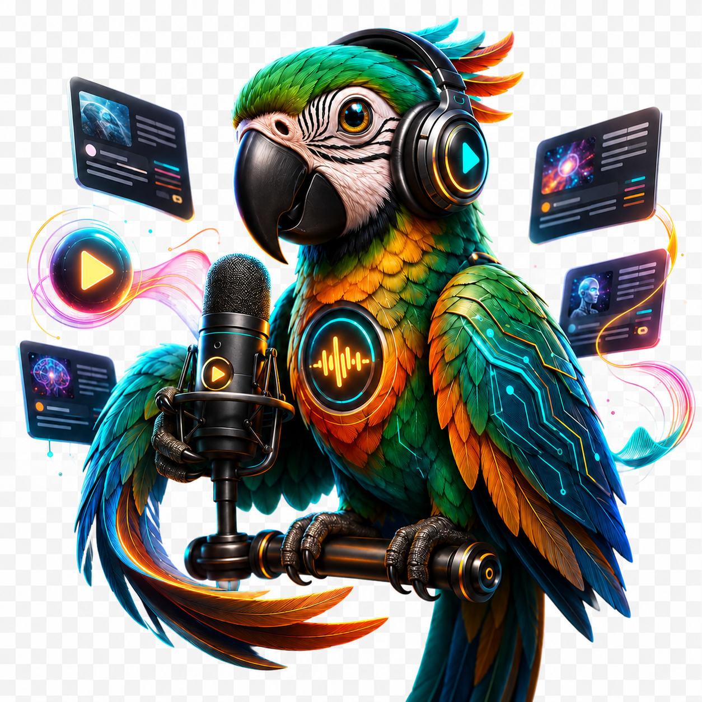
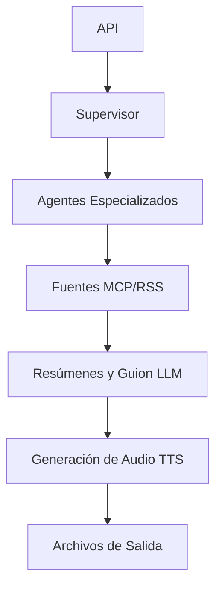

<p align="center">
  
</p>

# 🎓 Guía Educativa de Patrones de Agentes IA

## 📚 **Ruta de Aprendizaje: De Principiante a Experto**

Esta guía proporciona una ruta de aprendizaje estructurada a través de los Patrones de Agentes IA implementados en el proyecto AI-Parrot. Cada sección se basa en conceptos previos, haciéndola perfecta para propósitos educativos.

AI-Parrot es un sistema educativo con patrones inspirados en producción. Trata el código como un mapa funcional de conceptos de agentes, no como una plataforma de producción terminada. La mejor forma de aprender es ejecutar una generación de podcast, observar los logs y después leer el camino de código que produjo cada paso.

### **Cómo Estudiar Este Proyecto**

1. **Empieza por el flujo**: `RESUMEN_SISTEMA_ES.md` muestra API → supervisor → agentes → MCP/RSS → LLM → TTS → salida.
2. **Estudia el contrato API**: `DOCUMENTACION_API_ES.md` explica generación encolada y consulta de tareas.
3. **Sigue al supervisor**: `src/podcast_generator/agent_supervisor.py` muestra cómo se divide el trabajo entre agentes.
4. **Sigue las fuentes de contenido**: `src/podcast_generator/article_fetcher.py` y `src/podcast_generator/mcp_client.py` muestran MCP primero, con RSS como respaldo.
5. **Sigue la colaboración**: `src/podcast_generator/a2a_protocol.py` demuestra evaluación de calidad entre pares.
6. **Sigue la generación**: `src/podcast_generator/ai_processor.py` y `src/podcast_generator/file_utils.py` convierten artículos en guion y audio.
7. **Sigue la resiliencia**: `src/podcast_generator/circuit_breaker.py` demuestra límites de fallo y pensamiento de respaldo.
8. **Termina con pruebas**: `tests/` da ejemplos seguros que puedes cambiar antes de tocar APIs pagadas.

### **Mapa de Patrones y Pruebas**

| Patrón | Código a Leer | Prueba a Ejecutar |
|---|---|---|
| Orquestación supervisor | `src/podcast_generator/agent_supervisor.py` | `tests/test_agent_supervisor.py` |
| Consenso A2A | `src/podcast_generator/a2a_protocol.py` | `tests/test_a2a_protocol.py` |
| Fuentes MCP/RSS | `src/podcast_generator/article_fetcher.py`, `src/podcast_generator/mcp_client.py` | `tests/test_mcp_rss_fetching.py` |
| Resiliencia circuit breaker | `src/podcast_generator/circuit_breaker.py` | `tests/test_circuit_breaker.py` |

### **Brechas de Producción a Observar**

Estas brechas también forman parte del aprendizaje. En producción, el estado de tareas debería pasar de memoria a Redis o una base de datos, autenticación y autorización deberían endurecerse, los workers deberían ejecutarse fuera del proceso web, las colas deberían absorber trabajos largos, reintentos y tareas muertas deberían ser explícitos, el rate limiting debería proteger llamadas de API pagadas, logs y métricas deberían centralizarse, y el despliegue debería incluir secretos, escalado, backups y alertas.

---

## 🌟 **Nivel 1: Conceptos Fundamentales**

### **🤖 ¿Qué son los Patrones de Agentes IA?**

Los Patrones de Agentes IA son soluciones reutilizables a problemas comunes en sistemas multi-agente. Al igual que los patrones de diseño en ingeniería de software, proporcionan enfoques probados para:

- **Coordinación**: Cómo los agentes trabajan juntos
- **Comunicación**: Cómo los agentes intercambian información  
- **Especialización**: Cómo los agentes dividen responsabilidades
- **Resistencia**: Cómo los sistemas manejan fallos
- **Monitoreo**: Cómo observar el comportamiento del sistema

### **🎯 ¿Por qué Usar Patrones de Agentes?**

1. **Escalabilidad**: Los sistemas pueden crecer agregando más agentes
2. **Confiabilidad**: Los fallos en un agente no colapsan el sistema
3. **Mantenibilidad**: Cada agente tiene responsabilidades claras
4. **Flexibilidad**: Fácil modificar o reemplazar componentes individuales
5. **Observabilidad**: Visibilidad clara del comportamiento del sistema

---

## 🏗️ **Nivel 2: Comprensión de la Arquitectura**

### **📊 Resumen del Sistema**

```
🎙️ Generador de Podcasts AI-Parrot
├── 🏛️ Agente Supervisor (Coordinador)
├── 📰 Agente Obtenedor de Contenido (Recolección de Datos)
├── 🎯 Agente Evaluador de Calidad (Colaboración A2A)  
├── 🤖 Agente Procesador de Contenido (Procesamiento IA)
└── 🎵 Agente Generador de Audio (Producción de Medios)
```

### **🔄 Flujo de Datos**



---

## 🎭 **Nivel 3: Inmersión Profunda en Patrones**

### **Patrón 1: 🏛️ Coordinación Jerárquica (Supervisor)**

**📖 Concepto**: Un agente supervisor coordina múltiples agentes trabajadores, similar a un gerente de proyecto dirigiendo un equipo.

**🔍 Ubicación de Implementación**: `src/podcast_generator/agent_supervisor.py`

**🎯 Puntos Clave de Aprendizaje**:
```python
class AgentSupervisor:
    """
    🎓 ENFOQUE EDUCATIVO:
    - Gestión de cola de tareas
    - Coordinación del ciclo de vida de agentes  
    - Balanceador de carga entre agentes
    - Monitoreo de salud del sistema
    """
```

**💡 Aplicaciones del Mundo Real**:
- Orquestación de microservicios
- Sistemas de gestión de flujo de trabajo
- Clusters de computación distribuida
- Coordinación de pipelines DevOps

**🧪 Ejercicio**: Añade un observer que registre duración de tareas y extiende `tests/test_agent_supervisor.py`.

### **Patrón 2: 🤝 Comunicación Agente-a-Agente**

**📖 Concepto**: Los agentes se comunican directamente con pares para colaborar en tareas, como expertos consultándose entre sí.

**🔍 Ubicación de Implementación**: `src/podcast_generator/a2a_protocol.py`

**🎯 Puntos Clave de Aprendizaje**:
```python
class A2AQualityAgent:
    """
    🎓 ENFOQUE EDUCATIVO:
    - Mecanismos de descubrimiento de pares
    - Algoritmos de construcción de consenso
    - Patrones de resistencia de red
    - Toma de decisiones colaborativa
    """
```

**💡 Aplicaciones del Mundo Real**:
- Mecanismos de consenso blockchain
- Bases de datos distribuidas
- Redes peer-to-peer
- Sistemas de filtrado colaborativo

**🧪 Ejercicio**: Cambia la fórmula de peso por confianza y actualiza `tests/test_a2a_protocol.py`.

### **Patrón 3: 🎭 Patrón de Agente Especializado**

**📖 Concepto**: Cada agente tiene una experiencia de dominio específica, como especialistas en un equipo médico.

**🔍 Ejemplos de Implementación**:
```python
class ContentFetcherAgent(SpecializedAgent):
    """🎓 Se especializa en: Recuperación y procesamiento de artículos"""
    
class QualityAssessorAgent(SpecializedAgent):
    """🎓 Se especializa en: Evaluación colaborativa A2A"""
    
class ContentProcessorAgent(SpecializedAgent):
    """🎓 Se especializa en: Resumen IA y generación de guiones"""
```

**💡 Aplicaciones del Mundo Real**:
- Sistemas expertos
- Motores de recomendación
- Sistemas de trading automatizado
- Plataformas de moderación de contenido

**🧪 Ejercicio**: Añade un nuevo agente especializado con un contrato de tarea y extiende `tests/test_agent_supervisor.py`.

### **Patrón 4: 👁️ Patrón Observer**

**📖 Concepto**: Los componentes pueden suscribirse a eventos y ser notificados cuando suceden cosas, como un servicio de suscripción de noticias.

**🔍 Ubicación de Implementación**: `src/podcast_generator/agent_supervisor.py`

**🎯 Puntos Clave de Aprendizaje**:
```python
def task_monitor_observer(event_type: str, data: Dict[str, Any]):
    """
    🎓 ENFOQUE EDUCATIVO:
    - Arquitectura dirigida por eventos
    - Acoplamiento débil entre componentes
    - Capacidades de monitoreo en tiempo real
    - Depuración y observabilidad
    """
```

**💡 Aplicaciones del Mundo Real**:
- Plataformas de streaming de eventos (Kafka)
- Analítica en tiempo real
- Sistemas de monitoreo y alertas
- Actualizaciones de interfaz de usuario

**🧪 Ejercicio**: Añade un segundo observer que guarde eventos en memoria y valida el orden en `tests/test_agent_supervisor.py`.

### **Patrón 5: 🔄 Resistencia Circuit Breaker**

**📖 Concepto**: Prevenir fallos en cascada "rompiendo el circuito" cuando los servicios no están saludables, como los disyuntores eléctricos.

**🔍 Ubicación de Implementación**: `src/podcast_generator/circuit_breaker.py`

**🎯 Puntos Clave de Aprendizaje**:
```python
class CircuitBreaker:
    """
    🎓 ENFOQUE EDUCATIVO:
    - Mecanismos de detección de fallos
    - Estrategias de degradación elegante
    - Procedimientos de recuperación automática
    - Patrones de estabilidad del sistema
    """
```

**💡 Aplicaciones del Mundo Real**:
- Biblioteca Hystrix de Netflix
- Patrones de service mesh de AWS
- Pooling de conexiones de base de datos
- Limitación de tasa de API

**🧪 Ejercicio**: Añade una prueba de recuperación half-open y extiende `tests/test_circuit_breaker.py`.

---

## 🧪 **Nivel 4: Aprendizaje Práctico**

### **🔬 Experimento 1: Generación Básica de Podcast**

**Objetivo**: Entender el flujo de trabajo tradicional

```bash
# Ejecutar el flujo de podcast por defecto
python -m podcast_generator.main --language en --voice "Aria"
```

**🎯 Objetivos de Aprendizaje**:
- Observar el flujo completo
- Identificar dónde ocurren la obtención de contenido, el procesamiento LLM y la generación de audio
- Notar qué pasos requieren claves API externas

### **🔬 Experimento 2: Colaboración A2A**

**Objetivo**: Ver agentes colaborando en evaluación de calidad

```bash
python -m pytest tests/test_a2a_protocol.py -q
```

**🎯 Objetivos de Aprendizaje**:
- Inspeccionar puntuación de calidad local
- Observar consenso ponderado por confianza
- Cambiar una puntuación y predecir el consenso resultante

### **🔬 Experimento 3: Coordinación Completa de Agentes**

**Objetivo**: Experimentar sistema multi-agente completo

```bash
python -m pytest tests/test_agent_supervisor.py -q
```

**🎯 Objetivos de Aprendizaje**:
- Ver envío y ejecución de tareas
- Monitorear el orden de eventos del observer
- Entender cómo un supervisor delega trabajo sin llamar APIs pagadas

### **🔬 Experimento 4: Aprendizaje Visual**

**Objetivo**: Usar la UI Streamlit para comprensión visual

```bash
# Lanzar la interfaz educativa
./run_ui.sh
```

**🎯 Objetivos de Aprendizaje**:
- Visualizar topología de red de agentes
- Monitorear métricas del sistema en tiempo real
- Entender interacciones de patrones

---

## 📊 **Nivel 5: Análisis de Rendimiento**

### **📈 Métricas a Monitorear**

1. **Tiempo de Ejecución de Tareas**: Cuánto tiempo toma cada agente
2. **Throughput del Sistema**: Total de podcasts por hora
3. **Calidad de Consenso A2A**: Acuerdo entre agentes
4. **Utilización de Recursos**: Uso de CPU y memoria
5. **Tasas de Error**: Frecuencia de fallos por componente

### **🔍 Preguntas de Análisis**

1. **Escalabilidad**: ¿Cómo cambia el rendimiento con más agentes?
2. **Confiabilidad**: ¿Qué pasa cuando los agentes fallan?
3. **Calidad**: ¿La colaboración A2A mejora la salida?
4. **Eficiencia**: ¿Cuál es la sobrecarga de coordinación?
5. **Mantenibilidad**: ¿Qué tan fácil es modificar agentes?

---

## 🎯 **Nivel 6: Conceptos Avanzados**

### **🚀 Ideas de Extensión**

1. **Balanceador de Carga**: Implementar gestión de pool de agentes
2. **Caché**: Agregar caché de resultados entre agentes
3. **Programación**: Generación de podcasts basada en tiempo
4. **Analítica**: Métricas detalladas de rendimiento
5. **Seguridad**: Autenticación y autorización de agentes

### **🔮 Direcciones de Investigación**

1. **Aprendizaje Automático**: Agentes que aprenden de la experiencia
2. **Blockchain**: Coordinación de agentes descentralizada
3. **Edge Computing**: Despliegue distribuido de agentes
4. **Computación Cuántica**: Comunicación de agentes mejorada cuánticamente
5. **Inteligencia de Enjambre**: Comportamiento emergente de agentes simples

---

## 📚 **Recursos de Aprendizaje**

### **📖 Libros**
- "Multiagent Systems" por Gerhard Weiss
- "An Introduction to MultiAgent Systems" por Michael Wooldridge
- "Distributed Systems" por Maarten van Steen

### **🎓 Cursos en Línea**
- MIT 6.034 Artificial Intelligence
- Stanford CS221 Artificial Intelligence
- Coursera Multi-Agent Systems

### **🔬 Artículos de Investigación**
- "The Contract Net Protocol" (Smith, 1980)
- "Consensus in the Presence of Partial Synchrony" (Dwork et al., 1988)
- "MapReduce: Simplified Data Processing" (Dean & Ghemawat, 2004)

### **🛠️ Herramientas y Frameworks**
- JADE (Java Agent Development Framework)
- SPADE (Smart Python Agent Development Environment)
- Mesa (Modelado basado en agentes en Python)
- Ray (Framework de computación distribuida)

---

## 🎉 **Evaluación y Próximos Pasos**

### **✅ Lista de Verificación de Autoevaluación**

- [ ] Entiendo qué son los Patrones de Agentes IA y por qué son útiles
- [ ] Puedo identificar los 5 patrones implementados en AI-Parrot
- [ ] Puedo ejecutar todas las configuraciones experimentales
- [ ] Puedo interpretar el dashboard de monitoreo
- [ ] Puedo explicar las compensaciones entre patrones
- [ ] Puedo proponer extensiones al sistema
- [ ] Entiendo aplicaciones del mundo real de estos patrones

### **🚀 Próximos Pasos de Aprendizaje**

1. **Implementar un Nuevo Agente**: Agregar un agente de traducción
2. **Modificar Coordinación**: Probar diferentes algoritmos de programación de tareas
3. **Agregar Monitoreo**: Implementar recolección de métricas personalizadas
4. **Escalar el Sistema**: Desplegar agentes en múltiples máquinas
5. **Investigar Aplicaciones**: Estudiar cómo las empresas usan estos patrones

### **🤝 Participación Comunitaria**

- Únete a comunidades de IA/ML y discute patrones de agentes
- Contribuye a proyectos multi-agente de código abierto
- Asiste a conferencias sobre sistemas distribuidos
- Comparte tu viaje de aprendizaje y experimentos
- Mentoriza a otros aprendiendo sobre sistemas de agentes IA

---

## 🎯 **Conclusión**

El proyecto AI-Parrot sirve como una plataforma educativa integral para aprender Patrones de Agentes IA. Al trabajar a través de esta guía, has ganado:

- **Comprensión Teórica**: Conceptos y principios centrales
- **Experiencia Práctica**: Detalles de implementación práctica
- **Pensamiento Sistémico**: Cómo los patrones trabajan juntos
- **Conciencia de Rendimiento**: Compensaciones y optimización
- **Visión Futura**: Conceptos avanzados y direcciones de investigación

**Recuerda**: La mejor manera de aprender es haciendo. Experimenta, rompe cosas, arregla, y lo más importante, ¡diviértete explorando el fascinante mundo de los Patrones de Agentes IA! 🚀

---

*Esta guía educativa está diseñada para crecer con tu viaje de aprendizaje. A medida que ganes experiencia, revisa secciones para descubrir insights y conexiones más profundas.*
