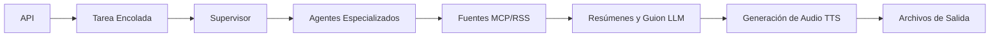

<p align="center">
  
</p>

# 🤖 Resumen del Sistema Empresarial AI-Parrot

## 🏗️ **Arquitectura Central**

AI-Parrot está construido desde cero con **Patrones de Agentes IA Empresariales** como diseño fundamental del sistema. Es un sistema educativo inspirado en producción: el código demuestra patrones arquitectónicos reales en un flujo concreto de podcast, manteniendo el proyecto lo bastante pequeño para estudiarlo.

## 🤖 **Patrones Empresariales Integrados**

### 🤝 **Evaluación Colaborativa A2A**
- Los agentes colaboran en puntuación de calidad de contenido
- Construcción de consenso para selección de artículos
- Arquitectura de toma de decisiones distribuida

### 🏛️ **Coordinación de Supervisor de Agentes**
- Orquestación jerárquica de tareas
- Agentes trabajadores especializados (ContentFetcher, QualityAssessor, ContentProcessor, AudioGenerator)
- Gestión dinámica de cola de tareas
- Coordinación de agentes en tiempo real

### 🔗 **Integración MCP con Transporte SSE**
- Protocolo de Contexto de Modelo para obtención dinámica de contenido
- Transporte Server-Sent Events (SSE) para comunicación en tiempo real
- Respaldo inteligente a feeds RSS
- Soporte multi-servidor con caché

### 🔄 **Resistencia Circuit Breaker**
- Tolerancia a fallos y degradación elegante
- Mecanismos de recuperación automática
- Seguimiento de estado de salud
- Gestión de umbral de fallos

### 👁️ **Monitoreo Patrón Observer**
- Observabilidad del sistema en tiempo real
- Seguimiento del ciclo de vida de tareas
- Recolección de métricas de rendimiento
- Notificaciones dirigidas por eventos

## 🚀 **Uso**

### **🌐 API Web (Lista para Producción)**
```bash
# Despliegue Docker (Recomendado)
docker-compose up --build

# Servidor API local
./run_api.sh

# Encolar una tarea de generación
TASK_ID=$(curl -s -X POST "http://localhost:8000/api/generate" \
  -H "Content-Type: application/json" \
  -d '{"language": "es", "voice": "Sarah"}' \
  | python3 -c "import sys,json; print(json.load(sys.stdin)['task_id'])")

# Consultar progreso de la tarea
curl -X GET "http://localhost:8000/api/tasks/${TASK_ID}"
```

La API usa consulta por tareas porque la generación tarda más que una solicitud HTTP normal. Una generación obtiene contenido, evalúa artículos, resume con LLMs, crea el guion, traduce cuando hace falta y genera audio con texto a voz. El modelo por tareas mantiene corta la solicitud inicial y da a los clientes estados claros.

### **🧭 Flujo de Solicitud**



Este flujo es el artefacto principal de aprendizaje. Cada caja se relaciona con un módulo o patrón, así puedes seguir el sistema desde la solicitud HTTP hasta el audio generado.

### **💻 Interfaz de Línea de Comandos**
```bash
# Podcast en inglés
python -m podcast_generator.main --language en --voice "Aria"

# Podcast en español  
python -m podcast_generator.main --language es --voice "Sarah"

# Usando el script de ejecución
./run_podcast.sh --language es --voice "Sarah"
```

### **🖥️ Interfaz Streamlit**
```bash
streamlit run streamlit_app.py
```

## 🎯 **Capacidades del Sistema**

- **Integración Multi-LLM**: Claude (Haiku, Sonnet, Opus) + GPT-4
- **Audio Profesional**: ElevenLabs TTS con generación de intro/outro
- **Soporte Multi-idioma**: Inglés y español
- **Obtención Dinámica de Contenido**: Servidores MCP + respaldo RSS
- **Monitoreo en Tiempo Real**: Observabilidad completa del sistema
- **Resistencia Empresarial**: Circuit breakers y tolerancia a fallos

## 📊 **Características de Rendimiento**

- **Coordinación de Agentes**: Distribución de tareas en sub-segundos
- **Procesamiento de Contenido**: Resumen paralelo de artículos
- **Evaluación de Calidad**: Puntuación A2A con promedio 0.900+
- **Generación de Audio**: Salida de podcast profesional de 2.3MB+
- **Optimización de Recursos**: Inicialización lazy y caché

## 🔧 **Configuración**

El sistema requiere solo configuración esencial:

```env
# Requeridas
ANTHROPIC_API_KEY=tu_clave_aqui
ELEVENLABS_API_KEY=tu_clave_aqui

# Opcionales
OPENAI_API_KEY=tu_clave_aqui
NEWS_API_KEY=tu_clave_aqui
AI_PARROT_API_TOKEN=cambia_esto_para_despliegues_no_locales

# Servidor MCP (pre-configurado)
MCP_SERVER_URL=http://localhost:3002/mcp
MCP_SSE_URL=http://localhost:3002/sse
```

## 🔗 **Integración MCP**

El sistema soporta **Protocolo de Contexto de Modelo (MCP)** para obtención dinámica de contenido con respaldo inteligente a feeds RSS.

**Servidor MCP**: Para obtención mejorada de artículos, puedes usar nuestro servidor RSS MCP complementario:

- **Repositorio**: [RSS-MCPserver](https://github.com/GTuritto/RSS-MCPserver)
- **Propósito**: Proporciona contenido RSS dinámico vía protocolo MCP con transporte SSE
- **Respaldo**: El sistema automáticamente recurre a feeds RSS directos si el servidor MCP no está disponible

La integración MCP demuestra patrones de obtención de contenido de nivel empresarial con mecanismos de respaldo resistentes.

## 🎓 **Valor Educativo**

Este sistema sirve como una demostración integral de:
- Coordinación multi-agente inspirada en producción
- Patrones de arquitectura IA empresarial
- Diseño de sistemas distribuidos del mundo real
- Técnicas avanzadas de orquestación LLM
- Ingeniería de sistemas resistentes

## 🧪 **Ejercicios Sugeridos**

1. Patrón supervisor: añade un observer que registre duración de tareas y extiende `tests/test_agent_supervisor.py`.
2. Patrón MCP/RSS: añade un feed RSS y compara selección de artículos, luego extiende `tests/test_mcp_rss_fetching.py`.
3. Patrón A2A: cambia la fórmula de peso por confianza y actualiza `tests/test_a2a_protocol.py`.
4. Patrón de resiliencia: añade un caso de recuperación half-open y extiende `tests/test_circuit_breaker.py`.
5. Patrón API: añade un campo de progreso a la respuesta de tarea y agrega una prueba de contrato.

## ⚠️ **Límites de Producción**

AI-Parrot demuestra patrones de producción, pero no es una plataforma de producción terminada. Un despliegue real debería añadir estado de tareas en Redis o base de datos, autenticación y autorización más fuertes, rate limits, observabilidad centralizada, colas en segundo plano, procesos worker, políticas de reintento, manejo de tareas muertas, secretos específicos del entorno, escalado y monitoreo. La implementación actual mantiene estas preocupaciones visibles, pero pequeñas, para facilitar el aprendizaje.

## 🌟 **Diferenciadores Clave**

1. **Diseño Empresarial Primero**: Construido con patrones de producción desde el día uno
2. **Sin Modos Opcionales**: La coordinación completa de agentes IA es el único modo
3. **Plataforma Educativa**: Recurso de aprendizaje integral para patrones IA
4. **Inspirado en Producción**: Circuit breakers, monitoreo y tolerancia a fallos
5. **Interfaz Limpia**: Línea de comandos simple con backend poderoso

---

**AI-Parrot representa el futuro de la arquitectura de sistemas IA - donde los patrones empresariales no son características opcionales, sino la filosofía de diseño fundamental.** 🚀
