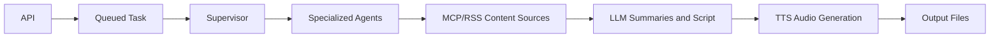

<p align="center">
  
</p>

# 🤖 AI-Parrot Enterprise System Overview

## 🏗️ **Core Architecture**

AI-Parrot is built from the ground up with **Enterprise AI Agent Patterns** as the fundamental system design. It is a production-inspired educational system: the code demonstrates real architectural patterns in a concrete podcast workflow, while keeping the project small enough to study.

## 🤖 **Built-in Enterprise Patterns**

### 🤝 **A2A Collaborative Assessment**
- Agents collaborate on content quality scoring
- Consensus-building for article selection
- Distributed decision-making architecture

### 🏛️ **Agent Supervisor Coordination**
- Hierarchical task orchestration
- Specialized worker agents (ContentFetcher, QualityAssessor, ContentProcessor, AudioGenerator)
- Dynamic task queue management
- Real-time agent coordination

### 🔗 **MCP Integration with SSE Transport**
- Model Context Protocol for dynamic content sourcing
- Server-Sent Events (SSE) transport for real-time communication
- Intelligent fallback to RSS feeds
- Multi-server support with caching

### 🔄 **Circuit Breaker Resilience**
- Fault tolerance and graceful degradation
- Automatic recovery mechanisms
- Health status tracking
- Failure threshold management

### 👁️ **Observer Pattern Monitoring**
- Real-time system observability
- Task lifecycle tracking
- Performance metrics collection
- Event-driven notifications

## 🚀 **Usage**

### **🌐 Web API (Production Ready)**
```bash
# Docker deployment (Recommended)
docker-compose up --build

# Local API server
./run_api.sh

# Queue a podcast generation task
TASK_ID=$(curl -s -X POST "http://localhost:8000/api/generate" \
  -H "Content-Type: application/json" \
  -d '{"language": "en", "voice": "Aria"}' \
  | python3 -c "import sys,json; print(json.load(sys.stdin)['task_id'])")

# Poll task progress
curl -X GET "http://localhost:8000/api/tasks/${TASK_ID}"
```

The API uses task polling because generation is long-running. A request starts content fetching, article assessment, LLM summarization, script generation, translation when needed, and text-to-speech audio creation. Polling keeps the HTTP request short and gives clients a clear status model.

### **🧭 Request Flow**



This flow is the main learning artifact. Each box maps to a module or pattern, so you can trace the system from HTTP request to generated audio.

### **💻 Command Line Interface**
```bash
# English podcast
python -m podcast_generator.main --language en --voice "Aria"

# Spanish podcast  
python -m podcast_generator.main --language es --voice "Sarah"

# Using the run script
./run_podcast.sh --language en --voice "Aria"
```

### **🖥️ Streamlit Interface**
```bash
streamlit run streamlit_app.py
```

## 🎯 **System Capabilities**

- **Multi-LLM Integration**: Claude (Haiku, Sonnet, Opus) + GPT-4
- **Professional Audio**: ElevenLabs TTS with intro/outro generation
- **Multi-language Support**: English and Spanish
- **Dynamic Content Sourcing**: MCP servers + RSS fallback
- **Real-time Monitoring**: Complete system observability
- **Enterprise Resilience**: Circuit breakers and fault tolerance

## 📊 **Performance Characteristics**

- **Agent Coordination**: Sub-second task distribution
- **Content Processing**: Parallel article summarization
- **Quality Assessment**: A2A scoring with 0.900+ average
- **Audio Generation**: Professional 2.3MB+ podcast output
- **Resource Optimization**: Lazy initialization and caching

## 🔧 **Configuration**

The system requires only essential configuration:

```env
# Required
ANTHROPIC_API_KEY=your_key_here
ELEVENLABS_API_KEY=your_key_here

# Optional
OPENAI_API_KEY=your_key_here
NEWS_API_KEY=your_key_here
AI_PARROT_API_TOKEN=change_me_for_non_local_deployments

# MCP Server (pre-configured)
MCP_SERVER_URL=http://localhost:3002/mcp
MCP_SSE_URL=http://localhost:3002/sse
```

## 🎓 **Educational Value**

This system serves as a comprehensive demonstration of:
- Production-inspired multi-agent coordination
- Enterprise AI architecture patterns
- Real-world distributed system design
- Advanced LLM orchestration techniques
- Resilient system engineering

## 🧪 **Suggested Exercises**

1. Supervisor pattern: add a new observer that records task durations, then extend `tests/test_agent_supervisor.py`.
2. MCP/RSS pattern: add one RSS feed and compare article selection, then extend `tests/test_mcp_rss_fetching.py`.
3. A2A pattern: change the confidence weighting formula, then update `tests/test_a2a_protocol.py`.
4. Resilience pattern: add a half-open recovery case, then extend `tests/test_circuit_breaker.py`.
5. API pattern: add a task progress field to the API response, then add a contract test.

## ⚠️ **Production Boundaries**

AI-Parrot demonstrates production patterns, but it is not a finished production platform. Production deployment should add Redis or database-backed task state, stronger authentication and authorization, rate limits, centralized observability, background queues, worker processes, retry policies, dead-letter handling, deployment-specific secrets, scaling, and monitoring. The current implementation keeps these concerns visible but intentionally small for learning.

## 🌟 **Key Differentiators**

1. **Enterprise-First Design**: Built with production patterns from day one
2. **No Optional Modes**: Full AI agent coordination is the only mode
3. **Educational Platform**: Comprehensive learning resource for AI patterns
4. **Production-Inspired**: Circuit breakers, monitoring, and fault tolerance
5. **Clean Interface**: Simple command-line with powerful backend

---

**AI-Parrot represents the future of AI system architecture - where enterprise patterns aren't optional features, but the fundamental design philosophy.** 🚀
