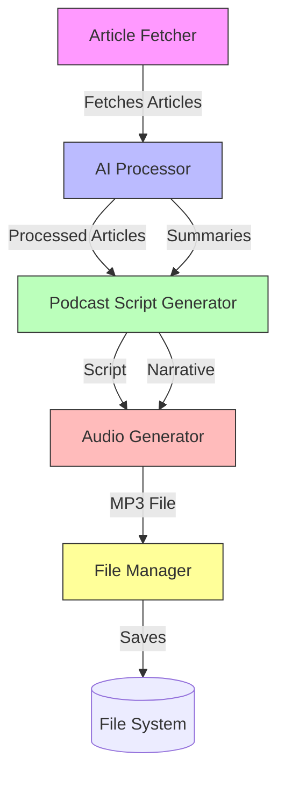
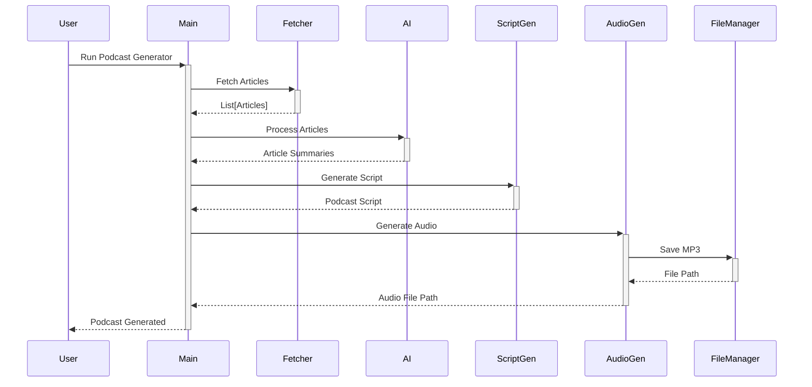

# Podcast Generator - System Architecture

## Overview

The Podcast Generator is an AI-powered system that automatically generates podcast episodes based on recent news articles. It fetches articles, processes them using AI, generates a podcast script, and converts it to speech using ElevenLabs TTS.

## System Diagram



## Component Overview

### 1. Article Fetcher
- Fetches recent articles from RSS feeds
- Filters and processes article data
- Outputs structured article data

### 2. AI Processing

The AI processing is handled by the `AIProcessor` class, which uses different LLM models optimized for specific tasks:

| Task | Model | Reason |
|------|-------|--------|
| **Article Ranking** | Claude Haiku | Fast and cost-effective for relevance scoring |
| **Article Summarization** | Claude Sonnet | Good balance of speed and quality for summarization |
| **Script Generation** | Claude Opus | Highest quality for creative content generation |
| **Script Refinement** | GPT-4 (fallback to Claude Sonnet) | Excellent at following detailed instructions for TTS optimization |

The system will automatically fall back to Claude Sonnet if GPT-4 is not available.

### 3. Podcast Script Generator
- Creates a natural-sounding podcast script
- Structures the content with proper transitions
- Ensures cohesive narrative flow

### 4. Audio Generator
- Converts text to speech using ElevenLabs
- Handles voice selection and audio generation
- Manages audio quality settings

### 5. File Manager
- Handles file operations
- Manages storage of generated content
- Organizes output files

## Data Flow



## Prompts

### Article Summarization Prompt
```
Summarize the following article in a clear and concise manner, focusing on the key points that would be interesting for a podcast audience. 
Include the main topic, key findings or events, and any important context.

Article Title: {article_title}
Article Content: {article_content}

Summary:
```

### Podcast Script Generation Prompt
```
Create a podcast script based on the following article summaries. 
The script should have a natural flow, with smooth transitions between articles. 
Include an introduction, main content with 3-5 key points, and a conclusion.

Article Summaries:
{article_summaries}

Podcast Script:
```

## Error Handling

The system includes comprehensive error handling for:
- API failures (ElevenLabs, Claude AI)
- Network connectivity issues
- File system operations
- Invalid or missing configuration

## Security Considerations

- API keys are loaded from environment variables
- Sensitive files are excluded via .gitignore
- Input validation is performed on all external data

## Performance Considerations

- Asynchronous operations for I/O bound tasks
- Caching of API responses where appropriate
- Efficient file handling for large audio files

## Dependencies

- Python 3.8+
- ElevenLabs Python SDK
- LangChain
- Claude AI
- aiofiles
- python-dotenv

## Configuration

Configuration is managed through environment variables. See `.env.example` for required variables.

## Logging

Comprehensive logging is implemented throughout the application to aid in debugging and monitoring.
